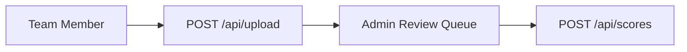
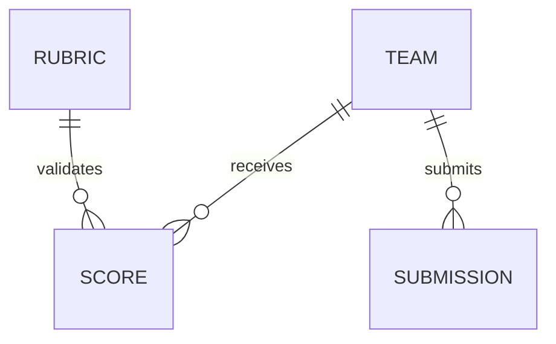

# Documentation Standards

Instructions for creating and maintaining user-facing documentation
in the `docs/` folder.

## Structure Requirements

### File Header

Every doc file should start with:

```markdown
# {Title}

> {One-line description of the document's purpose}
```

### Single H1 Rule

Each file has exactly ONE H1 heading (the title). Use H2+ for all
other sections.

### Link Style

- Use relative links for internal docs (e.g., `[API Spec](api-spec.md)`)
- Use reference-style links for external URLs
- No broken links — verify all relative links resolve to existing files

## Badge Standards

Use shields.io badges at the top of every doc file for visual metadata.

- **Type badge**: ``
- **Status badge**: `brightgreen` (active), `yellow` (draft), `red` (deprecated)
- **Tech badges**: Runtime, auth, hosting (for example: Node.js 20, GitHub OAuth, Azure SWA)

Place badges immediately after the H1 title, before the description blockquote.

```markdown
# HackerBoard API Specification


> Endpoint contracts for the HackerBoard Azure Functions API.
```

## Quick Links Table Pattern

Use a quick links table near the top of docs for navigation across key sections.
Use emoji + link + description columns for consistent scanning.

```markdown
## Quick Links

| Area | Link                                    | Description                                       |
| ---- | --------------------------------------- | ------------------------------------------------- |
| 🧩   | [Architecture](app-design.md)           | SPA + Functions + Table Storage system design     |
| 🔌   | [API Spec](api-spec.md)                 | Endpoint contracts, payloads, and error envelopes |
| 🤖   | [Agents & Skills](agents-and-skills.md) | Agent inventory and skill usage guidance          |
| 📋   | [Backlog](backlog.md)                   | Current phase status, decisions, and blockers     |
```

## Collapsible Sections

Use collapsible sections for long content such as full API responses,
expanded configuration examples, and large reference lists.

````markdown
<details>
<summary>Sample `POST /api/scores` success response</summary>

```json
{
  "submissionId": "sub_20260216_001",
  "teamId": "team-rocket",
  "status": "pendingReview",
  "submittedBy": "octocat",
  "totalScore": 112
}
```

</details>
````

## Mermaid Diagrams

Use Mermaid when a visual is clearer than prose.

- Use `graph LR` for workflows and request/approval flows
- Use `erDiagram` for data models and entity relationships
- Keep diagrams focused on one topic per block

````markdown



````

## Structured Tables

Prefer tables over bullet lists for inventories and structured references.

- Inventory columns: `Name | Purpose | File path`
- Configuration columns: `Property | Value`

```markdown
| Name       | Purpose                        | File path                     |
| ---------- | ------------------------------ | ----------------------------- |
| Teams API  | Team CRUD and listing          | `api/src/functions/teams.js`  |
| Scores API | Score submission and retrieval | `api/src/functions/scores.js` |

| Property | Value                            |
| -------- | -------------------------------- |
| Runtime  | Node.js 20+                      |
| Hosting  | Azure Static Web Apps (Standard) |
```

## Navigation Links

Every doc page should include a navigation footer link at the bottom:

```markdown
---

[← Back to Documentation](README.md)
```

## Current Architecture

### Documentation Files

| File                            | Purpose                                 |
| ------------------------------- | --------------------------------------- | --- | -------------------------- | --------------------------- | --- | --------------------------- | ----------------------------------- |
| `docs/README.md`                | Documentation hub and navigation        |
| `docs/api-spec.md`              | API endpoint specifications             |
| `docs/admin-procedures.md`      | Admin workflows and operational runbook |
| `docs/app-design.md`            | Application design and architecture     |
| `docs/app-prd.md`               | Product requirements document           |
| `docs/app-scaffold.md`          | Project scaffolding guide               |
| `docs/app-handoff-checklist.md` | Handoff and review checklist            |     | `docs/deployment-guide.md` | End-to-end deployment guide |     | `docs/agents-and-skills.md` | Agent/skill inventory, prompt guide |
| `docs/backlog.md`               | Feature backlog and task tracking       |
| `README.md`                     | Repo root README                        |

### Agents

| Agent                    | Purpose                               |
| ------------------------ | ------------------------------------- |
| `hackerboard-conductor`  | Orchestrates the 7-step workflow      |
| `implementation-planner` | Structured implementation plans       |
| `azure-architect`        | WAF-based architecture review         |
| `bicep-avm`              | Bicep IaC with Azure Verified Modules |
| `security-reviewer`      | OWASP and Zero Trust code review      |
| `ux-designer`            | UX/UI design and accessibility        |
| `task-planner`           | Task research and dependency analysis |

## Content Principles

| Principle           | Application                               |
| ------------------- | ----------------------------------------- |
| **DRY**             | Single source of truth per topic          |
| **Current state**   | No historical context in main docs        |
| **Action-oriented** | Every section answers "how do I...?"      |
| **Minimal**         | If it doesn't help users today, remove it |

## Validation

When updating documentation:

- No broken internal links
- Markdown lint passes (120-char line limit)
- Agent and file counts match the actual filesystem
- Code examples are current and runnable
