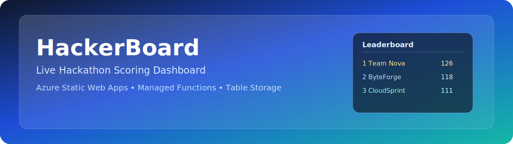
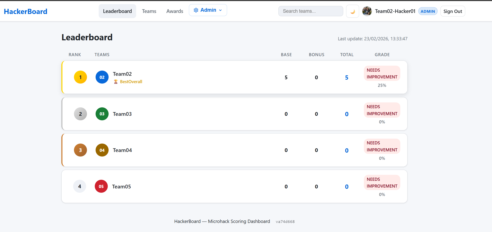
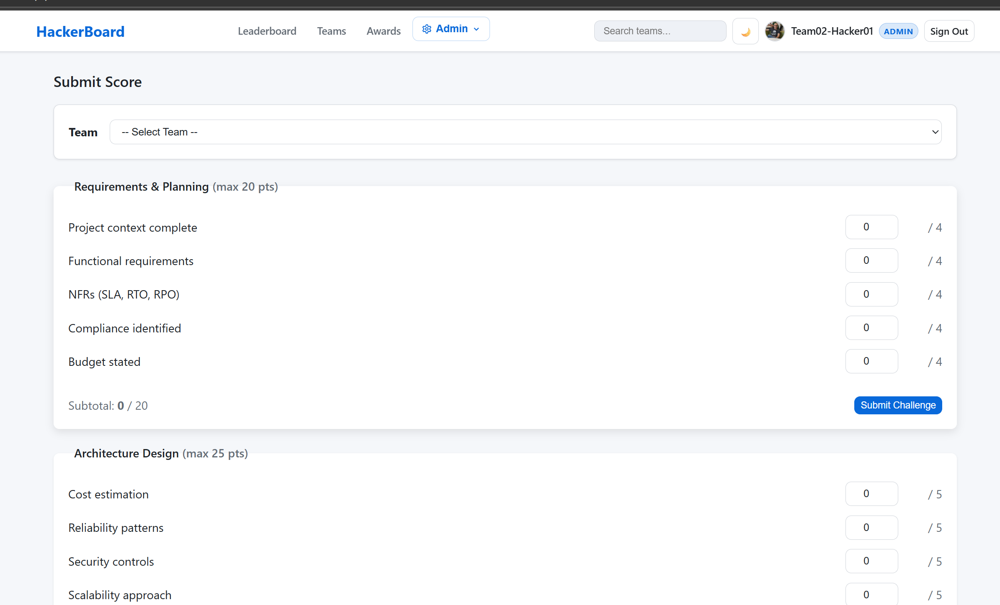
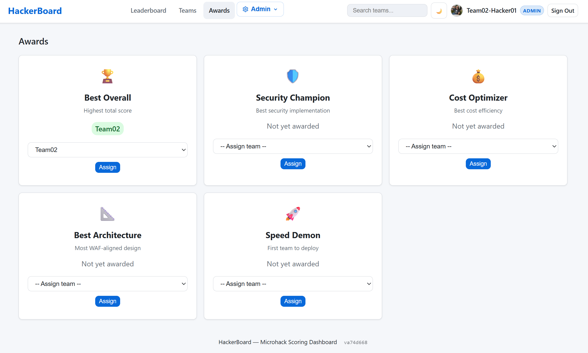
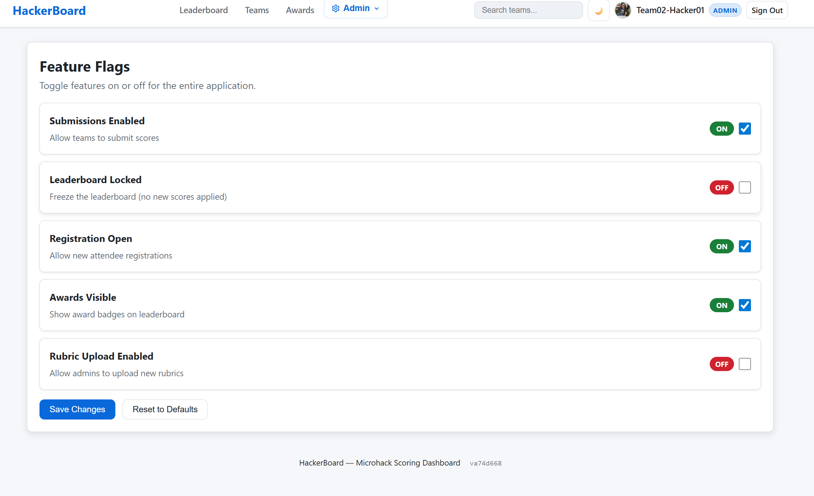

# HackerBoard



Microhack scoring dashboard — App Service for Linux Containers + ACR + Express + Cosmos DB NoSQL Serverless.


## What It Does

Teams submit scores through a web form or JSON upload. Admins review and approve submissions before they appear on the live leaderboard. The app handles attendee registration, random team assignment, configurable scoring rubrics, and award presentation — all behind GitHub OAuth.

## Screenshots

|               Landing Page               |                 Scoring                  |
| :--------------------------------------: | :--------------------------------------: |
|  |  |

|                 Awards                 |               Feature Flags                |
| :------------------------------------: | :----------------------------------------: |
|  |  |

## Architecture

```text
App Service for Linux Containers (S1)
├── SPA Frontend (src/)
├── Express 5.x API adapter (api/server.js)
│   └── Node.js 20 — port 8080
├── GitHub OAuth (App Service Easy Auth)
└── Azure Cosmos DB NoSQL (Serverless)
    ├── Teams, Attendees, Scores
    ├── Submissions, Rubrics, Flags
    └── Managed Identity — no connection strings

Azure Container Registry (Basic) ← docker push
GitHub Actions → ACR → App Service (ACR CD webhook)
```

## Quick Start

```bash
# Install dependencies
npm install
cd api && npm install && cd ..

# Start local dev server (serves frontend + API on port 8080)
cd api && npm start
# Open http://localhost:8080
```

Or run the full container:

```bash
docker build -t hacker-board:local .
docker run -p 8080:8080 -e COSMOS_ENDPOINT=https://localhost:8081 hacker-board:local
```

### Run Tests

```bash
npm run test:all
```

### Prerequisites

- Node.js 20+
- [Docker Desktop](https://www.docker.com/products/docker-desktop/) (for container builds)
- [Azure Cosmos DB Emulator](https://learn.microsoft.com/azure/cosmos-db/how-to-develop-emulator) or a cloud Cosmos DB endpoint

## Deploy to Azure

```powershell
cd infra
./deploy.ps1 `
  -CostCenter "microhack" `
  -TechnicalContact "team@contoso.com" `
  -GitHubOAuthClientId "<id>" `
  -GitHubOAuthClientSecret "<secret>" `
  -AdminUsers "github:<your-github-username>"
```

See [docs/operations.md](docs/operations.md) for the full end-to-end deployment guide.

## Features

| #   | Feature                       | Role   |
| --- | ----------------------------- | ------ |
| F1  | Team Score Submission Form    | Member |
| F2  | Live Leaderboard              | All    |
| F3  | Grading Display               | All    |
| F4  | Award Categories              | Admin  |
| F5  | GitHub OAuth Authentication   | All    |
| F6  | JSON Score Upload             | Member |
| F7  | Attendee Registration         | All    |
| F8  | Admin Validation & Override   | Admin  |
| F9  | Attendee Bulk Entry           | Admin  |
| F10 | Random Team Assignment        | Admin  |
| F11 | Configurable Rubric Templates | Admin  |

## API Endpoints

| Endpoint                    | Methods             | Auth          |
| --------------------------- | ------------------- | ------------- |
| `/api/health`               | GET                 | none          |
| `/api/teams`                | GET, POST, PUT, DEL | admin (write) |
| `/api/teams/assign`         | POST                | admin         |
| `/api/scores`               | GET, POST           | admin (write) |
| `/api/attendees`            | GET                 | admin         |
| `/api/attendees/me`         | GET, POST           | authenticated |
| `/api/attendees/bulk`       | POST                | admin         |
| `/api/awards`               | GET, POST, PUT      | admin (write) |
| `/api/upload`               | POST                | member        |
| `/api/submissions`          | GET                 | admin         |
| `/api/submissions/validate` | POST                | admin         |
| `/api/rubrics`              | GET, POST           | admin (write) |
| `/api/rubrics/active`       | GET                 | authenticated |
| `/api/feature-flags`        | GET, POST           | admin (write) |

Full schemas in [docs/api-spec.md](docs/api-spec.md).

## Project Structure

```text
├── .github/workflows/deploy-app.yml   # GitHub Actions — Docker build → ACR → App Service
├── api/                                # Express 5.x API server (Node.js 20+)
│   └── server.js                       # Entry point: routes + security headers
├── src/                                # SPA Frontend (vanilla JS, ES2022+)
├── Dockerfile                          # Node.js 20 Alpine container image
├── infra/                              # Bicep IaC templates + deploy script
│   ├── main.bicep                      # Root template
│   ├── deploy.ps1                      # Deployment script
│   └── modules/                        # AVM-based modules
├── docs/                               # Documentation
└── README.md
```

## Documentation

| Document                                     | Purpose                                                 |
| -------------------------------------------- | ------------------------------------------------------- |
| [docs/guide.md](docs/guide.md)               | Features, roles, NFRs, and event admin walkthroughs     |
| [docs/architecture.md](docs/architecture.md) | Architecture diagrams, ADRs, governance, WAF assessment |
| [docs/operations.md](docs/operations.md)     | Deployment, CI/CD, operations, troubleshooting, and FAQ |
| [docs/api-spec.md](docs/api-spec.md)         | Full API specification with request/response schemas    |

## Infrastructure

Estimated cost: **~$18.15/month** (Central US, low traffic). See [docs/architecture.md](docs/architecture.md#cost-estimate) for breakdown.

| Resource           | SKU        | Purpose              |
| ------------------ | ---------- | -------------------- |
| App Service Plan   | S1 Linux   | Container hosting    |
| Container Registry | Basic      | Docker image storage |
| Cosmos DB NoSQL    | Serverless | All application data |
| App Insights       | —          | Telemetry            |
| Log Analytics      | PerGB2018  | Centralized logging  |

## License

MIT
