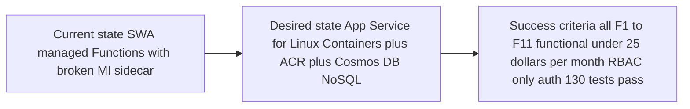

# Step 1: Requirements — HackerBoard

<strong>📑 Table of Contents</strong>

- [Project Overview](#project-overview)
- [Functional Requirements](#functional-requirements)
- [Non-Functional Requirements (NFRs)](#non-functional-requirements-nfrs)
- [Compliance & Security Requirements](#compliance--security-requirements)
- [Budget](#budget)
- [Operational Requirements](#operational-requirements)
- [Regional Preferences](#regional-preferences)
- [Summary for Architecture Assessment](#summary-for-architecture-assessment)
- [References](#references)

> Generated by @requirements agent | 2026-02-19 · Updated 2026-02-20 (Phase 18: App Service Migration — D28/D29/D30)

| ⬅️ Previous | 📑 Index            | Next ➡️                                                        |
| ----------- | ------------------- | -------------------------------------------------------------- |
| —           | [README](README.md) | [02-architecture-assessment.md](02-architecture-assessment.md) |

## Project Overview

| Field                   | Value                                                                                                                                                    |
| ----------------------- | -------------------------------------------------------------------------------------------------------------------------------------------------------- |
| **Project Name**        | HackerBoard                                                                                                                                              |
| **Project Type**        | Full-Stack (SPA + Containerized API + NoSQL Database)                                                                                                    |
| **Timeline**            | 2026-02-16 → 2026-03-02 (1–2 weeks)                                                                                                                      |
| **Primary Stakeholder** | Darth Vader                                                                                                                                              |
| **Business Context**    | Live, interactive hackathon scoring dashboard replacing manual JSON handling and script-only scoring with a browser-based submission and review workflow |

### Business Context

| Field               | Value                                                                                                                                                                                                                 |
| ------------------- | --------------------------------------------------------------------------------------------------------------------------------------------------------------------------------------------------------------------- |
| Industry / Vertical | Technology / Developer Events                                                                                                                                                                                         |
| Company Size        | Mid-Market                                                                                                                                                                                                            |
| Current State       | Modernization — migrating from Azure SQL to Cosmos DB NoSQL (Serverless)                                                                                                                                              |
| Migration Source    | Azure SQL Database (Basic DTU) — Phase 14 complete, Phase 17 in progress                                                                                                                                              |
| Business Drivers    | Reduce scoring turnaround during live microhack events; eliminate manual JSON file editing; keep leaderboard updates traceable through an approval workflow; align with governance (RBAC-only, no connection strings) |
| Success Criteria    | All 11 features functional (F1–F11); GitHub OAuth via Easy Auth enforced; response time <2s; up to 50 concurrent users; monthly cost <$25; all 130 tests pass                                                         |

### State Transition

## Functional Requirements

### Core Capabilities

| #   | Capability                                  | Priority | Acceptance Criteria                                                                                                                                                |
| --- | ------------------------------------------- | -------- | ------------------------------------------------------------------------------------------------------------------------------------------------------------------ |
| F1  | Team Score Submission Form                  | 🔴 Must  | Team member submits scores for own team across 8 categories + 4 bonus items; validates totals ≤ max; saves as pending submission                                   |
| F2  | Live Leaderboard                            | 🔴 Must  | Ranked table of all teams sorted by total score (desc); auto-refreshes every 30s; expandable rows with category breakdown; mobile-responsive                       |
| F3  | Grading Display                             | 🔴 Must  | Grade computed as (baseScore / 105) × 100; badge color matches tier (Outstanding / Excellent / Good / Satisfactory / Needs Improvement)                            |
| F4  | Award Categories                            | 🔴 Must  | 5 awards (Best Overall, Security Champion, Cost Optimizer, Best Architecture, Speed Demon); admin assigns via dropdown; badges on leaderboard                      |
| F5  | Authentication (GitHub OAuth via Easy Auth) | 🔴 Must  | All routes require authentication; GitHub OAuth for team members via App Service Easy Auth (same `/.auth/*` contract as SWA — D30); role-based UI (admin / member) |
| F6  | JSON Score Upload                           | 🔴 Must  | Team member uploads `score-results.json` for own team only; schema validation; preview before submit; pending until admin approval                                 |
| F7  | Attendee Registration                       | 🔴 Must  | Authenticated users register profile (alias-based, anonymized); linked to team; admins manage all                                                                  |
| F8  | Admin Validation & Manual Override          | 🔴 Must  | Admin queue shows pending submissions; approve writes to Scores; reject requires reason; manual override for approved scores                                       |
| F9  | Attendee Bulk Entry (Admin)                 | 🔴 Must  | Admin enters attendee names before event; multi-line/CSV paste; creates records in Attendees container                                                             |
| F10 | Random Team Assignment                      | 🔴 Must  | Fisher-Yates shuffle distributes attendees across teams; preview → confirm/re-shuffle; Team Roster page visible to all authenticated users                         |
| F11 | Configurable Rubric Templates               | 🔴 Must  | Admin uploads Markdown rubric; parsed into structured config (categories, bonus, grading, awards); one active rubric at a time; drives F1/F2/F3/F6 dynamically     |

### User Types

| User Type      | Description                                                                               | Est. Count | Access Level                                       |
| -------------- | ----------------------------------------------------------------------------------------- | ---------- | -------------------------------------------------- |
| Admin          | Facilitator / deployer — validates submissions, assigns awards, manages teams and rubrics | 1–3        | Admin (full access)                                |
| Team Member    | Hackathon participant — submits own team scores, uploads JSON, views leaderboard          | 20–50      | Member (own-team write, read-only for shared data) |
| Entra ID Admin | Deploying user — auto-assigned `admin` app role via Bicep `deploymentScript`              | 1          | Admin (via Entra ID identity provider)             |
| Anonymous      | Unauthenticated visitors                                                                  | 0          | Blocked — all routes require authentication        |

### Integrations

| System                               | Direction | Protocol                                     | Auth Method                                    | SLA                  |
| ------------------------------------ | --------- | -------------------------------------------- | ---------------------------------------------- | -------------------- |
| GitHub OAuth (App Service Easy Auth) | Inbound   | OAuth 2.0 via `/.auth/login/github`          | OAuth (Easy Auth — same contract as SWA, D30)  | 99.95% (App Service) |
| Azure Container Registry (ACR)       | Internal  | Docker pull via `acrPull` RBAC               | App Service MI → ACR `acrPull` role assignment | 99.9% (ACR)          |
| Azure Cosmos DB NoSQL                | Outbound  | HTTPS (Cosmos SDK)                           | Managed Identity (DefaultAzureCredential)      | 99.99%               |
| Application Insights                 | Outbound  | HTTPS (SDK telemetry)                        | Connection string (instrumentation key)        | 99.9%                |
| GitHub Actions CI/CD                 | Inbound   | Docker build → ACR push → App Service deploy | ACR credentials or OIDC                        | N/A                  |

### Data Types

| Category                                | Sensitivity | Est. Volume      | Retention       | Residency  |
| --------------------------------------- | ----------- | ---------------- | --------------- | ---------- |
| Team metadata                           | 🟢 Low      | ~100 documents   | Event + 30 days | Central US |
| Attendee profiles (anonymized aliases)  | 🟡 Medium   | ~200 documents   | Event + 30 days | Central US |
| Score records                           | 🟢 Low      | ~2,000 documents | Event + 30 days | Central US |
| Submissions (pending/approved/rejected) | 🟡 Medium   | ~100 documents   | Event + 30 days | Central US |
| Rubric configurations                   | 🟢 Low      | ~10 documents    | Indefinite      | Central US |
| Award assignments                       | 🟢 Low      | ~5 documents     | Event + 30 days | Central US |

### Architecture Pattern

| Field              | Value                                                                                                                                                                                                                                                                                                                                          |
| ------------------ | ---------------------------------------------------------------------------------------------------------------------------------------------------------------------------------------------------------------------------------------------------------------------------------------------------------------------------------------------- |
| Workload Pattern   | Containerized (Express server serving static frontend + API in single container + serverless database)                                                                                                                                                                                                                                         |
| Recommended Option | Azure App Service for Linux Containers (B1) + Azure Container Registry (Basic) + Azure Cosmos DB NoSQL (Serverless) — D28                                                                                                                                                                                                                      |
| Tier               | Cost-Optimized                                                                                                                                                                                                                                                                                                                                 |
| Justification      | SWA managed Functions MI sidecar has `expires_on` parsing bug blocking Cosmos MI auth (D28); App Service MI is battle-tested; Express adapter pattern (D29) wraps existing Functions handlers unchanged — all 130 tests preserved; Easy Auth provides identical `/.auth/*` contract (D30); est. ~$0.70/day ($21/month) — within $50/day budget |

## Non-Functional Requirements (NFRs)

| WAF Pillar     | Metric             | Target                                               | Current                   | Gap  |
| -------------- | ------------------ | ---------------------------------------------------- | ------------------------- | ---- |
| 🔄 Reliability | SLA                | 99.9%                                                | N/A (not yet deployed)    | —    |
| 🔄 Reliability | RTO                | 4 hours                                              | N/A                       | —    |
| 🔄 Reliability | RPO                | 1 hour                                               | N/A                       | —    |
| ⚡ Performance | Page Load          | <2,000 ms                                            | N/A                       | —    |
| ⚡ Performance | API Response (p95) | <500 ms                                              | N/A                       | —    |
| ⚡ Performance | Concurrent Users   | 50                                                   | N/A                       | —    |
| 🔒 Security    | Auth Method        | GitHub OAuth + Entra ID (MFA enforced by governance) | Implemented in SWA config | None |
| 🔒 Security    | Encryption         | At-rest (platform) + In-transit (TLS 1.2)            | Platform default          | None |
| 💰 Cost        | Monthly Budget     | <$50/day (~$1,500/month ceiling)                     | Est. ~$9.01/month         | None |
| 🔧 Operations  | Uptime Monitoring  | Yes (Application Insights + Log Analytics)           | Configured in Bicep       | None |

### Scalability

| Dimension        | Current          | 6-Month Projection                 | 12-Month Projection |
| ---------------- | ---------------- | ---------------------------------- | ------------------- |
| Users            | 50 concurrent    | 50 concurrent (event-based)        | 100 concurrent      |
| Data Volume      | ~2,500 documents | ~5,000 documents (multiple events) | ~10,000 documents   |
| Transactions/day | ~500 (event day) | ~1,000                             | ~2,000              |

## Compliance & Security Requirements

### Regulatory Frameworks

<strong>PCI-DSS</strong> — Not Applicable

| Requirement             | Applicability | Notes                 |
| ----------------------- | ------------- | --------------------- |
| Cardholder data storage | No            | No payment processing |
| Network segmentation    | No            | No cardholder data    |
| Encryption requirements | No            | N/A                   |

<strong>SOC 2</strong> — Not Applicable

| Trust Principle | Applicability | Notes                                                  |
| --------------- | ------------- | ------------------------------------------------------ |
| Security        | No            | Internal hackathon tool, not a customer-facing service |
| Availability    | No            | Event-based tool with 30-day retention                 |
| Confidentiality | No            | No customer data processed                             |

<strong>HIPAA</strong> — Not Applicable

| Requirement   | Applicability | Notes          |
| ------------- | ------------- | -------------- |
| PHI handling  | No            | No health data |
| BAA required  | No            | N/A            |
| Audit logging | No            | N/A            |

<strong>GDPR</strong> — Applicable (Audit)

| Requirement      | Applicability | Notes                                                                                          |
| ---------------- | ------------- | ---------------------------------------------------------------------------------------------- |
| EU data subjects | Yes           | Hackathon participants in EU; deployed in West Europe                                          |
| Data residency   | Yes           | All data stored in West Europe region                                                          |
| Right to erasure | Yes           | `scripts/cleanup-app-data.js` purges all data; attendee anonymization (Phase 13) minimizes PII |

> Subscription has EU GDPR 2016/679 audit policy assigned (`60a5fd56...`). Compliance reporting only — no deployment blocker.

<strong>ISO 27001</strong> — Not Applicable

| Control Area        | Applicability | Notes                                                                            |
| ------------------- | ------------- | -------------------------------------------------------------------------------- |
| Access control      | Partial       | RBAC enforced via Entra ID + SWA roles, but no formal ISO certification required |
| Asset management    | No            | Short-lived event tool                                                           |
| Incident management | No            | No formal incident process required                                              |

### Data Residency

| Requirement              | Value                                              |
| ------------------------ | -------------------------------------------------- |
| Primary Region           | Central US (`centralus`)                           |
| Data Sovereignty         | Event-based workload; data residency in US region  |
| Cross-region Replication | Not required (single-region, event-based workload) |

### Authentication & Authorization

| Requirement       | Value                                                                                                                                                                                                                                    |
| ----------------- | ---------------------------------------------------------------------------------------------------------------------------------------------------------------------------------------------------------------------------------------- |
| Identity Provider | GitHub OAuth (team members) + Microsoft Entra ID (admin/deployer)                                                                                                                                                                        |
| MFA Requirement   | Required — governance policy `sys.mfa-write` (Deny effect) enforces MFA on all resource write operations; deployer must authenticate with MFA                                                                                            |
| RBAC Model        | Application-level (`admin` / `member` roles via App Service Easy Auth + `x-ms-client-principal` header — D30) + Azure RBAC (`Cosmos DB Built-in Data Contributor` for App Service managed identity; `acrPull` for App Service MI on ACR) |

### Network Security

| Control                     | Required | Notes                                                                                                                                 |
| --------------------------- | -------- | ------------------------------------------------------------------------------------------------------------------------------------- |
| Private endpoints           | ❌       | Disabled for cost optimization (`enablePrivateEndpoint=false`); Cosmos DB Serverless accessed over public endpoint with Entra ID RBAC |
| VNet integration            | ❌       | Not required — serverless architecture with managed identity authentication                                                           |
| Public endpoints acceptable | ✅       | SWA and Cosmos DB use public endpoints; access controlled via authentication + RBAC                                                   |
| WAF required                | ❌       | Not required — low-traffic internal event tool with authenticated-only access                                                         |

### Recommended Security Controls

| Control               | Recommended | User Confirmed | Notes                                                                                                                  |
| --------------------- | ----------- | -------------- | ---------------------------------------------------------------------------------------------------------------------- |
| Managed Identity      | Yes         | Yes            | SWA system-assigned MI for Cosmos DB access; `DefaultAzureCredential` in API code                                      |
| Private Endpoints     | No          | No             | Cost optimization — public endpoints with RBAC-only auth                                                               |
| WAF                   | No          | No             | Internal event tool; all routes require authentication                                                                 |
| Key Vault for Secrets | No          | No             | No secrets to store — MI-based auth eliminates connection strings; App Insights uses connection string in app settings |
| Diagnostic Settings   | Yes         | Yes            | Log Analytics workspace + Application Insights configured via Bicep                                                    |
| TLS 1.2 Minimum       | Yes         | Yes            | Platform default for SWA and Cosmos DB                                                                                 |
| Encryption at Rest    | Yes         | Yes            | Platform-managed encryption for Cosmos DB and SWA                                                                      |
| Network Isolation     | No          | No             | Not required for cost-optimized event tool; RBAC provides access control                                               |

## Budget

> [!NOTE]
> Budget ceiling: **$50/day** (~$1,500/month). Target: minimize cost — the lower the better.
> Current estimate: **~$0.30/day** (~$9.01/month) — well within ceiling.

| Field              | Value                                                                            |
| ------------------ | -------------------------------------------------------------------------------- |
| 💰 Monthly Budget  | ~$18.24 (estimated) / $1,500 (ceiling)                                           |
| 📅 Annual Budget   | ~$219 (estimated) / $18,000 (ceiling)                                            |
| 🚦 Limit Type      | 🟡 Soft — $50/day ceiling is flexible; optimize for lowest cost                  |
| 📊 Cost Model Pref | Hybrid (App Service B1 flat + ACR Basic flat + Cosmos DB Serverless consumption) |

### Cost Optimization Priorities

| Priority                         | Selected | Impact                                                                                   |
| -------------------------------- | -------- | ---------------------------------------------------------------------------------------- |
| Minimize compute costs           | ☑        | High — App Service B1 is lowest tier supporting containers; ACR Basic is lowest ACR tier |
| Prefer consumption-based pricing | ☑        | High — Cosmos DB Serverless charges per RU consumed; zero idle cost                      |
| Reserved instances acceptable    | ☐        | Low — B1 does not support reservations; workload is event-based                          |
| Spot instances for non-critical  | ☐        | Low — App Service does not support spot; workload needs reliability during events        |

### Estimated Cost Breakdown

| Resource                 | SKU        | Est. Monthly Cost | Notes                                                                      |
| ------------------------ | ---------- | ----------------- | -------------------------------------------------------------------------- |
| Azure App Service Plan   | B1 Linux   | $13.14            | 1 core, 1.75 GB RAM; supports containers + Easy Auth + system MI           |
| Azure Container Registry | Basic      | $5.00             | 10 GB storage; App Service pulls via `acrPull` role                        |
| Azure Cosmos DB NoSQL    | Serverless | ~$0.10            | ~2,500 docs, low RU consumption during events; near-zero between events    |
| Log Analytics            | PerGB2018  | ~$0.00            | Free tier (5 GB/month); minimal log volume                                 |
| Application Insights     | —          | ~$0.00            | Free tier (5 GB/month); minimal telemetry                                  |
| GitHub OAuth App         | —          | $0.00             | Free; required for App Service Easy Auth GitHub provider                   |
| **Total**                |            | **~$18.24/month** | **~$0.61/day** — higher than SWA but solves MI sidecar bug; within $50/day |

## Operational Requirements

### Monitoring & Alerting

| Capability             | Required | Tool / Service            | Notes                                                                                 |
| ---------------------- | -------- | ------------------------- | ------------------------------------------------------------------------------------- |
| Application monitoring | ✅       | Application Insights      | Client-side telemetry (page views, errors) + server-side (API requests, dependencies) |
| Log aggregation        | ✅       | Log Analytics (PerGB2018) | Centralized logs from SWA, Functions, and Cosmos DB                                   |
| Alert notifications    | ❌       | —                         | Best-effort monitoring; no pager required for event tool                              |
| Custom dashboards      | ❌       | —                         | Application Insights default dashboards sufficient                                    |

### Support & Maintenance

| Requirement         | Value                                                    |
| ------------------- | -------------------------------------------------------- |
| Support Hours       | Best-effort (during hackathon events)                    |
| On-call Requirement | No                                                       |
| Maintenance Windows | Any (non-production SLA tag: `non-production`)           |
| Change Management   | Self-service (developer-driven via GitHub Actions CI/CD) |

### Backup & Disaster Recovery

| Component        | Backup Frequency              | Retention                      | Recovery Method                                         |
| ---------------- | ----------------------------- | ------------------------------ | ------------------------------------------------------- |
| Cosmos DB data   | Continuous (platform default) | 7 days (point-in-time restore) | Azure Portal restore                                    |
| Application code | Git history                   | Indefinite                     | Redeploy from `main` branch                             |
| Infrastructure   | Bicep templates in Git        | Indefinite                     | Re-provision via `deploy.ps1` or Deploy to Azure button |

## Regional Preferences

| Preference         | Value       | Justification                                                                                                          |
| ------------------ | ----------- | ---------------------------------------------------------------------------------------------------------------------- |
| Primary Region     | `centralus` | Selected for Cosmos DB Serverless availability and full Azure service parity; avoids region-specific availability gaps |
| Failover Region    | N/A         | Single-region deployment; event-based tool with 30-day data retention — DR handled by redeployment                     |
| Availability Zones | Not needed  | Cost-optimized tier; Cosmos DB Serverless does not support AZ configuration; App Service B1 does not support AZ        |

---

## Summary for Architecture Assessment

### Handoff Summary

| Aspect               | Key Points                                                                                                                                                                                                              |
| -------------------- | ----------------------------------------------------------------------------------------------------------------------------------------------------------------------------------------------------------------------- |
| Critical Constraints | (1) Cosmos DB local auth auto-disabled by governance — must use Entra ID RBAC; (2) Resource group requires 9 mandatory tags (Deny policy); (3) MFA enforced on all resource write operations; (4) SWA MI sidecar broken |
| Key Decisions        | D23: Cosmos DB replaces SQL; D25: RBAC-only for Cosmos; D28: App Service + ACR replaces SWA; D29: Express adapter pattern; D30: Easy Auth for GitHub OAuth                                                              |
| Open Risks           | App Service Easy Auth GitHub provider requires manual OAuth App creation (Step 10 of plan); cost increase from ~$9 to ~$18/month (still well within budget)                                                             |
| Recommended Pattern  | Containerized (App Service for Linux Containers B1 + ACR Basic + Cosmos DB NoSQL Serverless)                                                                                                                            |
| Budget Envelope      | ~$18.24/month (est.) with $50/day ceiling                                                                                                                                                                               |

### Requirements Completeness

| Section                  | Status | Notes                                                                                                       |
| ------------------------ | ------ | ----------------------------------------------------------------------------------------------------------- |
| Project Overview         | ✅     | Updated for App Service migration (Phase 18); documented in app-prd.md and backlog.md                       |
| Functional Requirements  | ✅     | All 11 features (F1–F11) defined; no functional changes from migration — adapter preserves all handlers     |
| NFRs                     | ✅     | SLA, performance, concurrency targets defined; App Service B1 SLA 99.95%                                    |
| Compliance & Security    | ✅     | GDPR audit policy in place; 21 governance policies analysed; App Service + ACR compliant with deny policies |
| Budget                   | ✅     | $50/day ceiling; estimated ~$18.24/month with detailed cost breakdown (up from $9.01 due to App Service)    |
| Operational Requirements | ✅     | App Insights + Log Analytics configured; Docker container health checks; best-effort support model          |

---

## References

> [!NOTE]
> 📚 The following project and Microsoft Learn resources provide additional guidance.

| Topic                          | Link                                                                                                                 |
| ------------------------------ | -------------------------------------------------------------------------------------------------------------------- |
| Product Requirements (PRD)     | [docs/app-prd.md](../../docs/app-prd.md)                                                                             |
| API Specification              | [docs/api-spec.md](../../docs/api-spec.md)                                                                           |
| App Design                     | [docs/app-design.md](../../docs/app-design.md)                                                                       |
| Deployment Guide               | [docs/deployment-guide.md](../../docs/deployment-guide.md)                                                           |
| Execution Plan (Backlog)       | [docs/backlog.md](../../docs/backlog.md)                                                                             |
| Governance Constraints         | [04-governance-constraints.md](04-governance-constraints.md)                                                         |
| Implementation Plan            | [04-implementation-plan.md](04-implementation-plan.md)                                                               |
| Well-Architected Framework     | [Overview](https://learn.microsoft.com/azure/well-architected/)                                                      |
| Azure Cosmos DB NoSQL          | [Documentation](https://learn.microsoft.com/azure/cosmos-db/nosql/)                                                  |
| Azure App Service (Containers) | [Documentation](https://learn.microsoft.com/azure/app-service/tutorial-custom-container)                             |
| Azure Container Registry       | [Documentation](https://learn.microsoft.com/azure/container-registry/)                                               |
| App Service Easy Auth          | [Documentation](https://learn.microsoft.com/azure/app-service/overview-authentication-authorization)                 |
| Cosmos DB RBAC with Entra ID   | [How-to Guide](https://learn.microsoft.com/azure/cosmos-db/nosql/security/how-to-grant-data-plane-role-based-access) |
| Azure Compliance               | [Compliance Offerings](https://learn.microsoft.com/azure/compliance/)                                                |

---

_Requirements captured using [plan-requirements.prompt.md](../../.github/prompts/plan-requirements.prompt.md) template_

---

| ⬅️ — | 🏠 [Project Index](README.md) | ➡️ [02-architecture-assessment.md](02-architecture-assessment.md) |
| ---- | ----------------------------- | ----------------------------------------------------------------- |
