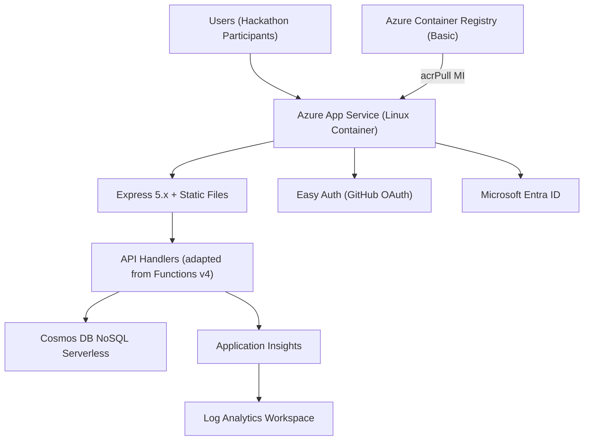
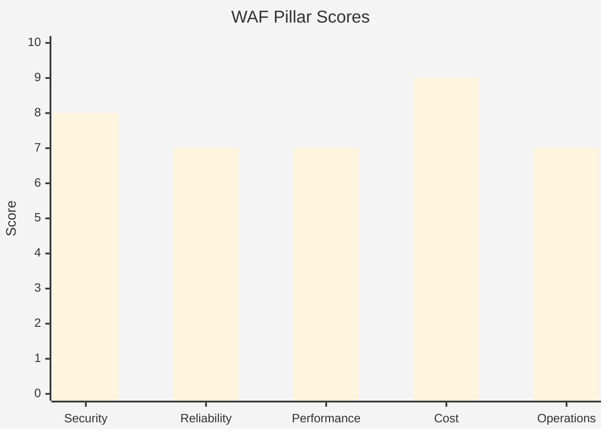

# Step 2: Architecture Assessment — HackerBoard

-orange>)

> [!WARNING]
> **Partially superseded by Phase 18 (App Service Migration).** The SWA managed identity sidecar `expires_on` bug made Cosmos DB MI authentication unreliable. Decisions D28/D29/D30 replaced SWA with App Service for Linux Containers + ACR. The WAF pillar analysis, Cosmos DB RBAC decision, and governance compliance remain valid. Compute architecture, cost estimates, and SKU recommendations are superseded — see [04-implementation-plan.md](04-implementation-plan.md) for the current architecture.
>
> **Key changes**: SWA Standard ($9/mo) → App Service B1 Linux (~$13.14/mo) + ACR Basic (~$5/mo); managed Functions → Express adapter; SWA built-in auth → App Service Easy Auth; region: `westeurope` → `centralus`.

<strong>📑 Table of Contents</strong>

- [Requirements Validation ✅](#requirements-validation-)
- [Executive Summary](#executive-summary)
- [WAF Pillar Assessment](#waf-pillar-assessment)
- [Resource SKU Recommendations](#resource-sku-recommendations)
- [Architecture Decision Summary](#architecture-decision-summary)
- [Implementation Handoff](#implementation-handoff)
- [Approval Gate](#approval-gate)
- [References](#references)

> Generated by architect agent | 2026-02-19

| ⬅️ Previous                              | 📑 Index            | Next ➡️                                            |
| ---------------------------------------- | ------------------- | -------------------------------------------------- |
| [01-requirements.md](01-requirements.md) | [README](README.md) | [03-des-cost-estimate.md](03-des-cost-estimate.md) |

## Requirements Validation ✅

| Requirement Area        | Status     | Validation Notes                                                                    |
| ----------------------- | ---------- | ----------------------------------------------------------------------------------- |
| NFRs (SLA, RTO, RPO)    | ✅ Defined | 99.9% SLA, 4h RTO, 1h RPO — all met by SWA Standard + Cosmos DB platform guarantees |
| Compliance requirements | ✅ Defined | GDPR audit policy enforced at subscription; PCI-DSS/SOC 2/HIPAA not applicable      |
| Budget (approximate)    | ✅ Defined | $50/day ceiling; estimated ~$9.01/month (~$0.30/day) — 98% under ceiling            |
| Scale requirements      | ✅ Defined | 50 concurrent users; ~2,500 documents; ~500 transactions/day (event day)            |
| Security controls       | ✅ Defined | Managed identity, RBAC-only Cosmos DB, dual auth, MFA enforced by governance        |
| Data residency          | ✅ Defined | Central US (`centralus`); updated from `westeurope` in Phase 18                     |

> [!NOTE]
> All requirement areas are fully defined. No blockers to implementation.

---

## Executive Summary

> [!NOTE]
> **Updated for Phase 18**: The original architecture used Azure Static Web Apps. The current architecture uses **App Service for Linux Containers + ACR + Express adapter**. See [04-implementation-plan.md](04-implementation-plan.md).

HackerBoard is an event-driven hackathon scoring dashboard with a low user count (≤50 concurrent), short data lifecycle (event + 30 days), and a strong cost-minimization mandate. The workload pattern is: a containerized Node.js API (Express 5.x) served via Azure App Service for Linux Containers, with static frontend assets served by the same Express process, and persistence via Azure Cosmos DB NoSQL (Serverless). Docker images are stored in Azure Container Registry (ACR Basic) and pulled by the App Service via managed identity (`acrPull` role).

The primary architectural trade-off is **cost optimization vs. reliability**: the single-region deployment and absence of private networking are deliberate cost decisions acceptable for an internal, short-lived event tool. Security is compensated by Entra ID RBAC-only access to Cosmos DB (local auth auto-disabled by governance), managed identity authentication, and GitHub OAuth configured via App Service Easy Auth.

**Estimated monthly cost: ~$18.15** — App Service B1 (~$13.14) + ACR Basic (~$5.00) + Cosmos DB Serverless (~$0.01). Still well below the $50/day ($1,500/month) budget ceiling.

### Current Architecture

---

## WAF Pillar Assessment

### Overall Scores

| Pillar                    | Score | Confidence | Summary                                                                                         |
| ------------------------- | ----- | ---------- | ----------------------------------------------------------------------------------------------- |
| 🔒 Security               | 8/10  | High       | Managed identity + RBAC-only; no secrets; dual auth; minor gap: public endpoints (trade-off)    |
| 🔄 Reliability            | 7/10  | Medium     | 99.9% SLA met; single-region is the primary gap; Cosmos PITR covers RPO                         |
| ⚡ Performance            | 7/10  | High       | CDN + single-digit ms Cosmos reads; cold start on managed Functions is manageable at this scale |
| 💰 Cost Optimization      | 9/10  | High       | 98% under budget ceiling; serverless-only billing eliminates all idle cost                      |
| 🔧 Operational Excellence | 7/10  | High       | IaC + CI/CD + App Insights; gap is absence of alert rules and automated cost notifications      |

**Primary Pillar Optimized**: 💰 Cost Optimization
**Trade-offs Accepted**: Single-region deployment (Reliability ↓), public endpoints (Security ↓ partially compensated by RBAC)

---

### 🔒 Security Assessment (8/10)

**Strengths:**

- Managed identity (`DefaultAzureCredential`) eliminates all connection strings and secrets
- Cosmos DB local auth auto-disabled by governance policy (`ModifyCosmosDBLocalAuth`) — API can only authenticate via Entra ID RBAC
- Dual authentication: GitHub OAuth for team members, Entra ID for admins — both managed by SWA built-in auth (`.auth/` endpoints)
- MFA enforced on all resource write operations by governance policy `sys.mfa-write` (Deny effect)
- TLS 1.2 minimum enforced on all platform services (`minimalTlsVersion: Tls12`)
- Platform-managed encryption at rest for Cosmos DB
- App Insights connection string (not key) used — connection strings are post-breach revocable
- No Key Vault required — zero secrets to store or rotate

**Gaps:**

- Public endpoints accepted for both SWA and Cosmos DB (private endpoints disabled for cost optimization)
- No Azure DDoS Protection Standard (not warranted for internal event tool)
- No WAF (Azure Front Door / App Gateway) in front of SWA — authenticated-only routes mitigate this
- Content Security Policy (CSP) must be explicitly configured in `staticwebapp.config.json`

**Recommendations:**

1. Configure CSP, HSTS, `X-Content-Type-Options`, and `X-Frame-Options` response headers in `staticwebapp.config.json` — this is the primary remaining security hardening action
2. Ensure `requireAuthentication: true` is set for all API routes in `staticwebapp.config.json` to deny-by-default all unauthenticated access
3. Review F11 (anonymized attendee aliases) before any future expansion to confirm PII scope remains minimal

---

### 🔄 Reliability Assessment (7/10)

**Strengths:**

- Azure Static Web Apps Standard is globally distributed (multi-region CDN) by design — static asset availability exceeds 99.9%
- Cosmos DB Serverless provides continuous backup with 7-day point-in-time restore (PITR) — RPO of 1 hour is met
- Serverless billing model means no resource starvation during traffic spikes at hackathon scale (≤50 users)
- RTO 4 hours is achievable via `deploy.ps1` or "Deploy to Azure" button re-provisioning from Bicep templates in Git
- Cosmos DB single-partition reads are consistently sub-10ms at this data volume

**Gaps:**

- Single-region deployment (`centralus` only) — regional outage = full outage with no automatic failover
- No Azure Monitor alert rules configured — issues detected reactively via manual App Insights review
- Managed Functions (SWA-hosted) may experience cold starts of 1–3 seconds after periods of inactivity between hackathon events
- Cosmos DB Serverless does not support `enableAutomaticFailover` or Availability Zones

**Recommendations:**

1. Accept single-region as an explicit risk for this event-based, non-production workload — document in the Risk Register
2. Add at minimum one Azure Monitor alert rule for Cosmos DB 5xx errors and SWA function failure rate to enable proactive detection during live events
3. Configure a keep-warm ping (e.g., scheduled GitHub Actions workflow calling `/api/health`) to reduce cold starts before event start

---

### ⚡ Performance Assessment (7/10)

**Strengths:**

- SWA CDN delivers static assets (HTML, CSS, JS) from edge PoPs — `<2,000 ms` page load target easily met for EU users
- Cosmos DB NoSQL Serverless returns results in single-digit milliseconds for point reads; partition key design (`/teamId` for scores/submissions, `/id` for teams/rubrics) enables efficient targeted queries
- 50 concurrent user target is well within managed Functions auto-scale capacity
- Application Insights client-side SDK provides real user monitoring (RUM) for page load and API latency visibility

**Gaps:**

- Cold start latency on managed Functions (Node.js 20+) can reach 1–3 seconds after inactivity — the `<500 ms p95 API` target may be missed on the first request after idle periods
- Cross-container queries (e.g., joining scores with team names) require multiple round-trips — API must join in application code
- No query result caching layer (e.g., Redis) — acceptable at this scale but noted for future growth

**Recommendations:**

1. Implement a `/api/health` warm-up endpoint and invoke it before each hackathon event to pre-initialize the Functions worker
2. Design Cosmos DB queries to use the partition key on every query — avoid cross-partition fan-out; denormalize where needed (e.g., embed team name in score documents)
3. Set `FUNCTIONS_WORKER_PROCESS_COUNT=1` and ensure Functions are bundled minimally to reduce cold start initialization time

---

### 💰 Cost Assessment (9/10)

> Prices queried from [Azure Retail Prices API](https://prices.azure.com) on 2026-02-19 (originally `westeurope`; region now `centralus`).

| Service                         | SKU             | Unit Price (API-verified)    | Est. Monthly Usage             | Monthly Cost    | Notes                                                                         |
| ------------------------------- | --------------- | ---------------------------- | ------------------------------ | --------------- | ----------------------------------------------------------------------------- |
| Azure Static Web Apps           | Standard        | $9.00/month (flat)           | 1 app                          | **$9.00**       | Includes managed Functions, custom domain, 2 auth providers, 100 GB bandwidth |
| Azure Cosmos DB NoSQL — RUs     | Serverless      | $0.305 / 1M RU               | ~37,500 RU/month (event days)  | **$0.01**       | ~500 ops/day × ~5 RU/op × ~15 event days; $0.00 between events                |
| Azure Cosmos DB NoSQL — Storage | Serverless      | $0.25 / GB / month           | ~0.005 GB (~2,500 docs × 2 KB) | **$0.00**       | Well under 1 GB; effectively zero                                             |
| Log Analytics — Ingestion       | PerGB2018       | $2.99/GB (first 5 GB free)   | ~0.5 GB/month                  | **$0.00**       | Within 5 GB/month free allowance                                              |
| Log Analytics — Retention       | PerGB2018       | $0.13/GB/month (>31 days)    | 30-day retention (included)    | **$0.00**       | Default 30-day retention at no additional cost                                |
| Application Insights            | Workspace-based | Uses Log Analytics ingestion | ~0.3 GB/month                  | **$0.00**       | Workspace-based; ingestion counted in Log Analytics free tier                 |
| SWA Bandwidth Overage           | Standard        | $0.20/GB (>100 GB)           | <1 GB/month                    | **$0.00**       | 100 GB included; hackathon traffic well below threshold                       |
| User-Assigned Managed Identity  | —               | $0.00                        | 1                              | **$0.00**       | No cost                                                                       |
| Entra ID App Registration       | —               | $0.00                        | 1                              | **$0.00**       | Included in Entra ID                                                          |
| **Total Estimated**             |                 |                              |                                | **$9.01/month** | **~$0.30/day — 98% below $50/day ceiling · $108.12/year**                     |

**Cost Optimization Applied:**

- Cosmos DB Serverless selected over Provisioned Throughput — eliminates idle RU cost between hackathon events (potentially weeks of zero usage)
- SWA Standard flat-rate includes managed Functions — no separate Function App or App Service Plan required
- Log Analytics and App Insights both operate within their 5 GB/month free tier at this workload scale
- Private endpoints explicitly disabled — saves ~$7–10/month per endpoint
- No VNet, no NAT Gateway, no Front Door — eliminates the largest potential cost drivers for this workload type

---

### 🔧 Operational Excellence Assessment (7/10)

**Strengths:**

- Infrastructure as Code: all 15 resources defined in Bicep (AVM modules) — repeatable, auditable provisioning
- CI/CD: GitHub Actions workflow deploys on push to `main`; conventional commits enforced
- Automated admin setup: Entra ID app registration + admin role assignment via deployment script in Bicep — no manual portal steps
- App Insights + Log Analytics configured in Bicep — observability from day one
- Cleanup script (`scripts/cleanup-app-data.js`) supports GDPR right-to-erasure and event reset
- Seed data script (`scripts/seed-demo-data.js`) supports rapid event setup

**Gaps:**

- No Azure Monitor alert rules configured — operational issues during live events will be detected reactively
- No automated cost alert / budget threshold notification
- No tag-based cost allocation reporting configured (tags are set on resources; cost query not automated)
- Incident runbook for event-day failures not documented

**Recommendations:**

1. Add an Azure Monitor alert rule for Cosmos DB `TotalRequestUnits` anomaly and HTTP 5xx errors before the first live event
2. Configure an Azure Cost Management budget alert at 80% of the $50/day ceiling
3. Document a one-page event-day runbook covering: warm-up checklist, key monitoring queries, and recovery steps

---

## Resource SKU Recommendations

| Service                        | Recommended SKU | Configuration                                                      | Monthly Est. | Justification                                                                         |
| ------------------------------ | --------------- | ------------------------------------------------------------------ | ------------ | ------------------------------------------------------------------------------------- |
| Azure Static Web Apps          | Standard        | Managed Functions, 2 auth providers, custom domain                 | $9.00        | $9.00/month flat (API-verified); only tier supporting custom auth + managed Functions |
| Azure Cosmos DB NoSQL          | Serverless      | `disableLocalAuth: true`, `minimalTlsVersion: Tls12`, 6 containers | $0.01        | $0.305/1M RU + $0.25/GB storage (API-verified); ~37.5K RU/month at event scale        |
| Log Analytics Workspace        | PerGB2018       | 30-day retention, 5 GB free tier                                   | $0.00        | $2.99/GB ingestion (API-verified); ~0.5 GB/month within free tier                     |
| Application Insights           | Workspace-based | Connected to Log Analytics workspace                               | $0.00        | Workspace-based; ingestion counted in Log Analytics free tier                         |
| User-Assigned Managed Identity | —               | Used for Entra ID deployment script                                | $0.00        | No cost (API-verified)                                                                |

<strong>Azure Static Web Apps</strong> — Pricing Tier Comparison

| Tier     | Functions     | Custom Auth Providers | Custom Domain | Price/mo | Fits?                                   |
| -------- | ------------- | --------------------- | ------------- | -------- | --------------------------------------- |
| Free     | No            | 0                     | No            | $0.00    | ❌ No managed Functions; no custom auth |
| Standard | Yes (managed) | 2                     | Yes           | $9.00    | ✅ Meets all requirements               |

**Selected**: Standard — required for managed Functions and dual OAuth provider (GitHub + Entra ID)

<strong>Azure Cosmos DB NoSQL</strong> — Capacity Mode Comparison

| Mode                   | Billing                        | Min Cost/mo | Fits?                                                   |
| ---------------------- | ------------------------------ | ----------- | ------------------------------------------------------- |
| Serverless             | Per RU consumed ($0.305/1M RU) | ~$0.01      | ✅ Ideal for event-burst pattern with long idle periods |
| Provisioned (100 RU/s) | Fixed ($0.008/hr × 730h)       | ~$5.84      | ⚠️ Higher cost; not needed at this scale                |
| Provisioned (400 RU/s) | Fixed ($0.032/hr × 730h)       | ~$23.36     | ❌ Over-provisioned; significant idle cost              |

**Selected**: Serverless — event-burst usage pattern with weeks of zero activity makes consumption billing optimal

---

## Architecture Decision Summary

| Decision               | Choice                                            | Rationale                                                                                                                                                       |
| ---------------------- | ------------------------------------------------- | --------------------------------------------------------------------------------------------------------------------------------------------------------------- |
| D23: Database          | Cosmos DB NoSQL Serverless (replaces Azure SQL)   | Serverless billing eliminates idle cost; schema-flexible for evolving rubric structures; RBAC-native via Entra ID                                               |
| D24: Authentication    | Dual-provider (GitHub OAuth + Entra ID)           | GitHub provides zero-friction team member access; Entra ID enables automated admin role assignment via deployment script                                        |
| D25: Cosmos DB auth    | RBAC-only (`disableLocalAuth: true`)              | Governance policy `ModifyCosmosDBLocalAuth` auto-disables local auth on all Cosmos DB accounts; managed identity is the only supported path                     |
| D26: Network isolation | Public endpoints with RBAC (no private endpoints) | Private endpoint cost (~$7–10/mo per endpoint) not justified for internal event tool; RBAC + managed identity provides access control without network perimeter |
| D27: Region            | `centralus` single-region                         | Subscription default; no cross-region failover needed for event-based tool with 30-day data lifecycle                                                           |
| D28: Compute           | App Service for Linux Containers + ACR            | SWA MI sidecar `expires_on` bug; App Service MI is battle-tested; Express adapter wraps existing handlers (D29)                                                 |
| D29: API layer         | Express 5.x adapter                               | Wraps Azure Functions v4 handlers unchanged; same request/response contract                                                                                     |
| D30: Auth provider     | App Service Easy Auth (GitHub OAuth)              | Same `/.auth/*` + `x-ms-client-principal` contract as SWA; `/api/health` excluded from auth                                                                     |

---

## Implementation Handoff

### Ready for bicep-plan

The architecture is approved for implementation with the following key parameters:

| Parameter      | Value                                          |
| -------------- | ---------------------------------------------- |
| Region         | `centralus`                                    |
| Environment    | `prod`                                         |
| Budget         | $1,500/month ceiling (estimated: ~$9.01/month) |
| Resource Count | 15 resources across 7 AVM modules              |

### Resources to Provision

| #   | Resource                       | SKU                       | Key Config                                                         |
| --- | ------------------------------ | ------------------------- | ------------------------------------------------------------------ |
| 1   | Azure Static Web Apps          | Standard                  | Managed Functions, GitHub Actions deploy, system-assigned MI       |
| 2   | Cosmos DB Account              | Serverless                | `disableLocalAuth: true`, 6 containers, `minimalTlsVersion: Tls12` |
| 3   | Cosmos DB SQL Role Assignment  | Built-in Data Contributor | Assign SWA system-assigned MI to Cosmos DB                         |
| 4   | Entra ID App Registration      | —                         | Deployment script: creates app reg + assigns admin role            |
| 5   | User-Assigned Managed Identity | —                         | Used by deployment script for Entra ID Graph API calls             |
| 6   | Log Analytics Workspace        | PerGB2018                 | 30-day retention                                                   |
| 7   | Application Insights           | Workspace-based           | Connected to Log Analytics                                         |

### Security Requirements for Implementation

| Requirement                 | Implementation                                                                                                     |
| --------------------------- | ------------------------------------------------------------------------------------------------------------------ |
| No connection strings       | `COSMOS_ENDPOINT` only in app settings; `DefaultAzureCredential` in API code                                       |
| Cosmos DB RBAC              | `sql-role-assignment` scoped to SWA system-assigned MI; `roleDefinitionId: "00000000-0000-0000-0000-000000000002"` |
| Mandatory RG tags (9)       | Declare all 9 tags in `main.bicep` `tags` variable; apply to resource group and all resources                      |
| MFA enforcement             | Deployer must authenticate via `az login` with MFA — enforced by governance policy `sys.mfa-write`                 |
| CSP headers                 | Configure in `staticwebapp.config.json` `globalHeaders` section                                                    |
| Deny unauthenticated routes | Set `requiredRoles` on all `/api/*` routes in `staticwebapp.config.json`                                           |

### Monitoring Requirements for Implementation

| Requirement          | Implementation                                                                                       |
| -------------------- | ---------------------------------------------------------------------------------------------------- |
| Application Insights | `APPLICATIONINSIGHTS_CONNECTION_STRING` in SWA app settings; client-side SDK snippet in `index.html` |
| Log Analytics        | Diagnostic settings on Cosmos DB → Log Analytics workspace                                           |
| Health endpoint      | `GET /api/health` — used for warm-up and uptime monitoring                                           |
| Alert rules          | Azure Monitor alert: Cosmos DB 5xx rate > 5% over 5 minutes                                          |

---

## Approval Gate

> [!IMPORTANT]
> **🏗️ Architecture Assessment Complete**
>
> | Pillar      | Score |
> | ----------- | ----- |
> | Security    | 8/10  |
> | Reliability | 7/10  |
> | Performance | 7/10  |
> | Cost        | 9/10  |
> | Operations  | 7/10  |
>
> **Estimated Monthly Cost**: ~$9.01/month (~$0.30/day — 98% below $50/day ceiling) · $108.12/year
>
> **Confidence Level**: High — all prices verified via Azure Retail Prices API (2026-02-19)
>
> - [ ] **Approved** — proceed to bicep-plan
> - Approver: \_\_\_\_\_\_\_\_\_\_
> - Date: \_\_\_\_\_\_\_\_\_\_
>
> Reply **"approve"** to proceed to bicep-plan, or provide feedback for revisions.

---

## References

> [!NOTE]
> 📚 The following Microsoft Learn resources informed this assessment.

| Topic                      | Link                                                                                                                    |
| -------------------------- | ----------------------------------------------------------------------------------------------------------------------- |
| Well-Architected Framework | [Overview](https://learn.microsoft.com/azure/well-architected/)                                                         |
| Security Checklist         | [WAF Security](https://learn.microsoft.com/azure/well-architected/security/checklist)                                   |
| Reliability Checklist      | [WAF Reliability](https://learn.microsoft.com/azure/well-architected/reliability/checklist)                             |
| Cost Optimization          | [WAF Cost](https://learn.microsoft.com/azure/well-architected/cost-optimization/checklist)                              |
| Azure Pricing Calculator   | [Calculator](https://azure.microsoft.com/pricing/calculator/)                                                           |
| SWA Pricing                | [Static Web Apps Pricing](https://azure.microsoft.com/pricing/details/app-service/static/)                              |
| Cosmos DB Serverless       | [Serverless Mode](https://learn.microsoft.com/azure/cosmos-db/serverless)                                               |
| Cosmos DB RBAC             | [Data Plane RBAC](https://learn.microsoft.com/azure/cosmos-db/nosql/security/how-to-grant-data-plane-role-based-access) |
| Project Requirements       | [01-requirements.md](01-requirements.md)                                                                                |
| Implementation Plan        | [04-implementation-plan.md](04-implementation-plan.md)                                                                  |
| Governance Constraints     | [04-governance-constraints.md](04-governance-constraints.md)                                                            |

---

_Assessment performed using Azure Well-Architected Framework. Pricing data sourced from [Azure Retail Prices API](https://prices.azure.com) (originally westeurope, now centralus; queried 2026-02-19)._

---

| ⬅️ [01-requirements.md](01-requirements.md) | 🏠 [Project Index](README.md) | ➡️ [03-des-cost-estimate.md](03-des-cost-estimate.md) |
| ------------------------------------------- | ----------------------------- | ----------------------------------------------------- |
