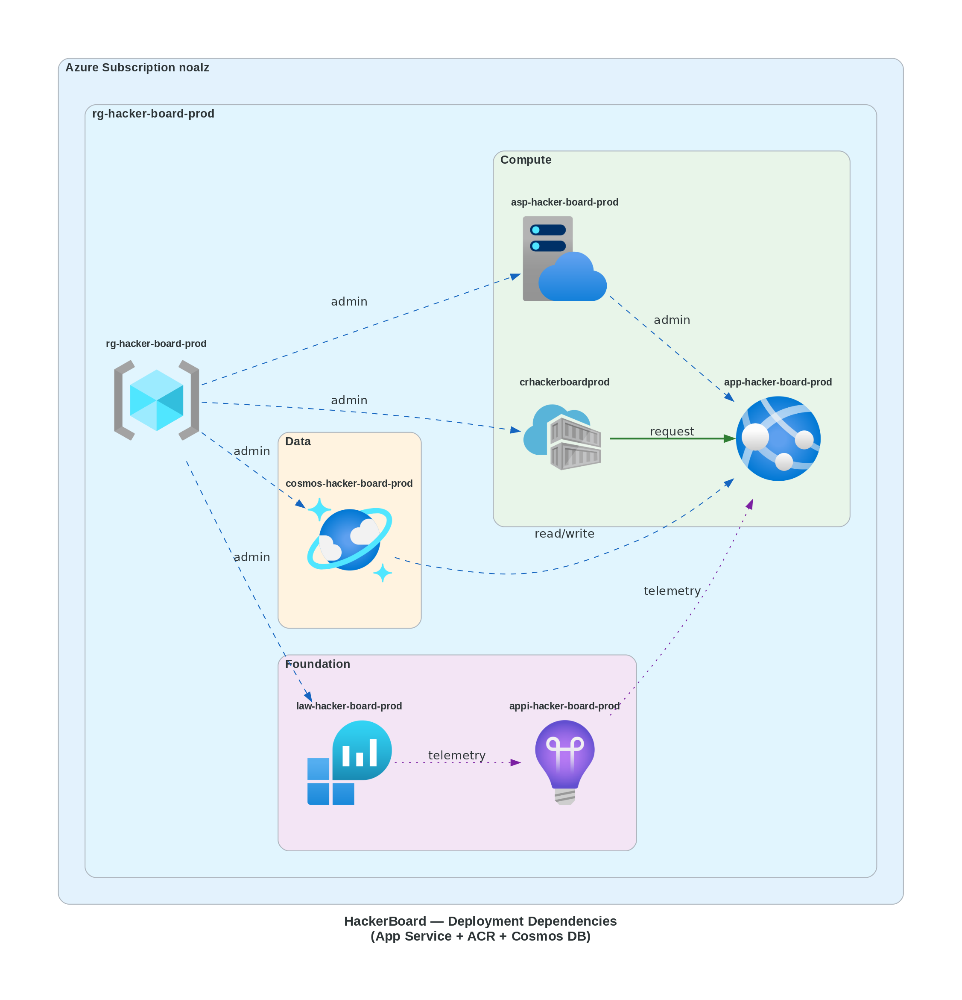
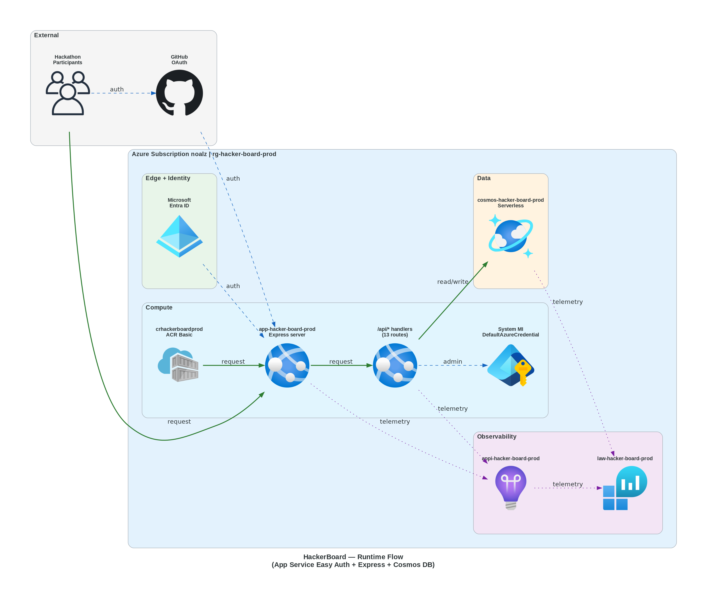

# Step 4: Implementation Plan — HackerBoard (Phase 18.4: App Service + ACR Migration)


<details>
<summary><strong>📑 Table of Contents</strong></summary>

- [Overview](#overview)
- [Resource Inventory](#resource-inventory)
- [Module Structure](#module-structure)
- [Implementation Tasks](#implementation-tasks)
- [Deployment Phases](#deployment-phases)
- [Dependency Graph](#dependency-graph)
- [Runtime Flow Diagram](#runtime-flow-diagram)
- [Naming Conventions](#naming-conventions)
- [Security Configuration](#security-configuration)
- [Estimated Implementation Time](#estimated-implementation-time)
- [Approval Gate](#approval-gate)
- [References](#references)

</details>

> Generated by bicep-plan agent | 2026-02-20

| ⬅️ Previous                                                  | 📑 Index            | Next ➡️                                        |
| ------------------------------------------------------------ | ------------------- | ---------------------------------------------- |
| [04-governance-constraints.md](04-governance-constraints.md) | [README](README.md) | [04-preflight-check.md](04-preflight-check.md) |

---

## Overview

> **Subscription**: noalz (`00858ffc-dded-4f0f-8bbf-e17fff0d47d9`)
> **Tenant**: Lord of the Cloud (`2d04cb4c-999b-4e60-a3a7-e8993edc768b`)
> **Deployment Strategy**: Phased (5 phases — Phases 1–2 already deployed) | **Est. Implementation**: ~4 hours

This plan replaces the **Azure Static Web App** module with **Azure App Service for Linux Containers** + **Azure Container Registry (ACR)**, addressing the SWA managed identity sidecar `expires_on` bug that makes Cosmos DB MI authentication unreliable. The Express adapter pattern (Steps 18.1–18.3) wraps existing Azure Functions handlers without modifying business logic; this plan covers **Step 18.4 — Bicep infrastructure changes only**.

### Decisions

| ID  | Decision                                                                   |
| --- | -------------------------------------------------------------------------- |
| D28 | Replace SWA with App Service for Linux Containers + ACR                    |
| D29 | Express adapter wraps existing Functions handlers unchanged                |
| D30 | App Service Easy Auth for GitHub OAuth — same `/.auth/*` + header contract |
| D31 | Cosmos DB accessed exclusively via Private Endpoint (B7 governance)        |

### What Changes (Infrastructure)

| Area               | Before (SWA)                               | After (App Service + ACR)                                              |
| ------------------ | ------------------------------------------ | ---------------------------------------------------------------------- |
| Compute            | SWA Standard (`Microsoft.Web/staticSites`) | App Service Plan B1 Linux + Web App for Containers                     |
| Container registry | N/A (SWA builds internally)                | ACR Basic (`Microsoft.ContainerRegistry/registries`)                   |
| Auth               | SWA built-in auth (config-driven)          | App Service Easy Auth (`authsettingsV2`) — same `/.auth/*` contract    |
| Managed identity   | SWA system-assigned MI (broken sidecar)    | App Service system-assigned MI (battle-tested)                         |
| Image pull         | N/A                                        | `acrPull` role assignment — MI-based, no admin credentials             |
| Cosmos RBAC        | SWA MI → Cosmos Data Contributor           | App Service MI → Cosmos Data Contributor (same role, different caller) |
| **Networking**     | **Public endpoint (no VNet)**              | **VNet + Private Endpoint + Private DNS for Cosmos DB (B7)**           |
| **Cosmos access**  | **Public network**                         | **Private endpoint only — public access disabled**                     |

### What Stays Unchanged

| Resource                       | AVM Module                               | Version | Notes                                       |
| ------------------------------ | ---------------------------------------- | ------- | ------------------------------------------- |
| Log Analytics Workspace        | `avm/res/operational-insights/workspace` | 0.15.0  | No changes                                  |
| Application Insights           | `avm/res/insights/component`             | 0.7.1   | No changes                                  |
| Cosmos DB Account (Serverless) | `avm/res/document-db/database-account`   | 0.18.0  | Modified — `publicNetworkAccess: Disabled`  |
| Cosmos DB RBAC module          | Native Bicep resource                    | —       | Same contract, different principalId source |

---

## Resource Inventory

| Resource                | Type                                          | SKU / Tier   | AVM Status | AVM Module                               | Version  | Dependencies                         | Status      |
| ----------------------- | --------------------------------------------- | ------------ | ---------- | ---------------------------------------- | -------- | ------------------------------------ | ----------- |
| Log Analytics Workspace | `Microsoft.OperationalInsights/workspaces`    | PerGB2018    | ✅ AVM     | `avm/res/operational-insights/workspace` | `0.15.0` | —                                    | ✅ Deployed |
| Application Insights    | `Microsoft.Insights/components`               | web          | ✅ AVM     | `avm/res/insights/component`             | `0.7.1`  | Log Analytics                        | ✅ Deployed |
| Cosmos DB Account       | `Microsoft.DocumentDB/databaseAccounts`       | Serverless   | ✅ AVM     | `avm/res/document-db/database-account`   | `0.18.0` | —                                    | 🔄 Modified |
| **Virtual Network**     | `Microsoft.Network/virtualNetworks`           | **—**        | ✅ AVM     | `avm/res/network/virtual-network`        | `0.7.2`  | —                                    | ⬜ New      |
| **Private DNS Zone**    | `Microsoft.Network/privateDnsZones`           | **—**        | ✅ AVM     | `avm/res/network/private-dns-zone`       | `0.8.0`  | VNet                                 | ⬜ New      |
| **Private Endpoint**    | `Microsoft.Network/privateEndpoints`          | **—**        | ✅ AVM     | `avm/res/network/private-endpoint`       | `0.11.1` | VNet, Cosmos DB, Private DNS         | ⬜ New      |
| **Container Registry**  | `Microsoft.ContainerRegistry/registries`      | **Basic**    | ✅ AVM     | `avm/res/container-registry/registry`    | `0.10.0` | —                                    | ⬜ New      |
| **App Service Plan**    | `Microsoft.Web/serverfarms`                   | **B1 Linux** | ✅ AVM     | `avm/res/web/serverfarm`                 | `0.7.0`  | —                                    | ⬜ New      |
| **Web App (Container)** | `Microsoft.Web/sites`                         | Linux        | ✅ AVM     | `avm/res/web/site`                       | `0.21.0` | ASP, ACR, Cosmos, App Insights, VNet | ⬜ New      |
| **ACR Pull Role**       | `Microsoft.Authorization/roleAssignments`     | —            | ❌ Native  | (simple role assignment)                 | —        | ACR, Web App MI                      | ⬜ New      |
| Cosmos DB RBAC          | `Microsoft.DocumentDB/.../sqlRoleAssignments` | —            | ❌ Native  | (Cosmos data-plane RBAC)                 | —        | Cosmos DB, Web App MI                | 🔄 Modified |

> **AVM coverage**: 9 of 11 resources use AVM modules. The 2 native resources are simple role assignments where AVM would add unnecessary complexity.

---

## Module Structure

```text
infra/
├── main.bicep              ← MODIFY (replace SWA module, add networking + ACR + App Service)
├── main.bicepparam         ← MODIFY (new OAuth + container params, remove SWA params)
├── azuredeploy.json        ← REBUILD (az bicep build)
├── deploy.ps1              ← MODIFY (separate Phase 18.6)
└── modules/
    ├── log-analytics.bicep            NO CHANGE
    ├── app-insights.bicep             NO CHANGE
    ├── cosmos-account.bicep           MODIFY (publicNetworkAccess: Disabled)
    ├── cosmos-rbac.bicep              NO CHANGE (same interface, different principalId source)
    ├── networking.bicep               NEW — VNet + 2 subnets via AVM
    ├── cosmos-private-endpoint.bicep  NEW — PE + Private DNS Zone + VNet link via AVM
    ├── acr.bicep                      NEW — ACR Basic via AVM
    ├── app-service.bicep              NEW — ASP B1 + Web App + Easy Auth + acrPull + VNet integration via AVM
    └── static-web-app.bicep           DELETE (deferred to Phase 18.9 cleanup)
```

| Module                            | AVM Source                                                        | Version                | Purpose                                     |
| --------------------------------- | ----------------------------------------------------------------- | ---------------------- | ------------------------------------------- |
| log-analytics.bicep               | `br/public:avm/res/operational-insights/workspace`                | `0.15.0`               | Log Analytics Workspace (unchanged)         |
| app-insights.bicep                | `br/public:avm/res/insights/component`                            | `0.7.1`                | Application Insights (unchanged)            |
| cosmos-account.bicep              | `br/public:avm/res/document-db/database-account`                  | `0.18.0`               | Cosmos DB Serverless (modified — PE access) |
| cosmos-rbac.bicep                 | Native `Microsoft.DocumentDB` resource                            | —                      | Cosmos Data Contributor (unchanged)         |
| **networking.bicep**              | `br/public:avm/res/network/virtual-network`                       | **`0.7.2`**            | VNet + snet-pe + snet-app subnets           |
| **cosmos-private-endpoint.bicep** | `br/public:avm/res/network/private-endpoint` + `private-dns-zone` | **`0.11.1` + `0.8.0`** | PE + Private DNS + VNet link for Cosmos DB  |
| **acr.bicep**                     | `br/public:avm/res/container-registry/registry`                   | **`0.10.0`**           | Azure Container Registry Basic              |
| **app-service.bicep**             | `br/public:avm/res/web/serverfarm` + `br/public:avm/res/web/site` | **`0.7.0` + `0.21.0`** | ASP B1 Linux + Web App + Easy Auth + VNet   |

---

## Implementation Tasks

### Task 1: Create `infra/modules/networking.bicep` (NEW)

**Purpose**: Provision a Virtual Network with two subnets — one for the Cosmos DB Private Endpoint and one for App Service VNet integration. Required by B7 governance constraint.

**Parameters**:

| Parameter  | Type     | Description     | Source in `main.bicep`   |
| ---------- | -------- | --------------- | ------------------------ |
| `name`     | `string` | VNet name       | `var vnetName` (derived) |
| `location` | `string` | Azure region    | `param location`         |
| `tags`     | `object` | Governance tags | `var tags`               |

**AVM Module**: `br/public:avm/res/network/virtual-network:0.7.2`

**Key Configuration**:

```bicep
module virtualNetwork 'br/public:avm/res/network/virtual-network:0.7.2' = {
  params: {
    name: name
    location: location
    tags: tags
    addressPrefixes: ['10.0.0.0/16']
    subnets: [
      {
        name: 'snet-pe'
        addressPrefix: '10.0.1.0/24'
      }
      {
        name: 'snet-app'
        addressPrefix: '10.0.2.0/24'
        delegation: 'Microsoft.Web/serverFarms'
      }
    ]
  }
}
```

**Outputs**:

| Output      | Type     | Description                         |
| ----------- | -------- | ----------------------------------- |
| `vnetId`    | `string` | VNet resource ID                    |
| `vnetName`  | `string` | VNet name                           |
| `snetPeId`  | `string` | PE subnet resource ID (`snet-pe`)   |
| `snetAppId` | `string` | App subnet resource ID (`snet-app`) |

---

### Task 2: Create `infra/modules/cosmos-private-endpoint.bicep` (NEW)

**Purpose**: Provision a Private Endpoint for Cosmos DB, a Private DNS Zone (`privatelink.documents.azure.com`), and link the DNS zone to the VNet. Required by B7 governance constraint.

**Parameters**:

| Parameter         | Type     | Description           | Source in `main.bicep`            |
| ----------------- | -------- | --------------------- | --------------------------------- |
| `name`            | `string` | Private Endpoint name | `var pepCosmosName` (derived)     |
| `location`        | `string` | Azure region          | `param location`                  |
| `tags`            | `object` | Governance tags       | `var tags`                        |
| `subnetId`        | `string` | PE subnet resource ID | `networking.outputs.snetPeId`     |
| `cosmosAccountId` | `string` | Cosmos DB account ID  | `cosmosAccount.outputs.accountId` |
| `vnetId`          | `string` | VNet resource ID      | `networking.outputs.vnetId`       |

**AVM Modules**:

- `br/public:avm/res/network/private-endpoint:0.11.1`
- `br/public:avm/res/network/private-dns-zone:0.8.0`

**Key Configuration**:

```bicep
module privateDnsZone 'br/public:avm/res/network/private-dns-zone:0.8.0' = {
  params: {
    name: 'privatelink.documents.azure.com'
    tags: tags
    virtualNetworkLinks: [
      {
        virtualNetworkResourceId: vnetId
        registrationEnabled: false
      }
    ]
  }
}

module privateEndpoint 'br/public:avm/res/network/private-endpoint:0.11.1' = {
  params: {
    name: name
    location: location
    tags: tags
    subnetResourceId: subnetId
    privateLinkServiceConnections: [
      {
        name: '${name}-connection'
        properties: {
          privateLinkServiceId: cosmosAccountId
          groupIds: ['Sql']
        }
      }
    ]
    privateDnsZoneGroup: {
      privateDnsZoneGroupConfigs: [
        {
          privateDnsZoneResourceId: privateDnsZone.outputs.resourceId
        }
      ]
    }
  }
}
```

**Outputs**:

| Output              | Type     | Description                  |
| ------------------- | -------- | ---------------------------- |
| `privateEndpointId` | `string` | Private Endpoint resource ID |
| `privateDnsZoneId`  | `string` | Private DNS Zone resource ID |

---

### Task 3: Modify `infra/modules/cosmos-account.bicep` (MODIFY)

**Purpose**: Disable public network access on the Cosmos DB account so it is only reachable via the private endpoint.

**Change**: Add `publicNetworkAccess: 'Disabled'` to the Cosmos DB AVM module parameters.

```bicep
// ADD to existing cosmos-account.bicep module params:
publicNetworkAccess: 'Disabled'
```

> [!WARNING]
> After setting `publicNetworkAccess: 'Disabled'`, the Cosmos DB account will ONLY be reachable via the private endpoint. Ensure the private endpoint and VNet integration are deployed in the same deployment or before this change is applied. The deployment phases handle this ordering.

---

### Task 4: Create `infra/modules/acr.bicep` (NEW)

**Purpose**: Provision an Azure Container Registry (Basic tier) for the HackerBoard container image.

**Parameters**:

| Parameter  | Type     | Description       | Source in `main.bicep`  |
| ---------- | -------- | ----------------- | ----------------------- |
| `name`     | `string` | ACR resource name | `var acrName` (derived) |
| `location` | `string` | Azure region      | `param location`        |
| `tags`     | `object` | Governance tags   | `var tags`              |

**AVM Module**: `br/public:avm/res/container-registry/registry:0.10.0`

**Key Configuration**:

```bicep
module containerRegistry 'br/public:avm/res/container-registry/registry:0.10.0' = {
  params: {
    name: name
    location: location
    tags: tags
    acrSku: 'Basic'
    publicNetworkAccess: 'Enabled'
    anonymousPullEnabled: false
    acrAdminUserEnabled: false
  }
}
```

**Outputs**:

| Output           | Type     | Description           |
| ---------------- | -------- | --------------------- |
| `acrName`        | `string` | ACR resource name     |
| `acrLoginServer` | `string` | ACR login server FQDN |
| `acrResourceId`  | `string` | ACR resource ID       |

---

### Task 5: Create `infra/modules/app-service.bicep` (NEW)

**Purpose**: Provision App Service Plan (B1 Linux) + Web App for Linux Containers with system-assigned managed identity, Easy Auth (GitHub OAuth), app settings, `acrPull` role assignment, and **VNet integration** (B7).

**Parameters**:

| Parameter                     | Type               | Description                          | Source in `main.bicep`                  |
| ----------------------------- | ------------------ | ------------------------------------ | --------------------------------------- | --- | -------------- | -------- | -------------------------------------- | ------------------------------ |
| `planName`                    | `string`           | App Service Plan name                | `var aspName` (derived)                 |
| `siteName`                    | `string`           | Web App name                         | `var appName` (derived)                 |
| `location`                    | `string`           | Azure region                         | `param location`                        |
| `tags`                        | `object`           | Governance tags                      | `var tags`                              |
| `acrLoginServer`              | `string`           | ACR login server FQDN                | `acr.outputs.acrLoginServer`            |
| `acrName`                     | `string`           | ACR resource name (for acrPull role) | `acr.outputs.acrName`                   |
| `containerImage`              | `string`           | Container image ref (`repo:tag`)     | `param containerImage`                  |
| `cosmosEndpoint`              | `string`           | Cosmos DB HTTPS endpoint             | `cosmosAccount.outputs.accountEndpoint` |
| `appInsightsConnectionString` | `string`           | App Insights connection string       | `appInsights.outputs.connectionString`  |
| `gitHubOAuthClientId`         | `@secure() string` | GitHub OAuth App client ID           | `param gitHubOAuthClientId`             |
| `gitHubOAuthClientSecret`     | `@secure() string` | GitHub OAuth App client secret       | `param gitHubOAuthClientSecret`         |     | `vnetSubnetId` | `string` | App Service VNet integration subnet ID | `networking.outputs.snetAppId` |

**Sub-resources**:

#### 2a. App Service Plan (AVM `serverfarm:0.7.0`)

```bicep
module appServicePlan 'br/public:avm/res/web/serverfarm:0.7.0' = {
  params: {
    name: planName
    location: location
    tags: tags
    kind: 'Linux'
    reserved: true
    skuName: 'B1'
    skuCapacity: 1
  }
}
```

#### 2b. Web App for Containers (AVM `site:0.21.0`)

```bicep
module webApp 'br/public:avm/res/web/site:0.21.0' = {
  params: {
    name: siteName
    location: location
    tags: tags
    kind: 'app,linux,container'
    serverFarmResourceId: appServicePlan.outputs.resourceId
    managedIdentities: {
      systemAssigned: true
    }
    httpsOnly: true
    virtualNetworkSubnetId: vnetSubnetId
    siteConfig: {
      linuxFxVersion: 'DOCKER|${acrLoginServer}/${containerImage}'
      acrUseManagedIdentityCreds: true
      alwaysOn: true
      ftpsState: 'Disabled'
      minTlsVersion: '1.2'
      http20Enabled: true
      vnetRouteAllEnabled: true
    }
    appSettingsKeyValuePairs: {
      COSMOS_ENDPOINT: cosmosEndpoint
      APPLICATIONINSIGHTS_CONNECTION_STRING: appInsightsConnectionString
      WEBSITES_PORT: '8080'
      DOCKER_REGISTRY_SERVER_URL: 'https://${acrLoginServer}'
      GITHUB_OAUTH_CLIENT_SECRET: gitHubOAuthClientSecret
    }
    authSettingV2Configuration: {
      platform: {
        enabled: true
        runtimeVersion: '~1'
      }
      globalValidation: {
        unauthenticatedClientAction: 'RedirectToLoginPage'
        redirectToProvider: 'github'
      }
      identityProviders: {
        gitHub: {
          registration: {
            clientId: gitHubOAuthClientId
            clientSecretSettingName: 'GITHUB_OAUTH_CLIENT_SECRET'
          }
        }
      }
      login: {
        tokenStore: {
          enabled: true
        }
      }
    }
  }
}
```

> [!WARNING]
> **Easy Auth Risk (R1)**: The AVM `web/site:0.21.0` `authSettingV2Configuration` parameter schema may not perfectly align with the ARM `Microsoft.Web/sites/config@2024-04-01` schema. If the AVM module rejects the auth config, **fallback**: create a separate native `Microsoft.Web/sites/config` child resource with `name: 'authsettingsV2'` after the AVM module deploys the site. See [Risks & Considerations](#risks--considerations).

#### 2c. ACR Pull Role Assignment (Native Bicep)

The `acrPull` role (GUID: `7f951dda-4ed3-4680-a7ca-43fe172d538d`) grants the App Service MI permission to pull container images from ACR without admin credentials.

```bicep
resource acr 'Microsoft.ContainerRegistry/registries@2023-07-01' existing = {
  name: acrName
}

resource acrPullRoleAssignment 'Microsoft.Authorization/roleAssignments@2022-04-01' = {
  name: guid(acr.id, webApp.outputs.systemAssignedMIPrincipalId, '7f951dda-4ed3-4680-a7ca-43fe172d538d')
  scope: acr
  properties: {
    roleDefinitionId: subscriptionResourceId(
      'Microsoft.Authorization/roleDefinitions',
      '7f951dda-4ed3-4680-a7ca-43fe172d538d'
    )
    principalId: webApp.outputs.systemAssignedMIPrincipalId
    principalType: 'ServicePrincipal'
  }
}
```

**Outputs**:

| Output                  | Type     | Description                              |
| ----------------------- | -------- | ---------------------------------------- |
| `appServiceHostname`    | `string` | Default hostname (`*.azurewebsites.net`) |
| `appServiceName`        | `string` | Web App resource name                    |
| `appServicePrincipalId` | `string` | System-assigned MI principal ID          |
| `appServiceResourceId`  | `string` | Web App resource ID                      |
| `appServicePlanId`      | `string` | App Service Plan resource ID             |

---

### Task 6: Update `infra/main.bicep` (MODIFY)

**Purpose**: Replace SWA module with networking + ACR + App Service modules; update parameter flow and outputs.

#### 3a. Parameters — Add

| Parameter                 | Type               | Default                 | Description                              |
| ------------------------- | ------------------ | ----------------------- | ---------------------------------------- |
| `gitHubOAuthClientId`     | `@secure() string` | _(required)_            | GitHub OAuth App client ID for Easy Auth |
| `gitHubOAuthClientSecret` | `@secure() string` | _(required)_            | GitHub OAuth App client secret           |
| `containerImage`          | `string`           | `'hacker-board:latest'` | Container image reference (`repo:tag`)   |
| `vnetAddressPrefix`       | `string`           | `'10.0.0.0/16'`         | VNet address space (default: /16)        |

#### 3b. Parameters — Remove

| Parameter          | Reason                               |
| ------------------ | ------------------------------------ |
| `repositoryUrl`    | SWA-specific (GitHub source linkage) |
| `repositoryBranch` | SWA-specific                         |

#### 3c. Parameters — Modify

| Parameter  | Change                                                                                                        |
| ---------- | ------------------------------------------------------------------------------------------------------------- |
| `location` | Update `@description` to remove SWA region requirement; keep `@allowed` or widen for App Service availability |

#### 3d. Variables — Add

```bicep
// ACR: alphanumeric only, 5-50 chars, CAF abbreviation 'cr'
var acrName = 'cr${replace(projectName, '-', '')}${environment}'

// App Service Plan: CAF abbreviation 'asp'
var aspName = 'asp-${suffix}'

// Web App: CAF abbreviation 'app'
var appName = 'app-${suffix}'

// Virtual Network: CAF abbreviation 'vnet'
var vnetName = 'vnet-${suffix}'

// Private Endpoint for Cosmos DB: CAF abbreviation 'pep'
var pepCosmosName = 'pep-cosmos-${suffix}'
```

#### 3e. Modules — Remove

```bicep
// DELETE entire block:
module staticWebApp 'modules/static-web-app.bicep' = { ... }
```

#### 3f. Modules — Add

```bicep
// Phase 2.5: Networking — VNet + subnets (required for Cosmos PE + App Service VNet integration)
module networking 'modules/networking.bicep' = {
  name: 'networking-${deploymentTimestamp}'
  params: {
    name: vnetName
    location: location
    tags: tags
  }
}

// Phase 2.5: Cosmos DB Private Endpoint + Private DNS Zone
module cosmosPrivateEndpoint 'modules/cosmos-private-endpoint.bicep' = {
  name: 'cosmos-pe-${deploymentTimestamp}'
  params: {
    name: pepCosmosName
    location: location
    tags: tags
    subnetId: networking.outputs.snetPeId
    cosmosAccountId: cosmosAccount.outputs.accountId
    vnetId: networking.outputs.vnetId
  }
}

// Phase 3: Container Registry
module acr 'modules/acr.bicep' = {
  name: 'acr-${deploymentTimestamp}'
  params: {
    name: acrName
    location: location
    tags: tags
  }
}

// Phase 4: Compute — App Service with container + Easy Auth + VNet integration
module appService 'modules/app-service.bicep' = {
  name: 'app-service-${deploymentTimestamp}'
  params: {
    planName: aspName
    siteName: appName
    location: location
    tags: tags
    acrLoginServer: acr.outputs.acrLoginServer
    acrName: acr.outputs.acrName
    containerImage: containerImage
    cosmosEndpoint: cosmosAccount.outputs.accountEndpoint
    appInsightsConnectionString: appInsights.outputs.connectionString
    gitHubOAuthClientId: gitHubOAuthClientId
    gitHubOAuthClientSecret: gitHubOAuthClientSecret
    vnetSubnetId: networking.outputs.snetAppId
  }
}
```

#### 3g. Cosmos RBAC — Update caller

```bicep
module cosmosRbac 'modules/cosmos-rbac.bicep' = {
  name: 'cosmos-rbac-${deploymentTimestamp}'
  params: {
    cosmosAccountName: cosmosAccount.outputs.accountName
    principalId: appService.outputs.appServicePrincipalId  // was: staticWebApp.outputs.principalId
  }
}
```

#### 3h. Outputs — Replace

| Remove           | Add                     | Type     |
| ---------------- | ----------------------- | -------- |
| `swaHostname`    | `appServiceHostname`    | `string` |
| `swaName`        | `appServiceName`        | `string` |
| `swaPrincipalId` | `appServicePrincipalId` | `string` |
| —                | `acrLoginServer`        | `string` |
| —                | `acrName`               | `string` |
| —                | `vnetName`              | `string` |
| —                | `privateEndpointId`     | `string` |

---

### Task 7: Update `infra/main.bicepparam` (MODIFY)

**Changes**:

```bicep-params
using 'main.bicep'

param projectName = 'hacker-board'
param environment = 'prod'
param location = 'centralus'
param owner = 'agentic-infraops'
param costCenter = 'microhack'
param technicalContact = 'jonathan@lordofthecloud.eu'
param application = 'hacker-board'
param workload = 'web-app'
param sla = 'non-production'
param backupPolicy = 'none'
param maintWindow = 'any'

// NEW: Container image (updated by CI/CD after first push)
param containerImage = 'hacker-board:latest'

// NEW: GitHub OAuth credentials — supply at deploy time, NEVER commit secrets
// param gitHubOAuthClientId = <provide via --parameters override>
// param gitHubOAuthClientSecret = <provide via --parameters override>

// REMOVED: repositoryUrl, repositoryBranch (SWA-specific)
```

> [!IMPORTANT]
> `gitHubOAuthClientId` and `gitHubOAuthClientSecret` are `@secure()` parameters. They **must** be supplied at deployment time via `--parameters` CLI override or Key Vault reference. They must **never** appear in `.bicepparam` files committed to source control.

---

### Task 8: Rebuild `infra/azuredeploy.json`

```bash
az bicep build --file infra/main.bicep --outfile infra/azuredeploy.json
```

> [!CAUTION]
> The Portal "Deploy to Azure" button reads `azuredeploy.json`. Skipping this step causes stale parameter defaults. Always commit `main.bicep` and `azuredeploy.json` together.

---

## Deployment Phases

> Deployment strategy: **Phased** (5 phases — matching existing deployment pattern)

### Phase 1: Foundation (NO CHANGE — Already Deployed)

| Order | Module              | Resources               | Validation                                |
| ----- | ------------------- | ----------------------- | ----------------------------------------- |
| 1     | log-analytics.bicep | Log Analytics Workspace | `az monitor log-analytics workspace show` |
| 2     | app-insights.bicep  | Application Insights    | Connection string in outputs              |

**Status**: ✅ Already deployed — no changes required.

### Phase 2: Data Layer (MODIFIED — Cosmos DB public access disabled)

| Order | Module               | Resources                             | Validation                  |
| ----- | -------------------- | ------------------------------------- | --------------------------- |
| 3     | cosmos-account.bicep | Cosmos DB Account + DB + 6 Containers | Account endpoint in outputs |

**Status**: 🔄 Modified — `publicNetworkAccess: Disabled` added. Deployed alongside Phase 2.5 to ensure PE is ready.

### Phase 2.5: Networking + Private Endpoint (NEW)

| Order | Module                        | Resources                                       | Validation                                       |
| ----- | ----------------------------- | ----------------------------------------------- | ------------------------------------------------ |
| 3.1   | networking.bicep              | VNet + snet-pe + snet-app subnets               | `az network vnet show`, subnets listed           |
| 3.2   | cosmos-private-endpoint.bicep | Private Endpoint + Private DNS Zone + VNet link | `az network private-endpoint show`, DNS resolves |

**Approval Gate**: Verify VNet is created, PE shows `Succeeded` state, and `nslookup cosmos-hacker-board-prod.documents.azure.com` resolves to a `10.0.1.x` private IP from within the VNet.

> [!IMPORTANT]
> Phase 2 (Cosmos `publicNetworkAccess: Disabled`) and Phase 2.5 (networking + PE) must be deployed together in the same deployment to avoid Cosmos becoming unreachable. The Bicep dependency graph handles ordering automatically.

### Phase 3: Container Registry (NEW)

| Order | Module    | Resources                | Validation                                       |
| ----- | --------- | ------------------------ | ------------------------------------------------ |
| 4     | acr.bicep | Azure Container Registry | `az acr show --name <acrName>`, login server URL |

**Approval Gate**: Verify ACR is accessible and login server resolves before proceeding.

### Phase 4: Compute + Auth + RBAC (NEW)

| Order | Module            | Resources                                                           | Validation                                       |
| ----- | ----------------- | ------------------------------------------------------------------- | ------------------------------------------------ |
| 5     | app-service.bicep | App Service Plan + Web App + MI + Easy Auth + acrPull + VNet integ. | `az webapp show`, hostname resolves, MI assigned |
| 6     | cosmos-rbac.bicep | Cosmos DB Data Contributor → App Service MI                         | `az cosmosdb sql role assignment list`           |

**Approval Gate**: Verify App Service is running, VNet integration active (`az webapp vnet-integration list`), Easy Auth responds at `/.auth/me`, and Cosmos RBAC is assigned.

### Phase Summary

| Phase | Resources          | Est. Deploy Time | Approval Gate | Status              |
| ----- | ------------------ | ---------------- | ------------- | ------------------- |
| 1     | 2 (unchanged)      | 0 min (skip)     | ✅ Deployed   | ✅ Already deployed |
| 2     | 1 (modified)       | ~2 min           | ✅            | 🔄 Modified         |
| 2.5   | 3 (new networking) | ~5 min           | ✅            | ⬜ New              |
| 3     | 1 (new)            | ~3 min           | ✅            | ⬜ New              |
| 4     | 3 (new + mod)      | ~5 min           | ✅            | ⬜ New              |

---

## Dependency Graph



Source: [04-dependency-diagram.py](./04-dependency-diagram.py)

### Parameter Flow

```text
main.bicep (orchestrator)
│
├─→ logAnalytics (name, location, tags)
│       └─→ outputs: workspaceId
│
├─→ appInsights (name, location, tags, workspaceResourceId ← logAnalytics)
│       └─→ outputs: connectionString
│
├─→ cosmosAccount (name, location, tags, publicNetworkAccess: Disabled)
│       └─→ outputs: accountEndpoint, accountName, accountId
│
├─→ networking (name, location, tags)
│       └─→ outputs: vnetId, vnetName, snetPeId, snetAppId
│
├─→ cosmosPrivateEndpoint (name, location, tags,
│                         subnetId ← networking, cosmosAccountId ← cosmosAccount,
│                         vnetId ← networking)
│       ├─→ [internal] Private DNS Zone (privatelink.documents.azure.com)
│       ├─→ [internal] VNet link (DNS zone → VNet)
│       ├─→ [internal] Private Endpoint (Cosmos DB → snet-pe)
│       └─→ outputs: privateEndpointId, privateDnsZoneId
│
├─→ acr (name, location, tags)
│       └─→ outputs: acrLoginServer, acrName, acrResourceId
│
├─→ appService (planName, siteName, location, tags,
│               acrLoginServer ← acr, acrName ← acr,
│               containerImage, cosmosEndpoint ← cosmosAccount,
│               appInsightsConnectionString ← appInsights,
│               gitHubOAuthClientId, gitHubOAuthClientSecret,
│               vnetSubnetId ← networking)
│       ├─→ [internal] App Service Plan (ASP B1 Linux)
│       ├─→ [internal] Web App for Containers (MI + Easy Auth + VNet integration + app settings)
│       ├─→ [internal] acrPull role assignment (App Service MI → ACR)
│       └─→ outputs: appServiceHostname, appServiceName, appServicePrincipalId
│
└─→ cosmosRbac (cosmosAccountName ← cosmosAccount, principalId ← appService)
```

---

## Runtime Flow Diagram



Source: [04-runtime-diagram.py](./04-runtime-diagram.py)

---

## Naming Conventions

| Resource               | Pattern                           | Generated Name                    | Max Length |
| ---------------------- | --------------------------------- | --------------------------------- | ---------- |
| Resource Group         | `rg-{project}-{env}`              | `rg-hacker-board-prod`            | 90         |
| Log Analytics          | `law-{project}-{env}`             | `law-hacker-board-prod`           | 63         |
| Application Insights   | `appi-{project}-{env}`            | `appi-hacker-board-prod`          | 255        |
| Cosmos DB Account      | `cosmos-{project}-{env}`          | `cosmos-hacker-board-prod`        | 44         |
| **Virtual Network**    | `vnet-{project}-{env}`            | `vnet-hacker-board-prod`          | 64         |
| **PE Subnet**          | `snet-pe`                         | `snet-pe`                         | 80         |
| **App Subnet**         | `snet-app`                        | `snet-app`                        | 80         |
| **Private Endpoint**   | `pep-cosmos-{project}-{env}`      | `pep-cosmos-hacker-board-prod`    | 64         |
| **Private DNS Zone**   | `privatelink.documents.azure.com` | `privatelink.documents.azure.com` | 63         |
| **Container Registry** | `cr{project-no-hyphens}{env}`     | `crhackerboardprod`               | 50         |
| **App Service Plan**   | `asp-{project}-{env}`             | `asp-hacker-board-prod`           | 40         |
| **Web App**            | `app-{project}-{env}`             | `app-hacker-board-prod`           | 60         |

> [!NOTE]
> ACR names must be **alphanumeric only** (no hyphens). The `cr` prefix follows CAF abbreviation conventions. All names are well within their max length limits. VNet uses CAF abbreviation `vnet`, Private Endpoint uses `pep`, subnets use `snet`.

---

## Security Configuration

| Resource         | Security Setting           | Value                              | Rationale                                  |
| ---------------- | -------------------------- | ---------------------------------- | ------------------------------------------ |
| VNet             | Address space              | `10.0.0.0/16`                      | Isolated network for private connectivity  |
| VNet (snet-pe)   | Subnet                     | `10.0.1.0/24`                      | Dedicated to private endpoints             |
| VNet (snet-app)  | Subnet delegation          | `Microsoft.Web/serverFarms`        | App Service VNet integration               |
| Private Endpoint | Target sub-resource        | `Sql` (Cosmos DB)                  | Cosmos DB NoSQL API private link           |
| Private DNS Zone | Zone name                  | `privatelink.documents.azure.com`  | Resolves Cosmos FQDN to private IP         |
| Cosmos DB        | Public network access      | `Disabled`                         | B7 — private endpoint only                 |
| ACR              | Admin user                 | `disabled`                         | MI-based pull, no shared credentials       |
| ACR              | Anonymous pull             | `disabled`                         | Private images only                        |
| ACR              | Public network access      | `Enabled`                          | Required for CI/CD push + App Service pull |
| App Service Plan | SKU                        | `B1` (Linux)                       | Cost-effective for non-production          |
| Web App          | HTTPS only                 | `true`                             | Enforce TLS                                |
| Web App          | Minimum TLS version        | `1.2`                              | Security baseline                          |
| Web App          | FTPS state                 | `Disabled`                         | No FTP access                              |
| Web App          | HTTP/2                     | `Enabled`                          | Performance                                |
| Web App          | Always On                  | `true`                             | Prevent cold starts                        |
| Web App          | System-assigned MI         | `Enabled`                          | For ACR pull + Cosmos RBAC                 |
| Web App          | ACR MI-based pull          | `acrUseManagedIdentityCreds: true` | No admin credentials                       |
| Web App          | VNet integration           | `snet-app` subnet                  | Route all traffic through VNet (B7)        |
| Web App          | `vnetRouteAllEnabled`      | `true`                             | All outbound traffic via VNet              |
| Web App          | Easy Auth                  | `Enabled` (GitHub provider)        | Same `/.auth/*` contract as SWA            |
| Web App          | Unauthenticated action     | `RedirectToLoginPage`              | Require auth by default                    |
| Web App          | Token store                | `Enabled`                          | Required for `/.auth/me` endpoint          |
| Cosmos DB RBAC   | Role                       | Built-in Data Contributor          | Least privilege for read/write data-plane  |
| ACR Pull Role    | `acrPull` (`7f951dda-...`) | App Service MI                     | Pull-only access, no push                  |
| Tags             | 9 governance tags          | All present                        | B3 policy compliance                       |

### Role Assignments Summary

| Principal      | Role                                | Scope             | Purpose               |
| -------------- | ----------------------------------- | ----------------- | --------------------- |
| App Service MI | `acrPull`                           | ACR resource      | Pull container images |
| App Service MI | Cosmos DB Built-in Data Contributor | Cosmos DB account | Read/write data-plane |

### Governance Compliance

| Constraint                       | Status           | Notes                                                         |
| -------------------------------- | ---------------- | ------------------------------------------------------------- |
| B3 — 9 RG tags                   | ✅ Compliant     | Already in `main.bicep`, tag inheritance auto-propagates      |
| B5 — MCAPSGov deny policies      | ✅ Compliant     | App Service + ACR not in deny list                            |
| B6 — Storage key auth deny       | ✅ Compliant     | ACR uses Azure-managed storage, not customer storage accounts |
| **B7 — Cosmos private endpoint** | **✅ Compliant** | **VNet + PE + Private DNS + App Service VNet integration**    |
| Cosmos `disableLocalAuth`        | ✅ Compliant     | `DefaultAzureCredential` + MI — no connection strings         |
| Cosmos `publicNetworkAccess`     | ✅ Compliant     | Set to `Disabled` — PE-only access (B7)                       |
| MFA on resource write (B1)       | ✅ Compliant     | Operational — deployer authenticates with MFA                 |
| Tag inheritance (Modify)         | ✅ Compliant     | Policy auto-copies 9 tags from RG to child resources          |

---

## Risks & Considerations

### R1: Easy Auth `authSettingV2Configuration` Schema Compatibility (Medium Risk)

The AVM `web/site:0.21.0` module accepts `authSettingV2Configuration` as a typed parameter, but the exact schema may not perfectly align with the ARM `Microsoft.Web/sites/config@2024-04-01` schema for `authsettingsV2`.

**Mitigation**: During Bicep Code implementation, test with `az bicep build` first. If the AVM module rejects the auth config:

- **Fallback**: Create a separate native `Microsoft.Web/sites/config` child resource with `name: 'authsettingsV2'` using the `parent` property or `existing` reference to the AVM-deployed site.

### R2: Container Image Not Available on First Deploy (Low Risk)

During initial infrastructure provisioning, the ACR will be empty — no container image exists yet. The Web App will show a startup error until CI/CD pushes the first image.

**Mitigation**: Accept the startup error for initial deployment (infrastructure-only Phase 18.4). The image gets pushed in Phase 18.5 (CI/CD pipeline). Alternatively, set `linuxFxVersion` to a known public placeholder like `DOCKER|mcr.microsoft.com/appsvc/staticsite:latest` and update after first push.

### R3: GitHub OAuth Callback URL Timing (Low Risk)

The GitHub OAuth App callback URL must be `https://app-hacker-board-prod.azurewebsites.net/.auth/login/github/callback`. This URL is only valid after deployment, but the OAuth App must be configured beforehand.

**Mitigation**: Hostname is deterministic from naming convention: `app-{project}-{env}.azurewebsites.net`. Pre-create the GitHub OAuth App with this value (Step 10 in migration plan).

### R4: ACR Basic Tier Limitations (Low Risk)

ACR Basic tier provides 10 GiB storage and limited throughput. Sufficient for a single-image hackathon app.

**Mitigation**: Monitor ACR storage. Upgrade to Standard via a simple `acrSku` parameter change if needed.

### R5: `@secure()` Parameters in `.bicepparam` (Operational)

`gitHubOAuthClientId` and `gitHubOAuthClientSecret` cannot be committed to `.bicepparam`. They must be supplied at deploy time.

**Mitigation**: `deploy.ps1` must accept these as CLI parameters or read from Key Vault. For CI/CD, store as GitHub Actions secrets and pass via `--parameters` override.

### R6: AVM `web/site` `siteConfig` vs `appSettingsKeyValuePairs` (Low Risk)

The AVM `web/site` module may use `appSettingsKeyValuePairs` (key-value object) or `siteConfig.appSettings` (array of `{name, value}` objects) — the handling may differ between AVM versions.

**Mitigation**: During preflight check (04-preflight-check), validate the exact AVM parameter names via `mcp_bicep_get_az_resource_type_schema`. Adjust configuration style to match the AVM module's expected input.

---

## Estimated Implementation Time

| Task                                          | Estimated Duration |
| --------------------------------------------- | ------------------ |
| `modules/networking.bicep` (new)              | 20 minutes         |
| `modules/cosmos-private-endpoint.bicep` (new) | 30 minutes         |
| `modules/cosmos-account.bicep` (modify)       | 10 minutes         |
| `modules/acr.bicep` (new)                     | 15 minutes         |
| `modules/app-service.bicep` (new)             | 45 minutes         |
| `main.bicep` updates                          | 30 minutes         |
| `main.bicepparam` updates                     | 10 minutes         |
| AVM schema validation + lint                  | 25 minutes         |
| `az bicep build` + testing                    | 15 minutes         |
| `what-if` dry run                             | 20 minutes         |
| **Total**                                     | **~4 hours**       |

---

## Approval Gate

> [!IMPORTANT]
> **📋 Implementation Plan Ready — Phase 18.4**
>
> | Metric                           | Value                                                                                                                                      |
> | -------------------------------- | ------------------------------------------------------------------------------------------------------------------------------------------ |
> | Azure resources planned          | 11 (6 new, 2 modified, 3 unchanged)                                                                                                        |
> | Bicep modules to create          | 4 (`networking.bicep`, `cosmos-private-endpoint.bicep`, `acr.bicep`, `app-service.bicep`)                                                  |
> | Bicep modules to modify          | 2 (`cosmos-account.bicep`, `main.bicep`)                                                                                                   |
> | AVM modules used                 | 6 new (`virtual-network:0.7.2`, `private-dns-zone:0.8.0`, `private-endpoint:0.11.1`, `registry:0.10.0`, `serverfarm:0.7.0`, `site:0.21.0`) |
> | Governance constraints addressed | ✅ All 7 verified (including B7 — Cosmos private endpoint)                                                                                 |
> | CAF naming conventions applied   | ✅                                                                                                                                         |
> | Deployment strategy              | Phased (5 phases — Phases 1 already deployed, Phase 2 modified)                                                                            |
> | Est. Implementation              | ~4 hours                                                                                                                                   |
>
> - [ ] **Approved** — proceed to bicep-code
> - **Approver**: **\*\***\_\_\_**\*\***
> - **Date**: **\*\***\_\_\_**\*\***
>
> Reply **"approve"** to proceed to bicep-code, or provide feedback.

---

## References

> [!NOTE]
> 📚 The following Microsoft Learn resources inform this implementation.

| Topic                        | Link                                                                                                                                                    |
| ---------------------------- | ------------------------------------------------------------------------------------------------------------------------------------------------------- |
| Azure Verified Modules       | [AVM Index](https://aka.ms/avm/index)                                                                                                                   |
| Bicep Best Practices         | [Documentation](https://learn.microsoft.com/azure/azure-resource-manager/bicep/best-practices)                                                          |
| CAF Naming Conventions       | [Naming Rules](https://learn.microsoft.com/azure/cloud-adoption-framework/ready/azure-best-practices/resource-naming)                                   |
| Resource Abbreviations       | [Abbreviations](https://learn.microsoft.com/azure/cloud-adoption-framework/ready/azure-best-practices/resource-abbreviations)                           |
| App Service Easy Auth        | [Authentication](https://learn.microsoft.com/azure/app-service/overview-authentication-authorization)                                                   |
| App Service + ACR MI Pull    | [ACR Pull with MI](https://learn.microsoft.com/azure/app-service/configure-custom-container#use-managed-identity-to-pull-from-azure-container-registry) |
| App Service VNet Integration | [VNet Integration](https://learn.microsoft.com/azure/app-service/overview-vnet-integration)                                                             |
| Private Endpoint for Cosmos  | [Cosmos DB PE](https://learn.microsoft.com/azure/cosmos-db/how-to-configure-private-endpoints)                                                          |
| Private DNS Zones            | [Private DNS](https://learn.microsoft.com/azure/dns/private-dns-overview)                                                                               |
| AVM Virtual Network          | [AVM VNet Module](https://github.com/Azure/bicep-registry-modules/tree/main/avm/res/network/virtual-network)                                            |
| AVM Private Endpoint         | [AVM PE Module](https://github.com/Azure/bicep-registry-modules/tree/main/avm/res/network/private-endpoint)                                             |
| AVM Private DNS Zone         | [AVM DNS Module](https://github.com/Azure/bicep-registry-modules/tree/main/avm/res/network/private-dns-zone)                                            |
| AVM Container Registry       | [AVM ACR Module](https://github.com/Azure/bicep-registry-modules/tree/main/avm/res/container-registry/registry)                                         |
| AVM Web Serverfarm           | [AVM ASP Module](https://github.com/Azure/bicep-registry-modules/tree/main/avm/res/web/serverfarm)                                                      |
| AVM Web Site                 | [AVM Site Module](https://github.com/Azure/bicep-registry-modules/tree/main/avm/res/web/site)                                                           |
| Easy Auth GitHub Provider    | [GitHub Provider](https://learn.microsoft.com/azure/app-service/configure-authentication-provider-github)                                               |

---

_Plan generated by bicep-plan agent following Azure Well-Architected Framework guidelines._

---

| ⬅️ [04-governance-constraints.md](04-governance-constraints.md) | 🏠 [Project Index](README.md) | ➡️ [04-preflight-check.md](04-preflight-check.md) |
| --------------------------------------------------------------- | ----------------------------- | ------------------------------------------------- |
