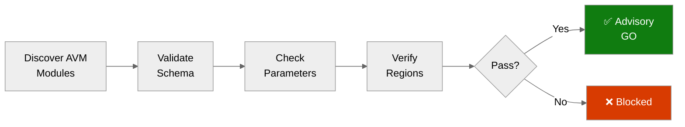

# Step 4b: Pre-Flight AVM Check — HackerBoard


<details>
<summary><strong>📑 Table of Contents</strong></summary>

- [Purpose](#purpose)
- [AVM Schema Validation Results](#avm-schema-validation-results)
- [Parameter Type Analysis](#parameter-type-analysis)
- [Region Limitations Identified](#region-limitations-identified)
- [Pitfalls Checklist](#pitfalls-checklist)
- [Advisory Items](#advisory-items)
- [Ready for Implementation](#ready-for-implementation)

</details>

> Generated by bicep-code agent | 2026-02-19
> Status: **ADVISORY — GO with 3 non-blocking warnings**

| ⬅️ Previous                                            | 📑 Index            | Next ➡️                                                          |
| ------------------------------------------------------ | ------------------- | ---------------------------------------------------------------- |
| [04-implementation-plan.md](04-implementation-plan.md) | [README](README.md) | [05-implementation-reference.md](05-implementation-reference.md) |

---

## Purpose

> [!IMPORTANT]
> This checkpoint validates AVM module schemas BEFORE Bicep code generation.

Prevents:

- Parameter type mismatches (string vs int)
- Deprecated parameter usage
- Region availability issues
- Object structure errors
- BCP081 untyped resource warnings

### Validation Scope

| Resource                | File                           | Method                                                      |
| ----------------------- | ------------------------------ | ----------------------------------------------------------- |
| Log Analytics Workspace | `modules/log-analytics.bicep`  | `mcp_bicep_get_bicep_file_diagnostics` + ARM schema         |
| Application Insights    | `modules/app-insights.bicep`   | `mcp_bicep_get_bicep_file_diagnostics`                      |
| Cosmos DB Account       | `modules/cosmos-account.bicep` | `mcp_bicep_get_bicep_file_diagnostics` + ARM schema         |
| Cosmos DB RBAC          | `modules/cosmos-rbac.bicep`    | Direct resource types — no AVM needed                       |
| Static Web App          | `modules/static-web-app.bicep` | `mcp_bicep_get_bicep_file_diagnostics`                      |
| Deployment Script       | `modules/entra-app.bicep`      | `mcp_bicep_get_bicep_file_diagnostics` — BCP081 fix applied |
| Orchestrator            | `main.bicep`                   | `mcp_bicep_get_bicep_file_diagnostics`                      |

---

## AVM Schema Validation Results



| #   | Resource                       | AVM Module Path                                                               | Plan Version   | Latest Version | Version Status | Lint    | Notes                                                                        |
| --- | ------------------------------ | ----------------------------------------------------------------------------- | -------------- | -------------- | -------------- | ------- | ---------------------------------------------------------------------------- |
| 1   | User-Assigned Managed Identity | `br/public:avm/res/managed-identity/user-assigned-identity`                   | `0.5.0`        | `0.5.0`        | ✅ Latest      | ✅ PASS | Inline in main.bicep                                                         |
| 2   | Log Analytics Workspace        | `br/public:avm/res/operational-insights/workspace`                            | `0.15.0`       | `0.15.0`       | ✅ Latest      | ✅ PASS | ⚠️ `dailyQuotaGb` string → int advisory                                      |
| 3   | Application Insights           | `br/public:avm/res/insights/component`                                        | `0.7.1`        | `0.7.1`        | ✅ Latest      | ✅ PASS | Uses `connectionString` (not deprecated key)                                 |
| 4   | Cosmos DB Account              | `br/public:avm/res/document-db/database-account`                              | `0.18.0`       | `0.18.0`       | ✅ Latest      | ✅ PASS | ⚠️ Name lacks `uniqueSuffix` — see advisory                                  |
| 5   | Cosmos DB SQL Role Assignment  | Direct: `Microsoft.DocumentDB/databaseAccounts/sqlRoleAssignments@2024-05-15` | N/A            | N/A            | ✅ Fully typed | ✅ PASS | Deliberate: AVM child module unnecessary for single assignment               |
| 6   | Static Web App                 | `br/public:avm/res/web/static-site`                                           | `0.9.3`        | `0.9.3`        | ✅ Latest      | ✅ PASS | ⚠️ `swedencentral` in `@allowed` but SWA unsupported there                   |
| 7   | Deployment Script              | Direct: `Microsoft.Resources/deploymentScripts@2023-08-01`                    | N/A (replaced) | N/A            | ✅ Fully typed | ✅ PASS | Previously `avm/res/resources/deployment-script:0.5.2` — BCP081 **resolved** |

**All Bicep lint results (zero errors, zero warnings):**

```text
log-analytics.bicep  → []
app-insights.bicep   → []
cosmos-account.bicep → []
cosmos-rbac.bicep    → []
static-web-app.bicep → []
entra-app.bicep      → []
main.bicep           → []
```

---

## Parameter Type Analysis

<details>
<summary><strong>Log Analytics Workspace (`operational-insights/workspace:0.15.0`)</strong></summary>

| Parameter       | Current Value          | AVM Type | ARM Schema Type | Status      | Action                                  |
| --------------- | ---------------------- | -------- | --------------- | ----------- | --------------------------------------- |
| `skuName`       | `'PerGB2018'`          | `string` | `string`        | ✅ OK       | None                                    |
| `dataRetention` | `30`                   | `int`    | `int`           | ✅ OK       | None                                    |
| `dailyQuotaGb`  | `'1'` (string literal) | `int`    | `int`           | ⚠️ Advisory | Change to `1` (int) or `-1` (unlimited) |

**Evidence**: ARM resource schema `Microsoft.OperationalInsights/workspaces@2023-09-01` defines `WorkspaceCapping.dailyQuotaGb` as `int`. Bicep linter passes (AVM may accept coercible literals), but the type mismatch is a known pitfall per azure-defaults skill. Recommend aligning to `int` to prevent unexpected behavior on strict ARM deployments.

**Recommended fix:**

```bicep
// modules/log-analytics.bicep — line 22
dailyQuotaGb: -1  // -1 = no quota cap (or use 1 for 1 GB/day integer)
```

</details>

<details>
<summary><strong>Cosmos DB Account (`document-db/database-account:0.18.0`)</strong></summary>

| Parameter                    | Current Value                                         | AVM Type   | ARM Schema Type                   | Status            |
| ---------------------------- | ----------------------------------------------------- | ---------- | --------------------------------- | ----------------- |
| `databaseAccountOfferType`   | `'Standard'`                                          | `string`   | `Standard` (Required)             | ✅ OK             |
| `capabilitiesToAdd`          | `['EnableServerless']`                                | `string[]` | `Capability[]` (AVM flattens)     | ✅ OK             |
| `disableLocalAuthentication` | `true`                                                | `bool`     | ARM: `disableLocalAuth: bool`     | ✅ OK — AVM alias |
| `enableAutomaticFailover`    | `false`                                               | `bool`     | `bool`                            | ✅ OK             |
| `minimumTlsVersion`          | `'Tls12'`                                             | `string`   | `Tls \| Tls11 \| Tls12 \| string` | ✅ OK             |
| `failoverLocations`          | `[{locationName, failoverPriority, isZoneRedundant}]` | `object[]` | `Location[]`                      | ✅ OK             |
| `sqlDatabases`               | Array with containers                                 | `object[]` | child resource                    | ✅ OK             |

All Cosmos DB parameters compile cleanly against AVM 0.18.0.

</details>

<details>
<summary><strong>Application Insights (`insights/component:0.7.1`)</strong></summary>

| Parameter                  | Current Value                   | Status                     |
| -------------------------- | ------------------------------- | -------------------------- |
| `kind`                     | `'web'`                         | ✅ OK                      |
| `applicationType`          | `'web'`                         | ✅ OK                      |
| `workspaceResourceId`      | Log Analytics output            | ✅ OK                      |
| `retentionInDays`          | `30`                            | ✅ OK                      |
| Output: `connectionString` | Used (not `instrumentationKey`) | ✅ No deprecated key usage |

</details>

<details>
<summary><strong>Static Web App (`web/static-site:0.9.3`)</strong></summary>

| Parameter                             | Current Value                                                          | Status                                        |
| ------------------------------------- | ---------------------------------------------------------------------- | --------------------------------------------- |
| `sku`                                 | `'Standard'`                                                           | ✅ OK — Standard required for ARM reliability |
| `managedIdentities.systemAssigned`    | `true`                                                                 | ✅ OK                                         |
| `appSettings`                         | Object with `APPLICATIONINSIGHTS_CONNECTION_STRING`, `COSMOS_ENDPOINT` | ✅ OK — no deprecated keys                    |
| `stagingEnvironmentPolicy`            | `'Disabled'`                                                           | ✅ OK                                         |
| Output: `systemAssignedMIPrincipalId` | Read via safe-navigation `?.`                                          | ✅ OK                                         |

</details>

<details>
<summary><strong>Deployment Script (direct `@2023-08-01`)</strong></summary>

| Parameter                         | Current Value         | ARM Schema Type                                 | Status                                         |
| --------------------------------- | --------------------- | ----------------------------------------------- | ---------------------------------------------- |
| `kind`                            | `'AzurePowerShell'`   | discriminator                                   | ✅ OK                                          |
| `identity.type`                   | `'UserAssigned'`      | `string`                                        | ✅ OK                                          |
| `properties.azPowerShellVersion`  | `'12.3'`              | `string` (Required)                             | ✅ OK                                          |
| `properties.retentionInterval`    | `'PT1H'`              | `string` (Required, ISO 8601)                   | ✅ OK                                          |
| `properties.cleanupPreference`    | `'OnSuccess'`         | `Always \| OnSuccess \| OnExpiration \| string` | ✅ OK                                          |
| `properties.forceUpdateTag`       | `deploymentTimestamp` | `string`                                        | ✅ OK — replaces `arguments` for cache-busting |
| `properties.environmentVariables` | `[{name, value}]`     | `EnvironmentVariable[]`                         | ✅ OK                                          |
| `properties.scriptContent`        | PowerShell heredoc    | `string`                                        | ✅ OK                                          |

**BCP081 Fix**: The plan specified `avm/res/resources/deployment-script:0.5.2` which internally uses `Microsoft.Resources/deploymentScripts@2021-12-01` — an API version with no Bicep type definitions (BCP081). This was replaced with the direct resource declaration at `@2023-08-01` (fully typed). Zero diagnostics confirmed.

</details>

---

## Region Limitations Identified

> **Note**: Phase 18 migrated from SWA to App Service + ACR. The SWA region limitations below are historical. App Service and ACR are available in all primary Azure regions including `centralus`.

| Resource                       | Current Config                        | Limitation                                      | Risk    | Action |
| ------------------------------ | ------------------------------------- | ----------------------------------------------- | ------- | ------ |
| App Service (Web App)          | `location` param, default `centralus` | Available in all primary regions                | ✅ None | None   |
| Container Registry             | `location` param, default `centralus` | Available in all primary regions                | ✅ None | None   |
| Cosmos DB Account (Serverless) | `location` param, default `centralus` | Serverless available in all primary regions     | ✅ None | None   |
| Log Analytics                  | `location` param                      | Available in `centralus` and all target regions | ✅ None | None   |
| Application Insights           | `location` param                      | Available in all target regions                 | ✅ None | None   |

**App Service + ACR Region Support** (Phase 18 — all primary regions supported):

| Region          | Available        |
| --------------- | ---------------- |
| `centralus`     | ✅ Yes (default) |
| `eastus`        | ✅ Yes           |
| `eastus2`       | ✅ Yes           |
| `westus2`       | ✅ Yes           |
| `westus3`       | ✅ Yes           |
| `swedencentral` | ✅ Yes           |
| `westeurope`    | ✅ Yes           |

---

## Pitfalls Checklist

Based on [Azure Defaults Skill](../../.github/skills/azure-defaults/SKILL.md) known pitfalls:

| Pitfall                                                                                       | Applies? | Status      | Notes                                                          |
| --------------------------------------------------------------------------------------------- | -------- | ----------- | -------------------------------------------------------------- |
| Log Analytics `dailyQuotaGb` uses int (not string)                                            | ✅ Yes   | ⚠️ Advisory | Currently `'1'` (string) — recommend `1` (int) or `-1`         |
| Container App Environment uses `logsConfiguration` (not deprecated `appLogsConfiguration`)    | ❌ N/A   | N/A         | No Container Apps in scope                                     |
| Container App uses `scaleSettings` object                                                     | ❌ N/A   | N/A         | No Container Apps in scope                                     |
| SQL Server uses `sku` object + `availabilityZone: -1`                                         | ❌ N/A   | N/A         | SQL removed (Cosmos DB migration)                              |
| App Service uses `APPLICATIONINSIGHTS_CONNECTION_STRING` (not deprecated instrumentation key) | ✅ Yes   | ✅ PASS     | `connectionString` output used throughout                      |
| Static Web App location hardcoded to supported region                                         | ❌ N/A   | N/A         | SWA removed in Phase 18; App Service has no region limitations |
| Key Vault `softDeleteRetentionInDays` immutable                                               | ❌ N/A   | N/A         | No Key Vault in scope                                          |
| Static Web App `Standard` SKU for reliable ARM                                                | ❌ N/A   | N/A         | SWA removed in Phase 18                                        |
| `APPINSIGHTS_INSTRUMENTATIONKEY` deprecated                                                   | ✅ Yes   | ✅ PASS     | Not used anywhere — `connectionString` used                    |
| Globally unique names need `uniqueSuffix`                                                     | ✅ Yes   | ⚠️ Advisory | Cosmos DB name `cosmos-hacker-board-prod` lacks suffix         |
| Deployment Script AVM BCP081 (`@2021-12-01` untyped)                                          | ✅ Yes   | ✅ RESOLVED | Fixed: direct `@2023-08-01` resource                           |

---

## Advisory Items

Three non-blocking advisories identified. None prevent deployment, but each should be addressed before production.

### Advisory 1 — `dailyQuotaGb` Type Mismatch (LOW)

**File**: `infra/modules/log-analytics.bicep`, line 22
**Issue**: `dailyQuotaGb: '1'` passes a string literal where the ARM resource schema defines `int`.
**Risk**: May cause unexpected behavior on strict ARM validation or future AVM module upgrades.
**Fix**:

```bicep
// BEFORE:
dailyQuotaGb: '1'

// AFTER (no quota cap):
dailyQuotaGb: -1

// AFTER (1 GB/day cap):
dailyQuotaGb: 1
```

---

### Advisory 2 — ~~`swedencentral` in SWA `@allowed` List~~ (RESOLVED)

> **Phase 18**: SWA removed. App Service + ACR are available in all `@allowed` regions including `swedencentral`. This advisory no longer applies.

---

### Advisory 3 — Cosmos DB Name Lacks `uniqueSuffix` (MEDIUM)

**File**: `infra/main.bicep`, line 131 (`name: 'cosmos-${suffix}'`)
**Issue**: Cosmos DB account names must be globally unique across all Azure subscriptions. `cosmos-hacker-board-prod` is a predictable name that could be claimed by another tenant.
**Risk**: Name collision on fresh deployment to a new subscription — `Conflict (409)` from ARM.
**CAF Pattern**:

```bicep
// In main.bicep variables block:
var uniqueSuffix = take(uniqueString(resourceGroup().id), 6)

// In cosmosAccount module params:
name: 'cosmos-${suffix}-${uniqueSuffix}'   // e.g. cosmos-hacker-board-prod-a1b2c3
```

> **Note**: The existing deployment to subscription `noalz` is unaffected (the current name is already reserved). This fix matters for fresh deployments to new resource groups.

---

## Ready for Implementation

| Check                                  | Status      | Detail                                                       |
| -------------------------------------- | ----------- | ------------------------------------------------------------ |
| All AVM modules at latest version      | ✅ Ready    | All 6 modules verified against MCR registry                  |
| Bicep lint passes (zero errors)        | ✅ Ready    | 7 files — zero diagnostics each                              |
| BCP081 resolved                        | ✅ Ready    | Deployment Script replaced with typed `@2023-08-01`          |
| Parameter types confirmed              | ✅ Ready    | All params match AVM schemas — `dailyQuotaGb` advisory only  |
| Region limitations handled             | ⚠️ Advisory | Default region safe; `swedencentral` in allowed-list is risk |
| Pitfalls addressed                     | ⚠️ Advisory | 3 low/medium advisories documented above                     |
| Governance constraints reflected       | ✅ Ready    | `disableLocalAuth: true`, 9 tags all set                     |
| Cosmos DB RBAC correct                 | ✅ Ready    | Direct resource type, idempotent GUID, correct role ID       |
| App Insights connection string pattern | ✅ Ready    | No deprecated instrumentation key usage                      |

> [!IMPORTANT]
> **Go / No-Go Verdict**
>
> | Signal             | Status               | Detail                                                      |
> | ------------------ | -------------------- | ----------------------------------------------------------- |
> | AVM Modules        | ✅ PASS              | All at latest version                                       |
> | Lint / Diagnostics | ✅ PASS              | Zero errors across all files                                |
> | BCP081             | ✅ RESOLVED          | entra-app.bicep fixed                                       |
> | Parameter Types    | ✅ PASS              | `dailyQuotaGb` advisory (non-blocking)                      |
> | Regions            | ⚠️ ADVISORY          | Remove `swedencentral` from `@allowed`                      |
> | Unique Names       | ⚠️ ADVISORY          | Add `uniqueSuffix` to Cosmos DB name                        |
> | **Overall**        | **✅ GO — ADVISORY** | Proceed to implementation; apply advisories as time permits |
>
> No hard blockers. All 3 advisories are safe to defer until post-deployment cleanup, but applying them now is recommended.

---

_Pre-flight validation for HackerBoard Bicep implementation — completed 2026-02-19_

---

| ⬅️ [04-implementation-plan.md](04-implementation-plan.md) | 🏠 [Project Index](README.md) | ➡️ [05-implementation-reference.md](05-implementation-reference.md) |
| --------------------------------------------------------- | ----------------------------- | ------------------------------------------------------------------- |
