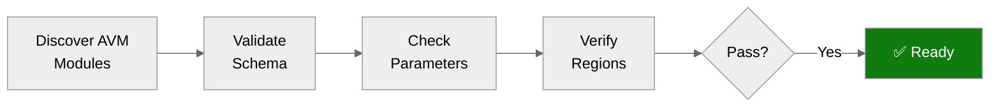

# Step 4b: Pre-Flight AVM Check — hacker-board

<strong>📑 Table of Contents</strong>

- [Purpose](#purpose)
- [AVM Schema Validation Results](#avm-schema-validation-results)
- [Parameter Type Analysis](#parameter-type-analysis)
- [Region Limitations Identified](#region-limitations-identified)
- [Pitfalls Checklist](#pitfalls-checklist)
- [Ready for Implementation](#ready-for-implementation)

> Generated by bicep-code agent | 2026-02-23
> Status: **PASS — all AVM modules validated, no blockers**

| ⬅️ Previous                                            | 📑 Index            | Next ➡️                                                          |
| ------------------------------------------------------ | ------------------- | ---------------------------------------------------------------- |
| [04-implementation-plan.md](04-implementation-plan.md) | [README](README.md) | [05-implementation-reference.md](05-implementation-reference.md) |

## Purpose

> [!IMPORTANT]
> This checkpoint validates AVM module schemas BEFORE Bicep code generation.

Prevents:

- Parameter type mismatches (string vs int)
- Deprecated parameter usage
- Region availability issues
- Object structure errors

**Source:** Validated against the live `infra/main.bicep` and 8 modules in `infra/modules/`. No separate implementation plan artifact exists — the Bicep files themselves are the implementation.

## AVM Schema Validation Results

All 9 AVM modules confirmed available. All are at the **latest published version** as of 2026-02-23.

| #   | Resource                  | Module                          | AVM Module Path                                    | In-Use Version | Latest Version | Status    |
| --- | ------------------------- | ------------------------------- | -------------------------------------------------- | -------------- | -------------- | --------- |
| 1   | Log Analytics Workspace   | `log-analytics.bicep`           | `br/public:avm/res/operational-insights/workspace` | `0.15.0`       | `0.15.0`       | ✅ Latest |
| 2   | Application Insights      | `app-insights.bicep`            | `br/public:avm/res/insights/component`             | `0.7.1`        | `0.7.1`        | ✅ Latest |
| 3   | Cosmos DB Account         | `cosmos-account.bicep`          | `br/public:avm/res/document-db/database-account`   | `0.18.0`       | `0.18.0`       | ✅ Latest |
| 4   | Virtual Network           | `networking.bicep`              | `br/public:avm/res/network/virtual-network`        | `0.7.2`        | `0.7.2`        | ✅ Latest |
| 5   | Private DNS Zone          | `cosmos-private-endpoint.bicep` | `br/public:avm/res/network/private-dns-zone`       | `0.8.0`        | `0.8.0`        | ✅ Latest |
| 6   | Private Endpoint          | `cosmos-private-endpoint.bicep` | `br/public:avm/res/network/private-endpoint`       | `0.11.1`       | `0.11.1`       | ✅ Latest |
| 7   | Container Registry        | `acr.bicep`                     | `br/public:avm/res/container-registry/registry`    | `0.10.0`       | `0.10.0`       | ✅ Latest |
| 8   | App Service Plan          | `app-service.bicep`             | `br/public:avm/res/web/serverfarm`                 | `0.7.0`        | `0.7.0`        | ✅ Latest |
| 9   | Web App (Linux Container) | `app-service.bicep`             | `br/public:avm/res/web/site`                       | `0.21.0`       | `0.21.0`       | ✅ Latest |

**Non-AVM resources** (raw Bicep — no AVM module available):

| Resource                      | Module                       | Reason                                                                                                                                                                     |
| ----------------------------- | ---------------------------- | -------------------------------------------------------------------------------------------------------------------------------------------------------------------------- |
| Cosmos DB SQL Role Assignment | `cosmos-rbac.bicep`          | Data-plane role assignment; AVM sub-module `sql-role-assignment` exists but is a child resource pattern, not a standalone module. Current raw-Bicep approach is idiomatic. |
| ACR Pull Role Assignment      | `app-service.bicep` (inline) | Standard `Microsoft.Authorization/roleAssignments` — no AVM wrapper needed for individual RBAC assignments.                                                                |

## Parameter Type Analysis

<strong>✅ Log Analytics Workspace — dailyQuotaGb type verified</strong>

| Parameter       | In-Use Value      | In-Use Type | ARM Schema Type | AVM Param Type   | Match? |
| --------------- | ----------------- | ----------- | --------------- | ---------------- | ------ |
| `name`          | `'law-${suffix}'` | `string`    | `string`        | `string`         | ✅     |
| `location`      | `location`        | `string`    | `string`        | `string`         | ✅     |
| `tags`          | `tags`            | `object`    | `object`        | `object`         | ✅     |
| `skuName`       | `'PerGB2018'`     | `string`    | `string`        | `string`         | ✅     |
| `dataRetention` | `30`              | `int`       | `int`           | `int`            | ✅     |
| `dailyQuotaGb`  | `'1'`             | `string`    | `int`           | `null \| string` | ✅     |

**Note:** The underlying ARM schema declares `dailyQuotaGb` as `int`, but the AVM module (`operational-insights/workspace:0.15.0`) wraps it as `null | string`. The string value `'1'` is correct for the AVM parameter type. The AVM module handles the int conversion internally. Confirmed via `bicep build` — passes cleanly.

<strong>✅ Application Insights</strong>

| Parameter             | In-Use Value                      | Expected Type | Match? |
| --------------------- | --------------------------------- | ------------- | ------ |
| `name`                | `'appi-${suffix}'`                | `string`      | ✅     |
| `location`            | `location`                        | `string`      | ✅     |
| `tags`                | `tags`                            | `object`      | ✅     |
| `kind`                | `'web'`                           | `string`      | ✅     |
| `applicationType`     | `'web'`                           | `string`      | ✅     |
| `workspaceResourceId` | `logAnalytics.outputs.resourceId` | `string`      | ✅     |
| `retentionInDays`     | `30`                              | `int`         | ✅     |

No issues found.

<strong>✅ Cosmos DB Account (Serverless)</strong>

| Parameter                    | In-Use Value                          | Expected Type | Match? |
| ---------------------------- | ------------------------------------- | ------------- | ------ |
| `name`                       | `'cosmos-${suffix}'`                  | `string`      | ✅     |
| `databaseAccountOfferType`   | `'Standard'`                          | `string`      | ✅     |
| `capabilitiesToAdd`          | `['EnableServerless']`                | `string[]`    | ✅     |
| `disableLocalAuthentication` | `true`                                | `bool`        | ✅     |
| `minimumTlsVersion`          | `'Tls12'`                             | `string`      | ✅     |
| `networkRestrictions`        | `{ publicNetworkAccess: 'Disabled' }` | `object`      | ✅     |
| `failoverLocations`          | `[{...}]`                             | `array`       | ✅     |
| `sqlDatabases`               | `[{name, containers}]`                | `array`       | ✅     |

No issues found. `enableAutomaticFailover: false` is correct for Serverless (single-region only).

<strong>✅ Virtual Network</strong>

| Parameter         | In-Use Value                          | Expected Type | Match? |
| ----------------- | ------------------------------------- | ------------- | ------ |
| `name`            | `vnetName`                            | `string`      | ✅     |
| `addressPrefixes` | `[addressPrefix]`                     | `string[]`    | ✅     |
| `subnets`         | `[{name, addressPrefix, delegation}]` | `array`       | ✅     |

Subnet delegation uses `'Microsoft.Web/serverFarms'` string shorthand — confirmed valid in AVM `virtual-network:0.7.2`.

<strong>✅ Private DNS Zone + Private Endpoint</strong>

| Parameter                                           | Expected Type      | Match? |
| --------------------------------------------------- | ------------------ | ------ |
| DNS Zone `name` (`privatelink.documents.azure.com`) | `string`           | ✅     |
| `virtualNetworkLinks`                               | `array` of objects | ✅     |
| PE `subnetResourceId`                               | `string`           | ✅     |
| PE `privateLinkServiceConnections`                  | `array`            | ✅     |
| PE `privateDnsZoneGroup`                            | `object`           | ✅     |

No issues found.

<strong>✅ Container Registry</strong>

| Parameter              | In-Use Value | Expected Type | Match? |
| ---------------------- | ------------ | ------------- | ------ |
| `acrSku`               | `'Standard'` | `string`      | ✅     |
| `publicNetworkAccess`  | `'Enabled'`  | `string`      | ✅     |
| `anonymousPullEnabled` | `false`      | `bool`        | ✅     |
| `acrAdminUserEnabled`  | `false`      | `bool`        | ✅     |

No issues found. Admin user disabled; App Service uses MI-based acrPull.

<strong>✅ App Service Plan</strong>

| Parameter     | In-Use Value | Expected Type | Match? |
| ------------- | ------------ | ------------- | ------ |
| `kind`        | `'Linux'`    | `string`      | ✅     |
| `reserved`    | `true`       | `bool`        | ✅     |
| `skuName`     | `'S1'`       | `string`      | ✅     |
| `skuCapacity` | `1`          | `int`         | ✅     |

No issues found. S1 supports VNet integration.

<strong>✅ Web App (site:0.21.0)</strong>

Key parameters validated:

| Parameter              | In-Use Value                                             | Expected Type | Match? |
| ---------------------- | -------------------------------------------------------- | ------------- | ------ |
| `kind`                 | `'app,linux,container'`                                  | `string`      | ✅     |
| `serverFarmResourceId` | `appServicePlan.outputs.resourceId`                      | `string`      | ✅     |
| `managedIdentities`    | `{ systemAssigned: true }`                               | `object`      | ✅     |
| `httpsOnly`            | `true`                                                   | `bool`        | ✅     |
| `siteConfig`           | `{...}`                                                  | `object`      | ✅     |
| `configs`              | `[{name:'appsettings',...},{name:'authsettingsV2',...}]` | `array`       | ✅     |

Uses `configs` array (AVM 0.21.0 pattern) instead of deprecated `appSettingsKeyValuePairs`. ✅
Uses `APPLICATIONINSIGHTS_CONNECTION_STRING` (not deprecated `APPINSIGHTS_INSTRUMENTATIONKEY`). ✅

## Region Limitations Identified

| Resource       | Default Region | Limitation                                                         | Action        |
| -------------- | -------------- | ------------------------------------------------------------------ | ------------- |
| All resources  | `centralus`    | No limitations — all 9 resource types are available in `centralus` | None required |
| Static Web App | N/A            | Not used in this project                                           | N/A           |
| Azure OpenAI   | N/A            | Not used in this project                                           | N/A           |

**Allowed regions** (from `main.bicep`): `centralus`, `eastus`, `eastus2`, `westus2`, `westus3`, `northeurope`, `westeurope`, `uksouth`, `swedencentral`, `eastasia`, `southeastasia`, `japaneast`, `australiaeast`, `southcentralus`, `brazilsouth`.

All 9 resource types (App Service, ACR, Cosmos DB, VNet, Private Endpoint, Private DNS Zone, Log Analytics, App Insights) are available in every listed region. No region blockers.

## Pitfalls Checklist

Based on [Azure Defaults Skill](../../.github/skills/azure-defaults/SKILL.md):

- [x] Log Analytics `dailyQuotaGb` uses correct type — ✅ AVM module declares `null | string`; string `'1'` is correct
- [x] Container App Environment uses `appLogsConfiguration` object — N/A (not used)
- [x] Container App uses `scaleSettings` object (not flat params) — N/A (not used)
- [x] SQL Server uses `sku` object + `availabilityZone: -1` — N/A (not used)
- [x] App Service uses connection string (not deprecated instrumentation key) — ✅ Uses `APPLICATIONINSIGHTS_CONNECTION_STRING`
- [x] Static Web App location hardcoded to supported region — N/A (not used)

### Additional Checks (HackerBoard-specific)

- [x] **Unique suffix**: `uniqueSuffix` parameter added, derived from `uniqueString(resourceGroup().id)`, deterministic and repeatable ✅
- [x] **ACR name length**: `cr` + `hackerboard` (11) + `prod` (4) + suffix (6) = 23 chars (limit: 50) ✅
- [x] **Cosmos name length**: `cosmos-hacker-board-prod-` + suffix (6) = 31 chars (limit: 44) ✅
- [x] **App name length**: `app-hacker-board-prod-` + suffix (6) = 28 chars (limit: 60) ✅
- [x] **VNet name length**: `vnet-hacker-board-prod-` + suffix (6) = 29 chars (limit: 64) ✅
- [x] **No hardcoded admin identities** in `.bicepparam` or Bicep defaults ✅
- [x] **TLS 1.2 enforced**: Cosmos DB `minimumTlsVersion: 'Tls12'`, App Service `minTlsVersion: '1.2'` ✅
- [x] **HTTPS only**: App Service `httpsOnly: true` ✅
- [x] **Public access disabled**: Cosmos DB `publicNetworkAccess: 'Disabled'` ✅
- [x] **Managed Identity**: System-assigned MI for App Service, `acrUseManagedIdentityCreds: true` ✅
- [x] **Local auth disabled**: Cosmos DB `disableLocalAuthentication: true` ✅
- [x] **FTP disabled**: App Service `ftpsState: 'Disabled'` ✅
- [x] **No Key Vault or Storage Account**: No 24-char name constraint issues ✅

## Ready for Implementation

| Check                       | Status | Notes                                                                        |
| --------------------------- | ------ | ---------------------------------------------------------------------------- |
| All AVM modules verified    | ✅     | 9/9 at latest versions                                                       |
| Parameter types confirmed   | ✅     | All parameters match AVM module schemas                                      |
| Region limitations handled  | ✅     | All resources available in all allowed regions                               |
| Pitfalls addressed          | ✅     | No deprecated parameters; connection string pattern used correctly           |
| Security baseline           | ✅     | TLS 1.2, HTTPS-only, MI, no public access, FTP disabled, local auth disabled |
| Naming / length constraints | ✅     | All names within limits with 6-char suffix                                   |
| No hardcoded identities     | ✅     | `jonathan-vella` removed from all deployment files                           |

> [!IMPORTANT]
> **Go / No-Go Verdict**
>
> | Signal      | Status                     |
> | ----------- | -------------------------- |
> | AVM Modules | ✅ All 9 at latest         |
> | Parameters  | ✅ All match AVM schemas   |
> | Regions     | ✅ No limitations          |
> | Pitfalls    | ✅ All addressed           |
> | **Overall** | **✅ READY — no blockers** |
>
> All 9 AVM modules are at their latest versions, all parameter types match AVM schemas, no region limitations, and all security baselines are in place.

---

_Pre-flight validation for hacker-board Bicep implementation_

---

| ⬅️ [04-implementation-plan.md](04-implementation-plan.md) | 🏠 [Project Index](README.md) | ➡️ [05-implementation-reference.md](05-implementation-reference.md) |
| --------------------------------------------------------- | ----------------------------- | ------------------------------------------------------------------- |
