# Step 5: Implementation Reference — HackerBoard


-yellow>)

<details>
<summary><strong>📑 Table of Contents</strong></summary>

- [Bicep Templates Location](#bicep-templates-location)
- [File Structure](#file-structure)
- [Validation Status](#validation-status)
- [Resources Created](#resources-created)
- [Deployment Instructions](#deployment-instructions)
- [Key Implementation Notes](#key-implementation-notes)

</details>

> Generated by bicep-code agent | 2025-07-15 · Updated 2026-02-20 (Phase 18: App Service + ACR Migration)

| ⬅️ Previous                                    | 📑 Index            | Next ➡️                                              |
| ---------------------------------------------- | ------------------- | ---------------------------------------------------- |
| [04-preflight-check.md](04-preflight-check.md) | [README](README.md) | [06-deployment-summary.md](06-deployment-summary.md) |

## Bicep Templates Location

📁 **Code Location**: [`infra/`](../../infra/)

## File Structure

```text
infra/
├── main.bicep              # Main orchestration template (17 params, 6 modules, 6 outputs)
├── main.bicepparam         # Parameter file for prod environment
├── deploy.ps1              # PowerShell deployment script with post-deploy Entra registration
├── azuredeploy.json        # Compiled ARM template (Portal "Deploy to Azure" button)
└── modules/
    ├── log-analytics.bicep     # AVM: operational-insights/workspace:0.15.0
    ├── app-insights.bicep      # AVM: insights/component:0.7.1
    ├── cosmos-account.bicep    # AVM: document-db/database-account:0.18.0 + 6 containers
    ├── acr.bicep               # AVM: container-registry/registry:0.10.0
    ├── app-service.bicep       # AVM: web/serverfarm:0.7.0 + web/site:0.21.0 + Easy Auth + acrPull
    └── cosmos-rbac.bicep       # Native Bicep: SQL role assignment (Data Contributor → App Service MI)
```

## Validation Status

| Check         | Result | Details                                            |
| ------------- | ------ | -------------------------------------------------- |
| `bicep build` | ✅     | Zero errors — compiled to azuredeploy.json         |
| `bicep lint`  | ✅     | Zero warnings                                      |
| IDE errors    | ✅     | Zero diagnostics in main.bicep and main.bicepparam |
| All tests     | ✅     | 137 tests pass (76 API + 61 UI)                    |

## Resources Created

| Resource                          | Bicep Type / AVM Module                                               | Module File          |
| --------------------------------- | --------------------------------------------------------------------- | -------------------- |
| Log Analytics Workspace           | `br/public:avm/res/operational-insights/workspace:0.15.0`             | log-analytics.bicep  |
| Application Insights              | `br/public:avm/res/insights/component:0.7.1`                          | app-insights.bicep   |
| Cosmos DB Account (Serverless)    | `br/public:avm/res/document-db/database-account:0.18.0`               | cosmos-account.bicep |
| Cosmos DB Database + 6 Containers | (nested in AVM module)                                                | cosmos-account.bicep |
| Container Registry (Basic)        | `br/public:avm/res/container-registry/registry:0.10.0`                | acr.bicep            |
| App Service Plan (B1 Linux)       | `br/public:avm/res/web/serverfarm:0.7.0`                              | app-service.bicep    |
| Web App for Containers            | `br/public:avm/res/web/site:0.21.0`                                   | app-service.bicep    |
| Easy Auth (authsettingsV2)        | `configs` array in AVM site module                                    | app-service.bicep    |
| ACR Pull Role Assignment          | `Microsoft.Authorization/roleAssignments`                             | app-service.bicep    |
| Cosmos DB SQL Role Assignment     | `Microsoft.DocumentDB/databaseAccounts/sqlRoleAssignments@2024-05-15` | cosmos-rbac.bicep    |
| Entra ID App Registration         | deploy.ps1 post-deployment step (D27)                                 | deploy.ps1           |

```mermaid
%%{init: {'theme':'neutral'}}%%
graph TD
    MAIN["main.bicep"] --> LA["log-analytics.bicep"]
    MAIN --> AI["app-insights.bicep"]
    MAIN --> COSMOS["cosmos-account.bicep"]
    MAIN --> ACR["acr.bicep"]
    MAIN --> APP["app-service.bicep"]
    MAIN --> RBAC["cosmos-rbac.bicep"]
    LA --> R1["📊 law-hacker-board-prod"]
    AI --> R2["📈 appi-hacker-board-prod"]
    COSMOS --> R3["💾 cosmos-hacker-board-prod"]
    ACR --> R4["📦 crhackerboardprod"]
    APP --> R5["🌐 app-hacker-board-prod"]
    APP --> R5b["⚙️ asp-hacker-board-prod"]
    RBAC --> R6["🔑 Cosmos SQL Role Assignment"]
    AI -.->|workspaceResourceId| LA
    APP -.->|cosmosEndpoint| COSMOS
    APP -.->|appInsightsConnectionString| AI
    APP -.->|acrLoginServer| ACR
    RBAC -.->|principalId| APP
    RBAC -.->|cosmosAccountName| COSMOS
```



## Deployment Instructions

<details>
<summary><strong>🟢 Quick Deploy (PowerShell)</strong></summary>

```powershell
cd infra
./deploy.ps1 `
    -CostCenter "microhack" `
    -TechnicalContact "team@contoso.com" `
    -AdminEmail "admin@contoso.com" `
    -GitHubOAuthClientId "<your-github-oauth-client-id>" `
    -GitHubOAuthClientSecret "<your-github-oauth-client-secret>"
```

</details>

<details>
<summary><strong>🔍 Preview Changes (What-If)</strong></summary>

```powershell
./deploy.ps1 -WhatIf `
    -CostCenter "microhack" `
    -TechnicalContact "team@contoso.com" `
    -GitHubOAuthClientId "<client-id>" `
    -GitHubOAuthClientSecret "<client-secret>"
```

</details>

<details>
<summary><strong>⚙️ Custom Parameters</strong></summary>

```powershell
./deploy.ps1 `
    -ResourceGroupName "rg-hacker-board-dev" `
    -Location "centralus" `
    -Environment "dev" `
    -CostCenter "microhack" `
    -TechnicalContact "team@contoso.com" `
    -AdminEmail "admin@contoso.com" `
    -GitHubOAuthClientId "<client-id>" `
    -GitHubOAuthClientSecret "<client-secret>" `
    -ContainerImage "hacker-board:v1.0.0"
```

</details>

<details>
<summary><strong>🚀 Azure CLI (Direct)</strong></summary>

```bash
az deployment group create \
  --resource-group "rg-hacker-board-prod" \
  --template-file main.bicep \
  --parameters main.bicepparam \
  --parameters gitHubOAuthClientId="<client-id>" \
  --parameters gitHubOAuthClientSecret="<client-secret>"
```

</details>

## Key Implementation Notes

| Note                                            | Impact                                              | Reference                                 |
| ----------------------------------------------- | --------------------------------------------------- | ----------------------------------------- |
| D27: Entra app registration moved to deploy.ps1 | B6 policy blocks ARM deployment scripts             | deploy.ps1 post-deploy step               |
| D28: SWA → App Service + ACR                    | SWA MI sidecar `expires_on` bug                     | acr.bicep, app-service.bicep              |
| D29: Express adapter wraps Functions handlers   | No business logic changes                           | api/server.js, api/shared/adapter.js      |
| D30: Easy Auth replaces SWA built-in auth       | Same `/.auth/*` contract                            | app-service.bicep `authsettingsV2` config |
| Cosmos `disableLocalAuth: true`                 | Enforced by ModifyCosmosDBLocalAuth policy          | cosmos-account.bicep                      |
| System MI on App Service → Cosmos RBAC          | Data Contributor role via deterministic GUID        | cosmos-rbac.bicep                         |
| System MI on App Service → ACR Pull             | `acrPull` built-in role                             | app-service.bicep                         |
| 9 governance tags on RG                         | Required by B3 tag policy; deploy.ps1 creates RG    | deploy.ps1                                |
| Naming: `{type}-hacker-board-{env}`             | CAF conventions                                     | main.bicep                                |
| AVM modules for all primary resources           | 6 of 8 resources use AVM; 2 native role assignments | modules/                                  |
| Non-root Docker container                       | Security: `appuser`/`appgroup` in Dockerfile        | Dockerfile                                |
| Trivy CVE scanning in CI/CD                     | CRITICAL/HIGH gate                                  | .github/workflows/deploy-app.yml          |
| `/api/health` excluded from Easy Auth           | Enables unauthenticated health checks               | app-service.bicep `excludedPaths`         |

### Governance Compliance

| Policy                       | Status                      | Implementation            |
| ---------------------------- | --------------------------- | ------------------------- |
| B1: MFA on write operations  | ✅ Deployer responsibility  | N/A (Azure AD enforced)   |
| B3: 9 RG tags required       | ✅ deploy.ps1 sets all 9    | deploy.ps1                |
| B5: MCAPSGov deny on classic | ✅ No classic resources     | All resources use ARM/AVM |
| B6: Storage key auth deny    | ✅ No deployment scripts    | D27: Entra via deploy.ps1 |
| ModifyCosmosDBLocalAuth      | ✅ `disableLocalAuth: true` | cosmos-account.bicep      |

### Security Hardening (Phase 18 Security Review)

| Finding                                        | Fix                                                      |
| ---------------------------------------------- | -------------------------------------------------------- |
| Docker container ran as root                   | Non-root user `appuser`/`appgroup` added                 |
| No `trust proxy` in Express                    | `app.set("trust proxy", 1)` for correct HTTPS detection  |
| `appInsightsConnectionString` in Bicep outputs | Removed — instrumentation key exposure risk              |
| No container image scanning                    | Trivy CRITICAL/HIGH CVE gate in CI/CD                    |
| Health endpoint required auth                  | `/api/health` excluded from Easy Auth `globalValidation` |

### D27 Decision: Deployment Scripts → deploy.ps1

Governance policy B6 blocks key-based authentication on all storage accounts in this
subscription. ARM deployment scripts (`Microsoft.Resources/deploymentScripts`) require
a backing storage account with key auth, making them completely unusable.

**Resolution**: The Entra ID app registration now runs as a post-deployment step in
`deploy.ps1` using the deployer's own Microsoft Graph token. This eliminates the UAMI
resource entirely.

---

_Implementation reference generated from Bicep templates. Updated for Phase 18 (App Service + ACR Migration)._

---

| ⬅️ [04-preflight-check.md](04-preflight-check.md) | 🏠 [Project Index](README.md) | ➡️ [06-deployment-summary.md](06-deployment-summary.md) |
| ------------------------------------------------- | ----------------------------- | ------------------------------------------------------- |
