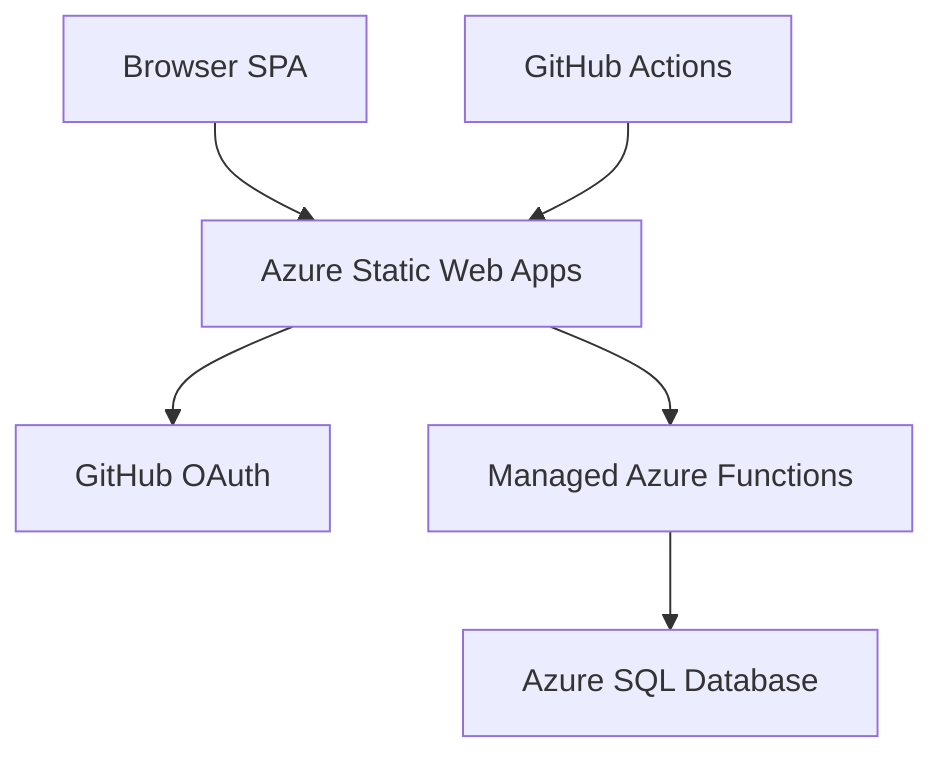

# HackerBoard Documentation


> Live, interactive hackathon scoring dashboard — Azure Static Web Apps + managed Functions + Azure SQL Database.

## Quick Links

| Area | Link                                          | Description                                                |
| ---- | --------------------------------------------- | ---------------------------------------------------------- |
| 📋   | [Product Requirements](app-prd.md)            | Features F1 through F11, user stories, acceptance criteria |
| 🔌   | [API Specification](api-spec.md)              | All 16 endpoint contracts                                  |
| 📘   | [OpenAPI / Swagger](swagger-ui.html)          | Interactive API explorer ([YAML](openapi.yaml))            |
| 🎨   | [App Design](app-design.md)                   | UI/UX, component model, responsive strategy                |
| 🚀   | [Deployment Guide](deployment-guide.md)       | End-to-end deploy: infra → CI/CD → roles → smoke test      |
| 🏗️   | [Scaffold Guide](app-scaffold.md)             | Folder structure, dependencies, helpers                    |
| ✅   | [Handoff Checklist](app-handoff-checklist.md) | Pre-deploy verification steps                              |
| 📊   | [Backlog](backlog.md)                         | Execution plan, task tracking, decision log                |
| 👤   | [Admin Procedures](admin-procedures.md)       | Role invitations, data management                          |
| 🤖   | [Agents & Skills](agents-and-skills.md)       | AI agent inventory, orchestration workflow, prompt guide   |
| 🧪   | [E2E Validation](e2e-validation.md)           | Deployment validation test protocol                        |
| 📜   | [Session History](session-history.md)         | Archived Copilot session handoff notes                     |

## Architecture Overview



## Feature Inventory

| Feature                            | Status       | Primary Components                                                      |
| ---------------------------------- | ------------ | ----------------------------------------------------------------------- |
| F1 — Team score submission form    | ✅ Delivered | `src/components/ScoreSubmission.js`, `api/src/functions/upload.js`      |
| F2 — Live leaderboard              | ✅ Delivered | `src/components/Leaderboard.js`, `api/src/functions/scores.js`          |
| F3 — Grading display               | ✅ Delivered | `src/components/Leaderboard.js`, `api/src/functions/scores.js`          |
| F4 — Award categories              | ✅ Delivered | `src/components/Awards.js`, `api/src/functions/awards.js`               |
| F5 — Authentication (GitHub OAuth) | ✅ Delivered | `staticwebapp.config.json`, `api/shared/auth.js`                        |
| F6 — JSON score upload             | ✅ Delivered | `src/components/ScoreSubmission.js`, `api/src/functions/upload.js`      |
| F7 — Attendee registration         | ✅ Delivered | `src/components/Registration.js`, `api/src/functions/attendees.js`      |
| F8 — Team roster management        | ✅ Delivered | `src/components/TeamRoster.js`, `api/src/functions/teams.js`            |
| F9 — Self-service join             | ✅ Delivered | `src/components/Registration.js`, `api/src/functions/attendees.js`      |
| F10 — Team assignment              | ✅ Delivered | `src/components/TeamAssignment.js`, `api/src/functions/teams-assign.js` |
| F11 — Rubric import + grading      | ✅ Delivered | `src/components/RubricManager.js`, `api/src/functions/rubrics.js`       |

## Tech Stack

| Layer    | Technology                      |
| -------- | ------------------------------- |
| Frontend | Vanilla JS SPA (ES2022+)        |
| API      | Azure Functions v4, Node.js 20+ |
| Storage  | Azure SQL Database (Basic DTU)  |
| Auth     | SWA built-in GitHub OAuth       |
| IaC      | Bicep (Azure Verified Modules)  |
| CI/CD    | GitHub Actions                  |
| Testing  | Vitest + happy-dom              |

## Project Structure

```text
hacker-board/
├── api/                  # Azure Functions API and shared helpers
├── docs/                 # Product, API, design, and operations docs
├── infra/                # Bicep infrastructure definitions
├── scripts/              # Utility scripts (seed data, cleanup)
├── src/                  # SPA application code (components/services/styles)
└── templates/            # Scoring and rubric templates
```

## Getting Help

- Open a bug report or feature request in [GitHub Issues][issues]
- Ask architectural or usage questions in [GitHub Discussions][discussions]

[issues]: https://github.com/jonathan-vella/hacker-board/issues
[discussions]: https://github.com/jonathan-vella/hacker-board/discussions

---

[← Back to Repository](../README.md)
