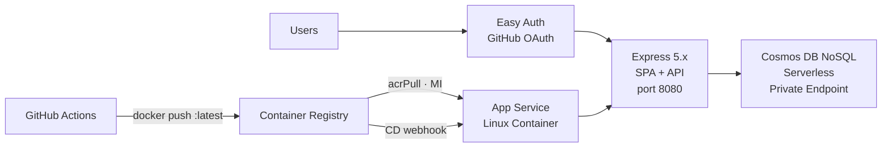

# HackerBoard Documentation

> Live, interactive hackathon scoring dashboard — App Service for Linux Containers + ACR + Express + Cosmos DB NoSQL Serverless.

## Documentation Index

| Doc                                   | Description                                                                                  |
| ------------------------------------- | -------------------------------------------------------------------------------------------- |
| [Requirements](requirements.md)       | What HackerBoard does, who uses it, all 11 features, NFRs, and infrastructure requirements   |
| [Architecture](architecture.md)       | Diagrams, resource table, networking, security model, CI/CD flow, and cost estimate          |
| [Functionality](functionality.md)     | Feature walkthroughs for event admins — rubric setup, score submission, review queue, awards |
| [Deployment Guide](deployment.md)     | End-to-end: GitHub OAuth → `deploy.ps1` → container push → CI/CD activation → smoke test     |
| [Troubleshooting](troubleshooting.md) | Common issues with deployment, auth, application errors, and CI/CD                           |
| [FAQ](faq.md)                         | Answers to common questions about cost, operations, admin management, and the app            |
| [API Specification](api-spec.md)      | All 16 endpoint contracts with request/response schemas                                      |
| [OpenAPI / Swagger](swagger-ui.html)  | Interactive API explorer ([YAML source](openapi.yaml))                                       |
| [Project Summary](project-summary.md) | Architecture decisions, governance constraints, WAF assessment, deployment history           |
| [Backlog](backlog.md)                 | Execution plan, task tracking, decision log                                                  |

## Architecture Snapshot

## Feature Status

All 11 features delivered:

| #   | Feature                       | Role   |
| --- | ----------------------------- | ------ |
| F1  | Team Score Submission Form    | Member |
| F2  | Live Leaderboard              | All    |
| F3  | Grading Display               | All    |
| F4  | Award Categories              | Admin  |
| F5  | GitHub OAuth Authentication   | All    |
| F6  | JSON Score Upload             | Member |
| F7  | Attendee Registration         | All    |
| F8  | Admin Validation & Override   | Admin  |
| F9  | Attendee Bulk Entry           | Admin  |
| F10 | Random Team Assignment        | Admin  |
| F11 | Configurable Rubric Templates | Admin  |

## Getting Help

- Open a bug report or feature request in [GitHub Issues][issues]
- Ask architectural or usage questions in [GitHub Discussions][discussions]

[issues]: https://github.com/jonathan-vella/hacker-board/issues
[discussions]: https://github.com/jonathan-vella/hacker-board/discussions

---

[← Back to Repository](../README.md)
