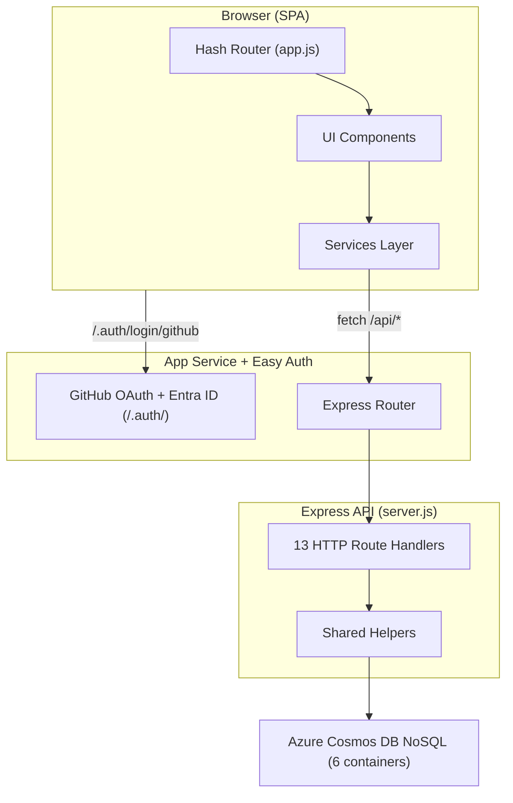
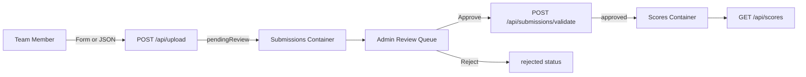

# App Design — HackerBoard

> Purpose: Define the UI and interaction design for the HackerBoard app implementation.
> Scope: App UX and frontend architecture only; infrastructure design is out of scope.

## Quick Links

| Area | Link                                    | Description                                  |
| ---- | --------------------------------------- | -------------------------------------------- |
| 🔌   | [API Specification](api-spec.md)        | Endpoint contracts and payloads              |
| 📋   | [Product Requirements](app-prd.md)      | Feature requirements and acceptance criteria |
| 🚀   | [Deployment Guide](deployment-guide.md) | End-to-end deployment instructions           |

## Problem, Users, Value

| Item        | Summary                                                                                                                                                 |
| ----------- | ------------------------------------------------------------------------------------------------------------------------------------------------------- |
| **Problem** | Manual JSON prep and script-based scoring create slower leaderboard updates and more operational friction during live sessions.                         |
| **Users**   | **Team members** submit scores for their own team. **Admins** review submissions, approve or reject them, and apply manual score overrides when needed. |
| **Value**   | The UX prioritizes fast submission, clear review state, and role-safe controls so scoring remains auditable and easier to run during the event.         |

---

## Application Architecture

## Design Goals

- Match the leaderboard visual hierarchy shown in the reference screenshot.
- Preserve PRD functional scope (F1–F11).
- Keep UI implementation responsive, accessible, and API-driven.
- Support admin and member experiences without duplicated screens.

## Experience Principles

- Prioritize live ranking clarity over decorative visuals.
- Keep score-entry workflows fast for facilitators during live sessions.
- Keep member views lightweight and easy to scan from mobile devices.
- Use consistent spacing, typography, and status treatments across cards and tables.

## Screen Structure

### Dashboard (Primary Screen)

- Top navigation: search, All / By Category / By Challenge tabs, notification area, theme toggle, user menu.
- Champions spotlight: top 3 ranked teams with prominent score badges and key stats.
- Highlights row: compact metric cards (activity, streak, rank movement indicators).
- Leaderboard body: sortable and expandable ranking table with team-level detail drilldown.

### Team Member Workflows

- Score submission panel for category and criterion scoring with validation.
- JSON upload panel for own-team import with schema validation and preview.
- Submission status panel showing pending/approved/rejected state.

### Admin Workflows

- Submission review queue with approve/reject actions.
- Manual score override panel.
- Awards panel for assigning category awards.
- Attendee bulk entry form (F9): multi-line or CSV paste for name import.
- Random team assignment panel (F10): team count input, shuffle preview,
  confirm/re-shuffle controls.

### Rubric Management Workflow (Admin)

- Rubric Management page (F11): list of uploaded rubrics with active indicator.
- Drag-and-drop upload zone for `rubric.md` files.
- Rubric preview panel showing parsed categories, criteria, point values,
  bonus items, and grading scale before activation.
- Activate/archive controls with confirmation dialog.
- Score entry form (F1) and leaderboard (F2) dynamically render based on
  the active rubric configuration.

### Shared Workflows

- Team score detail expansion in leaderboard.
- Attendee profile registration and update for authenticated users.
- Team Roster page (F10): card/table grid of all teams with assigned
  members; admin edit controls, member read-only with own-team highlight.

## Component Model

| Component           | File                   | Purpose                                                          |
| ------------------- | ---------------------- | ---------------------------------------------------------------- |
| `Navigation`        | `Navigation.js`        | Global controls, search, auth actions, and theme toggle          |
| `Leaderboard`       | `Leaderboard.js`       | Ranked team table with expansion and responsive fallback (F2/F3) |
| `ScoreSubmission`   | `ScoreSubmission.js`   | Member-only scoring editor with category subtotal checks (F1)    |
| `UploadScores`      | `UploadScores.js`      | Member-only structured JSON upload with validation (F6)          |
| `SubmissionStatus`  | `SubmissionStatus.js`  | Member view of latest submission state                           |
| `AdminReviewQueue`  | `AdminReviewQueue.js`  | Admin-only pending submission triage                             |
| `Awards`            | `Awards.js`            | Award display + admin assignment controls (F4)                   |
| `Registration`      | `Registration.js`      | Self-service attendee registration and editing (F7)              |
| `AttendeeBulkEntry` | `AttendeeBulkEntry.js` | Admin-only multi-line/CSV attendee import (F9)                   |
| `TeamAssignment`    | `TeamAssignment.js`    | Admin-only random assignment with preview (F10)                  |
| `TeamRoster`        | `TeamRoster.js`        | Team ↔ attendee display grid (F10)                               |
| `RubricManager`     | `RubricManager.js`     | Admin-only rubric list, upload, preview, activate/archive (F11)  |
| `FeatureFlags`      | `FeatureFlags.js`      | Admin-only feature flag toggles                                  |

> **Deferred components**: `ManualOverride` (admin score correction) is deferred to Phase 12.

## Responsive Strategy

- `xl`/`lg`: full table layout, 3-column champions, horizontal metric strip.
- `md`: champions use 2-column wrap, table remains scrollable.
- `sm`: champions and metrics stack vertically, leaderboard uses card-style fallback.
- Maintain touch target size for all interactive controls in mobile layouts.

## Theme Strategy

- Light mode default with neutral page background and white card surfaces.
- Dark mode with slate surfaces, lighter borders, reduced shadow depth.
- Toggle in navbar, persisted via localStorage.
- Ensure text, badges, and data states maintain WCAG 2.1 AA contrast.

## Accessibility Requirements

- Semantic landmarks (`header`, `main`, `section`, `table`, `form`) on all primary views.
- Keyboard access for tabs, row expansion, dialogs, and action buttons.
- Visible focus styles across both themes.
- ARIA labels for icon-only controls and descriptive alt text for avatars.

## Data Integration Expectations

- Leaderboard data sourced from `/api/scores` summary payload.
- Team metadata from `/api/teams`; awards from `/api/awards`.
- Attendee profile from `/api/attendees`; upload via `/api/upload`.
- Admin queue from `/api/submissions`; validation via `/api/submissions/validate`.
- Polling every 30 seconds for leaderboard freshness unless real-time transport is added.

### Scoring Workflow

## Animation Guidance

- Use subtle motion only: card hover elevation, light fade-in, smooth theme transition.
- Avoid heavy animation libraries and long-duration effects.

## Out of Scope

- Backend schema redesign or endpoint contract changes.
- New role definitions beyond `admin` and `member`.
- Visual rebranding outside this app and current workshop context.

## References

- [Product Requirements](app-prd.md)
- [API Specification](api-spec.md)
- [Deployment Guide](deployment-guide.md)
- [Repository README](../README.md)

---

[← Back to Documentation](README.md)
