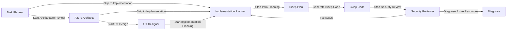
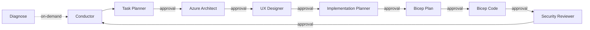

# Agents and Skills


> Reference guide for HackerBoard's AI agents, skills,
> orchestration workflow, handoff chains, and prompt examples.

HackerBoard uses 8 specialized AI agents, 1 Conductor
orchestrator, and 4 reusable skills to streamline development.
Each agent handles a specific workflow phase and can be used
standalone or as a subagent delegated by the Conductor.
Handoff buttons provide guided transitions between agents.

## Quick Links

| Area | Link                                                                                            | Description                             |
| ---- | ----------------------------------------------------------------------------------------------- | --------------------------------------- |
| 🏠   | [Documentation Hub](README.md)                                                                  | Main docs landing page                  |
| 📋   | [Execution Plan](backlog.md)                                                                    | Current phase status and tracked work   |
| 📜   | [Docs Standards](../.github/instructions/docs.instructions.md)                                  | Formatting and structure conventions    |
| 🤖   | [VS Code Custom Agents](https://code.visualstudio.com/docs/copilot/customization/custom-agents) | Official docs on custom agents          |
| 🔗   | [VS Code Subagents](https://code.visualstudio.com/docs/copilot/agents/subagents)                | Official docs on subagent orchestration |

---

## Agent Inventory

Agents are interactive AI assistants for specific workflow phases.
Invoke them with `@agent-name` in GitHub Copilot Chat, or let
the Conductor delegate to them as subagents.

| Agent                  | Conductor Step   | Tools                                      | Description                                    | Invocation                |
| ---------------------- | ---------------- | ------------------------------------------ | ---------------------------------------------- | ------------------------- |
| Task Planner           | 1 — Plan         | read, search, fetch, problems              | Research and plan tasks                        | `@task-planner`           |
| Azure Architect        | 2 — Architect    | read, search, fetch, problems              | WAF review and design                          | `@azure-architect`        |
| UX Designer            | 3 — Design       | read, search, fetch                        | User journeys, accessibility                   | `@ux-designer`            |
| Implementation Planner | 4 — Implement    | read, search, edit, fetch, problems        | Structured implementation plans                | `@implementation-planner` |
| Bicep Plan             | 5 — Infra Plan   | read, search, fetch, bicep, azure-mcp      | Machine-readable Bicep plans, AVM evaluation   | `@bicep-plan`             |
| Bicep Code             | 6 — Infra Code   | read, search, edit, bicep, azure-mcp       | Near-production-ready Bicep templates          | `@bicep-code`             |
| Security Reviewer      | 7 — Review       | read, search, problems                     | OWASP Top 10, Zero Trust code review           | `@security-reviewer`      |
| Diagnose               | Supplementary    | read, search, azure-mcp, applens           | Azure resource health diagnostics              | `@diagnose`               |
| HackerBoard Conductor  | Orchestrator     | agent, read, search, edit, fetch, problems | Coordinates all agents                         | `@hackerboard-conductor`  |

---

## Handoff Chains

Each agent provides handoff buttons that appear after a response,
enabling guided transitions to the next workflow step. Users
select a handoff button to switch agents with a pre-filled prompt.



The Conductor offers all handoffs from a single entry point,
making it the recommended starting point for full workflows.

---

## Subagent Delegation

The Conductor uses the `agent` tool to run workers as subagents.
Each subagent runs in an isolated context window and returns
only a summary to the Conductor.

**Key properties:**

- Subagents are synchronous — the Conductor waits for results
- Multiple subagents can run in parallel for independent tasks
- Only the final summary enters the Conductor's context window
- Each subagent starts with a clean context (no history inheritance)

---

## Skill Inventory

Skills are reusable capabilities invokable by agents or directly
by users. They activate based on trigger phrases in the prompt.

| Skill             | Category      | Trigger Keywords                          | Description                                 |
| ----------------- | ------------- | ----------------------------------------- | ------------------------------------------- |
| azure-diagrams    | Architecture  | "draw diagram", "architecture diagram"    | Azure diagrams via Python diagrams+Graphviz |
| docs-writer       | Documentation | "update docs", "check staleness"          | Documentation maintenance                   |
| git-commit        | Workflow      | "commit", "/commit"                       | Conventional commit generation              |
| github-operations | Workflow      | "create issue", "create PR"               | GitHub operations via MCP/CLI               |

---

## Orchestration Workflow

The Conductor orchestrates agents as subagents in a linear
pipeline with mandatory approval gates between each step.
Agents can also be used standalone with handoff buttons
for guided transitions.



**Two usage modes:**

| Mode          | How                                                                          | Best For                            |
| ------------- | ---------------------------------------------------------------------------- | ----------------------------------- |
| Conductor-led | Start with `@hackerboard-conductor` — full orchestration with approval gates | Complete features, multi-step tasks |
| Agent-direct  | Start with any `@agent` — use handoff buttons to transition                  | Targeted work on a single phase     |

---

## Prompt Guide

### Task Planner

The Task Planner researches the codebase and creates phased,
dependency-ordered task plans.

**Example 1 — Plan a new feature:**

```text
@task-planner Plan the implementation of real-time leaderboard
updates using Server-Sent Events. Check the current API and
frontend architecture first.
```

**Example 2 — Break down a backlog item:**

```text
@task-planner Break down Phase 12.1 (Agent Orchestration) into
individual tasks with dependencies and acceptance criteria.
```

**Example 3 — Analyze dependencies:**

```text
@task-planner What are the dependencies for adding multi-language
support to HackerBoard? Check existing i18n patterns in the
codebase.
```

---

### Azure Architect

The Azure Architect evaluates decisions against the 5 WAF pillars
and recommends Azure services and configurations.

**Example 1 — Architecture review:**

```text
@azure-architect Review the current Azure Table Storage partition
strategy for the Scores table. Are there performance concerns
with the current partition key design?
```

**Example 2 — Cost optimization:**

```text
@azure-architect We're targeting less than $10/month. Evaluate
the current resource SKUs and suggest optimizations while
maintaining reliability.
```

**Example 3 — Security assessment:**

```text
@azure-architect Assess the SWA authentication configuration
in staticwebapp.config.json against WAF Security pillar
requirements.
```

---

### UX Designer

The UX Designer maps user journeys, defines Jobs-to-be-Done,
and ensures WCAG 2.2 Level AA accessibility.

**Example 1 — User journey mapping:**

```text
@ux-designer Map the complete user journey for a team member
submitting scores during a hackathon event. Include pain points
and opportunities.
```

**Example 2 — Accessibility review:**

```text
@ux-designer Review the score submission form in
src/components/ScoreForm.js for WCAG 2.2 Level AA compliance.
Check keyboard navigation, color contrast, and screen reader
support.
```

**Example 3 — Jobs-to-be-Done analysis:**

```text
@ux-designer Define the Jobs-to-be-Done for the admin dashboard.
What are admins trying to accomplish when reviewing and approving
score submissions?
```

---

### Bicep Plan

The Bicep Plan agent creates comprehensive, machine-readable
implementation plans for Azure infrastructure. It evaluates AVM
availability, documents resource dependencies, and produces a
structured plan for the Bicep Code agent.

**Example 1 — Plan a new resource:**

```text
@bicep-plan Plan adding Azure Key Vault to the HackerBoard
infrastructure. Evaluate AVM module availability, naming
conventions, and RBAC requirements.
```

**Example 2 — Evaluate AVM options:**

```text
@bicep-plan Evaluate AVM modules for Azure Service Bus.
Document parameters, outputs, and integration points with
the existing infra/main.bicep.
```

---

### Bicep Code

The Bicep Code agent generates near-production-ready Bicep
templates from a Bicep Plan output. It validates, lints, and
ensures all resources follow AVM, naming, and security defaults.

**Example 1 — Implement from a plan:**

```text
@bicep-code Implement the Key Vault module from the Bicep Plan
output. Use AVM, follow naming conventions, and rebuild
azuredeploy.json after.
```

**Example 2 — Review existing Bicep:**

```text
@bicep-code Review infra/main.bicep for AVM compliance, naming
conventions, and security defaults. Flag any hardcoded values.
```

---

### Diagnose

The Diagnose agent guides users through Azure resource health
assessment, identifies root causes, and proposes remediation
steps. It uses AppLens diagnostics and resource health APIs.

**Example 1 — Diagnose a failing resource:**

```text
@diagnose The Static Web App is returning 503 errors. Check
resource health and AppLens diagnostics for root cause.
```

**Example 2 — Performance investigation:**

```text
@diagnose Application Insights shows p95 latency spiking on
the /api/scores endpoint. Investigate and suggest remediation.
```

---

### Implementation Planner

The Implementation Planner generates structured, actionable plans
with file paths, function signatures, and validation criteria.

**Example 1 — Feature implementation plan:**

```text
@implementation-planner Create an implementation plan for the
CSV export feature for the leaderboard. Include file paths,
API changes, and test requirements.
```

**Example 2 — Refactoring plan:**

```text
@implementation-planner Plan a refactor of api/shared/tables.js
to support connection pooling and retry logic. Keep backward
compatibility.
```

---

### Bicep AVM Expert (removed)

> **Deprecated** — replaced by [Bicep Plan](#bicep-plan) and [Bicep Code](#bicep-code).

---

### Security Reviewer

The Security Reviewer checks code against OWASP Top 10 and
Zero Trust principles.

**Example 1 — API security review:**

```text
@security-reviewer Review the /api/scores endpoint for OWASP
Top 10 vulnerabilities. Check authentication, authorization,
and input validation.
```

**Example 2 — Frontend XSS review:**

```text
@security-reviewer Scan src/components/ for XSS vulnerabilities.
Check for any usage of innerHTML or unsanitized user input in
DOM operations.
```

**Example 3 — Configuration review:**

```text
@security-reviewer Review staticwebapp.config.json for security
misconfigurations. Check route guards, security headers, and
authentication settings.
```

---

### HackerBoard Conductor

The Conductor orchestrates all agents through the full workflow
with approval gates.

**Example 1 — Full feature workflow:**

```text
@hackerboard-conductor Orchestrate the implementation of CSV
leaderboard export. Start with planning, go through architecture
review, and end with security review.
```

**Example 2 — Infrastructure change:**

```text
@hackerboard-conductor Coordinate adding a custom domain with
SSL to the Azure Static Web App. Run through all relevant
agents.
```

---

### azure-diagrams Skill

The azure-diagrams skill generates high-quality Azure architecture
diagrams using Python's `diagrams` library and Graphviz. Produces
`.py` source files and `.png`/`.svg` outputs stored in
`agent-output/{project}/`.

**Requires**: `graphviz` (system), `pip install diagrams matplotlib pillow`

**Example 1 — Architecture diagram:**

```text
Draw an Azure architecture diagram for HackerBoard showing
the SWA, Functions, Storage, and App Insights resources
with traffic flows.
```

**Example 2 — As-built diagram:**

```text
Generate an as-built diagram from the current infra/main.bicep
showing deployed resources and their connections.
```

---

### docs-writer Skill

The docs-writer skill maintains documentation accuracy and
freshness.

**Example 1 — Update docs after code changes:**

```text
Update the API spec to reflect the new /api/rubrics/active
endpoint.
```

**Example 2 — Freshness audit:**

```text
Check docs for staleness. Verify agent and skill counts match
the filesystem and all links resolve.
```

**Example 3 — Explain the repo:**

```text
Explain how the SPA frontend communicates with the Azure
Functions API and how authentication flows work.
```

---

### git-commit Skill

The git-commit skill generates conventional commit messages
from the current diff.

**Example 1 — Standard commit:**

```text
/commit
```

**Example 2 — Commit with context:**

```text
Commit these changes. The feature adds CSV export to the
leaderboard component.
```

---

### github-operations Skill

The github-operations skill manages GitHub issues, PRs, and
other operations via MCP tools.

**Example 1 — Create an issue:**

```text
Create an issue for adding dark mode support to the leaderboard
component. Label it as enhancement.
```

**Example 2 — Create a pull request:**

```text
Create a PR for the current branch targeting main. Include a
summary of the score validation changes.
```

**Example 3 — Check CI status:**

```text
List the recent workflow runs for the deploy-swa workflow and
show any failures.
```

---

[← Back to Documentation](README.md)
