# Agents and Skills

> Reference guide for HackerBoard's AI agents, skills,
> orchestration workflow, and prompt examples.

HackerBoard uses 6 specialized AI agents, 1 Conductor
orchestrator, and 3 reusable skills to streamline development.
Each agent handles a specific workflow phase, and the Conductor
coordinates them in sequence with approval gates between steps.

---

## Agent Inventory

Agents are interactive AI assistants for specific workflow phases.
Invoke them with `@agent-name` in GitHub Copilot Chat.

| Agent                  | Emoji | Conductor Step    | Description                          | Invocation                  |
| ---------------------- | ----- | ----------------- | ------------------------------------ | --------------------------- |
| Task Planner           | 📋    | 1 — Plan          | Research and plan tasks              | `@task-planner`             |
| Azure Architect        | 🏛️    | 2 — Architect     | WAF review and design                | `@azure-architect`          |
| UX Designer            | 🎨    | 3 — Design        | User journeys, accessibility         | `@ux-designer`              |
| Implementation Planner | 📐    | 4 — Plan          | Structured implementation plans      | `@implementation-planner`   |
| Bicep AVM Expert       | ⚒️    | 5 — Implement     | Bicep IaC with Azure Verified Modules | `@bicep-avm`               |
| Security Reviewer      | 🔍    | 6 — Review        | OWASP Top 10, Zero Trust code review | `@security-reviewer`        |
| HackerBoard Conductor  | 🎼    | Orchestrator      | Coordinates all agents               | `@hackerboard-conductor`    |

---

## Skill Inventory

Skills are reusable capabilities invokable by agents or directly
by users. They activate based on trigger phrases in the prompt.

| Skill              | Category      | Trigger Keywords                         | Description                       |
| ------------------ | ------------- | ---------------------------------------- | --------------------------------- |
| docs-writer        | Documentation | "update docs", "check staleness"         | Documentation maintenance         |
| git-commit         | Workflow      | "commit", "/commit"                      | Conventional commit generation    |
| github-operations  | Workflow      | "create issue", "create PR"              | GitHub operations via MCP/CLI     |

---

## Orchestration Workflow

The Conductor orchestrates agents in a linear pipeline with
mandatory approval gates between each step.

```mermaid
graph LR
    C[🎼 Conductor] --> TP[📋 Task Planner]
    TP -->|approval| AA[🏛️ Azure Architect]
    AA -->|approval| UX[🎨 UX Designer]
    UX -->|approval| IP[📐 Implementation Planner]
    IP -->|approval| BA[⚒️ Bicep AVM Expert]
    BA -->|approval| SR[🔍 Security Reviewer]
    SR -->|approval| C
```



Each transition requires user approval before the next agent
begins. This ensures quality gates and human oversight at every
step.

---

## Prompt Guide

### Task Planner

The Task Planner researches the codebase and creates phased,
dependency-ordered task plans.

**Example 1 — Plan a new feature:**

```text
@task-planner Plan the implementation of real-time leaderboard
updates using Server-Sent Events. Check the current API and
frontend architecture first.
```

**Example 2 — Break down a backlog item:**

```text
@task-planner Break down Phase 12.1 (Agent Orchestration) into
individual tasks with dependencies and acceptance criteria.
```

**Example 3 — Analyze dependencies:**

```text
@task-planner What are the dependencies for adding multi-language
support to HackerBoard? Check existing i18n patterns in the
codebase.
```

---

### Azure Architect

The Azure Architect evaluates decisions against the 5 WAF pillars
and recommends Azure services and configurations.

**Example 1 — Architecture review:**

```text
@azure-architect Review the current Azure Table Storage partition
strategy for the Scores table. Are there performance concerns
with the current partition key design?
```

**Example 2 — Cost optimization:**

```text
@azure-architect We're targeting less than $10/month. Evaluate
the current resource SKUs and suggest optimizations while
maintaining reliability.
```

**Example 3 — Security assessment:**

```text
@azure-architect Assess the SWA authentication configuration
in staticwebapp.config.json against WAF Security pillar
requirements.
```

---

### UX Designer

The UX Designer maps user journeys, defines Jobs-to-be-Done,
and ensures WCAG 2.2 Level AA accessibility.

**Example 1 — User journey mapping:**

```text
@ux-designer Map the complete user journey for a team member
submitting scores during a hackathon event. Include pain points
and opportunities.
```

**Example 2 — Accessibility review:**

```text
@ux-designer Review the score submission form in
src/components/ScoreForm.js for WCAG 2.2 Level AA compliance.
Check keyboard navigation, color contrast, and screen reader
support.
```

**Example 3 — Jobs-to-be-Done analysis:**

```text
@ux-designer Define the Jobs-to-be-Done for the admin dashboard.
What are admins trying to accomplish when reviewing and approving
score submissions?
```

---

### Implementation Planner

The Implementation Planner generates structured, actionable plans
with file paths, function signatures, and validation criteria.

**Example 1 — Feature implementation plan:**

```text
@implementation-planner Create an implementation plan for the
CSV export feature for the leaderboard. Include file paths,
API changes, and test requirements.
```

**Example 2 — Refactoring plan:**

```text
@implementation-planner Plan a refactor of api/shared/tables.js
to support connection pooling and retry logic. Keep backward
compatibility.
```

---

### Bicep AVM Expert

The Bicep AVM Expert creates, updates, and reviews Bicep IaC
using Azure Verified Modules.

**Example 1 — Create a new module:**

```text
@bicep-avm Create a Bicep module for Azure Key Vault using
AVM. Include diagnostic settings and a secret for the storage
connection string.
```

**Example 2 — Review existing IaC:**

```text
@bicep-avm Review infra/main.bicep for AVM compliance, naming
conventions, and security defaults. Flag any hardcoded values.
```

**Example 3 — Add a resource:**

```text
@bicep-avm Add Application Insights to the infrastructure
using the AVM module. Connect it to the existing Log Analytics
workspace.
```

---

### Security Reviewer

The Security Reviewer checks code against OWASP Top 10 and
Zero Trust principles.

**Example 1 — API security review:**

```text
@security-reviewer Review the /api/scores endpoint for OWASP
Top 10 vulnerabilities. Check authentication, authorization,
and input validation.
```

**Example 2 — Frontend XSS review:**

```text
@security-reviewer Scan src/components/ for XSS vulnerabilities.
Check for any usage of innerHTML or unsanitized user input in
DOM operations.
```

**Example 3 — Configuration review:**

```text
@security-reviewer Review staticwebapp.config.json for security
misconfigurations. Check route guards, security headers, and
authentication settings.
```

---

### HackerBoard Conductor

The Conductor orchestrates all agents through the full workflow
with approval gates.

**Example 1 — Full feature workflow:**

```text
@hackerboard-conductor Orchestrate the implementation of CSV
leaderboard export. Start with planning, go through architecture
review, and end with security review.
```

**Example 2 — Infrastructure change:**

```text
@hackerboard-conductor Coordinate adding a custom domain with
SSL to the Azure Static Web App. Run through all relevant
agents.
```

---

### docs-writer Skill

The docs-writer skill maintains documentation accuracy and
freshness.

**Example 1 — Update docs after code changes:**

```text
Update the API spec to reflect the new /api/rubrics/active
endpoint.
```

**Example 2 — Freshness audit:**

```text
Check docs for staleness. Verify agent and skill counts match
the filesystem and all links resolve.
```

**Example 3 — Explain the repo:**

```text
Explain how the SPA frontend communicates with the Azure
Functions API and how authentication flows work.
```

---

### git-commit Skill

The git-commit skill generates conventional commit messages
from the current diff.

**Example 1 — Standard commit:**

```text
/commit
```

**Example 2 — Commit with context:**

```text
Commit these changes. The feature adds CSV export to the
leaderboard component.
```

---

### github-operations Skill

The github-operations skill manages GitHub issues, PRs, and
other operations via MCP tools.

**Example 1 — Create an issue:**

```text
Create an issue for adding dark mode support to the leaderboard
component. Label it as enhancement.
```

**Example 2 — Create a pull request:**

```text
Create a PR for the current branch targeting main. Include a
summary of the score validation changes.
```

**Example 3 — Check CI status:**

```text
List the recent workflow runs for the deploy-swa workflow and
show any failures.
```

---

[← Back to Documentation](README.md)
