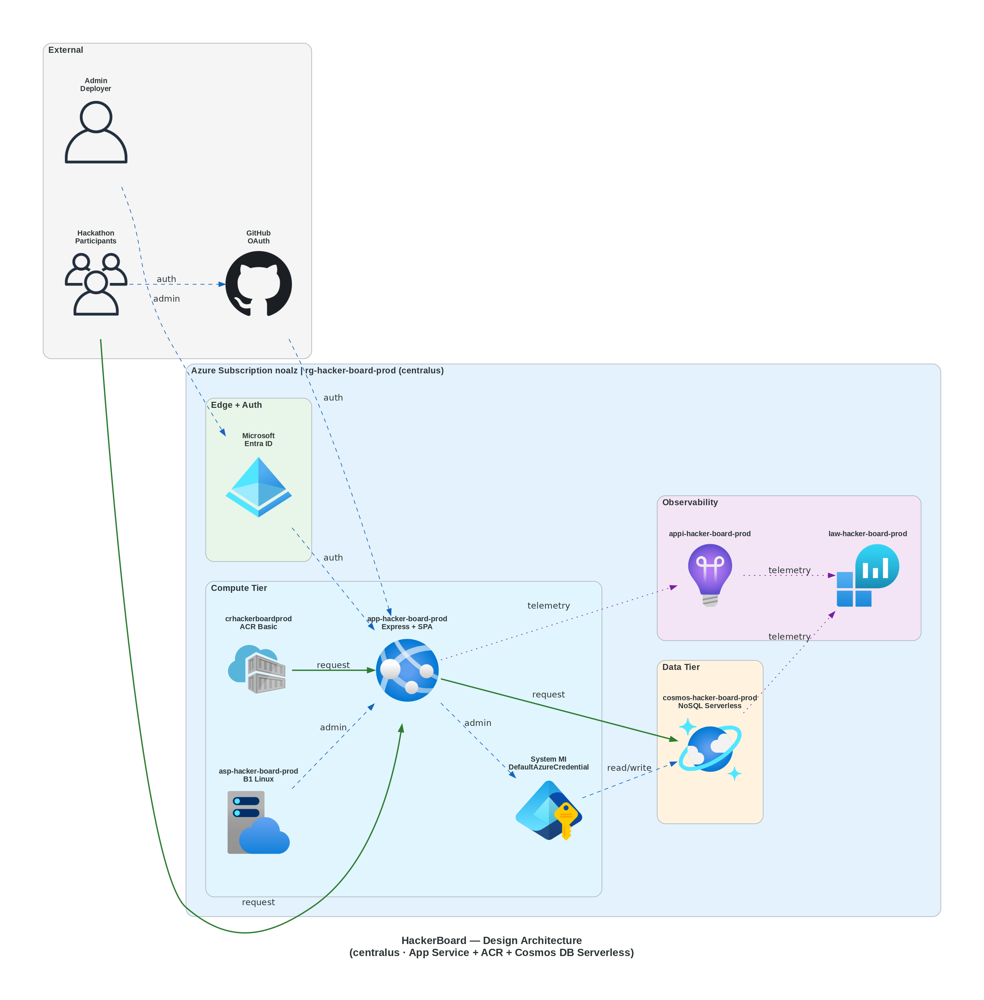
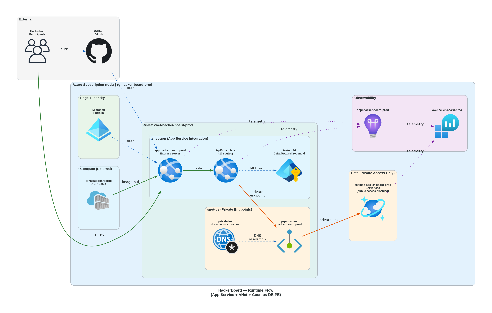
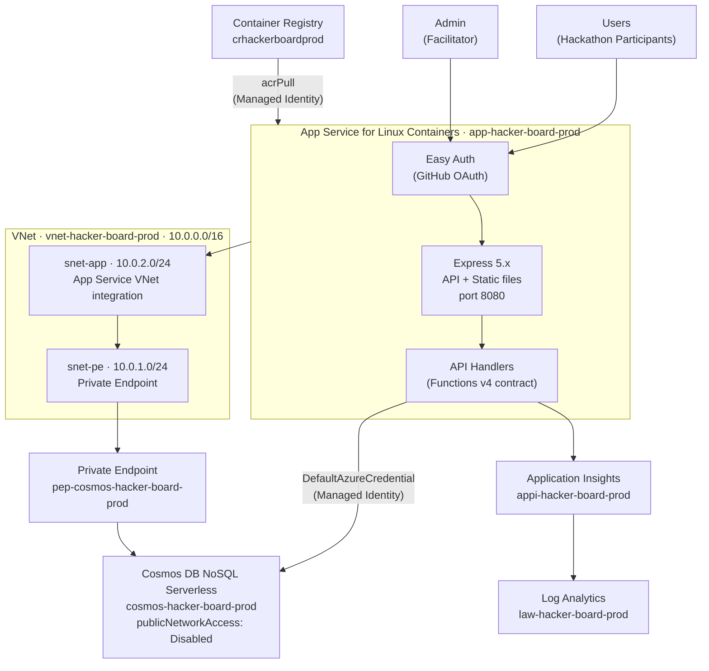
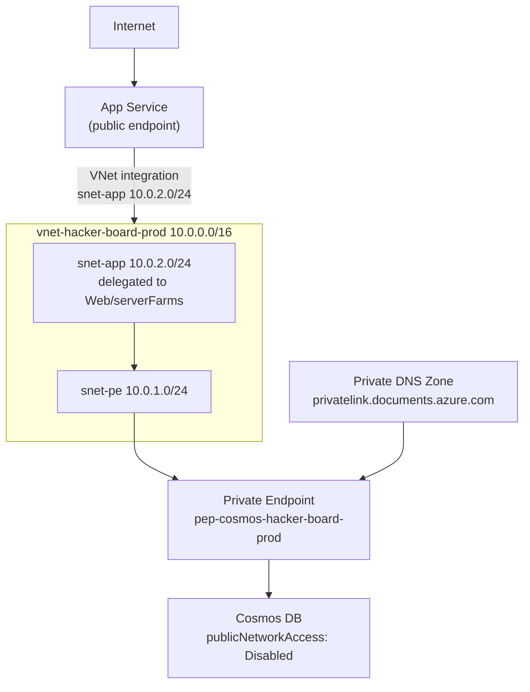
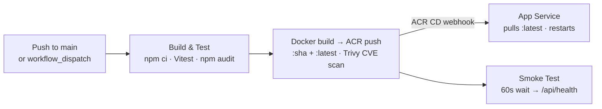

# HackerBoard — Architecture & Design Decisions

---

## Table of Contents

- [Overview Diagram](#overview-diagram)
- [Runtime Flow](#runtime-flow)
- [Resource Detail](#resource-detail)
- [Networking](#networking)
- [Security Model](#security-model)
- [CI/CD Pipeline](#cicd-pipeline)
- [Cost Estimate](#cost-estimate)
- [Architecture Decisions](#architecture-decisions)
- [Governance Constraints](#governance-constraints)
- [WAF Assessment](#waf-assessment)
- [Deployment History](#deployment-history)

---

## Overview Diagram

---

## Runtime Flow

The detail below shows request flow from sign-in to data access:

**Key flows:**

- All user requests hit App Service Easy Auth first — unauthenticated requests are redirected to GitHub OAuth.
- The Express server serves the SPA from `src/` and routes `/api/*` to the API handlers.
- Cosmos DB is only reachable via the Private Endpoint — `publicNetworkAccess` is `Disabled`. The App Service reaches it via VNet integration → Private DNS → Private Endpoint.
- The container image is pulled from ACR using the App Service managed identity (`acrPull` role). No ACR credentials are stored.

---

## Resource Detail

All resources deployed in `rg-hacker-board-prod` (Central US):

| Resource                | Name                              | SKU / Tier  | Purpose                                    |
| ----------------------- | --------------------------------- | ----------- | ------------------------------------------ |
| App Service Plan        | `asp-hacker-board-prod`           | S1 Linux    | Container hosting                          |
| Web App for Containers  | `app-hacker-board-prod`           | Linux       | SPA + API in a single container            |
| Container Registry      | `crhackerboardprod`               | Basic       | Docker image storage                       |
| Cosmos DB Account       | `cosmos-hacker-board-prod`        | Serverless  | All application data (6 containers)        |
| Virtual Network         | `vnet-hacker-board-prod`          | 10.0.0.0/16 | Private networking for Cosmos DB access    |
| Subnet — App            | `snet-app`                        | 10.0.2.0/24 | App Service VNet integration (delegated)   |
| Subnet — PE             | `snet-pe`                         | 10.0.1.0/24 | Private Endpoint subnet                    |
| Private Endpoint        | `pep-cosmos-hacker-board-prod`    | Sql         | Private Cosmos DB access                   |
| Private DNS Zone        | `privatelink.documents.azure.com` | global      | DNS resolution for PE                      |
| Application Insights    | `appi-hacker-board-prod`          | web         | Request tracing and performance monitoring |
| Log Analytics Workspace | `law-hacker-board-prod`           | PerGB2018   | Centralised log ingestion                  |

> **Why S1 and not P1v3**: The subscription had zero PremiumV3 quota in `centralus`. S1 (Standard) fully supports regional VNet integration and is the next best option.

### Cosmos DB Containers

| Container     | Partition Key | Contents                                    |
| ------------- | ------------- | ------------------------------------------- |
| `teams`       | `/id`         | Team records and award assignments          |
| `attendees`   | `/id`         | Participant profiles (anonymised aliases)   |
| `scores`      | `/teamId`     | Approved score records                      |
| `submissions` | `/teamId`     | Pending, approved, and rejected submissions |
| `rubrics`     | `/id`         | Rubric configurations                       |
| `flags`       | `/id`         | Feature flag settings                       |

---

## Networking

- **App Service** has a public HTTPS endpoint. Authentication is enforced at the Easy Auth layer.
- **Cosmos DB** has `publicNetworkAccess: Disabled`. The only inbound path is through the Private Endpoint in `snet-pe`.
- **Private DNS Zone** `privatelink.documents.azure.com` is linked to the VNet so the App Service can resolve the Cosmos DB FQDN to the private IP.

---

## Security Model

| Control              | Implementation                                                            |
| -------------------- | ------------------------------------------------------------------------- |
| Authentication       | App Service Easy Auth (GitHub OAuth) — all routes except `/api/health`    |
| Authorisation        | `ADMIN_USERS` app setting checked per-request in `api/shared/auth.js`     |
| Cosmos DB access     | `DefaultAzureCredential` (managed identity) — no connection strings       |
| Cosmos DB local auth | Disabled (`disableLocalAuth: true`) — enforced by governance policy       |
| Image pull from ACR  | `acrPull` role on App Service managed identity                            |
| TLS                  | TLS 1.2 minimum enforced on all resources                                 |
| Security headers     | CSP, HSTS, X-Content-Type-Options, X-Frame-Options — `api/server.js`      |
| XSS prevention       | `.textContent` used in SPA; DOMPurify where HTML is needed                |
| No secrets at rest   | GitHub OAuth secret stored as App Service app setting (encrypted at rest) |

---

## CI/CD Pipeline

The pipeline runs on every push to `main` touching `src/**`, `api/**`, or `Dockerfile`. The App Service watches the `hacker-board:latest` tag in ACR and automatically redeploys when a new image is pushed — no explicit deploy step is needed.

---

## Cost Estimate

Monthly cost at low traffic (Central US, as of 2026):

| Resource             | SKU        | Est. Monthly Cost  |
| -------------------- | ---------- | ------------------ |
| App Service Plan     | S1 Linux   | ~$13.14            |
| Container Registry   | Basic      | ~$5.00             |
| Cosmos DB NoSQL      | Serverless | ~$0.01 (idle)      |
| Log Analytics        | PerGB2018  | ~$0.00 (< 5 GB/mo) |
| Application Insights | —          | ~$0.00 (< 5 GB/mo) |
| **Total**            |            | **~$18.15/month**  |

Cosmos DB Serverless is billed per Request Unit consumed — cost scales with actual usage and is near zero between events.

---

## Architecture Decisions

### ADR-0001: App Service + ACR (supersedes SWA)

**Decision**: Replace Azure Static Web Apps with App Service for Linux Containers + ACR.

**Why**: The SWA managed identity sidecar had an `expires_on` parsing bug that made Cosmos DB MI authentication unreliable (401 failures after the token aged). App Service managed identity is production-hardened and has no such defect.

**Trade-offs accepted**: Fixed S1 compute cost (~$13.14/month) versus SWA's managed Functions model; ACR adds ~$5/month. The Express adapter pattern preserved all existing tests unchanged.

**Rejected alternatives**: SWA with Functions (MI bug), Container Apps (~$30–50+/month), Azure SQL (governance conflict — local auth disabled by policy).

---

### ADR-0002: Dual Authentication (GitHub OAuth + Entra ID)

**Decision**: GitHub OAuth via App Service Easy Auth for all users. The deploying user's Entra ID identity is used to assign the first admin app role.

**Why**: Event participants all have GitHub accounts. App Service Easy Auth provides the same `/.auth/*` contract as SWA built-in auth — the frontend required zero changes. Admin role is enforced by the `ADMIN_USERS` app setting checked at request time in `api/shared/auth.js`.

---

### ADR-0003: Cosmos DB RBAC-Only Access

**Decision**: Cosmos DB local authentication disabled (`disableLocalAuth: true`). App Service authenticates via `DefaultAzureCredential` + Cosmos DB Built-in Data Contributor role.

**Why**: Azure Policy `ModifyCosmosDBLocalAuth` (Modify effect) auto-disables local auth at the subscription. Connection strings would fail governance. The managed identity path is cleaner — no secrets to store, rotate, or leak.

---

### ADR-0004: Single-Region Deployment

**Decision**: Deploy to `centralus` only. No geo-replication, no Availability Zones.

**Why**: HackerBoard is an internal, short-lived event tool (hours to days of active use). The cost of multi-region Cosmos DB (requires Provisioned mode — Serverless cannot geo-replicate) and AZ-aware App Service plans is not justified. Accepted risk: RTO ~4h, RPO ~1h via Cosmos PITR.

---

## Governance Constraints

The subscription (`noalz`) has 21 policy assignments. Key constraints that affected the Bicep templates:

| ID  | Policy                         | Effect | Impact on HackerBoard                                                                                                                                                        |
| --- | ------------------------------ | ------ | ---------------------------------------------------------------------------------------------------------------------------------------------------------------------------- |
| B1  | MFA on resource write actions  | Deny   | Deployer must use MFA. CI/CD service principals are exempt.                                                                                                                  |
| B3  | Resource Group tag enforcement | Deny   | RG must have all 9 tags: `environment`, `owner`, `costcenter`, `application`, `workload`, `sla`, `backup-policy`, `maint-window`, `tech-contact`. `deploy.ps1` handles this. |
| B5  | Cosmos DB local auth disabled  | Modify | `disableLocalAuth: true` is set by policy automatically. Bicep also sets it explicitly to avoid drift.                                                                       |
| B7  | Cosmos DB public access        | Modify | `publicNetworkAccess: Disabled` enforced. Requires VNet + Private Endpoint.                                                                                                  |
| B8  | TLS 1.2 minimum                | Deny   | `minimalTlsVersion: 'Tls12'` set on all applicable resources.                                                                                                                |

---

## WAF Assessment

Assessment as of Phase 18 (App Service + ACR + Cosmos DB Serverless, centralus, single-region):

| Pillar                 | Score | Key strength                                     | Accepted gap                                |
| ---------------------- | ----- | ------------------------------------------------ | ------------------------------------------- |
| Security               | 8/10  | No secrets, RBAC-only Cosmos, dual auth, TLS 1.2 | Public App Service endpoint (no WAF/AFD)    |
| Reliability            | 7/10  | 99.9% SLA, Cosmos PITR (RPO 1h)                  | Single-region, no AZ support for Serverless |
| Performance            | 7/10  | Sub-10ms Cosmos reads at this data volume        | No CDN in front of static assets            |
| Cost Optimization      | 9/10  | ~$18.15/month — 98% under $50/day ceiling        | S1 fixed cost regardless of usage           |
| Operational Excellence | 7/10  | IaC + CI/CD + App Insights + structured logging  | No automated alert rules                    |

**Primary optimized pillar**: Cost Optimization.

---

## Deployment History

First successful deployment: **2026-02-21** — `hacker-board-20260221-153137` (Incremental, Succeeded).

### Deployed Resources

| Resource                          | Name                              | SKU / Tier  |
| --------------------------------- | --------------------------------- | ----------- |
| Log Analytics Workspace           | `law-hacker-board-prod`           | PerGB2018   |
| Application Insights              | `appi-hacker-board-prod`          | web         |
| Cosmos DB Account (Serverless)    | `cosmos-hacker-board-prod`        | Serverless  |
| Cosmos DB Database + 6 Containers | `hackerboard`                     | —           |
| Virtual Network                   | `vnet-hacker-board-prod`          | 10.0.0.0/16 |
| Subnet (App, delegated)           | `snet-app`                        | 10.0.2.0/24 |
| Subnet (Private Endpoint)         | `snet-pe`                         | 10.0.1.0/24 |
| Private Endpoint                  | `pep-cosmos-hacker-board-prod`    | Sql         |
| Private DNS Zone                  | `privatelink.documents.azure.com` | global      |
| Container Registry                | `crhackerboardprod`               | Basic       |
| App Service Plan                  | `asp-hacker-board-prod`           | S1 Linux    |
| Web App for Containers            | `app-hacker-board-prod`           | Linux       |
| Cosmos DB RBAC assignments        | Built-in Data Contributor × 3     | —           |

### Key Outputs

| Output             | Value                                                       |
| ------------------ | ----------------------------------------------------------- |
| App Service URL    | `https://app-hacker-board-prod.azurewebsites.net`           |
| ACR Login Server   | `crhackerboardprod.azurecr.io`                              |
| Cosmos DB Endpoint | `https://cosmos-hacker-board-prod.documents.azure.com:443/` |
| Resource Group     | `rg-hacker-board-prod` (centralus)                          |
| Subscription       | `noalz` (`00858ffc-dded-4f0f-8bbf-e17fff0d47d9`)            |

---

[← Back to Documentation](README.md)
