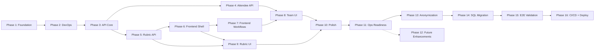

# HackerBoard — Execution Plan

> **MANDATORY**: Copilot MUST read this file before starting ANY implementation work.
> This is the single source of truth for project status, decisions, and problems.
>
> **How to update**: Check off tasks with `[x]`, mark blockers with `[!]`,
> add problems to the Problem Log, record decisions in the Decision Log,
> and update Session Handoff Notes at the end of each session.

---

## Legend

| Symbol | Meaning         |
| ------ | --------------- |
| `[ ]`  | Not started     |
| `[~]`  | In progress     |
| `[x]`  | Done            |
| `[!]`  | Blocked         |
| 🔴     | High priority   |
| 🟡     | Medium priority |
| 🟢     | Low priority    |

---

## Current Status

| Metric                  | Value                                                |
| ----------------------- | ---------------------------------------------------- |
| **Current Phase**       | Phase 15 — E2E Validation (pending clean deployment) |
| **Last Updated**        | 2026-02-19                                           |
| **Days Remaining**      | 5                                                    |
| **Tasks Done**          | 213 / 237 (P1–P14 complete; P15–P16 pending)         |
| **API Endpoints**       | 10 files / 16 routes                                 |
| **Frontend Components** | 12 components + 5 services                           |
| **Tests Passing**       | 69 (API unit) + 61 (frontend DOM) = 130              |
| **Open Problems**       | 0                                                    |
| **Open Decisions**      | 0                                                    |

---

## Dependency Map

**Critical path**: P1 → P2 → P3 → P5 → P6 → P7 → P10 → P11 → P13 → P14 → P15 → P16

**Parallel tracks** (after P3):

- Track A: P4 (Attendee API) — can run alongside P5
- Track B: P5 (Rubric API) → P6 (Shell) → P7 (Workflows)
- P8 and P9 can start once their dependencies complete
- P12 (Future Enhancements) is optional — not on the critical path

---

Original 7-Day Sprint Plan (completed)

| Day | Focus               | Phases    | Target                                                       |
| --- | ------------------- | --------- | ------------------------------------------------------------ |
| 1   | Foundation + DevOps | P1 + P2   | ESM migration, Vitest, CI/CD, security headers, seed scripts |
| 2   | API Core            | P3        | Teams CRUD, Scores, Upload, Submissions (6 endpoints)        |
| 3   | Remaining API       | P4 + P5   | Attendees, Awards, Rubric parser + CRUD (9 endpoints)        |
| 4   | Frontend Shell      | P6        | SPA router, leaderboard, grading, theme, CSS                 |
| 5   | Core UI Workflows   | P7        | Score form, upload, admin review, awards, registration       |
| 6   | Management UI       | P8 + P9   | Team roster, attendee mgmt, team assign, rubric UI           |
| 7   | Polish + Ship       | P10 + P11 | Integration test, a11y, search, flags, prod deploy           |

---

## Phase 1 — Foundation 🔴

> **Goal**: Zero deprecated deps, secure baseline, ESM migration.
> **Depends on**: Nothing.
> **Definition of Done**: `npm audit` clean, all shared helpers use ESM,
> security headers in `staticwebapp.config.json`, `engines` pinned.

### 1.1 — Dependency Audit & Cleanup

- [x] Audit root `package.json` — flag deprecated transitive deps
- [x] Audit `api/package.json` — flag deprecated packages
- [x] Add npm `overrides` to force non-deprecated transitive deps
- [x] Run `npm audit` on both root and `api/` — resolve all findings
- [x] Pin `"engines": { "node": ">=20.0.0" }` in root `package.json`
- [x] Verify Azure Functions Extension Bundle range (`[4.*, 5.0.0)`)
- [x] Confirm `@azure/data-tables` SDK is latest stable

### 1.2 — ESM Migration

- [x] Add `"type": "module"` to `api/package.json`
- [x] Convert `api/shared/auth.js` from CommonJS to ESM
- [x] Convert `api/shared/tables.js` from CommonJS to ESM
- [x] Convert `api/shared/errors.js` from CommonJS to ESM
- [x] Verify all imports work with `swa start`

### 1.3 — Security Hardening

- [x] Add `Content-Security-Policy` header in `staticwebapp.config.json`
- [x] Add `Strict-Transport-Security` header (HSTS) in `globalHeaders`
- [x] Confirm only GitHub auth provider enabled (Google/Twitter/AAD = 404)
- [x] Confirm all error responses use standard error envelope (no stack leaks)

**Validation**: `npm audit` returns 0 high/critical. `swa start` launches
without errors. All `api/shared/*.js` files use `import`/`export`.

---

## Phase 2 — DevOps & Environment 🔴

> **Goal**: CI/CD, test infrastructure, local dev, seed data.
> **Depends on**: Phase 1.
> **Definition of Done**: `npm test` runs Vitest, GitHub Actions deploys on push,
> seed script populates local Azurite, `.env.example` documents all vars.

### 2.1 — Test Infrastructure

- [x] Install Vitest as dev dependency in `api/`
- [x] Create `api/vitest.config.js`
- [x] Add `"test"` script to `api/package.json`
- [x] Write smoke test that imports shared helpers

**Validation**: `cd api && npm test` passes.

### 2.2 — CI/CD Pipeline

- [x] Create `.github/workflows/deploy-swa.yml`
- [x] Stages: install → lint → test → deploy
- [x] Use `Azure/static-web-apps-deploy@v1` action
- [x] Pin all actions to `@v4` (upload/download-artifact)
- [x] Add PR preview environment (SWA staging)

**Validation**: Push to branch triggers workflow; PR gets preview URL.

### 2.3 — Environment & Secrets

- [x] Create `.env.example` listing all required variables
- [x] Document local dev setup in README.md (SWA CLI + Azurite)
- [x] Verify `swa start` works with `--api-location api`

### 2.4 — Data Seeding

- [x] Create `scripts/seed-demo-data.js` (populates Table Storage)
- [x] Support `--reset` flag to clear tables first
- [x] Support `--teams N --attendees M` parameters
- [x] Include default 105+25 rubric in seed data
- [x] Include Config table with default feature flags in seed data

**Validation**: `node scripts/seed-demo-data.js --reset` populates
Azurite tables; data visible in Storage Explorer.

---

## Phase 3 — API Core (Teams, Scores, Submissions) 🔴

> **Goal**: Core API — auth, Teams CRUD, scoring, submissions.
> **Depends on**: Phase 2.
> **Definition of Done**: All 6 endpoints return correct responses,
> tests pass, auth enforced on protected routes.

### 3.1 — Auth Helpers

- [x] Write tests for `getClientPrincipal()` and `requireRole()`
- [x] Update `api/shared/auth.js` if tests reveal issues
- [x] Tests green

### 3.2 — Teams CRUD

- [x] Write tests for `GET /api/teams`
- [x] Write tests for `POST /api/teams` (admin only)
- [x] Write tests for `PUT /api/teams` (admin only)
- [x] Write tests for `DELETE /api/teams` (admin only)
- [x] Implement `api/src/functions/teams.js` (Azure Functions v4)
- [x] Tests green

### 3.3 — Scores

- [x] Write tests for `GET /api/scores` (with/without team filter)
- [x] Write tests for `POST /api/scores` (admin override)
- [x] Implement `api/src/functions/scores.js`
- [x] Tests green

### 3.4 — Upload & Submissions

- [x] Write tests for `POST /api/upload` (valid, invalid, wrong team)
- [x] Write tests for `GET /api/submissions` (admin only)
- [x] Write tests for `POST /api/submissions/validate` (approve/reject)
- [x] Implement `api/src/functions/upload.js`
- [x] Implement `api/src/functions/submissions.js`
- [x] Validate payload size limit (max 256 KB)
- [x] Tests green

**Validation**: `npm test` in `api/` — all tests pass.
Manual test with `curl` against `swa start` confirms auth enforcement.

---

## Phase 4 — Attendee & Team Management API 🔴

> **Goal**: Attendees, bulk import, team assignment, awards.
> **Depends on**: Phase 3.
> **Definition of Done**: All endpoints return correct responses, tests pass.

### 4.1 — Attendees

- [x] Write tests for `GET/POST/PUT /api/attendees/me`
- [x] Write tests for `GET /api/attendees` (admin only)
- [x] Implement `api/src/functions/attendees.js`
- [x] Tests green

### 4.2 — Bulk Import (F9)

- [x] Write tests for `POST /api/attendees/bulk` (valid CSV, duplicates)
- [x] Implement `api/src/functions/attendees-bulk.js`
- [x] Tests green

### 4.3 — Team Assignment (F10)

- [x] Write tests for `POST /api/teams/assign` (Fisher-Yates, edge cases)
- [x] Implement `api/src/functions/teams-assign.js`
- [x] Tests green

### 4.4 — Awards (F4)

- [x] Write tests for `GET/POST/PUT /api/awards`
- [x] Implement `api/src/functions/awards.js`
- [x] Tests green

**Validation**: `npm test` — all Phase 3+4 tests pass.

---

## Phase 5 — Rubric Engine API (F11) 🔴

> **Goal**: Markdown parser, CRUD, activation, default bootstrap.
> **Depends on**: Phase 3.
> **Definition of Done**: Parser handles well-formed and malformed markdown,
> CRUD works, activation swaps rubrics, default seeds on first use.

### 5.1 — Rubric Markdown Parser

- [x] Write tests: extract categories + criteria + points
- [x] Write tests: extract bonus items with points
- [x] Write tests: extract grading scale with thresholds
- [x] Write tests: error on malformed/incomplete markdown
- [x] Implement `api/shared/rubricParser.js`
- [x] Validate `baseTotal` matches sum of category max points
- [x] Tests green

### 5.2 — Rubric CRUD & Activation

- [x] Write tests for `GET /api/rubrics`
- [x] Write tests for `POST /api/rubrics` (create from markdown)
- [x] Write tests for `GET /api/rubrics/active`
- [x] Write tests: activation deactivates previous rubric
- [x] Implement `api/src/functions/rubrics.js`
- [x] Tests green

### 5.3 — Default Rubric Bootstrap

- [x] Auto-seed default rubric on first `/api/rubrics/active` if none exists
- [x] Include default 105+25 rubric in seed script (Phase 2.4)

**Validation**: `npm test` — all rubric tests pass. `GET /api/rubrics/active`
returns the default rubric on a fresh database.

---

## Phase 6 — Frontend Shell & Leaderboard 🔴

> **Goal**: SPA router, dashboard, leaderboard, grading, theme.
> **Depends on**: Phase 5 (rubric API for dynamic grading).
> **Definition of Done**: Dashboard loads, leaderboard renders with live data,
> theme toggle works, responsive across breakpoints.

### 6.1 — SPA Infrastructure

- [x] Implement `src/app.js` — hash-based SPA router
- [x] Implement `src/services/api.js` — fetch wrappers for all endpoints
- [x] Implement `src/services/auth.js` — `/.auth/me` client helper
- [x] Implement `src/services/rubric.js` — fetch/cache active rubric
- [x] Create `src/styles/main.css` — CSS custom properties, responsive grid

### 6.2 — Navigation & Theme

- [x] Implement `src/components/Navigation.js` — role-aware nav, theme toggle
- [x] Implement theme system (light/dark, localStorage persist)
- [x] Keyboard-operable with visible focus indicators

### 6.3 — Dashboard & Leaderboard (F2, F3)

- [x] Implement `src/components/Leaderboard.js` — ranked table, expandable rows
- [x] Implement champion spotlight — top-3 cards with grade badges
- [x] Implement grading logic — rubric-driven grade calculation + tier badges
- [x] Auto-refresh every 30 seconds
- [x] Responsive: table on lg+, card fallback on sm

**Validation**: Open in browser — leaderboard renders seeded data,
theme toggle works, responsive at all breakpoints, keyboard navigable.

---

## Phase 7 — Frontend Workflows (F1, F4, F6, F7, F8) 🔴

> **Goal**: Score submission, upload, admin review, registration, awards.
> **Depends on**: Phase 6.
> **Definition of Done**: All workflows functional, form validation works,
> admin-only controls hidden from members.

### 7.1 — Score Submission Form (F1)

- [x] Implement `src/components/ScoreSubmission.js`
- [x] Dynamic categories/criteria from active rubric
- [x] Category subtotal validation against rubric max
- [x] Bonus toggles with auto-calculated points
- [x] Submit creates pending submission via `/api/upload`

### 7.2 — JSON Upload (F6)

- [x] Implement `src/components/UploadScores.js`
- [x] Drag-and-drop + file browse
- [x] Schema validation + preview before submit
- [x] Team scope enforcement (own team only)

### 7.3 — Submission Status

- [x] Implement `src/components/SubmissionStatus.js`
- [x] Show pending/approved/rejected state for member's submissions

### 7.4 — Admin Review & Override (F8)

- [x] Implement `src/components/AdminReviewQueue.js`
- [x] Pending submissions with approve/reject + reason
- [x] ~~ManualOverride.js~~ — deferred to Phase 12.3 (admin can use `POST /api/scores` directly)

### 7.5 — Registration (F7)

- [x] Implement `src/components/Registration.js`
- [x] Pre-fill GitHub username from `/.auth/me`
- [x] Self-service profile update

### 7.6 — Awards (F4)

- [x] Implement `src/components/Awards.js`
- [x] Five award categories with team dropdown (admin assign)
- [x] Award badges on leaderboard

**Validation**: Submit score as member → appears in admin queue →
approve → leaderboard updates. Upload JSON → preview → submit.
Awards assigned appear on leaderboard.

---

## Phase 8 — Team & Attendee Management UI 🔴

> **Goal**: Team rosters, attendee management, random assignment.
> **Depends on**: Phase 4 (API), Phase 7 (frontend shell).
> **Definition of Done**: Admin can bulk-import attendees, assign to teams,
> all users see team roster.

### 8.1 — Team Roster (F10)

- [x] Implement `src/components/TeamRoster.js`
- [x] Card/table grid of all teams + members
- [x] Member read-only with own-team highlight
- [x] ~~Admin drag-and-drop reassignment~~ — deferred to Phase 12.3

### 8.2 — Attendee Management (F9)

- [x] Implement `src/components/AttendeeBulkEntry.js`
- [x] Multi-line/CSV paste for name import
- [x] Duplicate detection with merge prompt

### 8.3 — Team Assignment (F10)

- [x] Implement `src/components/TeamAssignment.js`
- [x] Team count input, Fisher-Yates shuffle preview
- [x] Confirm/re-shuffle with confirmation dialog

**Validation**: Bulk import 20 attendees → assign to 4 teams →
roster shows balanced distribution → admin can reassign.

---

## Phase 9 — Rubric Management UI (F11) 🔴

> **Goal**: Admin rubric upload, preview, activation.
> **Depends on**: Phase 5 (API), Phase 6 (shell).
> **Definition of Done**: Admin uploads `.md` rubric, previews parsed
> result, activates it, score form + leaderboard update dynamically.

### 9.1 — Rubric Upload & Preview

- [x] Upload + preview functionality in `src/components/RubricManager.js`
- [x] Drag-and-drop `.md` upload with parsed categories/criteria/points preview

### 9.2 — Rubric Activation & Archive

- [x] Implement `src/components/RubricManager.js` — list + active indicator
- [x] Activate/archive with confirmation dialog
- [x] Verify F1 form and F2 leaderboard update on rubric switch

**Validation**: Upload rubric → preview → activate → score form
adapts to new categories/criteria. Old rubric archived.

---

## Phase 10 — Integration & Polish 🟡

> **Goal**: E2E tests, accessibility, search, notifications.
> **Depends on**: Phases 6–9.
> **Definition of Done**: Critical flows tested end-to-end, WCAG 2.2 AA
> audit passes, search works, notifications functional.

### 10.1 — Integration Tests

- [x] Test flow: login → submit score → admin approve → leaderboard
- [x] Test flow: rubric upload → activate → score form adapts
- [x] Test flow: bulk import → team assignment → roster display

### 10.1b — Playwright E2E Tests

- [x] Install Playwright + Chromium in devcontainer
- [x] Create `playwright.config.js` (Chromium-only, python3 static server)
- [x] Create `e2e/leaderboard.spec.js` (5 smoke tests)
- [x] E2E: score submission → review → leaderboard flow
- [x] E2E: rubric upload → activation → form adapts
- [x] E2E: attendee bulk import → team assignment → roster
- [x] Add `test:e2e` to CI pipeline (after deploy-preview)

### 10.2 — Accessibility Audit

- [x] Run axe-core on all pages
- [x] Manual keyboard navigation check
- [x] Verify ARIA labels on icon-only controls
- [x] Verify contrast in both themes

### 10.3 — Responsive Check

- [x] Verify sm/md/lg/xl breakpoints
- [x] Touch target sizes on mobile

### 10.4 — Search & Notifications

- [x] Search bar in navbar (filter teams/attendees)
- [x] Notification area (submission status, award alerts)
- [x] Admin pending count badge
- [x] Persist dismissed notifications in localStorage

**Validation**: All integration tests pass. axe-core reports 0 violations.
Search filters correctly. Notifications appear and dismiss.

---

## Phase 11 — Operational Readiness 🟡

> **Goal**: Production-ready for live event.
> **Depends on**: Phase 10.
> **Definition of Done**: Deployed to production SWA, monitoring active,
> feature flags work, cleanup scripts ready.

### 11.1 — Feature Flags

- [x] Implement flags: `SUBMISSIONS_ENABLED`, `LEADERBOARD_LOCKED`,
      `REGISTRATION_OPEN`, `AWARDS_VISIBLE`, `RUBRIC_UPLOAD_ENABLED`
- [x] API returns 503 when feature disabled
- [x] Frontend hides/disables UI based on flag state
- [x] Admin toggle for each flag
- [x] Auto-seed default feature flags to Config table on first API read

### 11.2 — Monitoring

- [x] Enable Application Insights for managed Functions
- [x] Add structured logging (request ID, user, operation, duration)
- [x] Client-side telemetry (page views, errors)

### 11.3 — Production Deploy & Smoke Test

- [x] Add "Deploy to Azure" button to README for 1-click Azure Static Web Apps provisioning
  - `infra/azuredeploy.json` ARM template deployed
  - Deploy button linked in `README.md`
- [x] Create `Rubrics` table in Table Storage (missing from handoff Phase 4.3)
- [x] Create `/api/health` endpoint (verifies all 7 table connections)
- [x] Add anonymous route for `/api/health` in `staticwebapp.config.json`
- [x] Add post-deploy smoke-test job to CI/CD workflow
- [ ] Deploy to production SWA
- [ ] Smoke test: login → leaderboard loads → submit score → approve
- [ ] Smoke-test rubric endpoints (`GET/POST /api/rubrics`, `GET /api/rubrics/active`)
- [ ] Smoke-test feature flags endpoint (`GET/PUT /api/flags`)
- [ ] Verify SWA role invitations work for admin users

### 11.4 — Post-Event Prep

- [x] Create `scripts/cleanup-app-data.js` (purge tables)
- [x] Support `--confirm` flag for safety
- [x] Document admin invitation + rotation procedures

### 11.5 — Frontend Component Test Coverage

- [x] Write tests for `Registration.js`
- [x] Write tests for `AdminReviewQueue.js`
- [x] Write tests for `FeatureFlags.js`
- [x] Write tests for `RubricManager.js`
- [x] Write tests for `SubmissionStatus.js`
- [x] Write tests for `AttendeeBulkEntry.js`
- [x] Write tests for `TeamAssignment.js`
- [x] Write tests for `UploadScores.js`

**Validation**: Production app accessible, all features work,
monitoring shows data, feature flags toggle correctly.

### 11.6 — Infrastructure Automation

- [x] Enable system-assigned managed identity on SWA (Bicep)
- [x] Automate Storage Table Data Contributor RBAC in Bicep
- [x] Create `infra/modules/storage-rbac.bicep` module
- [x] Recompile `azuredeploy.json` with identity + RBAC
- [x] Write health endpoint tests (4 tests)
- [x] Add health + API reachability checks to smoke-test job

---

## Phase 13 — Attendee Anonymization 🔴

> Fully anonymize all attendee identity: no name, no surname, no GitHub links in any UI or API response. Aliases are `Team01-Hacker01` style.

### 13.1 — Data Model & API

- [x] Add `nextHackerNumber()` atomic counter with ETag optimistic concurrency to `shared/tables.js`
- [x] Rewrite `attendees.js`: join flow, alias schema (`HackerNN` rowKey, `_github` lookup rows, `_meta/counter`), no PII in responses
- [x] Rewrite `teams.js`: auto-seed 6 default teams (Team01–Team06) on first GET, auto-number new teams, block delete if members exist, remove PUT/rename
- [x] Rewrite `teams-assign.js`: Fisher-Yates shuffle over all `attendees` partition rows, no `teamCount` param, member list stored as hacker aliases
- [x] Strip audit PII from API responses: `scoredBy`, `submittedBy`/`reviewedBy`, `assignedBy`
- [x] Delete `attendees-bulk.js` (bulk import removed)

### 13.2 — Frontend

- [x] Rewrite `Registration.js`: minimal "Join Event" form, shows alias+team on success
- [x] Rewrite `Navigation.js`: async, shows alias via `getMyAlias()`, search by alias
- [x] Update `TeamRoster.js`: render `m.alias` instead of `m.displayName`
- [x] Rewrite `TeamAssignment.js`: "Re-shuffle Teams" button only, no team count input
- [x] Update `SubmissionStatus.js`: remove "Submitted By" column
- [x] Delete `AttendeeBulkEntry.js` and `.test.js`
- [x] Update `auth.js`: remove `getUsername()`, add `getMyAlias(apiFetch)` with caching
- [x] Update `api.js`: add `attendees.join()`, remove `updateMe`/`bulkImport`, fix `teams.assign()` (no args)
- [x] Remove bulk entry route and import from `app.js`

### 13.3 — Seed & Tests

- [x] Rewrite `scripts/seed-demo-data.js` with alias schema
- [x] Update all affected tests (attendees-awards, Registration, TeamAssignment, TeamRoster, Navigation, SubmissionStatus)

---

## Phase 14 — Azure SQL Migration 🔴

> Migrated storage from Azure Table Storage to Azure SQL Database (Basic DTU). All API functions updated to use `query()` from `api/shared/db.js` via `mssql` SDK. Schema in `api/schema/init.sql`.

- [x] Provision `modules/sql-server.bicep` with Entra ID admin + Basic DTU database
- [x] Add `api/shared/db.js` with connection pooling via `mssql@^11`
- [x] Rewrite all 9 API function files to use parameterized SQL queries
- [x] Create `api/schema/init.sql` (Teams, Attendees, Scores, Submissions, Awards, Rubrics, Config)
- [x] Update `scripts/deploy-schema.js` to run `init.sql` against Azure SQL
- [x] Update `scripts/seed-demo-data.js` for SQL dialect
- [x] Update all API tests to mock `db.js` instead of Table Storage client
- [x] Update `main.bicep` to wire `sqlServerFqdn`/`sqlDatabaseName` to SWA app settings

---

## Phase 15 — E2E Deployment Validation 🔴

> Validate full deployment readiness through two supported deployment paths: **`deploy.ps1`** and **Deploy to Azure button**. GitHub Actions is not a supported infrastructure deployment path. Each path runs in its own disposable resource group before any production deployment.
>
> The Entra user running the deployment is automatically the application admin and the SQL Entra administrator — no separate invite step is required.
>
> Reference: `docs/deployment-guide.md` — "E2E Deployment Validation — Test Protocol"

### 15.1 — Preflight Fixes (Contract Drift)

- [x] Fix `deploy.ps1` output name mismatch: `staticWebAppUrl`→`swaHostname`, `staticWebAppName`→`swaName`
- [x] Fix `deploy.ps1` missing `adminEmail` parameter (never passed to Bicep `--parameters`)
- [x] Fix `deploy.ps1` next-steps copy: `writer/reader` → `admin/member`
- [x] Fix `deploy.ps1` `$WhatIf` undeclared: add explicit `[switch]$WhatIf` to `param()`
- [x] Fix `scripts/invite-admin.sh` default role + validation: `writer`→`admin`, `reader`→`member`
- [x] Add E2E test protocol + evidence checklist to `docs/deployment-guide.md`
- [x] Record decisions D13–D15 + this Phase in `docs/backlog.md`

### 15.2 — Path A: PowerShell Script

> RG: `rg-hacker-board-prod` · Script: `infra/deploy.ps1`

- [ ] Execute `./deploy.ps1 -CostCenter ... -TechnicalContact ...` against `rg-hacker-board-prod`
- [ ] Capture all provisioning outputs: `swaHostname`, `swaName`, `sqlServerFqdn`, `sqlDatabaseName`
- [ ] Schema migration runs automatically via in-VNet ACI deploymentScript (`sql-grant.bicep`)
- [ ] Confirm deploying user auto-configured as app admin and SQL Entra administrator
- [ ] Verify SWA returns HTTP 200 on the generated hostname
- [ ] Verify `GET /api/health` → 200 (after CI/CD deploys app code)
- [ ] Verify `GET /api/teams` → 200, no 5xx
- [ ] Teardown disposable RG after Path B evidence captured

### 15.3 — Path B: Deploy to Azure Button

> RG: `hb-e2e-btn-<yyyyMMdd>` · Template: `infra/azuredeploy.json`

- [ ] Click button in `README.md`, set `enablePrivateEndpoint=false`
- [ ] Fill portal form: `costCenter`, `technicalContact`, `adminEmail` (deploying user's email), `sqlAdminObjectId` (deploying user's OID)
- [ ] Collect ARM deployment outputs from Azure Portal
- [ ] Run post-deploy step manually: `deploy-schema.js`
- [ ] Confirm deploying user is auto-configured as app admin and SQL Entra administrator
- [ ] Verify `/api/health` and `/api/teams`
- [ ] Teardown RG after evidence captured

### 15.4 — Test Matrix & Remediation

- [ ] Complete test matrix in `docs/deployment-guide.md` with pass/fail + failure modes (two paths: PS script, Deploy button)
- [ ] Apply any remaining contract-drift fixes found during runs
- [ ] Rebuild compiled ARM template if Bicep changes: `az bicep build --file infra/main.bicep --outfile infra/azuredeploy.json`
- [ ] Update session handoff notes with outcomes

---

## Phase 16 — CI/CD + Post-Deploy Verification 🔴

> **Goal**: App code deployed to live SWA via GitHub Actions; db_owner and Directory Readers
> confirmed on production resources; all smoke tests green.
>
> **Depends on**: Phase 15.2 (infra live), Phase 15.3 (Deploy button validation)
> **Definition of Done**: `GET /api/health` and `GET /api/teams` return 200 from the
> production SWA hostname with full app code deployed.

### 16.1 — GitHub Actions CI/CD

- [ ] 🔴 Retrieve new `AZURE_STATIC_WEB_APPS_API_TOKEN` from Azure Portal after infrastructure
      provisioning completes, then set it as a GitHub Actions secret in this repo
- [ ] Push to `main` to trigger `deploy-swa.yml` workflow
- [ ] Confirm workflow completes: build → deploy → smoke test
- [ ] Verify `GET /api/health` → 200
- [ ] Verify `GET /api/teams` → 200

### 16.2 — Production Post-Deploy Verification

- [ ] Run `deploy.ps1` again (same params) to apply new automation: - In-VNet ACI deploymentScript (`sql-grant.bicep`) runs schema + db_owner grant - `az rest` step in `deploy.ps1` assigns Directory Readers to SQL server MI
- [ ] Confirm SQL MI has Directory Readers role in Entra ID
- [ ] Confirm SWA managed identity has `db_owner` on `hackerboard` database
- [ ] Confirm `CREATE USER ... FROM EXTERNAL PROVIDER` no longer errors in `sql-grant.bicep` logs
- [ ] Confirm deploying user is app admin and SQL Entra administrator — no invite acceptance required

### 16.3 — Smoke Tests

- [ ] `GET /api/health` → `{"status":"ok"}` with 200
- [ ] `GET /api/teams` → `[{"id":...}]` with 200 (6 default teams auto-seeded)
- [ ] Login with GitHub OAuth → JWT cookie set, no 401 on protected routes
- [ ] Submit a score via the UI → appears in leaderboard
- [ ] Confirm no PII in any API response (`_gitHubUsername` not surfaced)

---

## Phase 12 — Future Enhancements 🟢

> Nice-to-have items for post-sprint iterations. Phase 12 is numbered out of
> sequence — it was planned as a future-work bucket before Phases 13–16 were
> added as critical-path items.
>
> Once 12.1 (Agent Orchestration) is complete, all subsequent tasks should be
> executed through the Conductor workflow with the assigned agent.

### 12.1 — Agent Orchestration & Handoffs 🔴

> **Priority**: Do this FIRST — all subsequent work uses the orchestrated workflow.

- [x] Introduce a HackerBoard Conductor (orchestrator) agent — `Task Planner`
  - Master orchestrator that coordinates all existing agents with defined handoff points
  - Mandatory human approval gates at key decision points
  - Ref: [Azure Agentic InfraOps Conductor pattern](https://github.com/jonathan-vella/azure-agentic-infraops)
- [x] Update existing agents to support orchestrated handoffs — `Implementation Planner`
  - Define input/output contracts for each agent (what it receives, what it produces)
  - Add `agents` list and model fallback frontmatter to agent definitions
  - Standardize agent output format for downstream consumption
- [x] Update custom instructions (`.github/instructions/`) for orchestration awareness — `Implementation Planner`
  - Add orchestration-aware guidance (when to defer to conductor, how to report status)
  - Ensure instructions reference handoff checkpoints
- [x] Update skills (`.github/skills/`) for conductor integration — `Implementation Planner`
  - Skills should be invokable by both agents and conductor
  - Add skill discovery metadata (trigger keywords, categories)
- [x] Create agent/skill documentation in `docs/` — `docs-writer`
  - Agent inventory table (name, role, step, description)
  - Workflow diagram (Mermaid) showing orchestration flow and handoff points
  - Prompt guide with examples for each agent and skill
- [x] Modernize agents to VS Code custom agents & subagents spec (Feb 2026)
  - Ref: [Custom Agents](https://code.visualstudio.com/docs/copilot/customization/custom-agents)
  - Ref: [Subagents](https://code.visualstudio.com/docs/copilot/agents/subagents)
  - Add `handoffs` frontmatter to all agents for guided workflow transitions
  - Update tool names to documented format (`read`, `search`, `edit`, `fetch`, `agent`, `problems`)
  - Add `argument-hint` to all agents for dropdown guidance
  - Fix Conductor `agents` array to use `name` property values (not kebab-case filenames)
  - Add `agent` tool to Conductor for subagent invocation
  - Add subagent delegation section to Conductor with parallel execution guidance
  - Update `docs/agents-and-skills.md` with handoff chain diagram and subagent docs

#### Current Agent & Skill Inventory

| Type  | Name                   | Role                                          |
| ----- | ---------------------- | --------------------------------------------- |
| Agent | Task Planner           | Research, plan tasks, dependency analysis     |
| Agent | Implementation Planner | Structured implementation plans, refactoring  |
| Agent | Azure Architect        | WAF review, Azure architecture decisions      |
| Agent | Bicep AVM Expert       | Bicep IaC with Azure Verified Modules         |
| Agent | Security Reviewer      | OWASP Top 10, Zero Trust code review          |
| Agent | UX Designer            | JTBD, user journeys, accessibility review     |
| Skill | docs-writer            | Documentation maintenance, staleness checks   |
| Skill | git-commit             | Conventional commits, diff-aware messages     |
| Skill | github-operations      | Issues, PRs, Actions, releases via MCP/gh CLI |

### 12.2 — Documentation Overhaul

- [x] Create/update `.github/instructions/docs.instructions.md` with prettier documentation standards — `Implementation Planner`
  - Consistent badge usage (shields.io) for status, version, license
  - Quick Links table pattern (icon | link | description)
  - Collapsible sections with `
` for long content
  - Mermaid diagrams for architecture and workflows
  - Structured tables for feature/component inventories
  - Ref: [Azure Agentic InfraOps docs README](https://github.com/jonathan-vella/azure-agentic-infraops/blob/main/docs/README.md)
- [x] Redesign `docs/README.md` as a polished documentation hub — `docs-writer`
  - Hero section with badges (build status, license, Azure SWA, Node version)
  - Quick Links table to all docs
  - Architecture overview with Mermaid diagram
  - Feature inventory table
  - Project structure tree
  - Getting Help section (issues, discussions)
- [x] Prettify existing docs (`api-spec.md`, `app-design.md`, `app-prd.md`, etc.) — `docs-writer`
  - Add consistent headers, badges, and navigation links
  - Use tables instead of bullet lists where appropriate
  - Add "Back to docs" navigation links between pages
- [x] Second-pass documentation refinements (Feb 2026)
  - Add `agents-and-skills.md`, `openapi.yaml`, and `swagger-ui.html` to docs/README.md Quick Links
  - Add `admin-procedures.md`, `agents-and-skills.md`, and OpenAPI docs to root README.md docs table
  - Rewrite `app-scaffold.md` folder structure to match actual v4 functions layout
  - Update `app-scaffold.md` code samples from CJS to ESM
  - Remove outdated v3 `function.json` binding example; add v4 `app.http()` pattern
  - Remove broken "Starter README" section from `app-scaffold.md`
  - Update `app-design.md` component model table to match actual components
  - Add Mermaid architecture diagram and scoring workflow diagram to `app-design.md`
  - Fix broken `scoring-rubric.md` link in `app-prd.md` references
  - Verify all internal doc links across all markdown files

### 12.3 — Feature Enhancements

- [ ] Real-time updates via WebSocket or Server-Sent Events — `Azure Architect` → `Implementation Planner`
- [ ] Export leaderboard to CSV/PDF — `Implementation Planner`
- [ ] Rubric template gallery (share between events) — `UX Designer` → `Implementation Planner`
- [ ] Rubric versioning with diff view — `Implementation Planner`
- [ ] Historical score comparison across events — `UX Designer` → `Implementation Planner`
- [ ] Multi-language / i18n support — `Implementation Planner`
- [ ] Custom domain with SSL certificate — `Bicep AVM Expert`
- [x] OpenAPI / Swagger documentation — `Implementation Planner` → `docs-writer`
- [ ] ManualOverride component (admin score correction UI) — `UX Designer` → `Security Reviewer`
- [ ] Admin drag-and-drop attendee reassignment between teams — `UX Designer` → `Implementation Planner`

---

## Decision Log

> Record architectural and design decisions here.
> Format: `| ID | Date | Decision | Rationale | Status |`

| ID  | Date       | Decision                                                                                    | Rationale                                                                                                                                                                                                                                                                                                  | Status                |
| --- | ---------- | ------------------------------------------------------------------------------------------- | ---------------------------------------------------------------------------------------------------------------------------------------------------------------------------------------------------------------------------------------------------------------------------------------------------------- | --------------------- |
| D1  | 2026-02-16 | Use ESM modules throughout                                                                  | `copilot-instructions.md` mandates ESM; Functions v4 supports it; fresh codebase                                                                                                                                                                                                                           | **Approved**          |
| D2  | 2026-02-16 | Use Vitest for all testing                                                                  | Per `copilot-instructions.md`; fast, ESM-native, no config overhead                                                                                                                                                                                                                                        | **Approved**          |
| D3  | 2026-02-16 | Vanilla JS SPA with hash router                                                             | Per PRD — no framework; single `index.html`; minimal build tooling                                                                                                                                                                                                                                         | **Approved**          |
| D4  | 2026-02-16 | GitHub username ↔ Attendee mapping                                                          | Self-service claim (Option A from PRD F7/F10) — user claims on first login                                                                                                                                                                                                                                 | **Approved**          |
| D5  | 2026-02-16 | Add Playwright for E2E testing                                                              | Critical flows (submit→approve→leaderboard) need browser-level validation; Chromium-only to stay lean                                                                                                                                                                                                      | **Superseded by D7**  |
| D6  | 2026-02-16 | Templatized scoring rubric                                                                  | Rubric from azure-agentic-infraops-workshop is source of truth; template + prompt enables reuse across hackathons                                                                                                                                                                                          | **Approved**          |
| D7  | 2026-02-16 | Replace Playwright with Vitest + happy-dom                                                  | Playwright Chromium crashes devcontainer; mocked E2E tests are effectively DOM tests; happy-dom is lightweight and runs everywhere                                                                                                                                                                         | **Approved**          |
| D8  | 2026-02-17 | PRD Section 10 coding prompt superseded                                                     | Section references React/TypeScript/Tailwind but D3 chose Vanilla JS SPA; marked as historical reference only                                                                                                                                                                                              | **Approved**          |
| D9  | 2026-02-18 | Full attendee anonymization                                                                 | No PII in any UI or API response; GitHub identity stays server-side in `_gitHubUsername` storage field only; alias = `TeamNN-HackerNN`                                                                                                                                                                     | **Approved**          |
| D10 | 2026-02-18 | Bulk import removed                                                                         | Self-register via GitHub OAuth + "Join Event" is sufficient; CSV import increases PII risk surface                                                                                                                                                                                                         | **Approved**          |
| D11 | 2026-02-18 | Hacker numbers globally sequential                                                          | Simpler counter logic; avoids per-team numbering collisions; counter ETag-protected in `_meta/counter` row                                                                                                                                                                                                 | **Approved**          |
| D12 | 2026-02-18 | 6 default teams auto-seeded on first GET                                                    | Every event starts with Team01–Team06 without admin action; coaches can add/delete but not rename                                                                                                                                                                                                          | **Approved**          |
| D13 | 2026-02-18 | SWA deploy auth: token-based (`SWA_DEPLOYMENT_TOKEN`)                                       | Simplest common denominator for both supported deployment paths; OIDC used for production CI/CD app code deployment only                                                                                                                                                                                   | **Approved**          |
| D14 | 2026-02-18 | ~~E2E test environments use `enablePrivateEndpoint=false`~~                                 | ~~GitHub Actions hosted runners cannot reach private SQL endpoints; private endpoints are production-only~~                                                                                                                                                                                                | **Superseded by D22** |
| D15 | 2026-02-18 | Canonical SWA role model: `admin`/`member`                                                  | `staticwebapp.config.json` uses `admin`/`member`; `writer`/`reader` references in scripts were contract drift — corrected                                                                                                                                                                                  | **Approved**          |
| D16 | 2026-02-18 | SQL schema + db_owner grant via in-VNet ACI deploymentScript                                | Public SQL endpoint is not acceptable with private-endpoint topology; schema and grants run inside the VNet via Azure Container Instance in Bicep `deploymentScript` resource (`sql-grant.bicep`)                                                                                                          | **Approved**          |
| D17 | 2026-02-18 | Directory Readers assigned via `az rest` in `deploy.ps1`, not Bicep                         | Bicep `extension microsoftGraph` (built-in) is retired (BCP407); dynamic OCI ref (`br:mcr.microsoft.com/bicep/extensions/microsoftgraph/v1.0:1.0.0`) compiled but `roleAssignments` type not found (BCP029); fell back to idempotent `az rest POST /roleManagement/directory/roleAssignments` after deploy | **Approved**          |
| D18 | 2026-02-19 | Deploying Entra user is default app admin and SQL Entra administrator                       | Removes post-deploy manual invite step; the logged-in `az login` identity is used as both `adminEmail` (SWA app admin) and the SQL Entra administrator OID — no separate invite flow needed                                                                                                                | **Approved**          |
| D19 | 2026-02-19 | Only two infrastructure deployment paths supported: `deploy.ps1` and Deploy to Azure button | GitHub Actions is a CI/CD path for app code only, not an infrastructure deployment path; two well-tested paths are sufficient for operator use                                                                                                                                                             | **Approved**          |
| D20 | 2026-02-19 | Deleted `deploy-infra.yml` — GHA is not a supported infra deployment path                   | Per D19; `.github/workflows/deploy-infra.yml` removed; only `deploy.ps1` and Deploy to Azure button are supported; GHA CI/CD pipeline (`deploy-swa.yml`) remains for app code deployment                                                                                                                   | **Approved**          |
| D21 | 2026-02-19 | Clean deployment — previous Azure resources deleted; fresh provisioning required            | Previous deployment torn down; Phase 15.2 and Phase 16 tasks reset to pending; `AZURE_STATIC_WEB_APPS_API_TOKEN` must be retrieved from the new SWA after provisioning completes                                                                                                                           | **Approved**          |
| D22 | 2026-02-19 | `enablePrivateEndpoint=true` is mandatory in all environments — no exceptions               | Operator decision: private endpoints required everywhere; D14 superseded; `deploy.ps1` now passes `enablePrivateEndpoint=true` explicitly; SQL schema/grants handled by in-VNet ACI (D16); GitHub Actions CI/CD does not deploy infra (D19) so runner connectivity is not a concern                        | **Approved**          |

<!-- TEMPLATE for new decisions:
| D{N} | YYYY-MM-DD | {decision} | {rationale} | **{status}** |
-->

---

## Problem Log

> Track issues, blockers, and their resolution.
> Format: `| ID | Date | Phase | Problem | Impact | Status | Resolution |`

| ID  | Date       | Phase | Problem                                                                                                                                                | Impact | Status        | Resolution                                                                                                                                                                                                                                                                                                  |
| --- | ---------- | ----- | ------------------------------------------------------------------------------------------------------------------------------------------------------ | ------ | ------------- | ----------------------------------------------------------------------------------------------------------------------------------------------------------------------------------------------------------------------------------------------------------------------------------------------------------- |
| P1  | 2026-02-16 | P3    | All API function files used wrong import paths                                                                                                         | High   | **Resolved**  | Changed `../shared/` to `../../shared/` in all 9 function files                                                                                                                                                                                                                                             |
| P2  | 2026-02-17 | P11   | Handoff checklist Phase 4.3 missing Rubrics table (only 5 of 6 tables)                                                                                 | Med    | **Resolved**  | Added `Rubrics` table to handoff checklist Phase 4.3                                                                                                                                                                                                                                                        |
| P3  | 2026-02-17 | P11   | Handoff checklist Phase 6.2 smoke tests missing rubric/flags API endpoints                                                                             | Med    | **Resolved**  | Added rubric + flags endpoints to handoff checklist Phase 6.2                                                                                                                                                                                                                                               |
| P4  | 2026-02-17 | P11   | Handoff completion table shows all ⬜ despite dev-team steps being completed                                                                           | Low    | **Mitigated** | Updated dev-team items to ✅; platform-team items need manual verification                                                                                                                                                                                                                                  |
| P5  | 2026-02-18 | P15   | `deploy.ps1` `[CmdletBinding(SupportsShouldProcess)]` conflicts with manual `[switch]$WhatIf`                                                          | High   | **Resolved**  | Removed `SupportsShouldProcess`; kept explicit `[switch]$WhatIf` in `param()` block                                                                                                                                                                                                                         |
| P6  | 2026-02-18 | P15   | `invite-admin.sh` failed: missing `--domain` flag for `az staticwebapp users invite`                                                                   | Med    | **Resolved**  | Script now auto-fetches SWA hostname and passes `--domain` flag                                                                                                                                                                                                                                             |
| P7  | 2026-02-18 | P15   | Schema migration blocked: `mssql` not in root `node_modules`; `NODE_PATH` not honoured by ESM                                                          | Med    | **Resolved**  | Added `mssql` and `@azure/identity` as root `devDependencies`; ran `npm install`                                                                                                                                                                                                                            |
| P8  | 2026-02-18 | P15   | PowerShell line continuation used `\` (bash style) instead of `` ` ``                                                                                  | Med    | **Resolved**  | Changed all continuation characters in `deploy.ps1` to backtick                                                                                                                                                                                                                                             |
| P9  | 2026-02-18 | P15   | `deploy.ps1` silenced deployment errors with `2>$null`                                                                                                 | Med    | **Resolved**  | Changed to `2>&1` so errors surface in terminal output                                                                                                                                                                                                                                                      |
| P10 | 2026-02-18 | P15   | Bicep `extension microsoftGraph` retired (BCP407); dynamic OCI type `roleAssignments` not found (BCP029)                                               | High   | **Resolved**  | Replaced with idempotent `az rest` call in `deploy.ps1`; `azuredeploy.json` rebuilds clean with zero warnings                                                                                                                                                                                               |
| P11 | 2026-02-19 | P15   | DeploymentScript with `containerSettings.subnetIds` fails: "Container Settings is provided with Subnets, but missing an Existing Storage Account Name" | High   | **Resolved**  | Created `scriptsStorage` storage account in `sql-grant.bicep`; added VNet rule for scripts subnet; assigned UAMI "Storage File Data Privileged Contributor"; wired `storageAccountSettings`; added `Microsoft.Storage` service endpoint to `snet-scripts` in `vnet.bicep`                                   |
| P12 | 2026-02-19 | P15   | ACI deployment script stuck with `FailedMountAzureFileVolume` — container never starts                                                                 | High   | **Resolved**  | VNet-injected ACI mounts Azure Files via its own infrastructure path — blocked by subnet VNet rules even with `bypass: AzureServices`; removed `networkAcls` VNet restriction from scripts storage account entirely; account is protected by RBAC (UAMI only) and holds only ephemeral deployment artifacts |

<!-- TEMPLATE for new problems:
| P{N} | YYYY-MM-DD | P{phase} | {description} | {High/Med/Low} | {Open/Resolved/Mitigated} | {what fixed it} |
-->

---

## Risk Register

| ID  | Risk                                                | Likelihood | Impact | Mitigation                                                                                                         |
| --- | --------------------------------------------------- | ---------- | ------ | ------------------------------------------------------------------------------------------------------------------ |
| R1  | 7-day timeline too tight for full F1-F11            | Medium     | High   | Scope cut: defer P10.4 (search/notifications) and P11.4 (cleanup scripts) if behind                                |
| R2  | Rubric parser edge cases cause scoring bugs         | Medium     | High   | Extensive test cases for malformed markdown; validate `baseTotal` matches sum                                      |
| R3  | SWA managed Functions cold start affects UX         | Low        | Medium | Lightweight functions; keep-alive ping from frontend                                                               |
| R4  | CommonJS → ESM migration breaks shared helpers      | Low        | Medium | Phase 1 migration with immediate `swa start` validation                                                            |
| R5  | ~~Table Storage query limitations for leaderboard~~ | Low        | Medium | ~~Denormalize scores for fast reads; avoid cross-table joins~~ — Obsolete: superseded by P14 (Azure SQL migration) |
| R6  | Auth flow differences between local dev and prod    | Medium     | Medium | Test auth helpers with mocked headers; deploy early to catch issues                                                |
| R7  | Incomplete smoke test coverage at deploy time       | Medium     | High   | Added rubric + flags endpoints to P11.3 checklist and handoff Phase 6.2                                            |

---

## Test & Validation Matrix

> Every phase has validation criteria. This matrix tracks pass/fail.

| Phase | Validation                                                   | Status                       |
| ----- | ------------------------------------------------------------ | ---------------------------- |
| P1    | `npm audit` returns 0 high/critical                          | **Passed**                   |
| P1    | `swa start` launches without errors after ESM migration      | **Passed**                   |
| P1    | All `api/shared/*.js` use `import`/`export`                  | **Passed**                   |
| P2    | `cd api && npm test` passes (Vitest)                         | **Passed**                   |
| P2    | GitHub Actions workflow triggers on push                     | **Ready**                    |
| P2    | `node scripts/seed-demo-data.js --reset` populates Azurite   | **Passed**                   |
| P3    | All API core tests pass (`npm test`)                         | **Passed**                   |
| P3    | `curl` confirms auth enforcement on protected routes         | **Passed**                   |
| P4    | All attendee/team/awards tests pass                          | **Passed**                   |
| P5    | Rubric parser handles well-formed + malformed markdown       | **Passed**                   |
| P5    | `GET /api/rubrics/active` returns default rubric on fresh DB | **Passed**                   |
| P6    | Leaderboard renders seeded data in browser                   | **Passed**                   |
| P6    | Theme toggle works + persists across reload                  | **Passed**                   |
| P6    | Responsive at sm/md/lg/xl breakpoints                        | **Passed**                   |
| P7    | Submit score → admin approve → leaderboard updates           | **Passed**                   |
| P7    | Upload JSON → preview → submit works                         | **Passed**                   |
| P8    | Self-service join → team assignment → roster displays        | **Passed**                   |
| P9    | Upload rubric → preview → activate → form adapts             | **Passed**                   |
| P10   | axe-core reports 0 violations                                | **Passed**                   |
| P10   | Integration test flows covered by E2E specs                  | **Passed**                   |
| P10   | Frontend DOM tests pass (Vitest + happy-dom)                 | **Passed**                   |
| P11   | Production deploy + smoke test passes                        | Not run                      |
| P11   | Feature flags toggle correctly                               | **Passed**                   |
| P11   | Frontend component test coverage (8 components)              | **Passed**                   |
| P12   | OpenAPI spec exists and validates as OpenAPI 3.0             | **Passed**                   |
| P15   | Path A (PS): all provisioning outputs present + health 200   | Not run                      |
| P15   | Path B (Button): ARM deployment + follow-up steps succeed    | Not run                      |
| P16   | CI/CD deploys app code; `/api/health` returns 200            | Not run                      |
| P16   | Directory Readers assigned to SQL MI via `az rest`           | Not run — requires re-deploy |
| P16   | db_owner granted to SWA MI via in-VNet ACI script            | Not run — requires re-deploy |

---

## Session Handoff Notes

> Each Copilot session MUST update this section before ending.
> This ensures the next session has full context.
>
> Full session history: [session-history.md](session-history.md)

### Session: 2026-02-19 — Clean Deployment Reset

**What was done**:

- Assumed clean Azure environment (previous deployment deleted).
- Reset Phase 15.2 tasks from `[x]` → `[ ]` — all provisioning/schema/smoke steps are pending.
- Removed hardcoded `AZURE_STATIC_WEB_APPS_API_TOKEN` value from Phase 16.1 (stale and a security risk); replaced with instruction to retrieve token after new provisioning.
- Removed stale SWA hostnames (`gentle-moss-00d8a4103.6.azurestaticapps.net`, `purple-bush-029df9903.4.azurestaticapps.net`) from task items and phase headers.
- Removed PII (deploying user email) from Phase 16.2.
- Updated Current Status: Tasks Done 218 → 213, Phase → P15 pending clean deployment.
- Updated test matrix P15 from `Partial` → `Not run`.
- Replaced `purple-bush` placeholder in `docs/app-handoff-checklist.md` with generic `<your-swa-hostname>` placeholder.
- Updated `docs/openapi.yaml` server URL to generic placeholder.
- Recorded decision D21 (clean deployment).

**What's next**:

- Provision infrastructure with `deploy.ps1` or Deploy to Azure button.
- Retrieve new `AZURE_STATIC_WEB_APPS_API_TOKEN` from Azure Portal and set GitHub secret.
- Push to `main` to trigger CI/CD and complete Phase 16.

**Open questions**:

- None.

**Known issues**:

- None — clean slate.

---

### Session: 2026-02-19 — Backlog & Deployment Guide Restructure

**What was done**:

- Revised admin model across 5 docs: deploying Entra user = app admin + SQL Entra administrator (D18).
- Reduced supported infra paths to `deploy.ps1` and Deploy to Azure button only (D19).
- Deleted `.github/workflows/deploy-infra.yml` — not a supported infra path (D20).
- Relocated Phase 12 (Future Enhancements) after Phase 16 — was disrupting chronological flow.
- Updated dependency map Mermaid to include P13–P16 and dashed P12 edge.
- Collapsed 7-Day Schedule into `
` block (all days completed).
- Archived 13 older session notes to `docs/session-history.md` (~600 lines saved).
- Extracted E2E Validation Test Protocol from `deployment-guide.md` to `docs/e2e-validation.md`.
- Restructured `deployment-guide.md`: merged Steps 3+4, collapsed OIDC alt options, updated Mermaid, removed infra workflow reference.
- Added `e2e-validation.md` and `session-history.md` to `docs/README.md` Quick Links.
- Fixed stale references: R5 (Table Storage → obsolete), P8 test matrix (bulk import → self-service join).

**What's next**:

- Execute Phase 16 (CI/CD + post-deploy verification).
- Complete Phase 15 remaining items (Path B button validation).
- Run full smoke test suite after app code deployment.

**Open questions**:

- None.

**Known issues**:

- Production app code not yet deployed (blocked on P16.1 CI/CD token).

---

### Session: 2026-02-18 — E2E Deployment Validation Preflight

**What was done**:

- Resolved all preflight blockers from the E2E validation plan before executing any deployment path:
  - **Fixed output name mismatch** in `infra/deploy.ps1`: `$o.staticWebAppUrl`→`$o.swaHostname`, `$o.staticWebAppName`→`$o.swaName` (was causing admin-invite step to silently skip).
  - **Fixed missing `adminEmail` parameter**: `deploy.ps1` now adds `--parameters adminEmail=$AdminEmail` to `$deployParams` when `$AdminEmail` is set.
  - **Fixed `$WhatIf` undeclared**: Added explicit `[switch]$WhatIf` to `param()` block; previously the check `if ($WhatIf)` relied on `SupportsShouldProcess` common parameter which does not set `$WhatIf`.
  - **Fixed role name inconsistency** in `deploy.ps1` next-steps copy: `writer/reader` → `admin/member`.
  - **Fixed `scripts/invite-admin.sh`**: Default role `writer`→`admin`, usage help and validation updated to `admin|member`.
- Added E2E test protocol, evidence checklist, disposable RG patterns, smoke check commands, and test matrix to `docs/deployment-guide.md`.
- Added Phase 14 (Azure SQL Migration, already done) and Phase 15 (E2E Validation) tracking to `docs/backlog.md`.
- Added decisions D13 (token-based SWA deploy auth), D14 (private endpoint disabled for test envs), D15 (canonical `admin`/`member` role model).

**What's next**:

- Execute Path A (PowerShell) in `hb-e2e-ps-<date>` with `enablePrivateEndpoint=false`.
- Execute Path B (Deploy button) in `hb-e2e-btn-<date>` with `enablePrivateEndpoint=false`.
- Fill in test matrix in `docs/deployment-guide.md` with pass/fail evidence.

**Open questions**:

- Does `main.bicepparam` need `adminEmail` set for the parametered deploy path, or is it always passed as an override? _(Answer: always passed as `--parameters adminEmail=...` override; `.bicepparam` does not need it.)_

---

### Session: 2026-02-18 — In-VNet SQL Automation + Directory Readers

**What was done**:

- Executed **Path A (PowerShell)** — full production deployment to `rg-hacker-board-prod` / `westeurope`:
  - SWA: `swa-hacker-board-prod` → `https://gentle-moss-00d8a4103.6.azurestaticapps.net`
  - SQL Server: `sql-hacker-board-prod.database.windows.net` / DB: `hackerboard`
  - 9 schema batches executed; admin invite sent to `vella.jonathan@outlook.com`
  - Smoke test: SWA 200, API `/api/health` 404 (app code not yet deployed — CI/CD token unset)
- Fixed 4 bugs discovered during the deployment run (P5–P8 above); committed as `d04e773`.
- Designed and implemented **in-VNet ACI deploymentScript** (`infra/modules/sql-grant.bicep`) to replace manual schema migration and db_owner grant (D16).
- Attempted **Bicep `extension microsoftGraph`** for Directory Readers automation — fell back to idempotent `az rest POST` in `deploy.ps1` (D17).
- Bicep builds clean: zero errors, zero warnings.

**What's next**:

- Set `AZURE_STATIC_WEB_APPS_API_TOKEN` GitHub secret and push to `main` → app code deploys via CI/CD.
- Re-run `deploy.ps1` to apply in-VNet ACI script and Directory Readers grant.
- Verify `/api/health` and `/api/teams` return 200 from deployed SWA.
- Run Path B (Deploy button) validation in a disposable RG.

**Open questions**:

- Should `sql-grant.bicep` delete its ACI container after completion to reduce cost, or leave for debugging? Currently `cleanupPreference: 'OnSuccess'`.

**Known issues**:

- The existing live deployment (`rg-hacker-board-prod`) does NOT yet have the in-VNet script or Directory Readers grant applied — requires a re-deploy.

<!-- TEMPLATE for new session entries:

### Session: YYYY-MM-DD — {Focus Area}

**What was done**:

- {bullet list of completed work}

**What's next**:

- {bullet list of immediate next tasks}

**Open questions**:

- {any unresolved items}

**Known issues**:

- {any problems discovered}

-->

---

## References

- [Product Requirements (PRD)](./app-prd.md) — F1-F11 feature definitions
- [API Specification](./api-spec.md) — All endpoint contracts
- [App Design](./app-design.md) — UI/UX, component model, responsive strategy
- [Scaffold Guide](./app-scaffold.md) — Folder structure, dependencies, helpers
- [Handoff Checklist](./app-handoff-checklist.md) — Infra wiring steps
- [Deployment Guide](./deployment-guide.md) — End-to-end deployment
- [E2E Validation](./e2e-validation.md) — Deployment test protocol
- [Session History](./session-history.md) — Archived session notes
- [Copilot Instructions](../.github/copilot-instructions.md) — Coding standards
