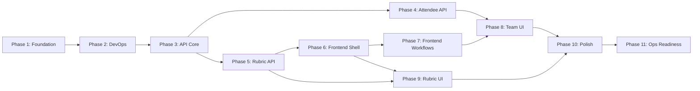

# HackerBoard — Execution Plan

> **MANDATORY**: Copilot MUST read this file before starting ANY implementation work.
> This is the single source of truth for project status, decisions, and problems.
>
> **How to update**: Check off tasks with `[x]`, mark blockers with `[!]`,
> add problems to the Problem Log, record decisions in the Decision Log,
> and update Session Handoff Notes at the end of each session.

---

## Legend

| Symbol | Meaning         |
| ------ | --------------- |
| `[ ]`  | Not started     |
| `[~]`  | In progress     |
| `[x]`  | Done            |
| `[!]`  | Blocked         |
| 🔴     | High priority   |
| 🟡     | Medium priority |
| 🟢     | Low priority    |

---

## Current Status

| Metric                  | Value                |
| ----------------------- | -------------------- |
| **Current Phase**       | Phase 1 — Foundation |
| **Last Updated**        | 2026-02-16           |
| **Days Remaining**      | 7                    |
| **Tasks Done**          | 0 / 120              |
| **API Endpoints**       | 0 / 15               |
| **Frontend Components** | 0 / 16               |
| **Tests Passing**       | 0                    |
| **Open Problems**       | 0                    |
| **Open Decisions**      | 1                    |

---

## Dependency Map

**Critical path**: P1 → P2 → P3 → P5 → P6 → P7 → P10 → P11

**Parallel tracks** (after P3):

- Track A: P4 (Attendee API) — can run alongside P5
- Track B: P5 (Rubric API) → P6 (Shell) → P7 (Workflows)
- P8 and P9 can start once their dependencies complete

---

## 7-Day Schedule

| Day | Focus               | Phases    | Target                                                       |
| --- | ------------------- | --------- | ------------------------------------------------------------ |
| 1   | Foundation + DevOps | P1 + P2   | ESM migration, Vitest, CI/CD, security headers, seed scripts |
| 2   | API Core            | P3        | Teams CRUD, Scores, Upload, Submissions (6 endpoints)        |
| 3   | Remaining API       | P4 + P5   | Attendees, Awards, Rubric parser + CRUD (9 endpoints)        |
| 4   | Frontend Shell      | P6        | SPA router, leaderboard, grading, theme, CSS                 |
| 5   | Core UI Workflows   | P7        | Score form, upload, admin review, awards, registration       |
| 6   | Management UI       | P8 + P9   | Team roster, attendee mgmt, team assign, rubric UI           |
| 7   | Polish + Ship       | P10 + P11 | Integration test, a11y, search, flags, prod deploy           |

---

## Phase 1 — Foundation 🔴

> **Goal**: Zero deprecated deps, secure baseline, ESM migration.
> **Depends on**: Nothing.
> **Definition of Done**: `npm audit` clean, all shared helpers use ESM,
> security headers in `staticwebapp.config.json`, `engines` pinned.

### 1.1 — Dependency Audit & Cleanup

- [x] Audit root `package.json` — flag deprecated transitive deps
- [x] Audit `api/package.json` — flag deprecated packages
- [x] Add npm `overrides` to force non-deprecated transitive deps
- [x] Run `npm audit` on both root and `api/` — resolve all findings
- [ ] Pin `"engines": { "node": ">=20.0.0" }` in root `package.json`
- [ ] Verify Azure Functions Extension Bundle range (`[4.*, 5.0.0)`)
- [ ] Confirm `@azure/data-tables` SDK is latest stable

### 1.2 — ESM Migration

- [ ] Add `"type": "module"` to `api/package.json`
- [ ] Convert `api/shared/auth.js` from CommonJS to ESM
- [ ] Convert `api/shared/tables.js` from CommonJS to ESM
- [ ] Convert `api/shared/errors.js` from CommonJS to ESM
- [ ] Verify all imports work with `swa start`

### 1.3 — Security Hardening

- [ ] Add `Content-Security-Policy` header in `staticwebapp.config.json`
- [ ] Add `Strict-Transport-Security` header (HSTS) in `globalHeaders`
- [ ] Confirm only GitHub auth provider enabled (Google/Twitter/AAD = 404)
- [ ] Confirm all error responses use standard error envelope (no stack leaks)

**Validation**: `npm audit` returns 0 high/critical. `swa start` launches
without errors. All `api/shared/*.js` files use `import`/`export`.

---

## Phase 2 — DevOps & Environment 🔴

> **Goal**: CI/CD, test infrastructure, local dev, seed data.
> **Depends on**: Phase 1.
> **Definition of Done**: `npm test` runs Vitest, GitHub Actions deploys on push,
> seed script populates local Azurite, `.env.example` documents all vars.

### 2.1 — Test Infrastructure

- [ ] Install Vitest as dev dependency in `api/`
- [ ] Create `api/vitest.config.js`
- [ ] Add `"test"` script to `api/package.json`
- [ ] Write smoke test that imports shared helpers

**Validation**: `cd api && npm test` passes.

### 2.2 — CI/CD Pipeline

- [ ] Create `.github/workflows/deploy-swa.yml`
- [ ] Stages: install → lint → test → deploy
- [ ] Use `Azure/static-web-apps-deploy@v1` action
- [ ] Pin all actions to `@v4` (upload/download-artifact)
- [ ] Add PR preview environment (SWA staging)

**Validation**: Push to branch triggers workflow; PR gets preview URL.

### 2.3 — Environment & Secrets

- [ ] Create `.env.example` listing all required variables
- [ ] Document local dev setup in README.md (SWA CLI + Azurite)
- [ ] Verify `swa start` works with `--api-location api`

### 2.4 — Data Seeding

- [ ] Create `scripts/seed-demo-data.js` (populates Table Storage)
- [ ] Support `--reset` flag to clear tables first
- [ ] Support `--teams N --attendees M` parameters
- [ ] Include default 105+25 rubric in seed data

**Validation**: `node scripts/seed-demo-data.js --reset` populates
Azurite tables; data visible in Storage Explorer.

---

## Phase 3 — API Core (Teams, Scores, Submissions) 🔴

> **Goal**: Core API — auth, Teams CRUD, scoring, submissions.
> **Depends on**: Phase 2.
> **Definition of Done**: All 6 endpoints return correct responses,
> tests pass, auth enforced on protected routes.

### 3.1 — Auth Helpers

- [ ] Write tests for `getClientPrincipal()` and `requireRole()`
- [ ] Update `api/shared/auth.js` if tests reveal issues
- [ ] Tests green

### 3.2 — Teams CRUD

- [ ] Write tests for `GET /api/teams`
- [ ] Write tests for `POST /api/teams` (admin only)
- [ ] Write tests for `PUT /api/teams` (admin only)
- [ ] Write tests for `DELETE /api/teams` (admin only)
- [ ] Implement `api/src/functions/teams.js` (Azure Functions v4)
- [ ] Tests green

### 3.3 — Scores

- [ ] Write tests for `GET /api/scores` (with/without team filter)
- [ ] Write tests for `POST /api/scores` (admin override)
- [ ] Implement `api/src/functions/scores.js`
- [ ] Tests green

### 3.4 — Upload & Submissions

- [ ] Write tests for `POST /api/upload` (valid, invalid, wrong team)
- [ ] Write tests for `GET /api/submissions` (admin only)
- [ ] Write tests for `POST /api/submissions/validate` (approve/reject)
- [ ] Implement `api/src/functions/upload.js`
- [ ] Implement `api/src/functions/submissions.js`
- [ ] Validate payload size limit (max 256 KB)
- [ ] Tests green

**Validation**: `npm test` in `api/` — all tests pass.
Manual test with `curl` against `swa start` confirms auth enforcement.

---

## Phase 4 — Attendee & Team Management API 🔴

> **Goal**: Attendees, bulk import, team assignment, awards.
> **Depends on**: Phase 3.
> **Definition of Done**: All endpoints return correct responses, tests pass.

### 4.1 — Attendees

- [ ] Write tests for `GET/POST/PUT /api/attendees/me`
- [ ] Write tests for `GET /api/attendees` (admin only)
- [ ] Implement `api/src/functions/attendees.js`
- [ ] Tests green

### 4.2 — Bulk Import (F9)

- [ ] Write tests for `POST /api/attendees/bulk` (valid CSV, duplicates)
- [ ] Implement `api/src/functions/attendees-bulk.js`
- [ ] Tests green

### 4.3 — Team Assignment (F10)

- [ ] Write tests for `POST /api/teams/assign` (Fisher-Yates, edge cases)
- [ ] Implement `api/src/functions/teams-assign.js`
- [ ] Tests green

### 4.4 — Awards (F4)

- [ ] Write tests for `GET/POST/PUT /api/awards`
- [ ] Implement `api/src/functions/awards.js`
- [ ] Tests green

**Validation**: `npm test` — all Phase 3+4 tests pass.

---

## Phase 5 — Rubric Engine API (F11) 🔴

> **Goal**: Markdown parser, CRUD, activation, default bootstrap.
> **Depends on**: Phase 3.
> **Definition of Done**: Parser handles well-formed and malformed markdown,
> CRUD works, activation swaps rubrics, default seeds on first use.

### 5.1 — Rubric Markdown Parser

- [ ] Write tests: extract categories + criteria + points
- [ ] Write tests: extract bonus items with points
- [ ] Write tests: extract grading scale with thresholds
- [ ] Write tests: error on malformed/incomplete markdown
- [ ] Implement `api/shared/rubricParser.js`
- [ ] Validate `baseTotal` matches sum of category max points
- [ ] Tests green

### 5.2 — Rubric CRUD & Activation

- [ ] Write tests for `GET /api/rubrics`
- [ ] Write tests for `POST /api/rubrics` (create from markdown)
- [ ] Write tests for `GET /api/rubrics/active`
- [ ] Write tests: activation deactivates previous rubric
- [ ] Implement `api/src/functions/rubrics.js`
- [ ] Tests green

### 5.3 — Default Rubric Bootstrap

- [ ] Create `src/data/defaultRubric.js` (105+25 model)
- [ ] Auto-seed default on first `/api/rubrics/active` if none exists
- [ ] Include in seed script (Phase 2.4)

**Validation**: `npm test` — all rubric tests pass. `GET /api/rubrics/active`
returns the default rubric on a fresh database.

---

## Phase 6 — Frontend Shell & Leaderboard 🔴

> **Goal**: SPA router, dashboard, leaderboard, grading, theme.
> **Depends on**: Phase 5 (rubric API for dynamic grading).
> **Definition of Done**: Dashboard loads, leaderboard renders with live data,
> theme toggle works, responsive across breakpoints.

### 6.1 — SPA Infrastructure

- [ ] Implement `src/app.js` — hash-based SPA router
- [ ] Implement `src/services/api.js` — fetch wrappers for all endpoints
- [ ] Implement `src/services/auth.js` — `/.auth/me` client helper
- [ ] Implement `src/services/rubric.js` — fetch/cache active rubric
- [ ] Create `src/styles/main.css` — CSS custom properties, responsive grid

### 6.2 — Navigation & Theme

- [ ] Implement `src/components/Navigation.js` — role-aware nav, theme toggle
- [ ] Implement theme system (light/dark, localStorage persist)
- [ ] Keyboard-operable with visible focus indicators

### 6.3 — Dashboard & Leaderboard (F2, F3)

- [ ] Implement `src/components/Leaderboard.js` — ranked table, expandable rows
- [ ] Implement champion spotlight — top-3 cards with grade badges
- [ ] Implement grading logic — rubric-driven grade calculation + tier badges
- [ ] Auto-refresh every 30 seconds
- [ ] Responsive: table on lg+, card fallback on sm

**Validation**: Open in browser — leaderboard renders seeded data,
theme toggle works, responsive at all breakpoints, keyboard navigable.

---

## Phase 7 — Frontend Workflows (F1, F4, F6, F7, F8) 🔴

> **Goal**: Score submission, upload, admin review, registration, awards.
> **Depends on**: Phase 6.
> **Definition of Done**: All workflows functional, form validation works,
> admin-only controls hidden from members.

### 7.1 — Score Submission Form (F1)

- [ ] Implement `src/components/ScoreSubmission.js`
- [ ] Dynamic categories/criteria from active rubric
- [ ] Category subtotal validation against rubric max
- [ ] Bonus toggles with auto-calculated points
- [ ] Submit creates pending submission via `/api/upload`

### 7.2 — JSON Upload (F6)

- [ ] Implement `src/components/UploadScores.js`
- [ ] Drag-and-drop + file browse
- [ ] Schema validation + preview before submit
- [ ] Team scope enforcement (own team only)

### 7.3 — Submission Status

- [ ] Implement `src/components/SubmissionStatus.js`
- [ ] Show pending/approved/rejected state for member's submissions

### 7.4 — Admin Review & Override (F8)

- [ ] Implement `src/components/AdminReviewQueue.js`
- [ ] Pending submissions with approve/reject + reason
- [ ] Implement `src/components/ManualOverride.js`
- [ ] Admin score correction workflow

### 7.5 — Registration (F7)

- [ ] Implement `src/components/Registration.js`
- [ ] Pre-fill GitHub username from `/.auth/me`
- [ ] Self-service profile update

### 7.6 — Awards (F4)

- [ ] Implement `src/components/Awards.js`
- [ ] Five award categories with team dropdown (admin assign)
- [ ] Award badges on leaderboard

**Validation**: Submit score as member → appears in admin queue →
approve → leaderboard updates. Upload JSON → preview → submit.
Awards assigned appear on leaderboard.

---

## Phase 8 — Team & Attendee Management UI 🔴

> **Goal**: Team rosters, attendee management, random assignment.
> **Depends on**: Phase 4 (API), Phase 7 (frontend shell).
> **Definition of Done**: Admin can bulk-import attendees, assign to teams,
> all users see team roster.

### 8.1 — Team Roster (F10)

- [ ] Implement `src/components/TeamRoster.js`
- [ ] Card/table grid of all teams + members
- [ ] Admin edit (move attendees between teams)
- [ ] Member read-only with own-team highlight

### 8.2 — Attendee Management (F9)

- [ ] Implement `src/components/AttendeeBulkEntry.js`
- [ ] Multi-line/CSV paste for name import
- [ ] Duplicate detection with merge prompt

### 8.3 — Team Assignment (F10)

- [ ] Implement `src/components/TeamAssignment.js`
- [ ] Team count input, Fisher-Yates shuffle preview
- [ ] Confirm/re-shuffle with confirmation dialog

**Validation**: Bulk import 20 attendees → assign to 4 teams →
roster shows balanced distribution → admin can reassign.

---

## Phase 9 — Rubric Management UI (F11) 🔴

> **Goal**: Admin rubric upload, preview, activation.
> **Depends on**: Phase 5 (API), Phase 6 (shell).
> **Definition of Done**: Admin uploads `.md` rubric, previews parsed
> result, activates it, score form + leaderboard update dynamically.

### 9.1 — Rubric Upload & Preview

- [ ] Implement `src/components/RubricUpload.js` — drag-and-drop `.md`
- [ ] Implement `src/components/RubricPreview.js` — parsed categories/criteria/points

### 9.2 — Rubric Activation & Archive

- [ ] Implement `src/components/RubricManager.js` — list + active indicator
- [ ] Activate/archive with confirmation dialog
- [ ] Verify F1 form and F2 leaderboard update on rubric switch

**Validation**: Upload rubric → preview → activate → score form
adapts to new categories/criteria. Old rubric archived.

---

## Phase 10 — Integration & Polish 🟡

> **Goal**: E2E tests, accessibility, search, notifications.
> **Depends on**: Phases 6–9.
> **Definition of Done**: Critical flows tested end-to-end, WCAG 2.2 AA
> audit passes, search works, notifications functional.

### 10.1 — Integration Tests

- [ ] Test flow: login → submit score → admin approve → leaderboard
- [ ] Test flow: rubric upload → activate → score form adapts
- [ ] Test flow: bulk import → team assignment → roster display

### 10.2 — Accessibility Audit

- [ ] Run axe-core on all pages
- [ ] Manual keyboard navigation check
- [ ] Verify ARIA labels on icon-only controls
- [ ] Verify contrast in both themes

### 10.3 — Responsive Check

- [ ] Verify sm/md/lg/xl breakpoints
- [ ] Touch target sizes on mobile

### 10.4 — Search & Notifications

- [ ] Search bar in navbar (filter teams/attendees)
- [ ] Notification area (submission status, award alerts)
- [ ] Admin pending count badge
- [ ] Persist dismissed notifications in localStorage

**Validation**: All integration tests pass. axe-core reports 0 violations.
Search filters correctly. Notifications appear and dismiss.

---

## Phase 11 — Operational Readiness 🟡

> **Goal**: Production-ready for live event.
> **Depends on**: Phase 10.
> **Definition of Done**: Deployed to production SWA, monitoring active,
> feature flags work, cleanup scripts ready.

### 11.1 — Feature Flags

- [ ] Implement flags: `SUBMISSIONS_ENABLED`, `LEADERBOARD_LOCKED`,
      `REGISTRATION_OPEN`, `AWARDS_VISIBLE`, `RUBRIC_UPLOAD_ENABLED`
- [ ] API returns 503 when feature disabled
- [ ] Frontend hides/disables UI based on flag state
- [ ] Admin toggle for each flag

### 11.2 — Monitoring

- [ ] Enable Application Insights for managed Functions
- [ ] Add structured logging (request ID, user, operation, duration)
- [ ] Client-side telemetry (page views, errors)

### 11.3 — Production Deploy & Smoke Test

- [ ] Deploy to `purple-bush-029df9903.4.azurestaticapps.net`
- [ ] Smoke test: login → leaderboard loads → submit score → approve
- [ ] Verify SWA role invitations work for admin users

### 11.4 — Post-Event Prep

- [ ] Create `scripts/cleanup-app-data.js` (purge tables)
- [ ] Support `--confirm` flag for safety
- [ ] Document admin invitation + rotation procedures

**Validation**: Production app accessible, all features work,
monitoring shows data, feature flags toggle correctly.

---

## Phase 12 — Future Enhancements 🟢

> Nice-to-have items for post-sprint iterations.

- [ ] Real-time updates via WebSocket or Server-Sent Events
- [ ] Export leaderboard to CSV/PDF
- [ ] Rubric template gallery (share between events)
- [ ] Rubric versioning with diff view
- [ ] Historical score comparison across events
- [ ] Multi-language / i18n support
- [ ] Custom domain with SSL certificate
- [ ] OpenAPI / Swagger documentation
- [ ] Comprehensive Playwright E2E suite

---

## Decision Log

> Record architectural and design decisions here.
> Format: `| ID | Date | Decision | Rationale | Status |`

| ID  | Date       | Decision                            | Rationale                                                                        | Status                   |
| --- | ---------- | ----------------------------------- | -------------------------------------------------------------------------------- | ------------------------ |
| D1  | 2026-02-16 | Use ESM modules throughout          | `copilot-instructions.md` mandates ESM; Functions v4 supports it; fresh codebase | **Approved**             |
| D2  | 2026-02-16 | Use Vitest for all testing          | Per `copilot-instructions.md`; fast, ESM-native, no config overhead              | **Approved**             |
| D3  | 2026-02-16 | Vanilla JS SPA with hash router     | Per PRD — no framework; single `index.html`; minimal build tooling               | **Approved**             |
| D4  | 2026-02-16 | GitHub username ↔ Attendee mapping  | Self-service claim (Option A from PRD F7/F10) — user claims on first login       | **Pending confirmation** |
| D5  | 2026-02-16 | Defer Playwright E2E to post-sprint | 7-day sprint prioritizes unit + integration tests; E2E in week 2                 | **Approved**             |

<!-- TEMPLATE for new decisions:
| D{N} | YYYY-MM-DD | {decision} | {rationale} | **{status}** |
-->

---

## Problem Log

> Track issues, blockers, and their resolution.
> Format: `| ID | Date | Phase | Problem | Impact | Status | Resolution |`

| ID  | Date | Phase | Problem                | Impact | Status | Resolution |
| --- | ---- | ----- | ---------------------- | ------ | ------ | ---------- |
| —   | —    | —     | No problems logged yet | —      | —      | —          |

<!-- TEMPLATE for new problems:
| P{N} | YYYY-MM-DD | P{phase} | {description} | {High/Med/Low} | {Open/Resolved/Mitigated} | {what fixed it} |
-->

---

## Risk Register

| ID  | Risk                                             | Likelihood | Impact | Mitigation                                                                          |
| --- | ------------------------------------------------ | ---------- | ------ | ----------------------------------------------------------------------------------- |
| R1  | 7-day timeline too tight for full F1-F11         | Medium     | High   | Scope cut: defer P10.4 (search/notifications) and P11.4 (cleanup scripts) if behind |
| R2  | Rubric parser edge cases cause scoring bugs      | Medium     | High   | Extensive test cases for malformed markdown; validate `baseTotal` matches sum       |
| R3  | SWA managed Functions cold start affects UX      | Low        | Medium | Lightweight functions; keep-alive ping from frontend                                |
| R4  | CommonJS → ESM migration breaks shared helpers   | Low        | Medium | Phase 1 migration with immediate `swa start` validation                             |
| R5  | Table Storage query limitations for leaderboard  | Low        | Medium | Denormalize scores for fast reads; avoid cross-table joins                          |
| R6  | Auth flow differences between local dev and prod | Medium     | Medium | Test auth helpers with mocked headers; deploy early to catch issues                 |

---

## Session Handoff Notes

> Each Copilot session MUST update this section before ending.
> This ensures the next session has full context.

### Session: 2026-02-16 — Planning

**What was done**:

- Researched and ported 8 instructions + 3 skills from azure-agentic-infraops
- Eliminated all npm deprecation warnings (0 warnings, 0 vulnerabilities)
- Analyzed full codebase state: infra deployed, no app code, detailed PRD/API spec
- Created this execution plan replacing the old backlog

**What's next**:

- Start Phase 1.1: Pin `engines` in root `package.json`
- Start Phase 1.2: ESM migration of `api/shared/*.js`
- Start Phase 1.3: Add CSP and HSTS headers

**Open questions**:

- Decision D4: Confirm attendee mapping approach (self-service claim vs admin pre-fill)

**Known issues**:

- `api/shared/*.js` files use CommonJS — must convert before any new API work

<!-- TEMPLATE for new session entries:

### Session: YYYY-MM-DD — {Focus Area}

**What was done**:

- {bullet list of completed work}

**What's next**:

- {bullet list of immediate next tasks}

**Open questions**:

- {any unresolved items}

**Known issues**:

- {any problems discovered}

-->

---

## Test & Validation Matrix

> Every phase has validation criteria. This matrix tracks pass/fail.

| Phase | Validation                                                   | Status     |
| ----- | ------------------------------------------------------------ | ---------- |
| P1    | `npm audit` returns 0 high/critical                          | **Passed** |
| P1    | `swa start` launches without errors after ESM migration      | Not run    |
| P1    | All `api/shared/*.js` use `import`/`export`                  | Not done   |
| P2    | `cd api && npm test` passes (Vitest)                         | Not run    |
| P2    | GitHub Actions workflow triggers on push                     | Not run    |
| P2    | `node scripts/seed-demo-data.js --reset` populates Azurite   | Not run    |
| P3    | All API core tests pass (`npm test`)                         | Not run    |
| P3    | `curl` confirms auth enforcement on protected routes         | Not run    |
| P4    | All attendee/team/awards tests pass                          | Not run    |
| P5    | Rubric parser handles well-formed + malformed markdown       | Not run    |
| P5    | `GET /api/rubrics/active` returns default rubric on fresh DB | Not run    |
| P6    | Leaderboard renders seeded data in browser                   | Not run    |
| P6    | Theme toggle works + persists across reload                  | Not run    |
| P6    | Responsive at sm/md/lg/xl breakpoints                        | Not run    |
| P7    | Submit score → admin approve → leaderboard updates           | Not run    |
| P7    | Upload JSON → preview → submit works                         | Not run    |
| P8    | Bulk import → team assignment → roster displays              | Not run    |
| P9    | Upload rubric → preview → activate → form adapts             | Not run    |
| P10   | axe-core reports 0 violations                                | Not run    |
| P10   | All integration tests pass                                   | Not run    |
| P11   | Production deploy + smoke test passes                        | Not run    |
| P11   | Feature flags toggle correctly                               | Not run    |

---

## References

- [Product Requirements (PRD)](./app-prd.md) — F1-F11 feature definitions
- [API Specification](./api-spec.md) — All endpoint contracts
- [App Design](./app-design.md) — UI/UX, component model, responsive strategy
- [Scaffold Guide](./app-scaffold.md) — Folder structure, dependencies, helpers
- [Handoff Checklist](./app-handoff-checklist.md) — Infra wiring steps
- [Copilot Instructions](../.github/copilot-instructions.md) — Coding standards
