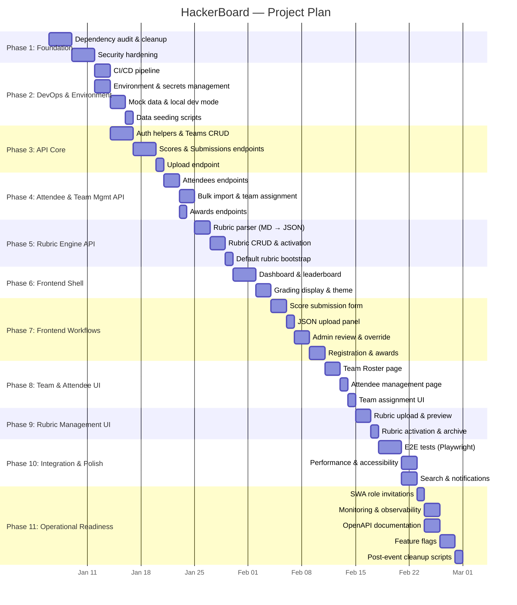

# HackerBoard App — Project Plan

> Living project plan, roadmap, and task tracker for the HackerBoard application.
> Phases are ordered by dependency — each phase builds on the previous.
> Check off tasks as they are completed; add new items at the end of the
> relevant phase.

---

## Legend

| Symbol | Meaning         |
| ------ | --------------- |
| `[ ]`  | Not started     |
| `[~]`  | In progress     |
| `[x]`  | Done            |
| `[!]`  | Blocked         |
| 🔴     | High priority   |
| 🟡     | Medium priority |
| 🟢     | Low priority    |

---

## Project Gantt Chart

---

## Phase 1 — Foundation (Dependency Hygiene & Security) 🔴

> **Goal**: Zero deprecated dependencies; all known security findings
> resolved before feature work begins.
> **Depends on**: Nothing — this is the starting point.

### 1.1 — Dependency Audit & Cleanup

- [ ] Audit `api/package.json` — flag packages with npm deprecation
      notices or beyond maintenance LTS
- [ ] Audit `package.json` (frontend) — same check
- [ ] Replace deprecated packages with supported alternatives
- [ ] Pin `"engines"` in both `package.json` files to Node.js 20 LTS
- [ ] Verify Azure Functions Extension Bundle range (`[4.*, 5.0.0)`)
      is current; update if a new stable range is available
- [ ] Confirm `@azure/data-tables` SDK version is latest stable
- [ ] Run `npm audit` on both `api/` and root; resolve all
      high/critical advisories

### 1.2 — Security Hardening

- [ ] Audit `staticwebapp.config.json` — confirm only GitHub provider
      is enabled (Google/Twitter/AAD blocked with 404)
- [ ] Add `Content-Security-Policy` header in `globalHeaders`
- [ ] Add `Strict-Transport-Security` header (HSTS) in `globalHeaders`
- [ ] Validate all API functions enforce authentication before any
      data access (no anonymous fallback paths)
- [ ] Verify managed identity is used for Table Storage access
      (no shared-key or connection-string patterns)
- [ ] Add input validation/sanitization on all user-supplied fields
- [ ] Ensure JSON upload endpoint validates payload size (max 256 KB)
- [ ] Add rate limiting guidance or SWA-native throttling config
- [ ] Review CORS settings — ensure no wildcard origins
- [ ] Confirm all error responses use the standard error envelope
      (no stack traces or internal details leak)

---

## Phase 2 — DevOps & Environment Setup 🔴

> **Goal**: CI/CD pipeline, local dev environment, mock data, and secrets
> management — the development foundation.
> **Depends on**: Phase 1 (clean dependencies, secure baseline).

### 2.1 — CI/CD Pipeline

- [ ] Create `.github/workflows/deploy-swa.yml` GitHub Actions workflow
- [ ] Workflow stages: install → lint → test → build → deploy
- [ ] Use `Azure/static-web-apps-deploy@v1` action
- [ ] Configure deployment token as repository secret
- [ ] Add PR preview environment (SWA staging environments)
- [ ] Add post-deploy smoke test step (curl health endpoint)

### 2.2 — Environment & Secrets Management

- [ ] Document all required secrets: `GITHUB_CLIENT_ID`,
      `GITHUB_CLIENT_SECRET`, Storage account connection info
- [ ] Add `.env.example` file listing all environment variables
- [ ] Configure SWA application settings via Azure Portal or CLI
- [ ] Verify local dev uses `swa start` with `--api-location api`
      and Azurite for local Table Storage emulation
- [ ] Add secrets rotation guidance for post-event cleanup

### 2.3 — Mock Data & Local Dev Mode

- [ ] Create `src/data/leaderboard.mock.ts` with realistic sample data
- [ ] Create mock data files for teams, attendees, scores, submissions,
      awards, rubrics
- [ ] Add `USE_MOCK_DATA` environment flag to bypass API calls
- [ ] Implement `services/mockApiClient.ts` that returns mock data
- [ ] Document local dev setup in README.md (SWA CLI + mock mode)

### 2.4 — Data Seeding Scripts

- [ ] Create `scripts/seed-demo-data.js` that populates Table Storage
      with sample teams, attendees, scores, and the default rubric
- [ ] Support `--reset` flag to clear tables before seeding
- [ ] Support `--teams N --attendees M` parameters for variable sizes
- [ ] Document seed script usage in README.md

---

## Phase 3 — API Core (Auth, Teams, Scores, Submissions) 🔴

> **Goal**: Core API layer — authentication helpers, Teams CRUD, scoring,
> and submission pipeline. All test-first.
> **Depends on**: Phase 2 (CI/CD, test infrastructure, mock data).

### 3.1 — Auth Helpers & Teams CRUD

- [ ] **Test first**: Write tests for `getClientPrincipal()` and
      `requireRole()` helpers
- [ ] Implement `api/shared/auth.js`
- [ ] **Test first**: Write tests for `GET /api/teams`, `POST /api/teams`
- [ ] Implement Teams CRUD functions
- [ ] **Test first**: Write tests for `PUT /api/teams`, `DELETE /api/teams`
- [ ] Implement remaining Teams endpoints
- [ ] All tests green before proceeding

### 3.2 — Scores & Submissions

- [ ] **Test first**: `GET /api/scores` with and without filters
- [ ] Implement Scores endpoints
- [ ] **Test first**: `POST /api/upload` with valid/invalid payloads,
      team scope violation
- [ ] Implement Upload endpoint
- [ ] **Test first**: `GET /api/submissions`, `POST /api/submissions/validate`
- [ ] Implement Submissions + Validate endpoints
- [ ] All tests green

---

## Phase 4 — Attendee & Team Management API 🔴

> **Goal**: Attendees, bulk import, random team assignment, and awards
> endpoints.
> **Depends on**: Phase 3 (Teams CRUD and auth helpers).

### 4.1 — Attendees & Awards

- [ ] **Test first**: `GET/POST /api/attendees/me`, `GET /api/attendees`
- [ ] Implement Attendees endpoints
- [ ] **Test first**: `POST/GET /api/awards`
- [ ] Implement Awards endpoints
- [ ] All tests green

### 4.2 — Bulk Import & Team Assignment

- [ ] **Test first**: `POST /api/attendees/bulk` with valid/invalid payloads
- [ ] Implement bulk attendee import endpoint (F9)
- [ ] **Test first**: `POST /api/teams/assign` (Fisher-Yates shuffle,
      boundary cases)
- [ ] Implement random team assignment endpoint (F10)
- [ ] All tests green

### 4.3 — GitHub Username ↔ Attendee Mapping 🟡

> **Decision required**: Finalize mapping approach (self-service claim,
> admin pre-fill, or hybrid). See PRD F10 for options.

- [ ] Finalize mapping approach (A / B / C)
- [ ] Update `POST /api/attendees/me` to support "claim" flow if
      Option A or C is chosen
- [ ] Add admin override endpoint to reassign GitHub ↔ Attendee links
- [ ] Update F7 acceptance criteria in app-prd.md once decided

---

## Phase 5 — Rubric Engine API (F11) 🔴

> **Goal**: Markdown rubric parser, CRUD endpoints, activation logic, and
> default rubric bootstrap.
> **Depends on**: Phase 3 (Table Storage patterns, auth helpers).

### 5.1 — Rubric Markdown Parser

- [ ] **Test first**: Parser extracts categories, criteria, points from
      well-formed rubric Markdown
- [ ] **Test first**: Parser extracts bonus items with points and type
- [ ] **Test first**: Parser extracts grading scale with thresholds
- [ ] **Test first**: Parser returns errors for malformed/incomplete Markdown
- [ ] Implement `api/shared/rubricParser.js`
- [ ] Validate computed `baseTotal` matches sum of category max points
- [ ] All parser tests green

### 5.2 — Rubric CRUD & Activation

- [ ] **Test first**: `GET /api/rubrics` returns list of rubrics
- [ ] **Test first**: `POST /api/rubrics` creates rubric from Markdown
- [ ] **Test first**: `GET /api/rubrics/active` returns active rubric
- [ ] **Test first**: Activation deactivates the previous rubric
- [ ] Implement rubric API functions
- [ ] All tests green

### 5.3 — Default Rubric Bootstrap

- [ ] Create `src/data/defaultRubric.js` with the 105+25 model from
      `microhack/facilitator/scoring-rubric.md`
- [ ] On first API call to `/api/rubrics/active`, if no rubric exists,
      seed the default rubric to the Rubrics table
- [ ] Include default rubric in data seeding script (Phase 2.4)

---

## Phase 6 — Frontend Shell & Leaderboard 🔴

> **Goal**: Dashboard, leaderboard table, grading display, theme system.
> All rubric-driven.
> **Depends on**: Phase 5 (active rubric API for dynamic grading).

### 6.1 — Dashboard & Leaderboard (F2)

- [ ] **Test first**: Render `LeaderboardTable` with mock data
- [ ] Implement Dashboard page with leaderboard table
- [ ] **Test first**: ChampionCard renders top-3 correctly
- [ ] Implement ChampionCard and StatCard components
- [ ] Fetch active rubric on app initialization (RubricContext)
- [ ] All tests green

### 6.2 — Grading Display & Theme (F3)

- [ ] **Test first**: Grade badge renders correct tier and color from
      active rubric's grading scale
- [ ] Implement grading display logic (rubric-driven, not hardcoded)
- [ ] **Test first**: Theme toggle persists to localStorage
- [ ] Implement theme system (light/dark)
- [ ] All tests green

---

## Phase 7 — Frontend Workflows (F1, F4, F6, F7, F8) 🔴

> **Goal**: Score submission form, JSON upload, admin review queue,
> registration, and awards panel.
> **Depends on**: Phase 6 (frontend shell, rubric context).

### 7.1 — Score Submission Form (F1)

- [ ] **Test first**: ScoreEntryForm dynamically renders categories and
      criteria from active rubric
- [ ] **Test first**: Form validates category subtotals against rubric max
- [ ] Implement F1 score submission form
- [ ] All tests green

### 7.2 — JSON Upload (F6)

- [ ] **Test first**: JsonUploadPanel validates schema against active rubric
- [ ] Implement F6 JSON upload panel with drag-and-drop
- [ ] All tests green

### 7.3 — Admin Review & Override (F8)

- [ ] **Test first**: AdminReviewQueue renders pending items
- [ ] Implement F8 admin queue and manual override
- [ ] All tests green

### 7.4 — Registration & Awards (F7, F4)

- [ ] **Test first**: AttendeeProfileForm pre-fills GitHub username
- [ ] Implement F7 registration form
- [ ] **Test first**: AwardsPanel assignment and display using rubric awards
- [ ] Implement F4 awards panel (rubric-driven award categories)
- [ ] All tests green

---

## Phase 8 — Team & Attendee Management UI 🔴

> **Goal**: Team Roster, attendee management, and team assignment UI.
> **Depends on**: Phase 7 (core frontend workflows complete), Phase 4
> (attendee and team assignment API).

### 8.1 — Team Roster Page

- [ ] **Test first**: TeamRoster page renders team grid
- [ ] Implement Team Roster page
- [ ] Admin edit controls for attendee moves between teams
- [ ] Member read-only view with own-team highlight
- [ ] All tests green

### 8.2 — Attendee Management Page (F9)

- [ ] **Test first**: Admin attendee entry form creates records
- [ ] Implement Attendee Management page with multi-line/CSV paste
- [ ] Duplicate detection by name with merge prompt
- [ ] All tests green

### 8.3 — Team Assignment UI (F10)

- [ ] **Test first**: Random assignment produces balanced teams
- [ ] Implement team assignment UI with shuffle preview
- [ ] Implement confirm/re-shuffle with confirmation dialog
- [ ] All tests green

---

## Phase 9 — Rubric Management UI (F11) 🔴

> **Goal**: Admin rubric upload, preview, and activation interface.
> **Depends on**: Phase 5 (rubric API), Phase 6 (frontend shell).

### 9.1 — Rubric Upload & Preview

- [ ] **Test first**: RubricUpload accepts `.md` file drag-and-drop
- [ ] **Test first**: RubricPreview renders parsed categories, criteria,
      points, and grading scale
- [ ] Implement drag-and-drop upload zone
- [ ] Implement preview panel with category/criteria/points breakdown
- [ ] All tests green

### 9.2 — Rubric Activation & Archive

- [ ] **Test first**: RubricManager lists rubrics with active indicator
- [ ] Implement activate/archive controls with confirmation dialog
- [ ] Implement rubric history list (name, event, date, active status)
- [ ] Verify score entry form (F1) and leaderboard (F2) update when
      rubric is switched
- [ ] All tests green

---

## Phase 10 — Integration, E2E & Polish 🟡

> **Goal**: End-to-end testing, performance validation, accessibility
> audit, and remaining UI polish.
> **Depends on**: Phases 6–9 (all frontend features complete).

### 10.1 — End-to-End Tests

- [ ] Write E2E tests (Playwright or Cypress) for critical flows:
      login → submit score → admin approve → leaderboard updates
- [ ] Write E2E test for rubric upload → activate → score form updates
- [ ] Write E2E test for attendee bulk entry → team assignment → roster
- [ ] All E2E tests green

### 10.2 — Performance & Accessibility

- [ ] Performance test: confirm < 2s page load, < 500ms API response
- [ ] Accessibility audit (axe-core automated + manual keyboard check)
- [ ] Responsive check across sm/md/lg/xl breakpoints
- [ ] Final security scan (`npm audit`, dependency review)

### 10.3 — Search & Notifications UI

- [ ] Implement search bar in navbar (filter teams/attendees by name)
- [ ] Implement notification area (submission status, award announcements)
- [ ] Add notification badge count for admin (pending submissions)
- [ ] Persist dismissed notifications in localStorage

---

## Phase 11 — Operational Readiness 🟡

> **Goal**: Monitoring, documentation, feature flags, and cleanup —
> everything for running the app at a live event.
> **Depends on**: Phase 10 (app is functionally complete and tested).

### 11.1 — SWA Role Invitation Workflow

- [ ] Document how to invite admins via Azure Portal
      (SWA → Role Management → Invite)
- [ ] Create a pre-event checklist for facilitator role setup
- [ ] Add `scripts/invite-admins.sh` helper or document manual steps
- [ ] Test that invited users receive the `admin` role after login

### 11.2 — Monitoring & Observability

- [ ] Enable Application Insights for managed Functions
- [ ] Add client-side telemetry (page views, errors)
- [ ] Add structured logging in API functions (request ID, user,
      operation, duration)
- [ ] Create Azure Monitor alert for API error rate > 5%
- [ ] Create dashboard: active users, submissions/hour, API latency

### 11.3 — OpenAPI / Swagger Documentation

- [ ] Generate OpenAPI 3.0 spec from API endpoint definitions
- [ ] Add `/api/docs` route serving Swagger UI
- [ ] Include request/response examples from `api-spec.md`
- [ ] Add schema validation middleware based on OpenAPI spec

### 11.4 — Feature Flags

- [ ] Add `featureFlags` section to SWA app settings or a config table
- [ ] Implement flags: `SUBMISSIONS_ENABLED`, `LEADERBOARD_LOCKED`,
      `REGISTRATION_OPEN`, `AWARDS_VISIBLE`, `RUBRIC_UPLOAD_ENABLED`
- [ ] Admin panel toggle for each flag
- [ ] API respects flags (returns 503 when feature is disabled)
- [ ] Frontend hides/disables UI surfaces based on flag state
- [ ] Facilitator can lock leaderboard during curveball challenge

### 11.5 — Post-Event Cleanup

- [ ] Create `scripts/cleanup-app-data.js` to purge all 6 tables
- [ ] Support `--confirm` flag for safety
- [ ] Remove PII (attendee names, GitHub usernames) from Table Storage
- [ ] Revoke SWA role invitations for event-specific admins
- [ ] Rotate `GITHUB_CLIENT_SECRET` after event
- [ ] Document retention policy (event + 30 days per PRD NFR)

---

## Phase 12 — Future Enhancements 🟢

> Nice-to-have items for post-MVP iterations.

- [ ] Real-time leaderboard updates via WebSocket or Server-Sent Events
- [ ] Export leaderboard to CSV/PDF
- [ ] Rubric template marketplace / gallery (share rubrics between events)
- [ ] Rubric versioning with diff view
- [ ] Attendee photo upload (GitHub avatar fallback)
- [ ] Historical score comparison across events
- [ ] Multi-language / i18n support
- [ ] Custom domain with SSL certificate

---

## References

- [Product Requirements (PRD)](./app-prd.md)
- [API Specification](./api-spec.md)
- [App Design](./app-design.md)
- [Scaffold Guide](./app-scaffold.md)
- [Handoff Checklist](./app-handoff-checklist.md)
- [Scoring Rubric](../../../microhack/facilitator/scoring-rubric.md)
