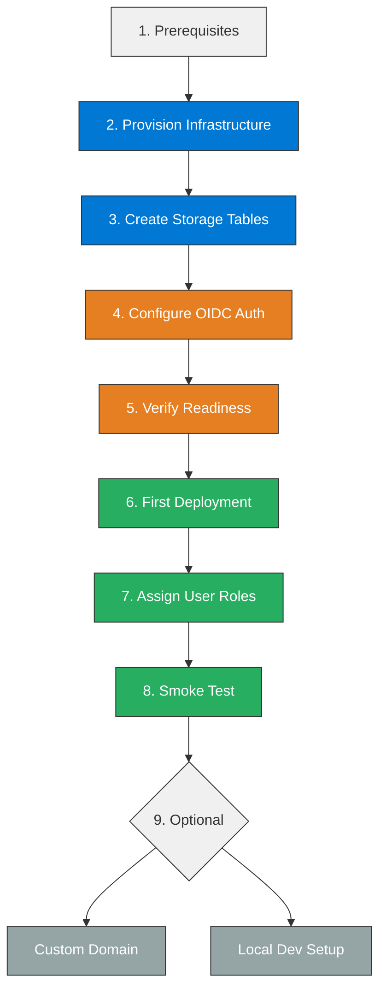
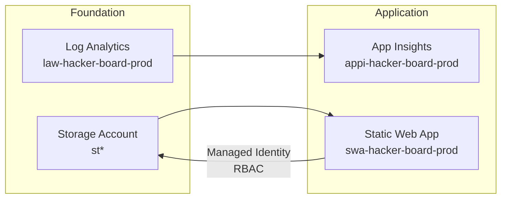
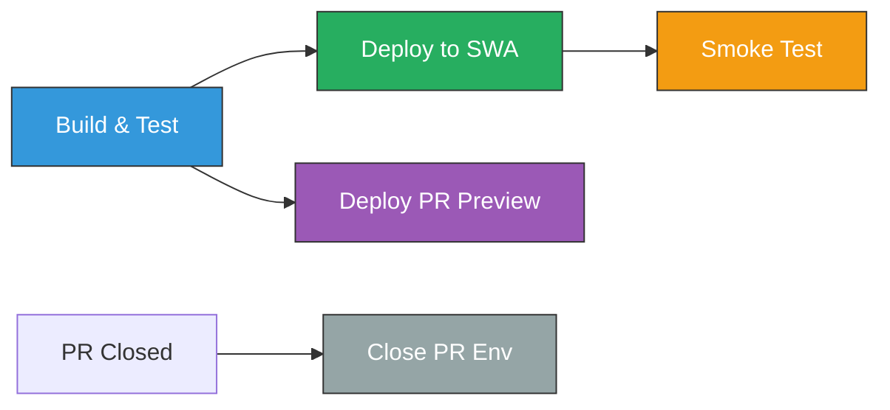

# HackerBoard Deployment Guide


> End-to-end guide for deploying HackerBoard — from Azure infrastructure provisioning through CI/CD to production smoke testing.

## Deployment Flow



## Prerequisites

| Requirement        | Version / Notes                        |
| ------------------ | -------------------------------------- |
| Azure subscription | Contributor access to a resource group |
| Azure CLI          | `az login` authenticated               |
| Bicep CLI          | Installed via `az bicep install`       |
| GitHub CLI         | `gh auth login` authenticated          |
| Node.js            | 20+                                    |
| PowerShell         | 7+ (for `deploy.ps1`)                  |

---

## Step 1 — Provision Azure Infrastructure

Two options: the **Deploy to Azure** button for 1-click provisioning, or the
**deploy script** for full control over parameters and phased deployment.

### Option A — Deploy to Azure Button

[](https://portal.azure.com/#create/Microsoft.Template/uri/https%3A%2F%2Fraw.githubusercontent.com%2Fjonathan-vella%2Fhacker-board%2Fmain%2Finfra%2Fazuredeploy.json)

This deploys via the pre-compiled ARM template. Fill in the required parameters
(`costCenter`, `technicalContact`) in the portal form.

### Option B — Deploy Script (Recommended)

```powershell
cd infra

# Full deployment (foundation + application phases)
./deploy.ps1 -CostCenter "microhack" -TechnicalContact "you@contoso.com"

# Preview changes first (what-if)
./deploy.ps1 -WhatIf -CostCenter "microhack" -TechnicalContact "you@contoso.com"

# Link to GitHub repo during provisioning
./deploy.ps1 \
  -CostCenter "microhack" \
  -TechnicalContact "you@contoso.com" \
  -RepositoryUrl "https://github.com/jonathan-vella/hacker-board"
```

<details>
<summary>Deploy script parameters</summary>

| Parameter           | Default                | Description                           |
| ------------------- | ---------------------- | ------------------------------------- |
| `ResourceGroupName` | `rg-hacker-board-prod` | Target resource group                 |
| `Location`          | `westeurope`           | Azure region                          |
| `Environment`       | `prod`                 | `dev`, `staging`, or `prod`           |
| `CostCenter`        | _(required)_           | Cost center code for tagging          |
| `TechnicalContact`  | _(required)_           | Contact email for tagging             |
| `RepositoryUrl`     | _(empty)_              | GitHub repo URL for SWA linkage       |
| `Phase`             | `all`                  | `all`, `foundation`, or `application` |
| `WhatIf`            | `false`                | Preview without deploying             |

</details>

### What Gets Deployed



| Resource             | Name Pattern               | SKU          |
| -------------------- | -------------------------- | ------------ |
| Resource Group       | `rg-hacker-board-{env}`    | —            |
| Log Analytics        | `law-{project}-{env}`      | PerGB2018    |
| Storage Account      | `st{project}{env}{suffix}` | Standard_LRS |
| Application Insights | `appi-{project}-{env}`     | —            |
| Static Web App       | `swa-{project}-{env}`      | Standard     |

The Bicep templates use [Azure Verified Modules](https://aka.ms/avm) and
automatically configure:

- System-assigned managed identity on the SWA
- Storage Table Data Contributor RBAC for the SWA identity
- App settings for Application Insights and Storage Account name

---

## Step 2 — Create Storage Tables

The storage account is provisioned by Bicep, but tables must be created
separately (Azure Table Storage does not support table creation via Bicep).

```bash
# Replace with your actual storage account name from deployment output
STORAGE_ACCOUNT="<storage-account-name>"

for TABLE in Teams Attendees Scores Submissions Awards Rubrics; do
  az storage table create \
    --name "$TABLE" \
    --account-name "$STORAGE_ACCOUNT" \
    --auth-mode login
done
```

Verify:

```bash
az storage table list --account-name "$STORAGE_ACCOUNT" --auth-mode login -o table
```

---

## Step 3 — Configure OIDC Deployment Auth

The CI/CD workflow uses OIDC (identity tokens) instead of long-lived secrets.
Azure SWA defaults to **DeploymentToken** auth policy, which rejects OIDC
deploys. You must switch it to **GitHub** once after initial provisioning.

> **Why can't Bicep do this?** The ARM/Bicep schema does not expose
> `deploymentAuthPolicy` as a writable property. The only programmatic route is
> an `az rest` PATCH that sends both the policy change and a GitHub PAT
> (`repositoryToken`) in the same request body so Azure can verify repo access.

### Option A — Setup Script (Recommended)

```bash
# Create a GitHub PAT with "repo" scope, then:
GITHUB_TOKEN="ghp_..." \
  ./scripts/configure-swa-auth.sh \
    --rg-name rg-hacker-board-prod
```

The script verifies the change and exits with an error if it fails.
Run `./scripts/configure-swa-auth.sh --help` for all options.

### Option B — Azure Portal

1. Navigate to your Static Web App in the Azure Portal
2. Go to **Settings** → **Configuration** → **Deployment configuration**
3. Set **Deployment authorization policy** to **GitHub**
4. Save

### Option C — Direct CLI

```bash
SWA_NAME="swa-hacker-board-prod"
RG_NAME="rg-hacker-board-prod"
SUB_ID="$(az account show --query id -o tsv)"
GITHUB_TOKEN="ghp_..."   # PAT with repo scope

az rest --method PATCH \
  --url "https://management.azure.com/subscriptions/${SUB_ID}/resourceGroups/${RG_NAME}/providers/Microsoft.Web/staticSites/${SWA_NAME}?api-version=2024-04-01" \
  --body "{
    \"properties\": {
      \"deploymentAuthPolicy\": \"GitHub\",
      \"repositoryToken\": \"${GITHUB_TOKEN}\",
      \"repositoryUrl\": \"https://github.com/jonathan-vella/hacker-board\",
      \"branch\": \"main\"
    }
  }"
```

---

## Step 4 — Verify Deployment Readiness

With OIDC auth the workflow authenticates using a GitHub-minted identity token
— no long-lived deployment token secret is required. Verify the setup:

```bash
SWA_NAME="swa-hacker-board-prod"
RG_NAME="rg-hacker-board-prod"
SUB_ID="$(az account show --query id -o tsv)"

# Confirm deployment auth policy is GitHub
az rest --method GET \
  --url "https://management.azure.com/subscriptions/${SUB_ID}/resourceGroups/${RG_NAME}/providers/Microsoft.Web/staticSites/${SWA_NAME}?api-version=2024-04-01" \
  --query "properties.{policy:deploymentAuthPolicy, provider:provider, hostname:defaultHostname}" \
  -o table
```

Expected output: `policy = GitHub`, `provider = GitHub`.

> **Note on SWA hostname:** The hostname (e.g.,
> `happy-pond-04878d603.4.azurestaticapps.net`) is generated once at SWA
> creation time and **stays stable** across redeployments. It only changes if
> you delete and recreate the resource. For a branded URL, add a custom domain
> (see [Optional — Custom Domain](#optional--custom-domain)).

---

## Step 5 — First Deployment

Push to `main` or trigger the workflow manually:

```bash
# Manual trigger
gh workflow run "CI/CD" --repo jonathan-vella/hacker-board

# Or push a commit
git push origin main
```

The CI/CD workflow runs five jobs:



| Job                   | Triggers On             | Purpose                                       |
| --------------------- | ----------------------- | --------------------------------------------- |
| **Build & Test**      | push, PR, manual        | `npm ci`, Vitest (API + UI), `npm audit`      |
| **Deploy**            | push to `main`, manual  | OIDC auth → `Azure/static-web-apps-deploy@v1` |
| **Smoke Test**        | after successful deploy | Health check + API reachability               |
| **Deploy PR Preview** | PR opened/updated       | Staging environment for the PR                |
| **Close PR Env**      | PR closed               | Tears down the staging environment            |

Monitor the run:

```bash
gh run watch --repo jonathan-vella/hacker-board
```

---

## Step 6 — Assign User Roles

HackerBoard uses two custom roles enforced by `staticwebapp.config.json`:

| Role     | Access                                                                |
| -------- | --------------------------------------------------------------------- |
| `admin`  | Full access — manage teams, scores, awards, rubrics, attendees, flags |
| `member` | Submit scores for their own team via JSON upload                      |

All authenticated users (without a specific role) can view the
leaderboard, awards, and register as attendees.

### Invite via CLI

```bash
SWA_NAME="swa-hacker-board-prod"
RG_NAME="rg-hacker-board-prod"
DOMAIN="<your-swa-hostname>.azurestaticapps.net"

# Invite an admin
az staticwebapp users invite \
  --name "$SWA_NAME" \
  --resource-group "$RG_NAME" \
  --authentication-provider "github" \
  --user-details "<github-username>" \
  --role "admin" \
  --domain "$DOMAIN"

# Invite a team member
az staticwebapp users invite \
  --name "$SWA_NAME" \
  --resource-group "$RG_NAME" \
  --authentication-provider "github" \
  --user-details "<github-username>" \
  --role "member" \
  --domain "$DOMAIN"
```

### Invite via Azure Portal

1. Navigate to your SWA → **Role management**
2. Click **Invite** → select GitHub provider → enter username → assign role
3. Send the generated invitation link to the user

See [Admin Procedures](admin-procedures.md) for the full admin runbook.

---

## Step 7 — Smoke Test

### Automated (CI/CD)

The smoke-test job runs automatically after each deploy. It checks:

- `GET /api/health` returns `200`
- `GET /api/teams` does not return `5xx`

### Manual Verification

```bash
SWA_URL="<your-swa-hostname>.azurestaticapps.net"

# Health endpoint (no auth required)
curl -s "https://${SWA_URL}/api/health" | python3 -m json.tool

# Auth flow — open in browser
echo "https://${SWA_URL}"
```

**Checklist:**

- [ ] App loads and redirects to GitHub login
- [ ] `/.auth/me` returns user claims after login
- [ ] Leaderboard page renders (empty initially)
- [ ] Admin routes accessible with `admin` role
- [ ] `POST /api/upload` works for `member` role
- [ ] Non-privileged users cannot access admin endpoints (401/403)

---

## Optional — Custom Domain

```bash
az staticwebapp hostname set \
  --name "swa-hacker-board-prod" \
  --resource-group "rg-hacker-board-prod" \
  --hostname "leaderboard.yourdomain.com"
```

Create a CNAME record pointing `leaderboard.yourdomain.com` to your SWA
hostname. Azure provisions a free managed SSL certificate automatically.

---

## Optional — Local Development

### Prerequisites

| Tool                          | Install                                                                                |
| ----------------------------- | -------------------------------------------------------------------------------------- |
| SWA CLI                       | `npm install -g @azure/static-web-apps-cli`                                            |
| Azure Functions Core Tools v4 | [Install guide](https://learn.microsoft.com/azure/azure-functions/functions-run-local) |
| Azurite                       | `npm install -g azurite`                                                               |

### Start Local Environment

```bash
# Terminal 1 — Start Azurite (Table Storage emulator)
azurite --silent --location /tmp/azurite

# Terminal 2 — Install deps + seed data
npm install && cd api && npm install && cd ..
node scripts/seed-demo-data.js --reset

# Terminal 3 — Start local dev server (emulates SWA auth + routing)
swa start src --api-location api
# Open http://localhost:4280
```

### Run Tests

```bash
# API tests
cd api && npm test

# Frontend UI tests
npm run test:ui

# All tests
npm run test:all
```

---

## Troubleshooting

| Symptom                                 | Cause                                             | Fix                                                      |
| --------------------------------------- | ------------------------------------------------- | -------------------------------------------------------- |
| Deploy action fails with "unauthorized" | Deployment auth policy not set to GitHub          | Run `scripts/configure-swa-auth.sh` (Step 3)             |
| Deploy action fails with OIDC error     | Deployment auth policy still on DeploymentToken   | Run `scripts/configure-swa-auth.sh` (Step 3)             |
| `/api/*` returns 404                    | API not deployed or `api_location` mismatch       | Verify `api_location: "api"` in workflow                 |
| Health check returns 500                | Storage tables not created or RBAC not configured | Complete Step 2; verify RBAC in Azure Portal             |
| User gets 401 on admin routes           | Role invitation not accepted                      | Re-send invitation (Step 6)                              |
| `swa start` fails locally               | Missing SWA CLI or Azurite not running            | Install prerequisites from the Local Development section |

---

## Quick Reference

| Item           | Value                                                  |
| -------------- | ------------------------------------------------------ |
| Resource Group | `rg-hacker-board-prod`                                 |
| SWA Resource   | `swa-hacker-board-prod`                                |
| Region         | `westeurope`                                           |
| Workflow File  | `.github/workflows/deploy-swa.yml`                     |
| Deploy Auth    | OIDC (`deploymentAuthPolicy: GitHub`)                  |
| Auth Provider  | GitHub OAuth (SWA built-in)                            |
| Setup Script   | `scripts/configure-swa-auth.sh`                        |
| Storage Tables | Teams, Attendees, Scores, Submissions, Awards, Rubrics |

## References

- [Azure SWA Build Configuration](https://learn.microsoft.com/azure/static-web-apps/build-configuration?tabs=identity&pivots=github-actions)
- [Azure SWA Role Management](https://learn.microsoft.com/azure/static-web-apps/authentication-authorization#role-management)
- [Azure Verified Modules](https://aka.ms/avm)
- [API Specification](api-spec.md) — Endpoint contracts
- [Admin Procedures](admin-procedures.md) — Operational runbook
- [App Design](app-design.md) — Architecture and components
- [Backlog](backlog.md) — Task tracking and decision log

---

[← Back to Documentation](README.md)
