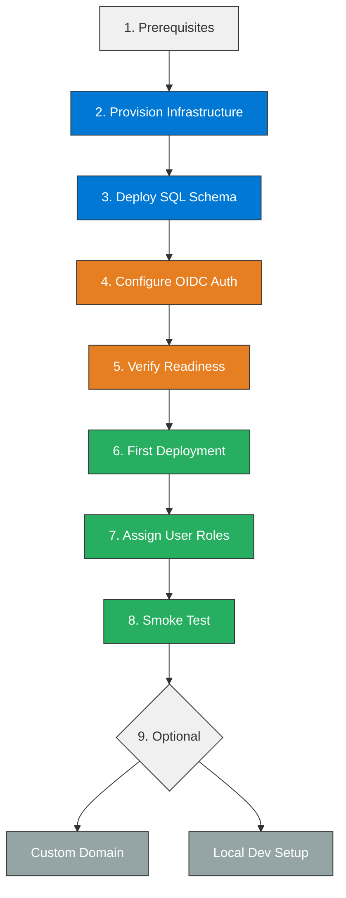
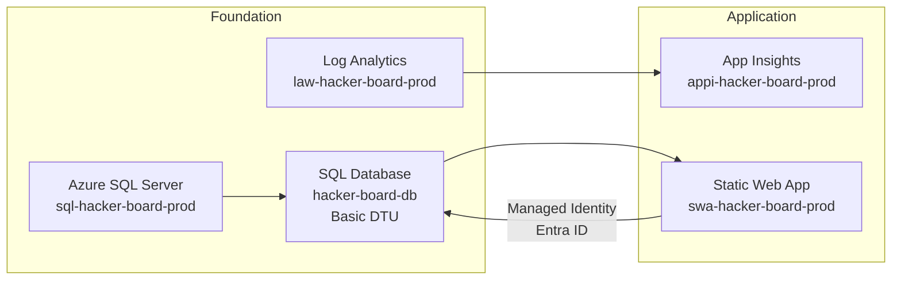
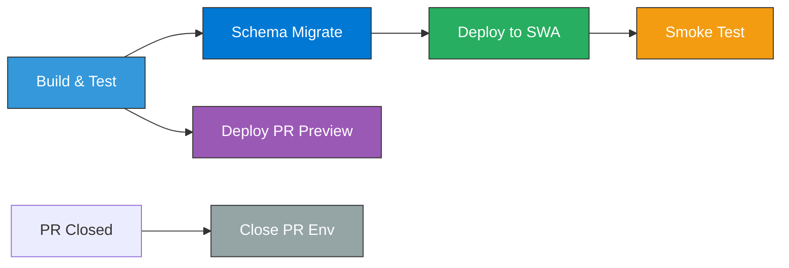

# HackerBoard Deployment Guide


> End-to-end guide for deploying HackerBoard — from Azure infrastructure provisioning through CI/CD to production smoke testing.

## Deployment Flow



## Prerequisites

| Requirement        | Version / Notes                        |
| ------------------ | -------------------------------------- |
| Azure subscription | Contributor access to a resource group |
| Azure CLI          | `az login` authenticated               |
| Bicep CLI          | Installed via `az bicep install`       |
| GitHub CLI         | `gh auth login` authenticated          |
| Node.js            | 20+                                    |
| PowerShell         | 7+ (for `deploy.ps1`)                  |

---

## Step 1 — Provision Azure Infrastructure

Two supported deployment paths: the **Deploy to Azure** button for 1-click provisioning, or the
**deploy script** for full control over parameters and phased deployment.

> **Default admin behaviour**: The Entra user running the deployment is automatically
> configured as the application administrator and assigned as the Microsoft Entra
> administrator on the Azure SQL server — no separate invite step is required.

### Option A — deploy.ps1 (Recommended)

```powershell
cd infra

# Full deployment — deploying user is auto-configured as app admin and SQL Entra admin
./deploy.ps1 `
  -CostCenter "microhack" `
  -TechnicalContact "you@contoso.com"

# Preview changes first (what-if)
./deploy.ps1 -WhatIf `
  -CostCenter "microhack" `
  -TechnicalContact "you@contoso.com"
```

<details>
<summary>Deploy script parameters</summary>

| Parameter           | Default                        | Description                                                                                     |
| ------------------- | ------------------------------ | ----------------------------------------------------------------------------------------------- |
| `ResourceGroupName` | `rg-hacker-board-prod`         | Target resource group                                                                           |
| `Location`          | `westeurope`                   | Azure region                                                                                    |
| `Environment`       | `prod`                         | `dev`, `staging`, or `prod`                                                                     |
| `CostCenter`        | _(required)_                   | Cost center code for tagging                                                                    |
| `TechnicalContact`  | _(required)_                   | Contact email for tagging                                                                       |
| `SqlAdminObjectId`  | _(deprecated — auto-detected)_ | Accepted for backwards compatibility; the deploying user's OID is used automatically            |
| `AdminEmail`        | _(auto-detected)_              | Deploying user's email is used by default; override only if deploying on behalf of another user |
| `SkipSchema`        | `false`                        | Skip automatic SQL schema migration step                                                        |
| `RepositoryUrl`     | _(empty)_                      | GitHub repo URL for SWA linkage                                                                 |
| `WhatIf`            | `false`                        | Preview without deploying                                                                       |

</details>

### Option B — Deploy to Azure Button

[](https://portal.azure.com/#create/Microsoft.Template/uri/https%3A%2F%2Fraw.githubusercontent.com%2Fjonathan-vella%2Fhacker-board%2Fmain%2Finfra%2Fazuredeploy.json)

Deploys via the pre-compiled ARM template. In the portal form, fill in `costCenter` and
`technicalContact`. Set `adminEmail` and `sqlAdminObjectId` to the signed-in deploying
user's email and Entra Object ID — this user becomes the app admin and SQL Entra administrator.

### What Gets Deployed



| Resource             | Name Pattern            | SKU           |
| -------------------- | ----------------------- | ------------- |
| Resource Group       | `rg-hacker-board-{env}` | —             |
| Log Analytics        | `law-{project}-{env}`   | PerGB2018     |
| Azure SQL Server     | `sql-{project}-{env}`   | —             |
| Azure SQL Database   | `{project}-db`          | Basic (5 DTU) |
| Application Insights | `appi-{project}-{env}`  | —             |
| Static Web App       | `swa-{project}-{env}`   | Standard      |

The Bicep templates use [Azure Verified Modules](https://aka.ms/avm) and
automatically configure:

- Entra ID-only authentication on the SQL Server (`azureADOnlyAuthentication: true`)
- System-assigned managed identity on the SWA
- App settings for Application Insights, SQL FQDN and database name

---

## Step 2 — Deploy SQL Schema

The SQL schema migration is idempotent — `api/schema/init.sql` uses
`IF NOT EXISTS` guards so it is safe to run on every deployment.

The `deploy.ps1` script runs this automatically after infrastructure is
provisioned. To run manually:

```bash
export SQL_SERVER_FQDN="<sql-server>.database.windows.net"
export SQL_DATABASE_NAME="hacker-board-db"

node scripts/deploy-schema.js
```

Expected output confirms 7 tables created: `Teams`, `Attendees`, `Scores`,
`Awards`, `Submissions`, `Rubrics`, `Config`, plus the `HackerNumberSequence`
SEQUENCE.

> **Entra ID access required**: The identity running the deployment is automatically
> assigned as the SQL Entra administrator by `deploy.ps1`. This same identity must
> be logged in via `az login` when running `deploy-schema.js` manually. The SWA
> managed identity is granted `db_datareader` and `db_datawriter` roles automatically
> by the schema script.

### Verify Schema

```bash
# Connect with sqlcmd (install via brew/apt)
sqlcmd -S $SQL_SERVER_FQDN -d $SQL_DATABASE_NAME \
  --authentication-method ActiveDirectoryDefault \
  -Q "SELECT name FROM sys.tables ORDER BY name"
```

---

## Step 3 — Configure OIDC Deployment Auth

The CI/CD workflow uses OIDC (identity tokens) instead of long-lived secrets.
Azure SWA defaults to **DeploymentToken** auth policy, which rejects OIDC
deploys. You must switch it to **GitHub** once after initial provisioning.

> **Why can't Bicep do this?** The ARM/Bicep schema does not expose
> `deploymentAuthPolicy` as a writable property. The only programmatic route is
> an `az rest` PATCH that sends both the policy change and a GitHub PAT
> (`repositoryToken`) in the same request body so Azure can verify repo access.

### Option A — Setup Script (Recommended)

```bash
# Create a GitHub PAT with "repo" scope, then:
GITHUB_TOKEN="ghp_..." \
  ./scripts/configure-swa-auth.sh \
    --rg-name rg-hacker-board-prod
```

The script verifies the change and exits with an error if it fails.
Run `./scripts/configure-swa-auth.sh --help` for all options.

### Option B — Azure Portal

1. Navigate to your Static Web App in the Azure Portal
2. Go to **Settings** → **Configuration** → **Deployment configuration**
3. Set **Deployment authorization policy** to **GitHub**
4. Save

### Option C — Direct CLI

```bash
SWA_NAME="swa-hacker-board-prod"
RG_NAME="rg-hacker-board-prod"
SUB_ID="$(az account show --query id -o tsv)"
GITHUB_TOKEN="ghp_..."   # PAT with repo scope

az rest --method PATCH \
  --url "https://management.azure.com/subscriptions/${SUB_ID}/resourceGroups/${RG_NAME}/providers/Microsoft.Web/staticSites/${SWA_NAME}?api-version=2024-04-01" \
  --body "{
    \"properties\": {
      \"deploymentAuthPolicy\": \"GitHub\",
      \"repositoryToken\": \"${GITHUB_TOKEN}\",
      \"repositoryUrl\": \"https://github.com/jonathan-vella/hacker-board\",
      \"branch\": \"main\"
    }
  }"
```

---

## Step 4 — Verify Deployment Readiness

With OIDC auth the workflow authenticates using a GitHub-minted identity token
— no long-lived deployment token secret is required. Verify the setup:

```bash
SWA_NAME="swa-hacker-board-prod"
RG_NAME="rg-hacker-board-prod"
SUB_ID="$(az account show --query id -o tsv)"

# Confirm deployment auth policy is GitHub
az rest --method GET \
  --url "https://management.azure.com/subscriptions/${SUB_ID}/resourceGroups/${RG_NAME}/providers/Microsoft.Web/staticSites/${SWA_NAME}?api-version=2024-04-01" \
  --query "properties.{policy:deploymentAuthPolicy, provider:provider, hostname:defaultHostname}" \
  -o table
```

Expected output: `policy = GitHub`, `provider = GitHub`.

> **Note on SWA hostname:** The hostname (e.g.,
> `happy-pond-04878d603.4.azurestaticapps.net`) is generated once at SWA
> creation time and **stays stable** across redeployments. It only changes if
> you delete and recreate the resource. For a branded URL, add a custom domain
> (see [Optional — Custom Domain](#optional--custom-domain)).

---

## Step 5 — First Deployment

Push to `main` or trigger the workflow manually:

```bash
# Manual trigger
gh workflow run "CI/CD" --repo jonathan-vella/hacker-board

# Or push a commit
git push origin main
```

The CI/CD workflow runs six jobs:



| Job                   | Triggers On             | Purpose                                       |
| --------------------- | ----------------------- | --------------------------------------------- |
| **Build & Test**      | push, PR, manual        | `npm ci`, Vitest (API + UI), `npm audit`      |
| **Schema Migrate**    | push to `main`, manual  | OIDC login → `node scripts/deploy-schema.js`  |
| **Deploy**            | push to `main`, manual  | OIDC auth → `Azure/static-web-apps-deploy@v1` |
| **Smoke Test**        | after successful deploy | Health check + API reachability               |
| **Deploy PR Preview** | PR opened/updated       | Staging environment for the PR                |
| **Close PR Env**      | PR closed               | Tears down the staging environment            |

Monitor the run:

```bash
gh run watch --repo jonathan-vella/hacker-board
```

---

## Step 6 — Assign User Roles

HackerBoard uses two custom roles enforced by `staticwebapp.config.json`:

| Role     | Access                                                                |
| -------- | --------------------------------------------------------------------- |
| `admin`  | Full access — manage teams, scores, awards, rubrics, attendees, flags |
| `member` | Submit scores for their own team via JSON upload                      |

All authenticated users (without a specific role) can view the
leaderboard, awards, and register as attendees.

> **Default admin**: The Entra user who ran the deployment is automatically
> configured as the first `admin` — no invitation required. Additional admins
> can be invited via the Azure Portal or CLI below.

### Invite Additional Admins via CLI

```bash
SWA_NAME="swa-hacker-board-prod"
RG_NAME="rg-hacker-board-prod"
DOMAIN="<your-swa-hostname>.azurestaticapps.net"

# Invite an additional admin
az staticwebapp users invite \
  --name "$SWA_NAME" \
  --resource-group "$RG_NAME" \
  --authentication-provider "github" \
  --user-details "<github-username>" \
  --role "admin" \
  --domain "$DOMAIN"

# Invite a team member
az staticwebapp users invite \
  --name "$SWA_NAME" \
  --resource-group "$RG_NAME" \
  --authentication-provider "github" \
  --user-details "<github-username>" \
  --role "member" \
  --domain "$DOMAIN"
```

### Invite via Azure Portal

1. Navigate to your SWA → **Role management**
2. Click **Invite** → select GitHub provider → enter username → assign role
3. Send the generated invitation link to the user

See [Admin Procedures](admin-procedures.md) for the full admin runbook.

---

## Step 7 — Smoke Test

### Automated (CI/CD)

The smoke-test job runs automatically after each deploy. It checks:

- `GET /api/health` returns `200`
- `GET /api/teams` does not return `5xx`

### Manual Verification

```bash
SWA_URL="<your-swa-hostname>.azurestaticapps.net"

# Health endpoint (no auth required)
curl -s "https://${SWA_URL}/api/health" | python3 -m json.tool

# Auth flow — open in browser
echo "https://${SWA_URL}"
```

**Checklist:**

- [ ] App loads and redirects to GitHub login
- [ ] `/.auth/me` returns user claims after login
- [ ] Leaderboard page renders (empty initially)
- [ ] Admin routes accessible with `admin` role
- [ ] `POST /api/upload` works for `member` role
- [ ] Non-privileged users cannot access admin endpoints (401/403)

---

## Optional — Custom Domain

```bash
az staticwebapp hostname set \
  --name "swa-hacker-board-prod" \
  --resource-group "rg-hacker-board-prod" \
  --hostname "leaderboard.yourdomain.com"
```

Create a CNAME record pointing `leaderboard.yourdomain.com` to your SWA
hostname. Azure provisions a free managed SSL certificate automatically.

---

## Optional — Local Development

### Prerequisites

| Tool                          | Install                                                                                                          |
| ----------------------------- | ---------------------------------------------------------------------------------------------------------------- |
| SWA CLI                       | `npm install -g @azure/static-web-apps-cli`                                                                      |
| Azure Functions Core Tools v4 | [Install guide](https://learn.microsoft.com/azure/azure-functions/functions-run-local)                           |
| SQL Server                    | Docker: `docker run -e ACCEPT_EULA=Y -e SA_PASSWORD=... -p 1433:1433 mcr.microsoft.com/mssql/server:2022-latest` |

### Start Local Environment

```bash
# Set local SQL connection string
export SQL_CONNECTION_STRING="Server=localhost;Database=hackerboard;User Id=sa;Password=<password>;Encrypt=false"

# Install deps + deploy schema + seed data
npm install && cd api && npm install && cd ..
node scripts/deploy-schema.js
node scripts/seed-demo-data.js --reset

# Start local dev server (emulates SWA auth + routing)
swa start src --api-location api
# Open http://localhost:4280
```

### Run Tests

```bash
# API tests
cd api && npm test

# Frontend UI tests
npm run test:ui

# All tests
npm run test:all
```

---

## Troubleshooting

| Symptom                                   | Cause                                                                             | Fix                                                                        |
| ----------------------------------------- | --------------------------------------------------------------------------------- | -------------------------------------------------------------------------- |
| Deploy action fails with "unauthorized"   | Deployment auth policy not set to GitHub                                          | Run `scripts/configure-swa-auth.sh` (Step 4)                               |
| Deploy action fails with OIDC error       | Deployment auth policy still on DeploymentToken                                   | Run `scripts/configure-swa-auth.sh` (Step 4)                               |
| `/api/*` returns 404                      | API not deployed or `api_location` mismatch                                       | Verify `api_location: "api"` in workflow                                   |
| Health check returns 500                  | SQL schema not deployed or SWA identity lacks SQL access                          | Run `node scripts/deploy-schema.js`; grant `db_datareader`/`db_datawriter` |
| Deploying user cannot access admin routes | Deploying user's GitHub email does not match the `adminEmail` used at deploy time | Re-run `deploy.ps1` with the correct `-AdminEmail` override                |
| `swa start` fails locally                 | Missing SWA CLI or SQL not running                                                | Install prerequisites from the Local Development section                   |
| Schema migration fails                    | `az login` identity is not the SQL Entra administrator                            | Ensure the same identity used for deployment runs `deploy-schema.js`       |

---

## Quick Reference

| Item           | Value                                                          |
| -------------- | -------------------------------------------------------------- |
| Resource Group | `rg-hacker-board-prod`                                         |
| SWA Resource   | `swa-hacker-board-prod`                                        |
| SQL Server     | `sql-hacker-board-prod.database.windows.net`                   |
| SQL Database   | `hacker-board-db` (Basic DTU)                                  |
| Region         | `westeurope`                                                   |
| Workflow File  | `.github/workflows/deploy-swa.yml`                             |
| Infra Workflow | `.github/workflows/deploy-infra.yml`                           |
| Deploy Auth    | OIDC (`deploymentAuthPolicy: GitHub`)                          |
| Auth Provider  | GitHub OAuth (SWA built-in)                                    |
| Schema Script  | `scripts/deploy-schema.js`                                     |
| SQL Tables     | Teams, Attendees, Scores, Submissions, Awards, Rubrics, Config |

## References

- [Azure SWA Build Configuration](https://learn.microsoft.com/azure/static-web-apps/build-configuration?tabs=identity&pivots=github-actions)
- [Azure SWA Role Management](https://learn.microsoft.com/azure/static-web-apps/authentication-authorization#role-management)
- [Azure Verified Modules](https://aka.ms/avm)
- [API Specification](api-spec.md) — Endpoint contracts
- [Admin Procedures](admin-procedures.md) — Operational runbook
- [App Design](app-design.md) — Architecture and components
- [Backlog](backlog.md) — Task tracking and decision log

---

## E2E Deployment Validation — Test Protocol

> This section defines the shared test protocol for validating both supported deployment paths: **Path A** (`deploy.ps1`) and **Path B** (Deploy to Azure button). Each path runs in its own disposable resource group.

### Disposable Resource Groups

| Path | Resource Group Pattern  | Deployment Method                     |
| ---- | ----------------------- | ------------------------------------- |
| A    | `hb-e2e-ps-<yyyyMMdd>`  | `infra/deploy.ps1`                    |
| B    | `hb-e2e-btn-<yyyyMMdd>` | ARM button → `infra/azuredeploy.json` |

### Required Evidence Per Run

Each path run MUST capture:

| Artifact                | Description                                                           |
| ----------------------- | --------------------------------------------------------------------- |
| Deployment ID/name      | Azure deployment name (e.g., `hacker-board-20260218-143022`)          |
| Provisioning outputs    | `swaHostname`, `swaName`, `sqlServerFqdn`, `sqlDatabaseName`          |
| Schema migration result | Exit code + output of `node scripts/deploy-schema.js`                 |
| Health check response   | `curl -fsS https://<swaHostname>/api/health` — must return `200`      |
| Teams endpoint response | `curl -i https://<swaHostname>/api/teams` — must return `200`, no 5xx |
| Role access validation  | Unauthenticated request to admin route → must return `401`/`403`      |
| Teardown confirmation   | `az group delete --name <rg> --yes --no-wait` + confirmation          |

### Preflight Gate (Both Paths)

Before executing any path, verify:

- [ ] `infra/main.bicep` compiles cleanly: `az bicep build --file infra/main.bicep`
- [ ] `infra/azuredeploy.json` is in sync with `main.bicep` (rebuild if changed)
- [ ] Required parameters are available: `costCenter`, `technicalContact`
- [ ] Azure CLI is authenticated with Contributor access to target subscription (`az login`)
- [ ] The signed-in identity is the intended app admin and SQL Entra administrator

### SQL Private Endpoint — Test Environment Constraint

When `enablePrivateEndpoint=true`, schema migration requires connectivity inside the VNet. For E2E test environments:

- Set `enablePrivateEndpoint=false` in both disposable test RGs
- Use `--parameters enablePrivateEndpoint=false` in Path A's `deploy.ps1` invocation
- This is expected behavior; private endpoints are for production only

### Path Execution Commands

**Path A — deploy.ps1**

```powershell
$date = Get-Date -Format 'yyyyMMdd'
./infra/deploy.ps1 `
  -ResourceGroupName "hb-e2e-ps-$date" `
  -CostCenter "microhack" `
  -TechnicalContact "you@contoso.com" `
  -Environment dev
```

> The signed-in `az login` identity is automatically the app admin and SQL Entra administrator.
> Schema migration runs automatically unless `-SkipSchema` is passed.

**Path B — Deploy Button**

1. Navigate to `README.md` and click **Deploy to Azure**
2. Fill parameters: `costCenter`, `technicalContact`, `enablePrivateEndpoint=false`; set `adminEmail` and `sqlAdminObjectId` to the deploying user's email and Entra OID
3. After ARM deployment completes, collect outputs from Azure Portal
4. Run `node scripts/deploy-schema.js` manually (set `SQL_SERVER_FQDN` and `SQL_DATABASE_NAME` from portal outputs)

### Runtime Smoke Checks (Both Paths)

```bash
export APP_URL=https://<swaHostname>

# Health
curl -fsS $APP_URL/api/health

# Teams (unauthenticated — list is public)
curl -i $APP_URL/api/teams

# Admin route access control (expect 401)
curl -i $APP_URL/api/scores -X POST -H "Content-Type: application/json" -d '{}'
```

### Test Matrix

| Check                                     | Path A (PS) | Path B (Button) |
| ----------------------------------------- | ----------- | --------------- |
| Provisioning success                      |             |                 |
| All outputs present                       |             |                 |
| Schema migration success                  |             |                 |
| App deployment success                    |             |                 |
| `/api/health` → 200                       |             |                 |
| `/api/teams` → 200, no 5xx                |             |                 |
| Deploying user has `admin` access         |             |                 |
| Deploying user is SQL Entra administrator |             |                 |
| Admin route → 401 unauthenticated         |             |                 |
| `admin`/`member` role behaviour           |             |                 |
| Teardown complete                         |             |                 |

### Teardown

```bash
# After run — preserve logs/artifacts before deletion if the run failed
az group delete --name <rg-name> --yes --no-wait

# Only if data was seeded into a shared environment
node scripts/cleanup-app-data.js
```

---

[← Back to Documentation](README.md)
