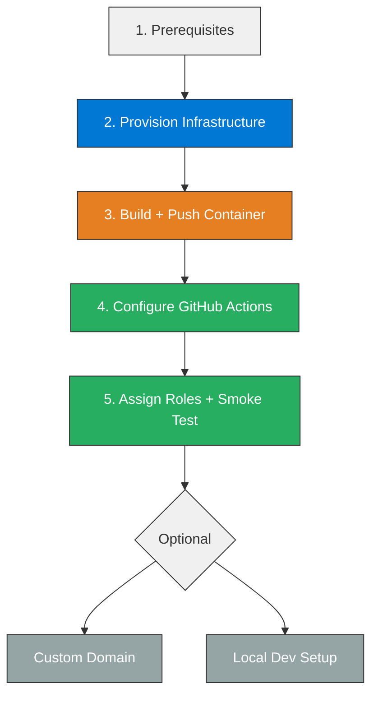
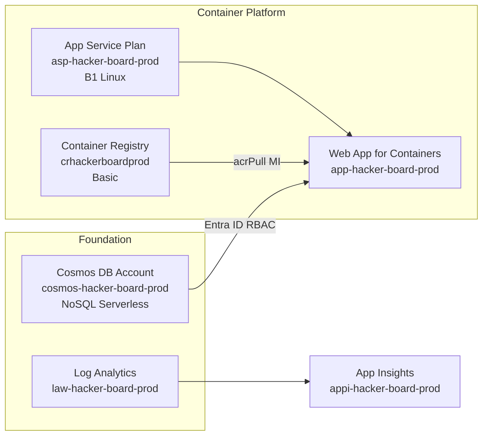
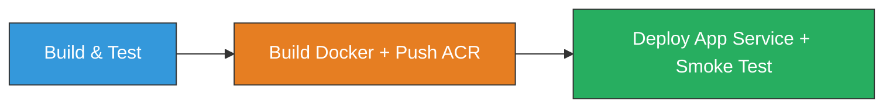

# HackerBoard Deployment Guide


> End-to-end guide for deploying HackerBoard — from infrastructure provisioning through container push to production smoke testing.

## Deployment Flow



## Prerequisites

| Requirement        | Version / Notes                        |
| ------------------ | -------------------------------------- |
| Azure subscription | Contributor access to a resource group |
| Azure CLI          | `az login` authenticated               |
| Bicep CLI          | Installed via `az bicep install`       |
| Docker             | Running locally for the initial image  |
| GitHub CLI         | `gh auth login` authenticated          |
| Node.js            | 20+                                    |
| PowerShell         | 7+ (for `deploy.ps1`)                  |
| GitHub OAuth App   | Client ID + Secret (see step below)    |

### Create a GitHub OAuth App

Before provisioning, create a GitHub OAuth App for Easy Auth:

1. Go to [GitHub → Settings → Developer settings → OAuth Apps → New OAuth App](https://github.com/settings/applications/new)
2. Set **Authorization callback URL** to:
   `https://app-hacker-board-prod.azurewebsites.net/.auth/login/github/callback`
3. Generate a **Client secret**
4. Copy the **Client ID** and **Client secret** — you'll pass them to `deploy.ps1`

---

## Step 1 — Provision Azure Infrastructure

### Option A — deploy.ps1 (Recommended)

```powershell
cd infra

./deploy.ps1 `
  -CostCenter "microhack" `
  -TechnicalContact "you@contoso.com" `
  -GitHubOAuthClientId "<client-id>" `
  -GitHubOAuthClientSecret "<client-secret>"

# Preview changes first (what-if)
./deploy.ps1 -WhatIf `
  -CostCenter "microhack" `
  -TechnicalContact "you@contoso.com" `
  -GitHubOAuthClientId "<client-id>" `
  -GitHubOAuthClientSecret "<client-secret>"
```

<details>
<summary>Deploy script parameters</summary>

| Parameter                 | Default                | Description                                                                       |
| ------------------------- | ---------------------- | --------------------------------------------------------------------------------- |
| `ResourceGroupName`       | `rg-hacker-board-prod` | Target resource group                                                             |
| `Location`                | `centralus`            | Azure region                                                                      |
| `Environment`             | `prod`                 | `dev`, `staging`, or `prod`                                                       |
| `CostCenter`              | _(required)_           | Cost center code for governance tagging                                           |
| `TechnicalContact`        | _(required)_           | Contact email for governance tagging                                              |
| `GitHubOAuthClientId`     | _(required)_           | GitHub OAuth App client ID for Easy Auth                                          |
| `GitHubOAuthClientSecret` | _(required)_           | GitHub OAuth App client secret for Easy Auth                                      |
| `AdminEmail`              | _(auto-detected)_      | Deploying user's email — becomes first app admin via Entra ID app role assignment |
| `ContainerImage`          | `hacker-board:latest`  | Container image reference (`repo:tag` relative to ACR)                            |
| `WhatIf`                  | `false`                | Preview without deploying                                                         |

</details>

### Option B — Deploy to Azure Button

[](https://portal.azure.com/#create/Microsoft.Template/uri/https%3A%2F%2Fraw.githubusercontent.com%2Fjonathan-vella%2Fhacker-board%2Fmain%2Finfra%2Fazuredeploy.json)

Fill in `costCenter`, `technicalContact`, `gitHubOAuthClientId`, and `gitHubOAuthClientSecret` in the portal form. The deploying user is automatically assigned the `admin` app role.

> **Tip — find your Object ID**: `az ad signed-in-user show --query id -o tsv`

### What Gets Deployed



| Resource             | Name Pattern             | SKU              |
| -------------------- | ------------------------ | ---------------- |
| Resource Group       | `rg-hacker-board-{env}`  | — (9 tags req'd) |
| Log Analytics        | `law-{project}-{env}`    | PerGB2018        |
| Application Insights | `appi-{project}-{env}`   | —                |
| Cosmos DB Account    | `cosmos-{project}-{env}` | Serverless       |
| Cosmos DB Database   | `hackerboard`            | 6 containers     |
| Container Registry   | `cr{project}{env}`       | Basic            |
| App Service Plan     | `asp-{project}-{env}`    | B1 Linux         |
| Web App (Containers) | `app-{project}-{env}`    | Linux            |
| Entra ID App Reg     | `app-{project}-{env}`    | —                |

Bicep templates use [Azure Verified Modules](https://aka.ms/avm) and automatically configure:

- Cosmos DB with Entra ID RBAC only (`disableLocalAuth: true` — enforced by governance)
- 6 containers: `teams`, `attendees`, `scores`, `submissions`, `rubrics`, `awards`
- App Service system-assigned MI with `Cosmos DB Built-in Data Contributor` role
- App Service system-assigned MI with `acrPull` role on ACR
- Easy Auth (GitHub OAuth) via `authSettingsV2` — same `/.auth/*` contract
- Entra ID app registration with `admin` app role; deployer auto-assigned
- 9 mandatory resource group tags (governance policy)

---

## Step 2 — Build and Push Container Image

After infrastructure is provisioned, build the Docker image and push it to ACR:

```bash
# Log in to ACR
az acr login --name crhackerboardprod

# Build the image
docker build -t crhackerboardprod.azurecr.io/hacker-board:latest .

# Push to ACR
docker push crhackerboardprod.azurecr.io/hacker-board:latest
```

> **Tip**: You can also use ACR Tasks to build in the cloud without Docker locally:
>
> ```bash
> az acr build --registry crhackerboardprod --image hacker-board:latest .
> ```

Verify the image is in ACR:

```bash
az acr repository show-tags --name crhackerboardprod --repository hacker-board -o table
```

Then restart the App Service to pull the new image:

```bash
az webapp restart --name app-hacker-board-prod -g rg-hacker-board-prod
```

---

## Step 3 — Configure GitHub Actions

The CI/CD workflow (`.github/workflows/deploy-app.yml`) builds and deploys on push to `main`. It authenticates using a service principal stored as `AZURE_CREDENTIALS`.

### Create the Service Principal

```bash
SP_JSON=$(az ad sp create-for-rbac \
  --name "sp-hacker-board-cicd" \
  --role Contributor \
  --scopes "/subscriptions/$(az account show --query id -o tsv)/resourceGroups/rg-hacker-board-prod" \
  --sdk-auth)

# Store in GitHub
gh secret set AZURE_CREDENTIALS --body "$SP_JSON" --repo jonathan-vella/hacker-board
```

Also grant the service principal the `acrPush` role:

```bash
SP_OID=$(az ad sp list --display-name sp-hacker-board-cicd --query "[0].id" -o tsv)
ACR_ID=$(az acr show --name crhackerboardprod -g rg-hacker-board-prod --query id -o tsv)
az role assignment create --assignee "$SP_OID" --role AcrPush --scope "$ACR_ID"
```

### Trigger the First CI/CD Run

```bash
# Manual trigger
gh workflow run "Build & Deploy" --repo jonathan-vella/hacker-board

# Or push a commit
git push origin main
```

The workflow runs two jobs:



| Job                     | Triggers On            | Purpose                                                              |
| ----------------------- | ---------------------- | -------------------------------------------------------------------- |
| **Build & Test**        | push, PR, manual       | `npm ci`, Vitest (76 API + 61 UI tests), `npm audit`, Trivy CVE scan |
| **Build Docker + Push** | push to `main`, manual | OIDC → `docker build` → ACR push                                     |
| **Deploy + Smoke Test** | after Docker push      | `az webapp config container set` → `GET /api/health` smoke check     |

Monitor the run:

```bash
gh run watch --repo jonathan-vella/hacker-board
```

---

## Step 4 — Assign User Roles

HackerBoard uses two roles enforced by the Express middleware (`api/shared/auth.js`):

| Role     | Access                                                                |
| -------- | --------------------------------------------------------------------- |
| `admin`  | Full access — manage teams, scores, awards, rubrics, attendees, flags |
| `member` | Submit scores for their own team via JSON upload                      |

All authenticated users (without a specific role) can view the leaderboard, awards, and register as attendees.

> **Default admin**: The Entra user who ran the deployment is automatically assigned the `admin` Entra ID app role — no invitation required.

### Invite Additional Admins via Entra ID App Roles

Additional admins are managed through Entra ID app role assignments (not SWA role management):

```bash
# Get the Entra app registration's service principal
APP_SP_OID=$(az ad sp list --display-name app-hacker-board-prod --query "[0].id" -o tsv)

# Get the admin role ID from the app registration
ADMIN_ROLE_ID=$(az ad app list --display-name app-hacker-board-prod \
  --query "[0].appRoles[?value=='admin'].id | [0]" -o tsv)

# Assign admin role to a user (by their Entra Object ID)
USER_OID=$(az ad user show --id "user@contoso.com" --query id -o tsv)
az rest --method POST \
  --url "https://graph.microsoft.com/v1.0/servicePrincipals/${APP_SP_OID}/appRoleAssignments" \
  --body "{\"principalId\":\"${USER_OID}\",\"resourceId\":\"${APP_SP_OID}\",\"appRoleId\":\"${ADMIN_ROLE_ID}\"}"
```

See [Admin Procedures](admin-procedures.md) for the full admin runbook.

---

## Step 5 — Smoke Test

### Automated (CI/CD)

The smoke-test step runs automatically after each deploy. It checks:

- `GET /api/health` returns `200`
- Response includes `{"status":"ok"}`

### Manual Verification

```bash
APP_URL="https://app-hacker-board-prod.azurewebsites.net"

# Health endpoint (no auth required)
curl -s "${APP_URL}/api/health" | python3 -m json.tool

# Open browser
echo "${APP_URL}"
```

**Checklist:**

- [ ] App loads and redirects to GitHub login
- [ ] `/.auth/me` returns user claims after login
- [ ] Leaderboard page renders (empty initially)
- [ ] Admin routes accessible with `admin` role
- [ ] `POST /api/upload` works for `member` role
- [ ] Non-privileged users cannot access admin endpoints (401/403)

---

## Optional — Custom Domain

```bash
az webapp update \
  --name app-hacker-board-prod \
  --resource-group rg-hacker-board-prod \
  --set customDomainVerificationId=$(az webapp show \
    --name app-hacker-board-prod \
    -g rg-hacker-board-prod \
    --query customDomainVerificationId -o tsv)

az webapp config hostname add \
  --webapp-name app-hacker-board-prod \
  --resource-group rg-hacker-board-prod \
  --hostname leaderboard.yourdomain.com
```

Create a CNAME record pointing `leaderboard.yourdomain.com` to `app-hacker-board-prod.azurewebsites.net`. App Service provisions a free managed SSL certificate automatically.

---

## Optional — Local Development

### Start Local Environment

```bash
# Set local Cosmos DB connection (emulator)
export COSMOS_ENDPOINT="https://localhost:8081"
export COSMOS_KEY="C2y6yDjf5/R+ob0N8A7Cgv30VRDJIWEHLM+4QDU5DE2nQ9nDuVTqobD4b8mGGyPMbIZnqyMsEcaGQy67XIw/Jw=="

# Install deps + seed data
npm install && cd api && npm install && cd ..
node scripts/seed-demo-data.js --reset

# Start API server directly
cd api && npm start
# Open http://localhost:3000
```

Or run in Docker (matches production):

```bash
docker build -t hacker-board:local .
docker run -p 8080:8080 \
  -e COSMOS_ENDPOINT=https://localhost:8081 \
  hacker-board:local
# Open http://localhost:8080
```

> **Note**: In production, Cosmos DB local auth is disabled by governance. The emulator key above is the well-known Cosmos DB emulator key for local development only.

### Run Tests

```bash
# API tests
cd api && npm test

# Frontend UI tests
npm run test:ui

# All tests
npm run test:all
```

---

## Troubleshooting

| Symptom                                   | Cause                                                                      | Fix                                                                              |
| ----------------------------------------- | -------------------------------------------------------------------------- | -------------------------------------------------------------------------------- |
| App Service shows default page            | Container image not yet pushed to ACR, or wrong image tag configured       | Run `docker push` (Step 2), then `az webapp restart`                             |
| `/api/health` returns 500                 | Cosmos DB RBAC role not assigned, or `COSMOS_ENDPOINT` app setting missing | Verify `Cosmos DB Built-in Data Contributor` assigned to App Service MI          |
| `/api/health` returns 503                 | App Service is starting cold; container still pulling                      | Wait 60 s and retry; check `az webapp log tail`                                  |
| CI/CD fails with AZURE_CREDENTIALS error  | Secret not set or expired service principal                                | Re-run `az ad sp create-for-rbac` and update `AZURE_CREDENTIALS` secret          |
| CI/CD fails with AcrPush unauthorized     | Service principal missing `acrPush` role on ACR                            | Grant `acrPush` role to the CI/CD service principal (Step 3)                     |
| Auth redirects fail (`/.auth/login`)      | GitHub OAuth App callback URL mismatch or Easy Auth misconfigured          | Verify callback URL matches App Service hostname exactly                         |
| Deploying user cannot access admin routes | Entra ID app role assignment not matched to login account                  | Re-run `deploy.ps1` with the correct `-AdminEmail` override                      |
| `COSMOS_ENDPOINT` not set                 | Infrastructure deployed but app settings not propagated                    | Check `az webapp config appsettings list --name app-hacker-board-prod -g rg-...` |

---

## Quick Reference

| Item           | Value                                                  |
| -------------- | ------------------------------------------------------ |
| Resource Group | `rg-hacker-board-prod`                                 |
| App Service    | `app-hacker-board-prod`                                |
| App URL        | `https://app-hacker-board-prod.azurewebsites.net`      |
| ACR            | `crhackerboardprod.azurecr.io`                         |
| Cosmos DB      | `cosmos-hacker-board-prod` (Serverless)                |
| Database       | `hackerboard`                                          |
| Region         | `centralus`                                            |
| Workflow File  | `.github/workflows/deploy-app.yml`                     |
| Deploy Auth    | `AZURE_CREDENTIALS` GitHub secret (service principal)  |
| Easy Auth      | GitHub OAuth via App Service Easy Auth (`/.auth/*`)    |
| Containers     | teams, attendees, scores, submissions, rubrics, awards |

## References

- [Azure App Service Deployment](https://learn.microsoft.com/azure/app-service/deploy-zip)
- [App Service Easy Auth](https://learn.microsoft.com/azure/app-service/overview-authentication-authorization)
- [Azure Container Registry](https://learn.microsoft.com/azure/container-registry/)
- [Azure Verified Modules](https://aka.ms/avm)
- [API Specification](api-spec.md) — Endpoint contracts
- [Admin Procedures](admin-procedures.md) — Operational runbook
- [App Design](app-design.md) — Architecture and components
- [Backlog](backlog.md) — Task tracking and decision log
- [E2E Deployment Validation](e2e-validation.md) — Full test protocol

---

## E2E Deployment Validation

For the full E2E test protocol, disposable RG patterns, evidence checklists, and runtime smoke checks, see [E2E Deployment Validation](e2e-validation.md).

---

[← Back to Documentation](README.md)
