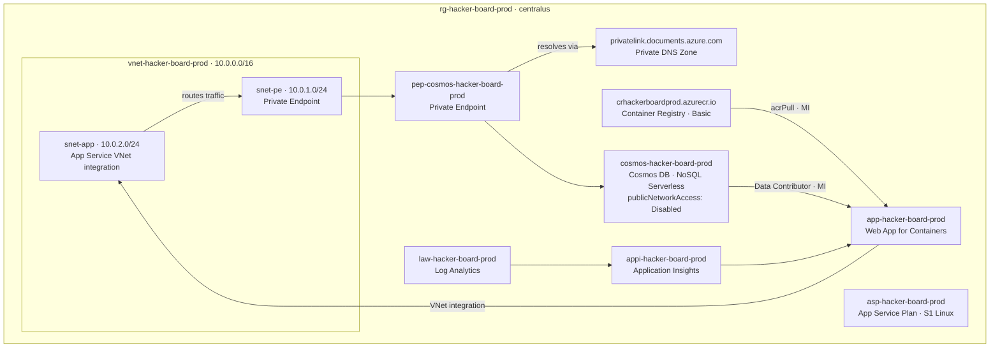
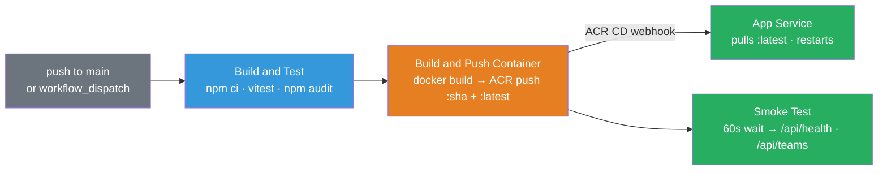

<!-- docs/deployment-guide.md -->

# HackerBoard — Deployment Guide

> End-to-end guide: GitHub OAuth setup → infrastructure provisioning → container image push → CI/CD activation → smoke test.

---

## Table of Contents

- [Architecture Overview](#architecture-overview)
- [Prerequisites](#prerequisites)
- [Step 1 — GitHub OAuth App](#step-1--github-oauth-app)
- [Step 2 — Provision Infrastructure](#step-2--provision-infrastructure)
- [Step 3 — Build and Push Container Image](#step-3--build-and-push-container-image)
- [Step 4 — Activate CI/CD](#step-4--activate-cicd)
- [Step 5 — Smoke Test](#step-5--smoke-test)
- [Redeployment and Updates](#redeployment-and-updates)
- [Troubleshooting](#troubleshooting)
- [Quick Reference](#quick-reference)

---

## Architecture Overview



### Deployed Resources

| Resource             | Name                              | SKU                    |
| -------------------- | --------------------------------- | ---------------------- |
| Resource Group       | `rg-hacker-board-prod`            | centralus              |
| Log Analytics        | `law-hacker-board-prod`           | PerGB2018              |
| Application Insights | `appi-hacker-board-prod`          | —                      |
| Cosmos DB Account    | `cosmos-hacker-board-prod`        | Serverless             |
| Cosmos DB Database   | `hackerboard`                     | 6 containers           |
| Virtual Network      | `vnet-hacker-board-prod`          | 10.0.0.0/16            |
| Subnet (App)         | `snet-app`                        | 10.0.2.0/24, delegated |
| Subnet (PE)          | `snet-pe`                         | 10.0.1.0/24            |
| Private Endpoint     | `pep-cosmos-hacker-board-prod`    | Sql                    |
| Private DNS Zone     | `privatelink.documents.azure.com` | global                 |
| Container Registry   | `crhackerboardprod`               | Basic                  |
| App Service Plan     | `asp-hacker-board-prod`           | **S1 Linux**           |
| Web App              | `app-hacker-board-prod`           | Linux containers       |

> **Why S1 and not P1v3**: The target subscription has zero PremiumV3 quota in `centralus`. S1 Standard fully supports regional VNet integration.

---

## Prerequisites

| Requirement | Version / Notes                               |
| ----------- | --------------------------------------------- |
| Azure CLI   | `az login` authenticated with ARM token valid |
| Bicep CLI   | `az bicep install`                            |
| Docker      | Running locally for the initial image push    |
| GitHub CLI  | `gh auth login` authenticated                 |
| Node.js     | 20+                                           |
| PowerShell  | 7+ (for `deploy.ps1`)                         |

Verify your Azure CLI session before starting:

```bash
az account show
az account get-access-token --resource https://management.azure.com/ --output none && echo "Token valid"
```

---

## Step 1 — GitHub OAuth App

Easy Auth uses a GitHub OAuth App for sign-in. Create one before provisioning.

1. Go to **[GitHub → Settings → Developer settings → OAuth Apps → New OAuth App](https://github.com/settings/applications/new)**
2. Fill in:
   - **Application name**: `HackerBoard`
   - **Homepage URL**: `https://app-hacker-board-prod.azurewebsites.net`
   - **Authorization callback URL**: `https://app-hacker-board-prod.azurewebsites.net/.auth/login/github/callback`
3. Click **Register application**
4. Click **Generate a new client secret**
5. Copy both the **Client ID** and **Client secret** — you need them in Step 2

> **Custom domain**: Update the OAuth App callback URL after binding any custom domain. The callback must exactly match the domain used to reach the app.

---

## Step 2 — Provision Infrastructure

All infrastructure is managed by `infra/main.bicep` via `infra/deploy.ps1`.

### Run the deployment

```powershell
cd infra

./deploy.ps1 `
  -CostCenter "microhack" `
  -TechnicalContact "you@contoso.com" `
  -GitHubOAuthClientId "<client-id-from-step-1>" `
  -GitHubOAuthClientSecret "<client-secret-from-step-1>" `
  -AdminUsers "github:<your-github-username>"
```

Run a **what-if preview** first to see what will be created or changed without deploying:

```powershell
./deploy.ps1 -WhatIf `
  -CostCenter "microhack" `
  -TechnicalContact "you@contoso.com" `
  -GitHubOAuthClientId "<client-id>" `
  -GitHubOAuthClientSecret "<client-secret>" `
  -AdminUsers "github:<your-github-username>"
```

<details>
<summary>All deploy.ps1 parameters</summary>

| Parameter                 | Default                | Required | Description                                                            |
| ------------------------- | ---------------------- | -------- | ---------------------------------------------------------------------- |
| `ResourceGroupName`       | `rg-hacker-board-prod` |          | Target resource group                                                  |
| `Location`                | `centralus`            |          | Azure region                                                           |
| `Environment`             | `prod`                 |          | `dev`, `staging`, or `prod`                                            |
| `CostCenter`              | —                      | ✅       | Cost center code (governance tag)                                      |
| `TechnicalContact`        | —                      | ✅       | Contact email (governance tag)                                         |
| `GitHubOAuthClientId`     | —                      | ✅       | GitHub OAuth App client ID                                             |
| `GitHubOAuthClientSecret` | —                      | ✅       | GitHub OAuth App client secret                                         |
| `AdminUsers`              | —                      | ✅       | Comma-separated `provider:username` identities (e.g. `github:octocat`) |
| `ContainerImage`          | `hacker-board:latest`  |          | Image reference relative to ACR                                        |
| `AdminEmail`              | _(auto-detected)_      |          | Deploying user's email — written to deploy log                         |
| `WhatIf`                  | `false`                |          | Preview without deploying                                              |

</details>

### What the deployment does

The script:

1. Validates Azure CLI token and Bicep version
2. Creates (or updates) `rg-hacker-board-prod` with 9 required governance tags
3. Runs `az bicep build` + `az bicep lint` on `main.bicep`
4. Deploys all 14 resources via `az deployment group create` (Incremental mode)
5. Runs post-deploy verification: App Service state, VNet integration, PE provisioning, Cosmos RBAC count, public network access

### Admin access model

Admins are declared at deploy time via `-AdminUsers`. The value is a comma-separated list of identities in `provider:username` format:

```powershell
# Single admin
-AdminUsers "github:octocat"

# Multiple admins
-AdminUsers "github:octocat,github:monalisa"
```

The Express middleware (`api/shared/auth.js`) checks the `ADMIN_USERS` app setting at request time — no Entra ID app role assignments are required.

---

## Step 3 — Build and Push Container Image

The App Service is configured for **ACR continuous deployment** — it watches `hacker-board:latest` on `crhackerboardprod` and automatically pulls and restarts when a new image is pushed.

### Option A — ACR Tasks (recommended, no local Docker required)

```bash
az acr build   --registry crhackerboardprod   --image hacker-board:latest   .
```

ACR Tasks builds the image in Azure directly from the source context.

### Option B — Local Docker build and push

```bash
# Authenticate
az acr login --name crhackerboardprod

# Build
docker build -t crhackerboardprod.azurecr.io/hacker-board:latest .

# Push
docker push crhackerboardprod.azurecr.io/hacker-board:latest
```

### Verify the image landed

```bash
az acr repository show-tags   --name crhackerboardprod   --repository hacker-board   --output table
```

App Service pulls `:latest` automatically via ACR CD webhook within ~30 seconds of the push. Force an immediate restart if needed:

```bash
az webapp restart   --name app-hacker-board-prod   --resource-group rg-hacker-board-prod
```

---

## Step 4 — Activate CI/CD

The workflow at [`.github/workflows/deploy-app.yml`](../.github/workflows/deploy-app.yml) runs on every push to `main` that touches `src/**`, `api/**`, or `Dockerfile`. It requires one GitHub secret.

### Create the service principal (one-time)

```bash
SP_JSON=$(az ad sp create-for-rbac   --name "sp-hacker-board-cicd"   --role Contributor   --scopes "/subscriptions/$(az account show --query id -o tsv)/resourceGroups/rg-hacker-board-prod"   --sdk-auth)

# Store as GitHub Actions secret
gh secret set AZURE_CREDENTIALS   --repo jonathan-vella/hacker-board   --body "$SP_JSON"

# Grant AcrPush so the workflow can push images
SP_CLIENT_ID=$(echo "$SP_JSON" | python3 -c "import sys,json; print(json.load(sys.stdin)['clientId'])")
az role assignment create   --assignee "$SP_CLIENT_ID"   --role AcrPush   --scope "$(az acr show --name crhackerboardprod -g rg-hacker-board-prod --query id -o tsv)"
```

> **Already done**: `AZURE_CREDENTIALS` and `AcrPush` were configured during the February 21, 2026 setup using SP `sp-hacker-board-cicd` (`clientId: 0e0c3e84-7690-4a15-904f-9ecd1b2a1ae4`). Only redo this if the secret expires or the SP is deleted.

### CI/CD pipeline flow



| Job                          | Triggers                            | What it does                                                               |
| ---------------------------- | ----------------------------------- | -------------------------------------------------------------------------- |
| **Build and Test**           | all events                          | `npm ci`, Vitest (API + UI tests), `npm audit --audit-level=high`          |
| **Build and Push Container** | push to `main`, `workflow_dispatch` | `az acr login` → `docker build` → push `:sha` + `:latest` · Trivy CVE scan |
| **Smoke Test**               | after push                          | 60s wait for ACR CD pull/restart → `GET /api/health` → `GET /api/teams`    |

> **No explicit deploy job**: App Service redeploys automatically via ACR continuous deployment webhook when `:latest` is updated. The `azure/webapps-deploy` action is intentionally not used — it would conflict by pinning the SHA tag while the portal watches `:latest`.

### Trigger a manual run

```bash
gh workflow run deploy-app.yml --repo jonathan-vella/hacker-board

# Monitor
gh run list --workflow=deploy-app.yml --repo jonathan-vella/hacker-board --limit 5
gh run watch <run-id> --repo jonathan-vella/hacker-board
```

---

## Step 5 — Smoke Test

### Automated

After each successful push, the workflow waits 60 seconds then probes:

- `GET /api/health` — expects HTTP 200
- `GET /api/teams` — expects HTTP 200, 401, or 403 (any 5xx fails the check)

### Manual verification

```bash
APP_URL="https://app-hacker-board-prod.azurewebsites.net"

# Health endpoint (unauthenticated — excluded from Easy Auth)
curl -s "${APP_URL}/api/health" | python3 -m json.tool

# Open in browser
"$BROWSER" "${APP_URL}"
```

**Full checklist:**

- [ ] `GET /api/health` returns `{"status":"ok"}`
- [ ] App loads and shows the login page
- [ ] GitHub OAuth sign-in completes and `/.auth/me` returns user claims
- [ ] Leaderboard renders (empty on first deploy is expected)
- [ ] Admin routes (`/admin`, `/api/feature-flags`) accessible with admin identity
- [ ] Non-admin users cannot call admin endpoints (401 or 403)
- [ ] `POST /api/upload` works for member role

### Check App Service logs

```bash
az webapp log tail   --name app-hacker-board-prod   --resource-group rg-hacker-board-prod
```

---

## Redeployment and Updates

### Infrastructure changes

Edit `infra/main.bicep` or a module, then redeploy:

```powershell
# Always rebuild compiled ARM templates after editing Bicep
az bicep build --file infra/main.bicep --outfile infra/azuredeploy.json
az bicep build --file infra/main.bicep --outfile infra/main.json

# Redeploy (idempotent — applies only the delta)
cd infra && ./deploy.ps1 `
  -CostCenter "microhack" -TechnicalContact "you@contoso.com" `
  -GitHubOAuthClientId "<id>" -GitHubOAuthClientSecret "<secret>" `
  -AdminUsers "github:<username>"
```

### Application code changes

Push to `main` — the workflow handles everything automatically:

```
git push origin main
# → build-and-test → docker push :latest → ACR CD webhook → App Service restarts → smoke test
```

### Rotating GitHub OAuth credentials

```powershell
./deploy.ps1 `
  -CostCenter "microhack" -TechnicalContact "you@contoso.com" `
  -GitHubOAuthClientId "<new-id>" `
  -GitHubOAuthClientSecret "<new-secret>" `
  -AdminUsers "github:<username>"
```

The script updates `authSettingsV2` and the `GITHUB_OAUTH_CLIENT_SECRET` app setting in place.

### Adding or removing admins

Re-run `deploy.ps1` with the updated `-AdminUsers` value. Changes take effect immediately — no restart required since the middleware reads the app setting at request time.

---

## Troubleshooting

| Symptom                                    | Cause                                                    | Fix                                                                                                                                           |
| ------------------------------------------ | -------------------------------------------------------- | --------------------------------------------------------------------------------------------------------------------------------------------- |
| App Service shows container start error    | No image in ACR yet                                      | Run Step 3 (build + push), then `az webapp restart`                                                                                           |
| `/api/health` returns 500                  | Cosmos DB RBAC not assigned or `COSMOS_ENDPOINT` missing | Verify `az cosmosdb sql role assignment list` returns ≥1 assignment; check app settings                                                       |
| `/api/health` returns 503                  | Container still pulling or cold start                    | Wait 60s and retry; `az webapp log tail` for details                                                                                          |
| CI/CD fails — `AZURE_CREDENTIALS` error    | Secret missing, wrongly formatted, or SP expired         | Re-create SP and re-run `gh secret set AZURE_CREDENTIALS`                                                                                     |
| CI/CD fails — Trivy CVE block              | HIGH CVEs detected in app dependencies                   | Run `npm audit fix` in `api/`, rebuild and push                                                                                               |
| ACR push fails in CI/CD                    | SP missing `AcrPush` role                                | `az role assignment create --assignee <sp-client-id> --role AcrPush --scope <acr-id>`                                                         |
| GitHub auth redirects fail                 | OAuth App callback URL mismatch                          | Verify callback URL in GitHub OAuth App settings matches the hostname exactly                                                                 |
| Cosmos DB connection refused               | VNet/PE not routing correctly                            | Verify `az network private-endpoint show --name pep-cosmos-hacker-board-prod -g rg-hacker-board-prod --query provisioningState` = `Succeeded` |
| Deploy fails — `PremiumV3 VMs quota = 0`   | Subscription has no P1v3 quota in centralus              | Template uses S1 — verify `infra/modules/app-service.bicep` has `skuName: 'S1'`                                                               |
| `disableLocalAuth` not `true` on Cosmos DB | Azure Policy remediation running async                   | Wait ~5 minutes and re-check; policy applies after resource creation                                                                          |

---

## Quick Reference

| Item             | Value                                                                         |
| ---------------- | ----------------------------------------------------------------------------- |
| Resource Group   | `rg-hacker-board-prod`                                                        |
| Region           | `centralus`                                                                   |
| App URL          | `https://app-hacker-board-prod.azurewebsites.net`                             |
| App Service      | `app-hacker-board-prod`                                                       |
| App Service Plan | `asp-hacker-board-prod` (S1 Linux)                                            |
| ACR              | `crhackerboardprod.azurecr.io`                                                |
| Cosmos DB        | `cosmos-hacker-board-prod` (Serverless, public access disabled)               |
| VNet             | `vnet-hacker-board-prod` (10.0.0.0/16)                                        |
| Private Endpoint | `pep-cosmos-hacker-board-prod`                                                |
| Subscription     | `noalz` (`00858ffc-dded-4f0f-8bbf-e17fff0d47d9`)                              |
| CI/CD Secret     | `AZURE_CREDENTIALS` (SP: `sp-hacker-board-cicd`)                              |
| OAuth Callback   | `https://app-hacker-board-prod.azurewebsites.net/.auth/login/github/callback` |
| Workflow         | `.github/workflows/deploy-app.yml`                                            |
| Infra script     | `infra/deploy.ps1`                                                            |
| Bicep entry      | `infra/main.bicep`                                                            |

---

## References

- [App Service Easy Auth](https://learn.microsoft.com/azure/app-service/overview-authentication-authorization)
- [ACR Continuous Deployment](https://learn.microsoft.com/azure/app-service/deploy-ci-cd-custom-container)
- [Azure Private Endpoints](https://learn.microsoft.com/azure/private-link/private-endpoint-overview)
- [Azure Verified Modules](https://aka.ms/avm)
- [API Specification](api-spec.md)
- [E2E Validation](e2e-validation.md)
- [Backlog](backlog.md)

---

[← Back to Documentation](README.md)
