# HackerBoard — End-to-End Deployment Guide


Complete guide: GitHub OAuth setup → infrastructure provisioning → container image push → CI/CD activation → smoke test.

---

## Table of Contents

- [Prerequisites](#prerequisites)
- [Step 1 — Create a GitHub OAuth App](#step-1--create-a-github-oauth-app)
- [Step 2 — Provision Infrastructure](#step-2--provision-infrastructure)
- [Step 3 — Build and Push the Container Image](#step-3--build-and-push-the-container-image)
- [Step 4 — Activate CI/CD](#step-4--activate-cicd)
- [Step 5 — Smoke Test](#step-5--smoke-test)
- [Ongoing Operations](#ongoing-operations)
- [Quick Reference](#quick-reference)

---

## Prerequisites

Verify these before starting:

| Tool       | Version / Note                 | How to check                                     |
| ---------- | ------------------------------ | ------------------------------------------------ |
| Azure CLI  | Latest, authenticated with MFA | `az account show`                                |
| Bicep CLI  | Latest                         | `az bicep version` (install: `az bicep install`) |
| Docker     | Running locally                | `docker version`                                 |
| PowerShell | 7+                             | `pwsh --version`                                 |
| GitHub CLI | Latest, authenticated          | `gh auth status`                                 |
| Node.js    | 20+                            | `node --version`                                 |

Verify your Azure CLI session is valid before deploying:

```bash
az account show
az account get-access-token --resource https://management.azure.com/ --output none && echo "Token is valid"
```

> **MFA required**: The subscription governance policy requires MFA for all resource write operations. Run `az login --use-device-code` if you need to re-authenticate with MFA.

---

## Step 1 — Create a GitHub OAuth App

App Service Easy Auth uses a GitHub OAuth App to authenticate users. Create it before provisioning infrastructure.

1. Go to **[GitHub → Settings → Developer settings → OAuth Apps → New OAuth App](https://github.com/settings/applications/new)**
2. Fill in:
   - **Application name**: `HackerBoard`
   - **Homepage URL**: `https://app-hacker-board-prod.azurewebsites.net`
   - **Authorization callback URL**: `https://app-hacker-board-prod.azurewebsites.net/.auth/login/github/callback`
3. Click **Register application**
4. On the next screen, click **Generate a new client secret**
5. Copy and save both the **Client ID** and the **Client secret** — you need them in Step 2

> **Custom domain**: If you plan to use a custom domain, substitute it throughout this guide and update the OAuth App callback URL after DNS is wired.

---

## Step 2 — Provision Infrastructure

All infrastructure is defined in `infra/main.bicep` and deployed via `infra/deploy.ps1`. The script handles resource group creation, tag compliance, Bicep validation, deployment, and post-deploy verification in one run.

### Run the deployment

```powershell
cd infra

./deploy.ps1 `
  -CostCenter "microhack" `
  -TechnicalContact "you@contoso.com" `
  -GitHubOAuthClientId "<client-id-from-step-1>" `
  -GitHubOAuthClientSecret "<client-secret-from-step-1>" `
  -AdminUsers "github:<your-github-username>"
```

Multiple admins:

```powershell
-AdminUsers "github:octocat,github:monalisa"
```

Run a **what-if preview** first to see what will change without deploying:

```powershell
./deploy.ps1 -WhatIf `
  -CostCenter "microhack" `
  -TechnicalContact "you@contoso.com" `
  -GitHubOAuthClientId "<client-id>" `
  -GitHubOAuthClientSecret "<client-secret>" `
  -AdminUsers "github:<your-github-username>"
```

### All deploy.ps1 parameters

| Parameter                 | Default                | Required | Description                                                                   |
| ------------------------- | ---------------------- | -------- | ----------------------------------------------------------------------------- |
| `ResourceGroupName`       | `rg-hacker-board-prod` |          | Target resource group name                                                    |
| `Location`                | `centralus`            |          | Azure region for all resources                                                |
| `Environment`             | `prod`                 |          | `dev`, `staging`, or `prod`                                                   |
| `Owner`                   | `agentic-infraops`     |          | Resource owner tag value                                                      |
| `CostCenter`              | —                      | ✅       | Cost center code (required by governance policy)                              |
| `TechnicalContact`        | —                      | ✅       | Technical contact email (required by governance policy)                       |
| `GitHubOAuthClientId`     | —                      | ✅       | GitHub OAuth App client ID                                                    |
| `GitHubOAuthClientSecret` | —                      | ✅       | GitHub OAuth App client secret                                                |
| `AdminUsers`              | —                      | ✅       | Comma-separated admin identities: `provider:username` (e.g. `github:octocat`) |
| `ContainerImage`          | `hacker-board:latest`  |          | Image tag reference (relative to ACR)                                         |
| `AdminEmail`              | _(auto-detected)_      |          | Deploying user's UPN — written to deploy log only                             |
| `WhatIf`                  | `false`                |          | Preview deployment without applying changes                                   |

### What the deployment does

1. Validates Azure CLI token and Bicep CLI version
2. Creates (or updates) the resource group with all 9 required governance tags
3. Runs `az bicep build` and `az bicep lint` on `infra/main.bicep`
4. Deploys all 14 resources via `az deployment group create` (Incremental mode)
5. Runs post-deploy verification: App Service state, VNet integration, Cosmos RBAC count, private endpoint state, `publicNetworkAccess`, `disableLocalAuth`, and `COSMOS_ENDPOINT` app setting

### Expected output

```
╔════════════════════════════════════════╗
║       ✅ Deployment Complete            ║
╚════════════════════════════════════════╝

  📌 Key Outputs:
     App URL:          https://app-hacker-board-prod.azurewebsites.net
     ACR Server:       crhackerboardprod.azurecr.io
     Cosmos Endpoint:  https://cosmos-hacker-board-prod.documents.azure.com:443/
```

---

## Step 3 — Build and Push the Container Image

The App Service is configured for **ACR continuous deployment** — it watches `hacker-board:latest` on the ACR and automatically pulls and restarts when a new image is pushed. Until an image exists, the App Service will show a container start error.

### Option A — ACR Tasks (recommended, no local Docker required)

```bash
az acr build \
  --registry crhackerboardprod \
  --image hacker-board:latest \
  .
```

ACR Tasks builds the image directly in Azure from the local source context.

### Option B — Local Docker build and push

```bash
# Authenticate
az acr login --name crhackerboardprod

# Build and push
docker build -t crhackerboardprod.azurecr.io/hacker-board:latest .
docker push crhackerboardprod.azurecr.io/hacker-board:latest
```

### Verify the image landed

```bash
az acr repository show-tags \
  --name crhackerboardprod \
  --repository hacker-board \
  --output table
```

App Service pulls `:latest` via the ACR CD webhook within ~30 seconds of the push. Force a restart if needed:

```bash
az webapp restart \
  --name app-hacker-board-prod \
  --resource-group rg-hacker-board-prod
```

---

## Step 4 — Activate CI/CD

The workflow at `.github/workflows/deploy-app.yml` runs on every push to `main` that touches `src/**`, `api/**`, or `Dockerfile`. It requires one GitHub Actions secret.

### Create the CI/CD service principal (first time only)

```bash
# Create the SP with Contributor on the resource group
SP_JSON=$(az ad sp create-for-rbac \
  --name "sp-hacker-board-cicd" \
  --role Contributor \
  --scopes "/subscriptions/$(az account show --query id -o tsv)/resourceGroups/rg-hacker-board-prod" \
  --sdk-auth)

# Store as the AZURE_CREDENTIALS GitHub Actions secret
gh secret set AZURE_CREDENTIALS \
  --repo jonathan-vella/hacker-board \
  --body "$SP_JSON"

# Grant AcrPush so the workflow can push images
SP_CLIENT_ID=$(echo "$SP_JSON" | python3 -c "import sys,json; print(json.load(sys.stdin)['clientId'])")
az role assignment create \
  --assignee "$SP_CLIENT_ID" \
  --role AcrPush \
  --scope "$(az acr show --name crhackerboardprod -g rg-hacker-board-prod --query id -o tsv)"
```

> **Existing setup**: If `AZURE_CREDENTIALS` is already set in the repo, skip this step. Only redo it if the secret expires or the service principal is deleted.

### Pipeline flow

```mermaid
graph LR
    A["Push to main\nor workflow_dispatch"] --> B["Build & Test\nnpm ci · Vitest · npm audit"]
    B --> C["Docker build → ACR\n:sha + :latest · Trivy scan"]
    C -->|"ACR CD webhook"| D["App Service\npulls :latest · restarts"]
    C --> E["Smoke Test\n60s → GET /api/health"]
```



| Job                      | When it runs         | What it does                                                               |
| ------------------------ | -------------------- | -------------------------------------------------------------------------- |
| Build and Test           | Every event          | `npm ci`, Vitest (API + UI), `npm audit --audit-level=high`                |
| Build and Push Container | Push to `main` only  | `az acr login` → `docker build` → push `:sha` + `:latest` + Trivy CVE scan |
| Smoke Test               | After container push | 60s wait → `GET /api/health` → `GET /api/teams`                            |

> App Service redeploys automatically via the ACR CD webhook when `:latest` is updated. No explicit deploy action is used in the pipeline — it would conflict with the webhook.

### Trigger a manual run

```bash
gh workflow run deploy-app.yml --repo jonathan-vella/hacker-board

# Watch progress
gh run list --workflow=deploy-app.yml --repo jonathan-vella/hacker-board --limit 5
```

---

## Step 5 — Smoke Test

### Automated (runs in CI/CD)

After each push, the workflow probes:

- `GET /api/health` — expects HTTP 200
- `GET /api/teams` — expects HTTP 200, 401, or 403 (5xx fails)

### Manual verification checklist

```bash
APP_URL="https://app-hacker-board-prod.azurewebsites.net"

# Health endpoint (excluded from Easy Auth)
curl -s "${APP_URL}/api/health" | python3 -m json.tool
```

- [ ] `/api/health` returns `{"status":"ok"}`
- [ ] App loads and shows the sign-in prompt
- [ ] GitHub OAuth sign-in completes successfully
- [ ] `/.auth/me` returns user claims (try in browser)
- [ ] Leaderboard renders (empty on first deploy — expected)
- [ ] Admin routes accessible with admin GitHub identity
- [ ] Non-admin users get 403 on admin endpoints
- [ ] `POST /api/upload` works for a member account

### Check App Service logs in real time

```bash
az webapp log tail \
  --name app-hacker-board-prod \
  --resource-group rg-hacker-board-prod
```

---

## Ongoing Operations

### Redeploy infrastructure (after Bicep changes)

After editing any `infra/*.bicep` file, rebuild the compiled ARM template first, then redeploy:

```bash
az bicep build --file infra/main.bicep --outfile infra/azuredeploy.json
```

```powershell
cd infra && ./deploy.ps1 `
  -CostCenter "microhack" `
  -TechnicalContact "you@contoso.com" `
  -GitHubOAuthClientId "<id>" `
  -GitHubOAuthClientSecret "<secret>" `
  -AdminUsers "github:<username>"
```

Deployment is idempotent — only changed resources are updated.

### Update application code

Push to `main`:

```bash
git push origin main
# → test → docker push :latest → ACR CD webhook → App Service restarts → smoke test
```

### Add or remove admins

Re-run `deploy.ps1` with the updated `-AdminUsers` value. The change is applied to the `ADMIN_USERS` app setting and takes effect immediately — no restart required.

### Rotate GitHub OAuth credentials

```powershell
./deploy.ps1 `
  -CostCenter "microhack" `
  -TechnicalContact "you@contoso.com" `
  -GitHubOAuthClientId "<new-client-id>" `
  -GitHubOAuthClientSecret "<new-client-secret>" `
  -AdminUsers "github:<username>"
```

Updates `authSettingsV2` and the `GITHUB_OAUTH_CLIENT_SECRET` app setting in place.

### Seed demo data (optional)

```bash
COSMOS_ENDPOINT=https://cosmos-hacker-board-prod.documents.azure.com:443/ \
  node scripts/seed-demo-data.js --reset
```

### Clean up event data after an event

```bash
node scripts/cleanup-app-data.js
```

---

## Quick Reference

| Item               | Value                                                                         |
| ------------------ | ----------------------------------------------------------------------------- |
| Resource group     | `rg-hacker-board-prod`                                                        |
| Region             | `centralus`                                                                   |
| App URL            | `https://app-hacker-board-prod.azurewebsites.net`                             |
| App Service        | `app-hacker-board-prod`                                                       |
| App Service Plan   | `asp-hacker-board-prod` (S1 Linux)                                            |
| ACR                | `crhackerboardprod.azurecr.io`                                                |
| Cosmos DB          | `cosmos-hacker-board-prod` (Serverless, public access disabled)               |
| VNet               | `vnet-hacker-board-prod` (10.0.0.0/16)                                        |
| Private Endpoint   | `pep-cosmos-hacker-board-prod`                                                |
| OAuth callback URL | `https://app-hacker-board-prod.azurewebsites.net/.auth/login/github/callback` |
| CI/CD secret       | `AZURE_CREDENTIALS` (SP: `sp-hacker-board-cicd`)                              |
| IaC entry point    | `infra/main.bicep`                                                            |
| Deployment script  | `infra/deploy.ps1`                                                            |
| CI/CD workflow     | `.github/workflows/deploy-app.yml`                                            |

---

[← Back to Documentation](README.md)
