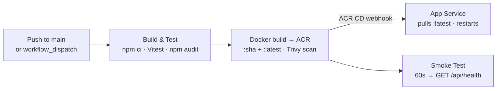

# HackerBoard — Operations Guide


Deployment, ongoing operations, troubleshooting, and frequently asked questions.

---

## Table of Contents

- [Prerequisites](#prerequisites)
- [Step 1 — Create a GitHub OAuth App](#step-1--create-a-github-oauth-app)
- [Step 2 — Provision Infrastructure](#step-2--provision-infrastructure)
- [Step 3 — Build and Push the Container Image](#step-3--build-and-push-the-container-image)
- [Step 4 — Activate CI/CD](#step-4--activate-cicd)
- [Step 5 — Smoke Test](#step-5--smoke-test)
- [Ongoing Operations](#ongoing-operations)
- [Quick Reference](#quick-reference)
- [Troubleshooting](#troubleshooting)
- [FAQ](#faq)

---

## Prerequisites

| Tool       | Version / Note                 | How to check                                     |
| ---------- | ------------------------------ | ------------------------------------------------ |
| Azure CLI  | Latest, authenticated with MFA | `az account show`                                |
| Bicep CLI  | Latest                         | `az bicep version` (install: `az bicep install`) |
| Docker     | Running locally                | `docker version`                                 |
| PowerShell | 7+                             | `pwsh --version`                                 |
| GitHub CLI | Latest, authenticated          | `gh auth status`                                 |
| Node.js    | 20+                            | `node --version`                                 |

```bash
az account show
az account get-access-token --resource https://management.azure.com/ --output none && echo "Token is valid"
```

> **MFA required**: The subscription governance policy requires MFA for all resource write operations. Run `az login --use-device-code` if you need to re-authenticate.

---

## Step 1 — Create a GitHub OAuth App

1. Go to **[GitHub → Settings → Developer settings → OAuth Apps → New OAuth App](https://github.com/settings/applications/new)**
2. Fill in:
   - **Application name**: `HackerBoard`
   - **Homepage URL**: `https://app-hacker-board-prod.azurewebsites.net`
   - **Authorization callback URL**: `https://app-hacker-board-prod.azurewebsites.net/.auth/login/github/callback`
3. Click **Register application**, then **Generate a new client secret**
4. Save both the **Client ID** and **Client secret** for Step 2

> **Custom domain**: Update the OAuth App callback URL after DNS is wired.

---

## Step 2 — Provision Infrastructure

```powershell
cd infra

./deploy.ps1 `
  -CostCenter "microhack" `
  -TechnicalContact "you@contoso.com" `
  -GitHubOAuthClientId "<client-id-from-step-1>" `
  -GitHubOAuthClientSecret "<client-secret-from-step-1>" `
  -AdminUsers "github:<your-github-username>"
```

Multiple admins: `-AdminUsers "github:octocat,github:monalisa"`

**What-if preview** (no changes applied):

```powershell
./deploy.ps1 -WhatIf -CostCenter "microhack" -TechnicalContact "you@contoso.com" `
  -GitHubOAuthClientId "<id>" -GitHubOAuthClientSecret "<secret>" `
  -AdminUsers "github:<username>"
```

### All deploy.ps1 parameters

| Parameter                 | Default                | Required | Description                                             |
| ------------------------- | ---------------------- | -------- | ------------------------------------------------------- |
| `ResourceGroupName`       | `rg-hacker-board-prod` |          | Target resource group name                              |
| `Location`                | `centralus`            |          | Azure region for all resources                          |
| `Environment`             | `prod`                 |          | `dev`, `staging`, or `prod`                             |
| `Owner`                   | `agentic-infraops`     |          | Resource owner tag value                                |
| `CostCenter`              | —                      | ✅       | Cost center code (required by governance policy)        |
| `TechnicalContact`        | —                      | ✅       | Technical contact email (required by governance policy) |
| `GitHubOAuthClientId`     | —                      | ✅       | GitHub OAuth App client ID                              |
| `GitHubOAuthClientSecret` | —                      | ✅       | GitHub OAuth App client secret                          |
| `AdminUsers`              | —                      | ✅       | Comma-separated admin identities: `github:username`     |
| `ContainerImage`          | `hacker-board:latest`  |          | Image tag reference (relative to ACR)                   |
| `WhatIf`                  | `false`                |          | Preview deployment without applying changes             |

### What the deployment does

1. Validates Azure CLI token and Bicep CLI version
2. Creates (or updates) the resource group with all 9 required governance tags
3. Runs `az bicep build` and `az bicep lint` on `infra/main.bicep`
4. Deploys all 14 resources (Incremental mode)
5. Runs post-deploy verification: App Service state, VNet integration, Cosmos RBAC count, private endpoint state, `publicNetworkAccess`, `disableLocalAuth`, and `COSMOS_ENDPOINT` app setting

---

## Step 3 — Build and Push the Container Image

### Option A — ACR Tasks (recommended, no local Docker required)

```bash
az acr build \
  --registry crhackerboardprod \
  --image hacker-board:latest \
  .
```

### Option B — Local Docker build and push

```bash
az acr login --name crhackerboardprod
docker build -t crhackerboardprod.azurecr.io/hacker-board:latest .
docker push crhackerboardprod.azurecr.io/hacker-board:latest
```

### Verify the image landed

```bash
az acr repository show-tags \
  --name crhackerboardprod \
  --repository hacker-board \
  --output table
```

App Service pulls `:latest` via the ACR CD webhook within ~30 seconds. Force a restart if needed:

```bash
az webapp restart \
  --name app-hacker-board-prod \
  --resource-group rg-hacker-board-prod
```

---

## Step 4 — Activate CI/CD

### Create the CI/CD service principal (first time only)

```bash
SP_JSON=$(az ad sp create-for-rbac \
  --name "sp-hacker-board-cicd" \
  --role Contributor \
  --scopes "/subscriptions/$(az account show --query id -o tsv)/resourceGroups/rg-hacker-board-prod" \
  --sdk-auth)

gh secret set AZURE_CREDENTIALS \
  --repo jonathan-vella/hacker-board \
  --body "$SP_JSON"

SP_CLIENT_ID=$(echo "$SP_JSON" | python3 -c "import sys,json; print(json.load(sys.stdin)['clientId'])")
az role assignment create \
  --assignee "$SP_CLIENT_ID" \
  --role AcrPush \
  --scope "$(az acr show --name crhackerboardprod -g rg-hacker-board-prod --query id -o tsv)"
```

> If `AZURE_CREDENTIALS` is already set, skip this step.

### Pipeline flow



| Job                      | When it runs         | What it does                                                               |
| ------------------------ | -------------------- | -------------------------------------------------------------------------- |
| Build and Test           | Every event          | `npm ci`, Vitest (API + UI), `npm audit --audit-level=high`                |
| Build and Push Container | Push to `main` only  | `az acr login` → `docker build` → push `:sha` + `:latest` + Trivy CVE scan |
| Smoke Test               | After container push | 60s wait → `GET /api/health` → `GET /api/teams`                            |

### Trigger a manual run

```bash
gh workflow run deploy-app.yml --repo jonathan-vella/hacker-board
gh run list --workflow=deploy-app.yml --repo jonathan-vella/hacker-board --limit 5
```

---

## Step 5 — Smoke Test

```bash
APP_URL="https://app-hacker-board-prod.azurewebsites.net"
curl -s "${APP_URL}/api/health" | python3 -m json.tool
```

- [ ] `/api/health` returns `{"status":"ok"}`
- [ ] App loads and shows the sign-in prompt
- [ ] GitHub OAuth sign-in completes successfully
- [ ] `/.auth/me` returns user claims (try in browser)
- [ ] Leaderboard renders (empty on first deploy — expected)
- [ ] Admin routes accessible with admin GitHub identity
- [ ] Non-admin users get 403 on admin endpoints

```bash
az webapp log tail \
  --name app-hacker-board-prod \
  --resource-group rg-hacker-board-prod
```

---

## Ongoing Operations

### Redeploy infrastructure (after Bicep changes)

```bash
az bicep build --file infra/main.bicep --outfile infra/azuredeploy.json
```

```powershell
cd infra && ./deploy.ps1 -CostCenter "microhack" -TechnicalContact "you@contoso.com" `
  -GitHubOAuthClientId "<id>" -GitHubOAuthClientSecret "<secret>" `
  -AdminUsers "github:<username>"
```

Deployment is idempotent — only changed resources are updated.

### Update application code

```bash
git push origin main
# → test → docker push :latest → ACR CD webhook → App Service restarts → smoke test
```

### Add or remove admins

Re-run `deploy.ps1` with the updated `-AdminUsers` value. Changes take effect immediately — no restart required.

### Rotate GitHub OAuth credentials

Re-run `deploy.ps1` with `-GitHubOAuthClientId` and `-GitHubOAuthClientSecret` set to the new values. Updates `authSettingsV2` and the app setting in place.

### Seed demo data (optional)

```bash
COSMOS_ENDPOINT=https://cosmos-hacker-board-prod.documents.azure.com:443/ \
  node scripts/seed-demo-data.js --reset
```

### Clean up event data after an event

```bash
node scripts/cleanup-app-data.js
```

---

## Quick Reference

| Item               | Value                                                                         |
| ------------------ | ----------------------------------------------------------------------------- |
| Resource group     | `rg-hacker-board-prod`                                                        |
| Region             | `centralus`                                                                   |
| App URL            | `https://app-hacker-board-prod.azurewebsites.net`                             |
| App Service        | `app-hacker-board-prod`                                                       |
| ACR                | `crhackerboardprod.azurecr.io`                                                |
| Cosmos DB          | `cosmos-hacker-board-prod` (Serverless, public access disabled)               |
| VNet               | `vnet-hacker-board-prod` (10.0.0.0/16)                                        |
| Private Endpoint   | `pep-cosmos-hacker-board-prod`                                                |
| OAuth callback URL | `https://app-hacker-board-prod.azurewebsites.net/.auth/login/github/callback` |
| CI/CD secret       | `AZURE_CREDENTIALS` (SP: `sp-hacker-board-cicd`)                              |
| IaC entry point    | `infra/main.bicep`                                                            |
| Deployment script  | `infra/deploy.ps1`                                                            |
| CI/CD workflow     | `.github/workflows/deploy-app.yml`                                            |

---

## Troubleshooting

### Deployment Issues

**`deploy.ps1` fails — "Not logged into Azure"**

Run `az login --use-device-code` and complete browser authentication. The subscription governance policy requires MFA for write operations.

---

**Deployment fails — Resource group tag policy denied**

Always deploy via `deploy.ps1`. It passes all 9 required governance tags automatically. Never run `az group create` or Bicep directly without the tags.

---

**Deployment fails — PremiumV3 quota**

The Bicep template uses S1 (Standard), not P1v3. Verify `infra/modules/app-service.bicep` has `skuName: 'S1'`. If you modified it to use P1v3, revert.

---

**App Service shows container start error after deploy**

No container image exists in ACR yet. Build and push first:

```bash
az acr build --registry crhackerboardprod --image hacker-board:latest .
az webapp restart --name app-hacker-board-prod --resource-group rg-hacker-board-prod
```

---

### Authentication Issues

**GitHub OAuth redirects fail / "Redirect URI mismatch"**

Verify the **Authorization callback URL** in your GitHub OAuth App is exactly:
`https://app-hacker-board-prod.azurewebsites.net/.auth/login/github/callback`

---

**Admin user cannot access admin pages**

The format must be `github:<username>` (lowercase, exact match). Check the app setting:

```bash
az webapp config appsettings list \
  --name app-hacker-board-prod \
  --resource-group rg-hacker-board-prod \
  --query "[?name=='ADMIN_USERS']"
```

---

### Application Errors

**`/api/health` returns 500**

The app cannot connect to Cosmos DB. Check RBAC assignments and the `COSMOS_ENDPOINT` app setting:

```bash
az cosmosdb sql role assignment list \
  --account-name cosmos-hacker-board-prod \
  --resource-group rg-hacker-board-prod \
  --query "length(@)"

az webapp config appsettings list \
  --name app-hacker-board-prod \
  --resource-group rg-hacker-board-prod \
  --query "[?name=='COSMOS_ENDPOINT']"
```

Re-run `deploy.ps1` if either is missing.

---

**Cosmos DB `ECONNREFUSED`**

The Private Endpoint or VNet integration is not routing correctly:

```bash
az network private-endpoint show \
  --name pep-cosmos-hacker-board-prod \
  --resource-group rg-hacker-board-prod \
  --query "provisioningState"

az webapp vnet-integration list \
  --name app-hacker-board-prod \
  --resource-group rg-hacker-board-prod
```

Both should return `Succeeded`. Re-run `deploy.ps1` to reconcile.

---

### CI/CD Issues

**Workflow fails — `AZURE_CREDENTIALS` error**

Re-create the service principal and update the secret (see [Step 4](#step-4--activate-cicd)).

---

**Workflow fails — ACR push denied**

The service principal is missing the `AcrPush` role:

```bash
SP_CLIENT_ID="<service-principal-client-id>"
ACR_ID=$(az acr show --name crhackerboardprod -g rg-hacker-board-prod --query id -o tsv)
az role assignment create --assignee "$SP_CLIENT_ID" --role AcrPush --scope "$ACR_ID"
```

---

**Workflow fails — Trivy CVE block**

```bash
cd api && npm audit fix
npm audit fix  # root frontend deps
```

Push the fix to `main` to trigger a new build.

---

### Diagnostics Commands

```bash
# App Service state
az webapp show \
  --name app-hacker-board-prod \
  --resource-group rg-hacker-board-prod \
  --query "{state:state,defaultHostName:defaultHostName}"

# Stream live logs
az webapp log tail \
  --name app-hacker-board-prod \
  --resource-group rg-hacker-board-prod

# Cosmos DB RBAC
az cosmosdb sql role assignment list \
  --account-name cosmos-hacker-board-prod \
  --resource-group rg-hacker-board-prod

# Cosmos DB public access + local auth
az cosmosdb show \
  --name cosmos-hacker-board-prod \
  --resource-group rg-hacker-board-prod \
  --query "{disableLocalAuth:disableLocalAuth,publicNetworkAccess:publicNetworkAccess}"

# App settings
az webapp config appsettings list \
  --name app-hacker-board-prod \
  --resource-group rg-hacker-board-prod \
  --query "[].{name:name}" --output table

# Force restart
az webapp restart \
  --name app-hacker-board-prod \
  --resource-group rg-hacker-board-prod
```

---

## FAQ

**What does it cost to run HackerBoard?**

~$18.15/month at low traffic — App Service S1 (~$13.14) + ACR Basic (~$5.00) + Cosmos DB Serverless (~$0.01 at idle). Cosmos scales with actual usage and is near zero between events.

---

**Can I run HackerBoard in a different Azure region?**

Yes. Pass `-Location "eastus"` to `deploy.ps1`. All resource names are region-agnostic.

---

**What's the minimum App Service SKU?**

B1 is the minimum that supports regional VNet integration (required for the Cosmos DB Private Endpoint). Default is S1 — the initial deployment subscription had no P1v3 quota in `centralus`.

---

**Can I skip the VNet and Private Endpoint to save cost?**

No. The `ModifyCosmosDBLocalAuth` governance policy disables Cosmos DB public network access automatically. The Private Endpoint is the only path for the App Service to reach Cosmos DB.

---

**Can I redeploy without losing data?**

Yes. `deploy.ps1` uses Incremental deployment mode — existing resources (including Cosmos DB data) are untouched. Cosmos DB Serverless does not wipe data on redeployment.

---

**How do I add a new admin after the initial deployment?**

Re-run `deploy.ps1` with the updated `-AdminUsers` value. The change takes effect on the next request — no restart required.

---

**How do I reset all scores and start fresh between events?**

```bash
node scripts/cleanup-app-data.js
```

Removes scores, submissions, and attendees but leaves teams and rubrics in place.

---

**Can I run multiple events on the same deployment?**

Yes. Run `node scripts/cleanup-app-data.js` between events to start clean. You can change the rubric without cleaning up — the leaderboard uses whatever is active.

---

**The leaderboard is not auto-refreshing.**

Check the browser console for errors. Verify `/api/health` returns 200. Hard-refresh the page (Ctrl+Shift+R).

---

**A submission was approved by mistake. Can it be undone?**

Use **Admin → Review Queue → Override** to correct the score values. There is no "unapprove" action — the override replaces the score in place.

---

**How are grades calculated?**

```
grade = (approvedBaseScore / rubricMaxBaseScore) × 100
```

Bonus points are added to the total score shown on the leaderboard but do not affect the grade percentage.

---

**Can participants sign in without a GitHub account?**

No. GitHub OAuth is the only authentication provider configured.

---

[← Back to Documentation](README.md)
